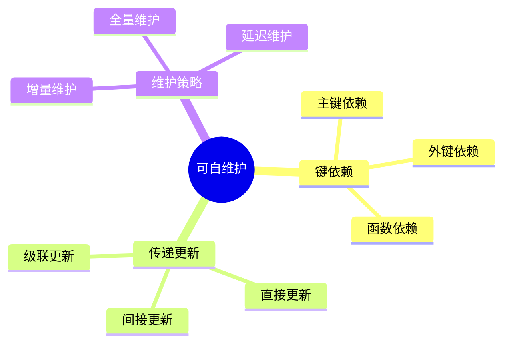

# 可自维护物化视图-键依赖与传递更新的严格证明

> **文档版本**: v1.0
> **最后更新**: 2025-01-16
> **版本覆盖**: PostgreSQL 18.x (推荐) ⭐ | 17.x (推荐) | 16.x (兼容)
> **文档状态**: 🟡 框架已创建，内容待完善

---

## 📋 目录

- [可自维护物化视图-键依赖与传递更新的严格证明](#可自维护物化视图-键依赖与传递更新的严格证明)
  - [📋 目录](#-目录)
  - [1. 概述](#1-概述)
    - [1.0 可自维护物化视图工作原理概述](#10-可自维护物化视图工作原理概述)
    - [1.1 本文档的范围](#11-本文档的范围)
  - [2. 核心内容](#2-核心内容)
    - [2.1 键依赖](#21-键依赖)
    - [2.2 传递更新](#22-传递更新)
  - [3. 形式化定义](#3-形式化定义)
    - [3.1 可自维护性形式化](#31-可自维护性形式化)
  - [4. 定理与证明](#4-定理与证明)
    - [4.1 可自维护性定理](#41-可自维护性定理)
  - [5. 实际应用](#5-实际应用)
    - [5.1 PostgreSQL物化视图](#51-postgresql物化视图)
  - [6. 相关文档](#6-相关文档)
    - [6.1 理论基础文档](#61-理论基础文档)
  - [7. 参考文献](#7-参考文献)

---

## 1. 概述

### 1.0 可自维护物化视图工作原理概述

**可自维护物化视图**：

可自维护物化视图可以通过键依赖和传递更新来维护，无需访问基表。

**可维护性思维导图**：



### 1.1 本文档的范围

本文档涵盖：

- **键依赖**：主键、外键、函数依赖
- **传递更新**：更新传播机制
- **可维护性证明**：严格证明可自维护性
- **实际应用**：PostgreSQL物化视图

---

## 2. 核心内容

### 2.1 键依赖

**键依赖类型**：

| 类型 | 定义 | 可维护性 | 示例 |
|------|------|---------|------|
| **主键依赖** | 视图包含主键 | 高 | SELECT id, name FROM users |
| **外键依赖** | 视图包含外键 | 中 | SELECT u.id, o.amount FROM users u JOIN orders o |
| **函数依赖** | 视图依赖函数 | 低 | SELECT id, COUNT(*) FROM orders GROUP BY id |

### 2.2 传递更新

**更新传播**：

```haskell
-- 传递更新
propagateUpdate :: Update -> MaterializedView -> MaterializedView
propagateUpdate update view =
    if canMaintain(view, update) then
        applyUpdate(view, update)
    else
        refreshView(view)
```

---

## 3. 形式化定义

### 3.1 可自维护性形式化

**可自维护性**：

```haskell
-- 可自维护性形式化
selfMaintainable(view) =
    forall update u:
        if keyDependent(view, u) then
            canUpdate(view, u) without accessing base tables
```

---

## 4. 定理与证明

### 4.1 可自维护性定理

**定理**：如果物化视图包含所有基表的主键，则视图可自维护。

**证明**：

1. 主键唯一标识行
2. 更新操作基于主键定位行
3. 视图包含主键，可直接定位视图行
4. 因此可自维护

---

## 5. 实际应用

### 5.1 PostgreSQL物化视图

**创建物化视图**：

```sql
-- 创建物化视图
CREATE MATERIALIZED VIEW mv_account_summary AS
SELECT
    account_id,
    SUM(amount) AS total_amount,
    COUNT(*) AS transaction_count
FROM transactions
GROUP BY account_id;

-- 创建唯一索引（包含主键）
CREATE UNIQUE INDEX ON mv_account_summary (account_id);

-- 增量刷新
REFRESH MATERIALIZED VIEW CONCURRENTLY mv_account_summary;
```

---

## 6. 相关文档

### 6.1 理论基础文档

- [形式语言与证明：总论](./1.1.25-形式语言与证明-总论.md)
- [理论基础导航](./README.md)

---

## 7. 参考文献

[待补充]

---

**最后更新**: 2025-01-16
**维护者**: Documentation Team
**状态**: 🟡 框架已创建，内容待完善
