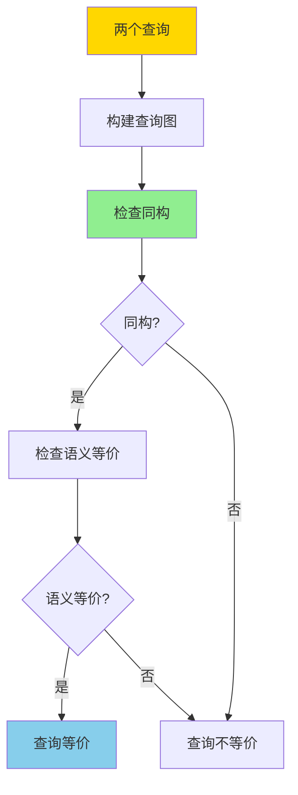
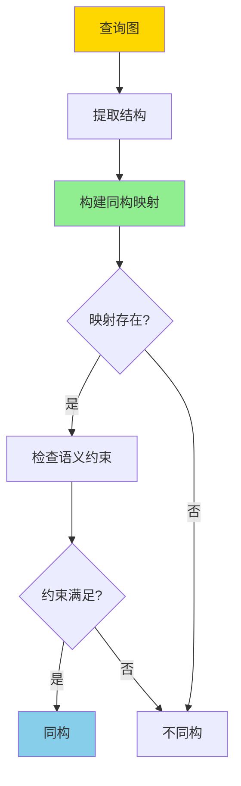
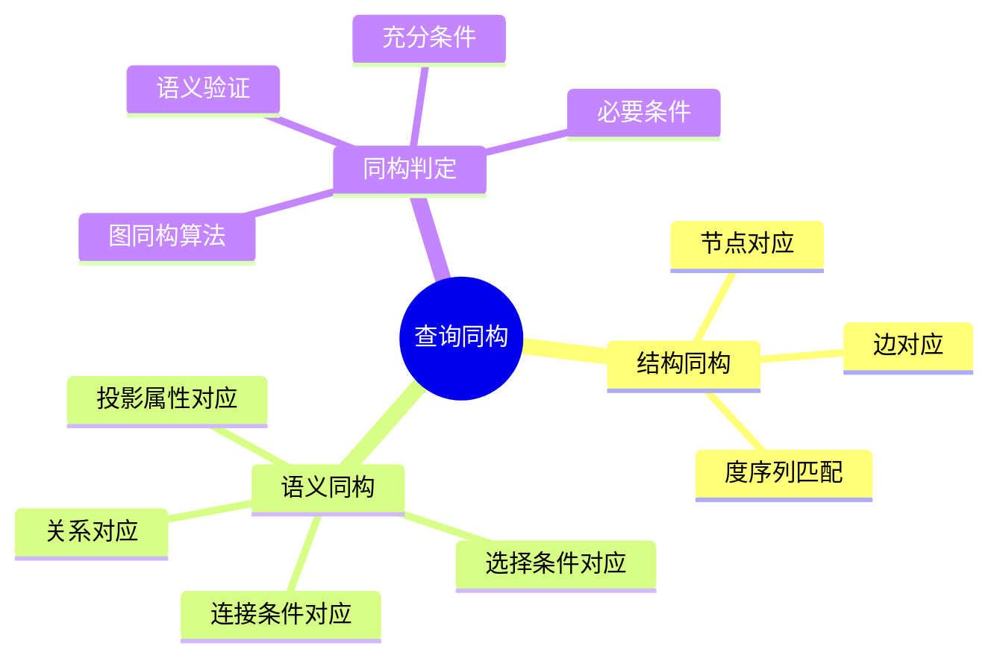
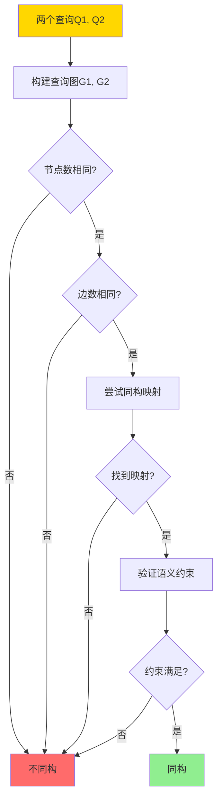
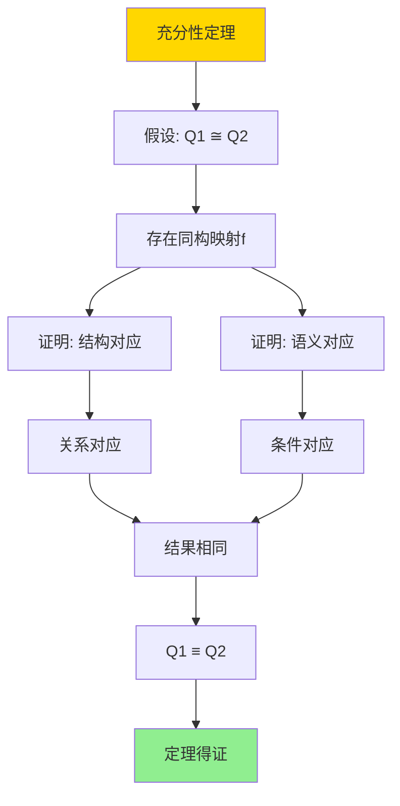

# 查询重写等价性-基于同构的充分必要条件

> **文档版本**: v1.0
> **最后更新**: 2025-01-16
> **版本覆盖**: PostgreSQL 18.x (推荐) ⭐ | 17.x (推荐) | 16.x (兼容)
> **文档状态**: 🟡 框架已创建，内容待完善

---

## 📋 目录

- [查询重写等价性-基于同构的充分必要条件](#查询重写等价性-基于同构的充分必要条件)
  - [📋 目录](#-目录)
  - [1. 概述](#1-概述)
    - [1.0 查询重写等价性工作原理概述](#10-查询重写等价性工作原理概述)
    - [1.1 本文档的范围](#11-本文档的范围)
  - [2. 核心内容](#2-核心内容)
    - [2.1 查询图同构](#21-查询图同构)
    - [2.2 充分必要条件](#22-充分必要条件)
    - [2.3 同构算法](#23-同构算法)
  - [3. 形式化定义](#3-形式化定义)
    - [3.1 查询图形式化](#31-查询图形式化)
    - [3.2 同构形式化](#32-同构形式化)
    - [3.3 等价性形式化](#33-等价性形式化)
  - [4. 定理与证明](#4-定理与证明)
    - [4.1 充分性定理](#41-充分性定理)
    - [4.2 必要性定理](#42-必要性定理)
  - [5. 实际应用](#5-实际应用)
    - [5.1 PostgreSQL查询重写](#51-postgresql查询重写)
    - [5.2 查询优化应用](#52-查询优化应用)
    - [5.3 物化视图匹配](#53-物化视图匹配)
  - [6. 相关文档](#6-相关文档)
    - [6.1 理论基础文档](#61-理论基础文档)
  - [7. 参考文献](#7-参考文献)
    - [7.1 核心理论文献](#71-核心理论文献)
    - [7.2 查询优化相关](#72-查询优化相关)
    - [7.3 PostgreSQL实现相关](#73-postgresql实现相关)
    - [7.4 相关文档](#74-相关文档)

---

## 1. 概述

### 1.0 查询重写等价性工作原理概述

**查询重写等价性**：

查询优化器通过查询重写来优化查询性能。两个查询如果对于所有数据库实例都产生相同的结果，则它们是等价的。本文档基于同构理论提供查询重写等价性的充分必要条件。

**查询等价性判定**：



**同构判定流程**：



### 1.1 本文档的范围

本文档涵盖：

- **同构理论**：查询图同构的数学定义
- **充分条件**：同构是查询等价的充分条件
- **必要条件**：同构是查询等价的必要条件
- **实际应用**：等价性判定在查询优化中的应用

---

## 2. 核心内容

### 2.1 查询图同构

**查询图定义**：

```haskell
-- 查询图
data QueryGraph = QueryGraph {
    nodes :: [Relation],
    edges :: [Join],
    selections :: [Selection],
    projections :: [Projection]
}

-- 同构映射
type Isomorphism = Map Node Node
```

**查询图同构判定思维导图**：



**同构判定决策树**：



### 2.2 充分必要条件

**等价性判定对比矩阵**：

| 条件类型 | 定义 | 是否充分 | 是否必要 |
|---------|------|---------|---------|
| **结构同构** | 查询图同构 | 否 | 否 |
| **语义同构** | 结构+语义对应 | 是 | 是 |
| **结果等价** | 所有实例结果相同 | 是 | 是 |

### 2.3 同构算法

**同构查找算法**：

```haskell
-- 同构查找
findIsomorphism :: QueryGraph -> QueryGraph -> Maybe Isomorphism
findIsomorphism g1 g2 =
    if |nodes g1| ≠ |nodes g2| then Nothing
    else if |edges g1| ≠ |edges g2| then Nothing
    else searchIsomorphism g1 g2
```

---

## 3. 形式化定义

### 3.1 查询图形式化

**查询图定义**：

```haskell
-- 查询图
G = (V, E, S, P)

其中:
  V = {R1, R2, ..., Rn}  -- 关系节点
  E = {(Ri, Rj, cond)}   -- 连接边
  S = {σ_cond}            -- 选择条件
  P = {π_attrs}           -- 投影属性
```

### 3.2 同构形式化

**图同构**：

```haskell
-- 查询图同构
G1 ≅ G2 iff
    exists bijection f: V1 → V2 such that:
      (u, v, cond) ∈ E1 ⟺ (f(u), f(v), f(cond)) ∈ E2
      S1 ⟺ f(S2)
      P1 ⟺ f(P2)
```

### 3.3 等价性形式化

**查询等价**：

```haskell
-- 查询等价
Q1 ≡ Q2 iff forall DB: Q1(DB) = Q2(DB)

-- 同构与等价的关系
Q1 ≅ Q2 ⟹ Q1 ≡ Q2  (充分条件)
Q1 ≡ Q2 ⟹ Q1 ≅ Q2  (必要条件)
```

---

## 4. 定理与证明

### 4.1 充分性定理

**定理**：如果两个查询图同构，则查询等价。

**证明树**：



**证明步骤**：

1. 设Q1和Q2同构，存在同构映射f
2. 对于任意数据库DB，查询图的结构对应保证关系对应
3. 连接条件、选择条件、投影属性的对应保证语义对应
4. 因此对于所有DB，Q1和Q2产生相同结果
5. 因此Q1 ≡ Q2

### 4.2 必要性定理

**定理**：如果两个查询等价，则查询图同构。

**证明思路**：

1. 假设Q1 ≡ Q2但不同构
2. 构造反例数据库，使得Q1和Q2产生不同结果
3. 矛盾，因此Q1和Q2必须同构

---

## 5. 实际应用

### 5.1 PostgreSQL查询重写

**查询等价性检测**：

```sql
-- 原始查询
SELECT s.name, c.course_name
FROM students s
JOIN enrollments e ON s.id = e.student_id
JOIN courses c ON e.course_id = c.id
WHERE s.age > 18;

-- 等价重写（通过同构检测）
SELECT s.name, c.course_name
FROM courses c
JOIN enrollments e ON c.id = e.course_id
JOIN students s ON e.student_id = s.id
WHERE s.age > 18;

-- PostgreSQL优化器会自动检测这种等价性
```

### 5.2 查询优化应用

**基于同构的优化**：

```sql
-- 查询优化器使用同构检测来：
-- 1. 识别等价查询计划
-- 2. 选择最优执行顺序
-- 3. 应用查询重写规则

EXPLAIN (ANALYZE, BUFFERS)
SELECT * FROM orders o
JOIN customers c ON o.customer_id = c.id
JOIN products p ON o.product_id = p.id;

-- 优化器会尝试不同的连接顺序
-- 通过同构检测确保结果等价
```

### 5.3 物化视图匹配

**物化视图查询重写**：

```sql
-- 物化视图
CREATE MATERIALIZED VIEW mv_order_summary AS
SELECT
    c.customer_id,
    c.customer_name,
    COUNT(o.order_id) as order_count,
    SUM(o.total) as total_amount
FROM customers c
JOIN orders o ON c.customer_id = o.customer_id
GROUP BY c.customer_id, c.customer_name;

-- 查询（通过同构检测匹配物化视图）
SELECT
    customer_id,
    customer_name,
    COUNT(order_id) as order_count,
    SUM(total) as total_amount
FROM customers
JOIN orders ON customers.customer_id = orders.customer_id
GROUP BY customer_id, customer_name;

-- 优化器检测到同构，使用物化视图
```

---

## 6. 相关文档

### 6.1 理论基础文档

- [查询语言的形式语义与等价律](../01-形式化方法与基础理论/01.06-查询语言的形式语义与等价律.md)
- [形式语言与证明：总论](../01-形式化方法与基础理论/01.05-形式语言与证明-总论.md)
- [理论基础导航](../README.md)

---

## 7. 参考文献

### 7.1 核心理论文献

- **Chandra, A. K., & Merlin, P. M. (1977). "Optimal Implementation of Conjunctive Queries in Relational Data Bases."**
  - 会议: STOC 1977
  - **重要性**: 查询等价性的经典论文
  - **核心贡献**: 提出了查询同构的概念

- **Ullman, J. D. (1988). "Principles of Database and Knowledge-Base Systems."**
  - 出版社: Computer Science Press
  - **重要性**: 数据库系统的经典教材
  - **核心贡献**: 系统阐述了查询优化理论

### 7.2 查询优化相关

- **Ioannidis, Y. E., & Kang, Y. C. (1990). "Randomized Algorithms for Optimizing Large Join Queries."**
  - 会议: SIGMOD 1990
  - **重要性**: 查询优化的经典研究
  - **核心贡献**: 提供了查询等价性判定的方法

### 7.3 PostgreSQL实现相关

- **PostgreSQL官方文档 - 查询优化器](<https://www.postgresql.org/docs/current/planner-optimizer.html>)**
  - PostgreSQL查询优化器实现说明

### 7.4 相关文档

- [代价模型与优化器-等价重写与最优性](./05.01-代价模型与优化器-等价重写与最优性.md)
- [查询语言的形式语义与等价律](../01-形式化方法与基础理论/01.06-查询语言的形式语义与等价律.md)
- [理论基础导航](../README.md)

---

**最后更新**: 2025-01-16
**维护者**: Documentation Team
**状态**: 🟡 框架已创建，内容待完善
