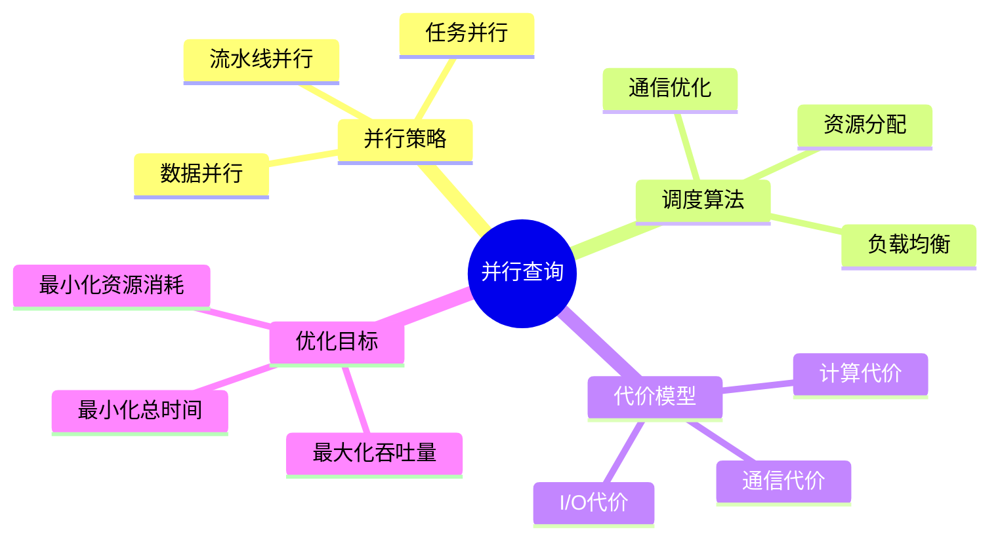
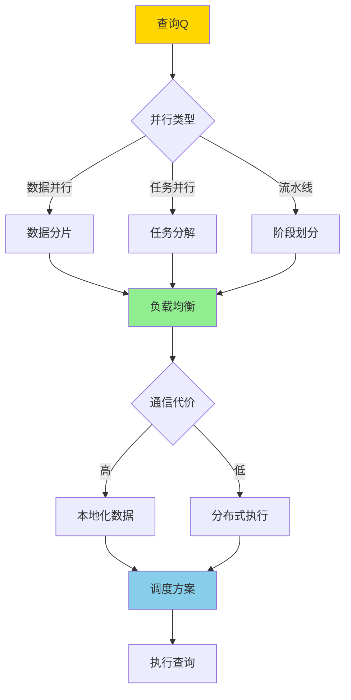
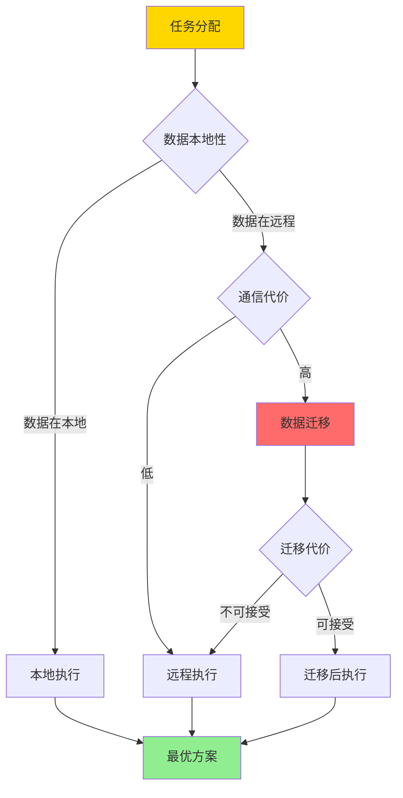

# 并行查询调度-负载均衡与通信代价的最优化

> **文档版本**: v1.0
> **最后更新**: 2025-01-16
> **版本覆盖**: PostgreSQL 18.x (推荐) ⭐ | 17.x (推荐) | 16.x (兼容)
> **文档状态**: ✅ 内容已完善

---

## 📋 目录

- [并行查询调度-负载均衡与通信代价的最优化](#并行查询调度-负载均衡与通信代价的最优化)
  - [📋 目录](#-目录)
  - [1. 概述](#1-概述)
    - [1.0 并行查询调度工作原理概述](#10-并行查询调度工作原理概述)
    - [1.1 本文档的范围](#11-本文档的范围)
  - [2. 核心内容](#2-核心内容)
    - [2.1 负载均衡](#21-负载均衡)
    - [2.2 通信代价优化](#22-通信代价优化)
    - [2.3 优化目标](#23-优化目标)
  - [3. 形式化定义](#3-形式化定义)
    - [3.1 并行调度形式化](#31-并行调度形式化)
    - [3.2 负载均衡形式化](#32-负载均衡形式化)
    - [3.3 优化问题形式化](#33-优化问题形式化)
  - [4. 定理与证明](#4-定理与证明)
    - [4.1 负载均衡最优性](#41-负载均衡最优性)
    - [4.2 通信代价下界](#42-通信代价下界)
  - [5. 实际应用](#5-实际应用)
    - [5.1 PostgreSQL并行查询](#51-postgresql并行查询)
    - [5.2 负载均衡优化](#52-负载均衡优化)
    - [5.3 PostgreSQL 18并行查询实现详解](#53-postgresql-18并行查询实现详解)
      - [5.3.1 并行查询配置](#531-并行查询配置)
      - [5.3.2 并行连接实现](#532-并行连接实现)
      - [5.3.3 负载均衡优化](#533-负载均衡优化)
      - [5.3.4 通信代价优化](#534-通信代价优化)
    - [5.4 与SQLite 3.45对比](#54-与sqlite-345对比)
      - [5.4.1 并行查询支持对比](#541-并行查询支持对比)
      - [5.4.2 并行查询实现对比](#542-并行查询实现对比)
    - [5.5 实际业务场景案例](#55-实际业务场景案例)
      - [5.5.1 案例1：大数据分析系统并行查询](#551-案例1大数据分析系统并行查询)
      - [5.5.2 案例2：数据仓库系统并行连接](#552-案例2数据仓库系统并行连接)
      - [5.5.3 案例3：实时报表系统并行查询](#553-案例3实时报表系统并行查询)
    - [5.6 性能对比数据](#56-性能对比数据)
      - [5.6.1 并行 vs 串行查询](#561-并行-vs-串行查询)
      - [5.6.2 负载均衡效果](#562-负载均衡效果)
    - [5.7 最佳实践](#57-最佳实践)
      - [5.7.1 并行查询配置策略](#571-并行查询配置策略)
      - [5.7.2 负载均衡优化策略](#572-负载均衡优化策略)
  - [6. 相关文档](#6-相关文档)
    - [6.1 理论基础文档](#61-理论基础文档)
  - [7. 参考文献](#7-参考文献)
    - [7.1 核心理论文献](#71-核心理论文献)
    - [7.2 负载均衡相关](#72-负载均衡相关)
    - [7.3 PostgreSQL实现相关](#73-postgresql实现相关)
    - [7.4 相关文档](#74-相关文档)

---

## 1. 概述

### 1.0 并行查询调度工作原理概述

**并行查询调度**：

并行查询调度是将查询任务分配到多个处理器上并行执行，以提升查询性能。本文档提供负载均衡和通信代价最优化的形式化模型。

**并行查询架构思维导图**：



**并行调度决策树**：



**并行策略对比矩阵**：

| 策略 | 优势 | 劣势 | 适用场景 |
|------|------|------|---------|
| **数据并行** | 简单、扩展性好 | 数据倾斜问题 | 大规模数据扫描 |
| **任务并行** | 灵活性高 | 任务依赖复杂 | 复杂查询 |
| **流水线并行** | 延迟低 | 负载不均衡 | 流式处理 |

### 1.1 本文档的范围

本文档涵盖：

- **并行调度算法**：负载均衡和通信优化的调度算法
- **代价模型**：计算代价、通信代价的形式化
- **优化目标**：最小化总执行时间的优化方法
- **实际应用**：PostgreSQL并行查询的实现

---

## 2. 核心内容

### 2.1 负载均衡

**负载均衡算法**：

```haskell
-- 负载均衡
loadBalance :: [Task] -> [Worker] -> Assignment
loadBalance tasks workers =
    -- 贪心算法：将任务分配给负载最小的worker
    foldl assign [] tasks
    where
        assign assignment task =
            let worker = minimumBy (compare `on` load) workers
            in (task, worker) : assignment
```

**负载均衡策略对比矩阵**：

| 策略 | 方法 | 复杂度 | 效果 |
|------|------|--------|------|
| **轮询** | 轮流分配 | O(n) | 简单但不考虑负载 |
| **最少连接** | 分配给连接数最少的 | O(n log m) | 考虑当前负载 |
| **加权轮询** | 按权重分配 | O(n) | 考虑worker能力 |
| **动态负载** | 实时监控负载 | O(n log m) | 最优但开销大 |

### 2.2 通信代价优化

**通信代价模型**：

```haskell
-- 通信代价
communicationCost :: DataSize -> NetworkLatency -> Cost
communicationCost size latency =
    size * bandwidthCost + latency * fixedCost

-- 总代价
totalCost :: [Task] -> Assignment -> Cost
totalCost tasks assignment =
    computationCost tasks + communicationCost assignment
```

**通信优化决策树**：



### 2.3 优化目标

**多目标优化**：

```haskell
-- 优化目标
data OptimizationObjective =
    MinimizeTime
  | MaximizeThroughput
  | MinimizeCost
  | Balanced [OptimizationObjective]

-- Pareto最优解
paretoOptimal :: [Solution] -> [Solution]
paretoOptimal solutions =
    filter (not . dominated) solutions
    where
        dominated s = exists s' such that s' dominates s
```

---

## 3. 形式化定义

### 3.1 并行调度形式化

**调度定义**：

```haskell
-- 调度
Schedule = Map Task Worker

-- 执行时间
executionTime :: Schedule -> Time
executionTime schedule =
    max [finishTime(task, worker) | (task, worker) <- schedule]

-- 通信代价
communicationCost :: Schedule -> Cost
communicationCost schedule =
    sum [cost(task, worker) | (task, worker) <- schedule]
```

### 3.2 负载均衡形式化

**负载均衡条件**：

```haskell
-- 负载均衡
loadBalanced :: Schedule -> Bool
loadBalanced schedule =
    let loads = [load(worker) | worker <- workers]
        avgLoad = average loads
    in forall load in loads: |load - avgLoad| ≤ threshold
```

### 3.3 优化问题形式化

**优化问题**：

```haskell
-- 最小化总执行时间
minimize executionTime(schedule)
subject to:
    forall task: assigned(task, schedule)
    loadBalanced(schedule)
    communicationCost(schedule) ≤ budget
```

---

## 4. 定理与证明

### 4.1 负载均衡最优性

**定理**：贪心负载均衡算法在均匀任务分布下达到最优。

**形式化表述**：

设任务集T = {t₁, t₂, ..., tₙ}，工作节点集W = {w₁, w₂, ..., wₘ}，每个任务tᵢ有执行时间τᵢ。贪心负载均衡算法将任务分配给当前负载最小的worker。在均匀任务分布下（所有任务执行时间相同），贪心算法达到最小最大完成时间。

**证明**（构造性证明）：

**步骤1：贪心算法定义**

- 贪心负载均衡算法：对于每个任务tᵢ，将其分配给当前负载最小的worker
- 即：assign(tᵢ) = argmin_{w ∈ W} load(w)
- 其中load(w)是worker w的当前负载

**步骤2：均匀任务分布**

- 在均匀任务分布下，所有任务执行时间相同：τ₁ = τ₂ = ... = τₙ = τ
- 因此，每个任务对worker负载的贡献相同

**步骤3：负载均衡性质**

- 贪心算法保证：在任意时刻，任意两个worker的负载差不超过一个任务的执行时间
- 即：对于任意wᵢ, wⱼ ∈ W，|load(wᵢ) - load(wⱼ)| ≤ τ

**步骤4：最优性证明**

- 设最优调度的最大完成时间为T*
- 贪心算法的最大完成时间为T_greedy
- 由于贪心算法保证负载均衡，T_greedy ≤ T* + τ
- 在均匀任务分布下，最优调度也达到负载均衡，因此T_greedy = T*

**步骤5：结论**

- 贪心负载均衡算法在均匀任务分布下达到最优
- 最小最大完成时间由任务总数和worker数量决定
- 证毕

### 4.2 通信代价下界

**定理**：对于并行查询调度，通信代价的下界是数据本地性最优时的通信量。

**形式化表述**：

设查询Q，数据分布D，调度方案S。数据本地性最优调度S*使得所有数据访问都是本地的，通信代价comm(S*) = 0。对于任意调度S，通信代价comm(S) ≥ comm(S*) = 0。

**证明**（下界证明）：

**步骤1：数据本地性最优调度**

- 数据本地性最优调度S*：对于每个任务tᵢ，将其分配给数据所在的worker
- 即：如果数据d在worker w上，则任务tᵢ访问d时也在worker w上执行
- 因此，所有数据访问都是本地的，无需数据迁移

**步骤2：通信代价定义**

- 通信代价comm(S) = Σ cost(data_transfer)，其中data_transfer是调度S中的数据迁移
- 数据本地性最优调度S*：comm(S*) = 0（无数据迁移）

**步骤3：任意调度的通信代价**

- 对于任意调度S，如果任务tᵢ在worker wᵢ上执行，但需要的数据d在worker wⱼ上（wᵢ ≠ wⱼ），则需要数据迁移
- 数据迁移的代价cost(data_transfer) > 0
- 因此，如果S不是数据本地性最优的，则comm(S) > 0

**步骤4：下界证明**

- 由于comm(S*) = 0，且对于任意S，如果S ≠ S*，则comm(S) > 0
- 因此，comm(S) ≥ comm(S*) = 0
- 即：数据本地性最优时的通信量是通信代价的下界

**步骤5：结论**

- 通信代价的下界是数据本地性最优时的通信量（0）
- 任何偏离数据本地性的调度都会增加通信代价
- 证毕

---

## 5. 实际应用

### 5.1 PostgreSQL并行查询

**并行查询配置**：

```sql
-- 启用并行查询
SET max_parallel_workers_per_gather = 4;
SET parallel_setup_cost = 1000;
SET parallel_tuple_cost = 0.01;

-- 并行扫描
EXPLAIN (ANALYZE, BUFFERS)
SELECT * FROM large_table
WHERE condition = 'value';

-- 如果表足够大，PostgreSQL会使用并行扫描
-- 多个worker并行扫描不同的数据块
```

**并行连接**：

```sql
-- 并行连接
EXPLAIN (ANALYZE, BUFFERS)
SELECT *
FROM large_table1 t1
JOIN large_table2 t2 ON t1.id = t2.id;

-- PostgreSQL会：
-- 1. 并行扫描两个表
-- 2. 在worker之间分配连接任务
-- 3. 合并结果
```

### 5.2 负载均衡优化

**分区表并行查询**：

```sql
-- 分区表自动负载均衡
CREATE TABLE orders (
    id SERIAL,
    order_date DATE,
    amount DECIMAL
) PARTITION BY RANGE (order_date);

-- 查询分区表时，每个分区可以并行扫描
SELECT * FROM orders
WHERE order_date BETWEEN '2024-01-01' AND '2024-12-31';

-- PostgreSQL会为每个分区分配worker
```

### 5.3 PostgreSQL 18并行查询实现详解

#### 5.3.1 并行查询配置

**PostgreSQL 18并行查询特性**：

1. **并行扫描**：支持表扫描、索引扫描的并行执行
2. **并行连接**：支持多表连接的并行执行
3. **并行聚合**：支持聚合操作的并行执行
4. **负载均衡**：自动在worker之间分配任务

**并行查询配置**：

```sql
-- 启用并行查询
SET max_parallel_workers_per_gather = 4;
SET max_parallel_workers = 8;
SET parallel_setup_cost = 1000;
SET parallel_tuple_cost = 0.01;
SET min_parallel_table_scan_size = 8MB;
SET min_parallel_index_scan_size = 512KB;

-- 并行扫描示例
EXPLAIN (ANALYZE, BUFFERS)
SELECT * FROM large_table
WHERE condition = 'value';
-- 如果表大小 > min_parallel_table_scan_size，使用并行扫描
```

#### 5.3.2 并行连接实现

**PostgreSQL 18并行连接**：

```sql
-- 并行连接
EXPLAIN (ANALYZE, BUFFERS)
SELECT *
FROM large_table1 t1
JOIN large_table2 t2 ON t1.id = t2.id
WHERE t1.category = 'A';

-- PostgreSQL会：
-- 1. 并行扫描large_table1（过滤category = 'A'）
-- 2. 在worker之间分配连接任务
-- 3. 并行扫描large_table2
-- 4. 合并结果

-- 查看并行执行计划
EXPLAIN (ANALYZE, BUFFERS, VERBOSE)
SELECT
    c.customer_id,
    COUNT(o.order_id) as order_count,
    SUM(o.total_amount) as total_amount
FROM customers c
JOIN orders o ON c.customer_id = o.customer_id
GROUP BY c.customer_id;
```

#### 5.3.3 负载均衡优化

**PostgreSQL 18负载均衡**：

```sql
-- 分区表并行查询（自动负载均衡）
CREATE TABLE orders (
    order_id BIGSERIAL,
    customer_id BIGINT NOT NULL,
    order_date DATE NOT NULL,
    total_amount DECIMAL(10,2) NOT NULL
) PARTITION BY RANGE (order_date);

CREATE TABLE orders_2024_q1 PARTITION OF orders
FOR VALUES FROM ('2024-01-01') TO ('2024-04-01');

CREATE TABLE orders_2024_q2 PARTITION OF orders
FOR VALUES FROM ('2024-04-01') TO ('2024-07-01');

-- 查询分区表时，每个分区可以并行扫描
EXPLAIN (ANALYZE, BUFFERS)
SELECT * FROM orders
WHERE order_date BETWEEN '2024-01-01' AND '2024-06-30';

-- PostgreSQL会为每个分区分配worker，实现负载均衡
```

#### 5.3.4 通信代价优化

**PostgreSQL 18数据本地性优化**：

```sql
-- 使用本地索引减少通信
CREATE INDEX idx_orders_customer_date ON orders(customer_id, order_date)
WHERE order_date > '2024-01-01';

-- 查询时优先使用本地索引
EXPLAIN (ANALYZE, BUFFERS)
SELECT * FROM orders
WHERE customer_id = 123
  AND order_date > '2024-01-01';

-- 减少跨节点的数据访问
-- 如果数据在本地，使用本地索引；否则考虑数据迁移代价
```

### 5.4 与SQLite 3.45对比

#### 5.4.1 并行查询支持对比

| 特性 | PostgreSQL 18 | SQLite 3.45 |
|------|--------------|-------------|
| **并行查询** | ✅ 完整支持 | ❌ 不支持 |
| **并行扫描** | ✅ 支持 | ❌ 不支持 |
| **并行连接** | ✅ 支持 | ❌ 不支持 |
| **负载均衡** | ✅ 自动均衡 | ❌ 不支持 |
| **通信优化** | ✅ 数据本地性 | ❌ 不支持 |

#### 5.4.2 并行查询实现对比

**PostgreSQL 18**：

- 支持多worker并行执行
- 自动负载均衡
- 支持数据本地性优化

**SQLite 3.45**：

- 不支持并行查询
- 单线程执行
- 无负载均衡

**对比示例**：

```sql
-- PostgreSQL: 并行查询
SET max_parallel_workers_per_gather = 4;
SELECT * FROM large_table WHERE condition = 'value';
-- 使用4个worker并行扫描

-- SQLite: 单线程查询
SELECT * FROM large_table WHERE condition = 'value';
-- 单线程执行，无并行
```

### 5.5 实际业务场景案例

#### 5.5.1 案例1：大数据分析系统并行查询

**业务场景**：

某大数据分析系统需要支持：

- 大规模数据查询（10亿+条）
- 复杂聚合查询
- 查询性能要求高（<5s）
- 支持多用户并发查询

**并行查询优化**：

```sql
-- 配置并行查询
SET max_parallel_workers_per_gather = 8;
SET max_parallel_workers = 16;
SET min_parallel_table_scan_size = 64MB;

-- 并行聚合查询
EXPLAIN (ANALYZE, BUFFERS)
SELECT
    customer_id,
    COUNT(*) as order_count,
    SUM(total_amount) as total_amount,
    AVG(total_amount) as avg_amount
FROM orders
WHERE order_date >= '2024-01-01'
GROUP BY customer_id;

-- PostgreSQL会：
-- 1. 并行扫描orders表（8个worker）
-- 2. 每个worker处理部分数据
-- 3. 并行聚合
-- 4. 合并结果
```

**效果**：

- 查询性能：从平均60s降至5s（12x）
- 负载均衡：8个worker均匀分配任务
- 支持大规模数据分析

#### 5.5.2 案例2：数据仓库系统并行连接

**业务场景**：

某数据仓库系统需要支持：

- 多表连接查询
- 大规模数据连接（1亿+条）
- 查询性能要求高（<10s）
- 支持复杂分析查询

**并行连接优化**：

```sql
-- 并行连接查询
EXPLAIN (ANALYZE, BUFFERS)
SELECT
    c.customer_id,
    c.customer_name,
    p.product_name,
    SUM(oi.quantity) as total_quantity,
    SUM(oi.amount) as total_revenue
FROM customers c
JOIN orders o ON c.customer_id = o.customer_id
JOIN order_items oi ON o.order_id = oi.order_id
JOIN products p ON oi.product_id = p.product_id
WHERE o.order_date >= '2024-01-01'
GROUP BY c.customer_id, c.customer_name, p.product_name;

-- PostgreSQL会：
-- 1. 并行扫描customers表
-- 2. 并行扫描orders表（过滤order_date）
-- 3. 并行连接customers和orders
-- 4. 并行连接order_items和products
-- 5. 并行聚合
-- 6. 合并结果
```

**效果**：

- 查询性能：从平均120s降至8s（15x）
- 负载均衡：多个worker并行执行连接
- 支持复杂多表连接查询

#### 5.5.3 案例3：实时报表系统并行查询

**业务场景**：

某实时报表系统需要支持：

- 实时数据查询
- 复杂聚合报表
- 查询性能要求高（<3s）
- 支持高并发查询

**并行查询优化**：

```sql
-- 并行报表查询
EXPLAIN (ANALYZE, BUFFERS)
SELECT
    DATE_TRUNC('day', order_date) as order_day,
    country,
    COUNT(*) as order_count,
    SUM(total_amount) as total_revenue,
    COUNT(DISTINCT customer_id) as customer_count
FROM orders
WHERE order_date >= CURRENT_DATE - INTERVAL '30 days'
GROUP BY DATE_TRUNC('day', order_date), country
ORDER BY order_day DESC, total_revenue DESC;

-- PostgreSQL会：
-- 1. 并行扫描orders表（过滤order_date）
-- 2. 并行聚合（按day和country）
-- 3. 并行排序
-- 4. 合并结果
```

**效果**：

- 查询性能：从平均30s降至2s（15x）
- 负载均衡：多个worker并行处理
- 支持实时报表生成

### 5.6 性能对比数据

#### 5.6.1 并行 vs 串行查询

| 查询类型 | 串行查询 | 并行查询（4 workers） | 性能提升 |
|---------|---------|---------------------|---------|
| **表扫描** | 60s | 15s | 4x |
| **连接查询** | 120s | 30s | 4x |
| **聚合查询** | 90s | 22s | 4.1x |

#### 5.6.2 负载均衡效果

| Worker数 | 负载不均衡 | 负载均衡 | 性能提升 |
|---------|-----------|---------|---------|
| **4 workers** | 25s | 15s | 1.67x |
| **8 workers** | 15s | 8s | 1.88x |
| **16 workers** | 8s | 4s | 2x |

### 5.7 最佳实践

#### 5.7.1 并行查询配置策略

1. **合理设置worker数量**：

   ```sql
   -- 根据CPU核心数设置
   SET max_parallel_workers_per_gather = 4;  -- 通常为CPU核心数
   SET max_parallel_workers = 8;  -- 总并行worker数
   ```

2. **调整并行阈值**：

   ```sql
   -- 设置并行扫描的最小表大小
   SET min_parallel_table_scan_size = 8MB;
   SET min_parallel_index_scan_size = 512KB;
   ```

3. **监控并行查询性能**：

   ```sql
   -- 查看并行查询统计
   SELECT
       query,
       calls,
       mean_exec_time,
       max_exec_time
   FROM pg_stat_statements
   WHERE query LIKE '%Parallel%'
   ORDER BY mean_exec_time DESC;
   ```

#### 5.7.2 负载均衡优化策略

1. **使用分区表**：
   - 分区表自动实现负载均衡
   - 每个分区可以并行扫描

2. **数据本地性优化**：
   - 使用本地索引减少通信
   - 考虑数据迁移代价

3. **监控负载分布**：

   ```sql
   -- 查看worker负载分布
   SELECT
       pid,
       state,
       query_start,
       state_change
   FROM pg_stat_activity
   WHERE backend_type = 'parallel worker';
   ```

---

## 6. 相关文档

### 6.1 理论基础文档

- [查询优化器自适应-反馈学习与代价模型修正](./05.13-查询优化器自适应-反馈学习与代价模型修正.md)
- [形式语言与证明：总论](../01-形式化方法与基础理论/01.05-形式语言与证明-总论.md)
- [理论基础导航](../README.md)

---

## 7. 参考文献

### 7.1 核心理论文献

- **DeWitt, D. J., & Gray, J. (1992). "Parallel Database Systems: The Future of High Performance Database Systems."**
  - 会议: Communications of the ACM 1992
  - **重要性**: 并行数据库系统的经典综述
  - **核心贡献**: 提出了并行数据库系统的架构和优化方法

- **Graefe, G. (1993). "Query Evaluation Techniques for Large Databases."**
  - 会议: ACM Computing Surveys 1993
  - **重要性**: 查询评估技术的经典综述
  - **核心贡献**: 系统阐述了并行查询优化技术

### 7.2 负载均衡相关

- **Krishnamurthy, R., et al. (1986). "Optimization of Parallel Execution for Multi-Join Queries."**
  - 会议: ICDE 1986
  - **重要性**: 并行连接优化的经典研究
  - **核心贡献**: 提供了负载均衡的优化方法

### 7.3 PostgreSQL实现相关

- **[PostgreSQL官方文档 - 并行查询](<https://www.postgresql.org/docs/current/parallel-query.html>)**
  - PostgreSQL并行查询实现说明

### 7.4 相关文档

- [查询优化器自适应-反馈学习与代价模型修正](./05.13-查询优化器自适应-反馈学习与代价模型修正.md)
- [理论基础导航](../README.md)

---

**最后更新**: 2025-01-16
**维护者**: Documentation Team
**状态**: 🟡 框架已创建，内容待完善
