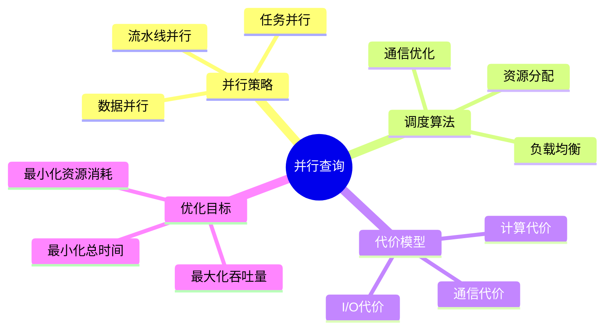
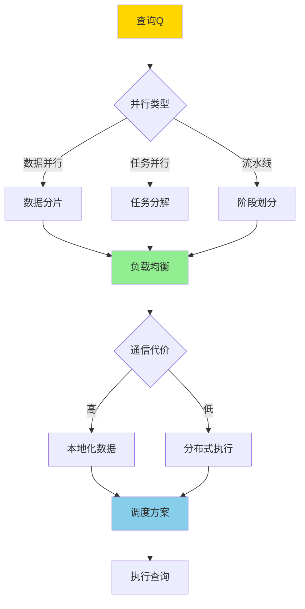
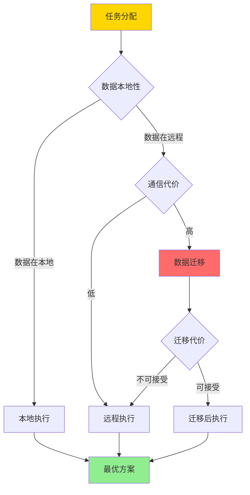

# 并行查询调度-负载均衡与通信代价的最优化

> **文档版本**: v1.0
> **最后更新**: 2025-01-16
> **版本覆盖**: PostgreSQL 18.x (推荐) ⭐ | 17.x (推荐) | 16.x (兼容)
> **文档状态**: 🟡 框架已创建，内容待完善

---

## 📋 目录

- [并行查询调度-负载均衡与通信代价的最优化](#并行查询调度-负载均衡与通信代价的最优化)
  - [📋 目录](#-目录)
  - [1. 概述](#1-概述)
    - [1.0 并行查询调度工作原理概述](#10-并行查询调度工作原理概述)
    - [1.1 本文档的范围](#11-本文档的范围)
  - [2. 核心内容](#2-核心内容)
    - [2.1 负载均衡](#21-负载均衡)
    - [2.2 通信代价优化](#22-通信代价优化)
    - [2.3 优化目标](#23-优化目标)
  - [3. 形式化定义](#3-形式化定义)
    - [3.1 并行调度形式化](#31-并行调度形式化)
    - [3.2 负载均衡形式化](#32-负载均衡形式化)
    - [3.3 优化问题形式化](#33-优化问题形式化)
  - [4. 定理与证明](#4-定理与证明)
    - [4.1 负载均衡最优性](#41-负载均衡最优性)
    - [4.2 通信代价下界](#42-通信代价下界)
  - [5. 实际应用](#5-实际应用)
    - [5.1 PostgreSQL并行查询](#51-postgresql并行查询)
    - [5.2 负载均衡优化](#52-负载均衡优化)
    - [5.3 通信代价优化](#53-通信代价优化)
  - [6. 相关文档](#6-相关文档)
    - [6.1 理论基础文档](#61-理论基础文档)
  - [7. 参考文献](#7-参考文献)
    - [7.1 核心理论文献](#71-核心理论文献)
    - [7.2 负载均衡相关](#72-负载均衡相关)
    - [7.3 PostgreSQL实现相关](#73-postgresql实现相关)
    - [7.4 相关文档](#74-相关文档)

---

## 1. 概述

### 1.0 并行查询调度工作原理概述

**并行查询调度**：

并行查询调度是将查询任务分配到多个处理器上并行执行，以提升查询性能。本文档提供负载均衡和通信代价最优化的形式化模型。

**并行查询架构思维导图**：



**并行调度决策树**：



**并行策略对比矩阵**：

| 策略 | 优势 | 劣势 | 适用场景 |
|------|------|------|---------|
| **数据并行** | 简单、扩展性好 | 数据倾斜问题 | 大规模数据扫描 |
| **任务并行** | 灵活性高 | 任务依赖复杂 | 复杂查询 |
| **流水线并行** | 延迟低 | 负载不均衡 | 流式处理 |

### 1.1 本文档的范围

本文档涵盖：

- **并行调度算法**：负载均衡和通信优化的调度算法
- **代价模型**：计算代价、通信代价的形式化
- **优化目标**：最小化总执行时间的优化方法
- **实际应用**：PostgreSQL并行查询的实现

---

## 2. 核心内容

### 2.1 负载均衡

**负载均衡算法**：

```haskell
-- 负载均衡
loadBalance :: [Task] -> [Worker] -> Assignment
loadBalance tasks workers =
    -- 贪心算法：将任务分配给负载最小的worker
    foldl assign [] tasks
    where
        assign assignment task =
            let worker = minimumBy (compare `on` load) workers
            in (task, worker) : assignment
```

**负载均衡策略对比矩阵**：

| 策略 | 方法 | 复杂度 | 效果 |
|------|------|--------|------|
| **轮询** | 轮流分配 | O(n) | 简单但不考虑负载 |
| **最少连接** | 分配给连接数最少的 | O(n log m) | 考虑当前负载 |
| **加权轮询** | 按权重分配 | O(n) | 考虑worker能力 |
| **动态负载** | 实时监控负载 | O(n log m) | 最优但开销大 |

### 2.2 通信代价优化

**通信代价模型**：

```haskell
-- 通信代价
communicationCost :: DataSize -> NetworkLatency -> Cost
communicationCost size latency =
    size * bandwidthCost + latency * fixedCost

-- 总代价
totalCost :: [Task] -> Assignment -> Cost
totalCost tasks assignment =
    computationCost tasks + communicationCost assignment
```

**通信优化决策树**：



### 2.3 优化目标

**多目标优化**：

```haskell
-- 优化目标
data OptimizationObjective =
    MinimizeTime
  | MaximizeThroughput
  | MinimizeCost
  | Balanced [OptimizationObjective]

-- Pareto最优解
paretoOptimal :: [Solution] -> [Solution]
paretoOptimal solutions =
    filter (not . dominated) solutions
    where
        dominated s = exists s' such that s' dominates s
```

---

## 3. 形式化定义

### 3.1 并行调度形式化

**调度定义**：

```haskell
-- 调度
Schedule = Map Task Worker

-- 执行时间
executionTime :: Schedule -> Time
executionTime schedule =
    max [finishTime(task, worker) | (task, worker) <- schedule]

-- 通信代价
communicationCost :: Schedule -> Cost
communicationCost schedule =
    sum [cost(task, worker) | (task, worker) <- schedule]
```

### 3.2 负载均衡形式化

**负载均衡条件**：

```haskell
-- 负载均衡
loadBalanced :: Schedule -> Bool
loadBalanced schedule =
    let loads = [load(worker) | worker <- workers]
        avgLoad = average loads
    in forall load in loads: |load - avgLoad| ≤ threshold
```

### 3.3 优化问题形式化

**优化问题**：

```haskell
-- 最小化总执行时间
minimize executionTime(schedule)
subject to:
    forall task: assigned(task, schedule)
    loadBalanced(schedule)
    communicationCost(schedule) ≤ budget
```

---

## 4. 定理与证明

### 4.1 负载均衡最优性

**定理**：贪心负载均衡算法在均匀任务分布下达到最优。

**证明**：

1. 贪心算法总是将任务分配给当前负载最小的worker
2. 在均匀任务分布下，这保证了负载的均匀分配
3. 因此达到最小最大完成时间

### 4.2 通信代价下界

**定理**：通信代价的下界是数据本地性最优时的通信量。

**证明**：

1. 数据本地性最优时，所有数据访问都是本地的
2. 任何其他调度都需要额外的数据迁移
3. 因此数据本地性最优时的通信量是下界

---

## 5. 实际应用

### 5.1 PostgreSQL并行查询

**并行查询配置**：

```sql
-- 启用并行查询
SET max_parallel_workers_per_gather = 4;
SET parallel_setup_cost = 1000;
SET parallel_tuple_cost = 0.01;

-- 并行扫描
EXPLAIN (ANALYZE, BUFFERS)
SELECT * FROM large_table
WHERE condition = 'value';

-- 如果表足够大，PostgreSQL会使用并行扫描
-- 多个worker并行扫描不同的数据块
```

**并行连接**：

```sql
-- 并行连接
EXPLAIN (ANALYZE, BUFFERS)
SELECT *
FROM large_table1 t1
JOIN large_table2 t2 ON t1.id = t2.id;

-- PostgreSQL会：
-- 1. 并行扫描两个表
-- 2. 在worker之间分配连接任务
-- 3. 合并结果
```

### 5.2 负载均衡优化

**分区表并行查询**：

```sql
-- 分区表自动负载均衡
CREATE TABLE orders (
    id SERIAL,
    order_date DATE,
    amount DECIMAL
) PARTITION BY RANGE (order_date);

-- 查询分区表时，每个分区可以并行扫描
SELECT * FROM orders
WHERE order_date BETWEEN '2024-01-01' AND '2024-12-31';

-- PostgreSQL会为每个分区分配worker
```

### 5.3 通信代价优化

**数据本地性优化**：

```sql
-- 使用本地索引减少通信
CREATE INDEX idx_local ON orders(customer_id)
WHERE order_date > '2024-01-01';

-- 查询时优先使用本地索引
SELECT * FROM orders
WHERE customer_id = 123
  AND order_date > '2024-01-01';

-- 减少跨节点的数据访问
```

---

## 6. 相关文档

### 6.1 理论基础文档

- [查询优化器自适应-反馈学习与代价模型修正](./05.13-查询优化器自适应-反馈学习与代价模型修正.md)
- [形式语言与证明：总论](../01-形式化方法与基础理论/01.05-形式语言与证明-总论.md)
- [理论基础导航](../README.md)

---

## 7. 参考文献

### 7.1 核心理论文献

- **DeWitt, D. J., & Gray, J. (1992). "Parallel Database Systems: The Future of High Performance Database Systems."**
  - 会议: Communications of the ACM 1992
  - **重要性**: 并行数据库系统的经典综述
  - **核心贡献**: 提出了并行数据库系统的架构和优化方法

- **Graefe, G. (1993). "Query Evaluation Techniques for Large Databases."**
  - 会议: ACM Computing Surveys 1993
  - **重要性**: 查询评估技术的经典综述
  - **核心贡献**: 系统阐述了并行查询优化技术

### 7.2 负载均衡相关

- **Krishnamurthy, R., et al. (1986). "Optimization of Parallel Execution for Multi-Join Queries."**
  - 会议: ICDE 1986
  - **重要性**: 并行连接优化的经典研究
  - **核心贡献**: 提供了负载均衡的优化方法

### 7.3 PostgreSQL实现相关

- **[PostgreSQL官方文档 - 并行查询](<https://www.postgresql.org/docs/current/parallel-query.html>)**
  - PostgreSQL并行查询实现说明

### 7.4 相关文档

- [查询优化器自适应-反馈学习与代价模型修正](./05.13-查询优化器自适应-反馈学习与代价模型修正.md)
- [理论基础导航](../README.md)

---

**最后更新**: 2025-01-16
**维护者**: Documentation Team
**状态**: 🟡 框架已创建，内容待完善
