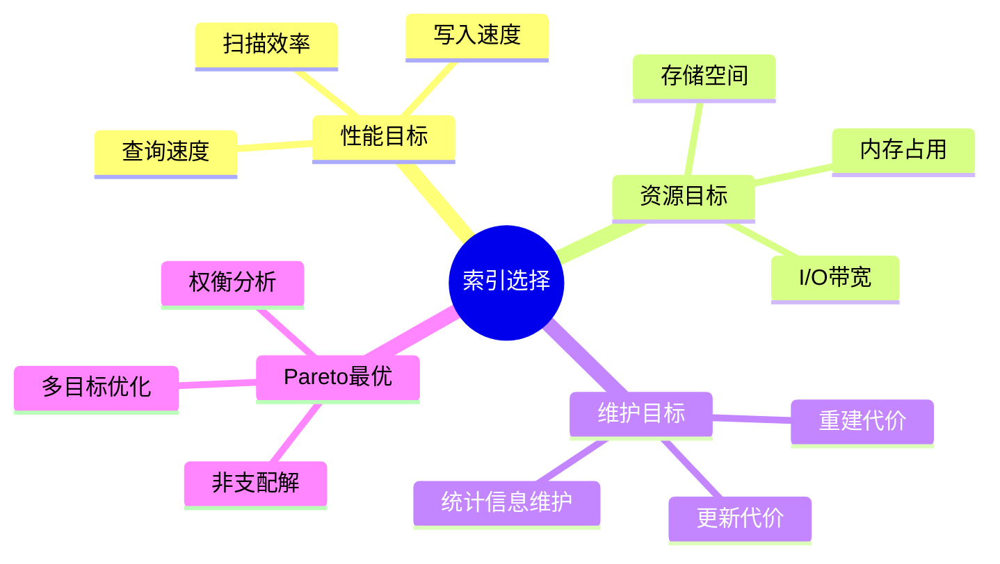
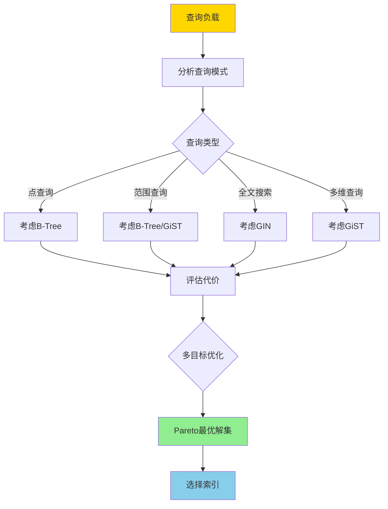
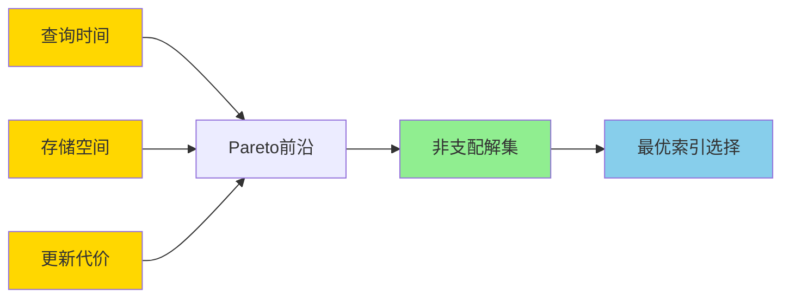
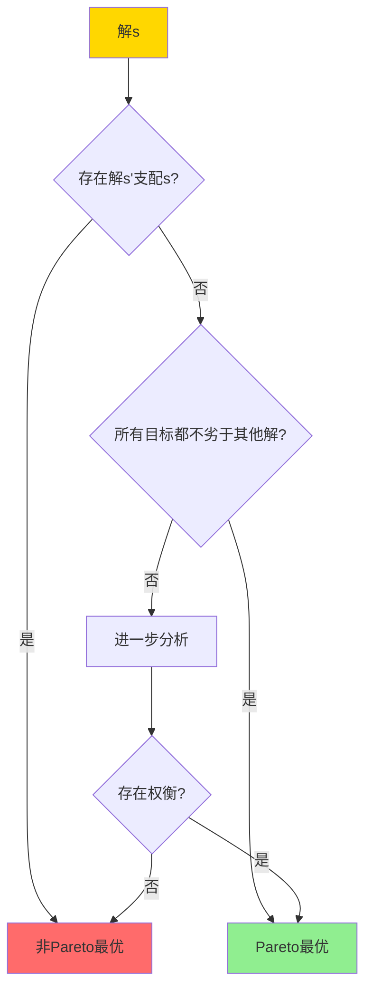

# 索引选择与代价模型-多目标优化的Pareto最优性

> **文档版本**: v1.0
> **最后更新**: 2025-01-16
> **版本覆盖**: PostgreSQL 18.x (推荐) ⭐ | 17.x (推荐) | 16.x (兼容)
> **文档状态**: 🟡 框架已创建，内容待完善

---

## 📋 目录

- [索引选择与代价模型-多目标优化的Pareto最优性](#索引选择与代价模型-多目标优化的pareto最优性)
  - [📋 目录](#-目录)
  - [1. 概述](#1-概述)
    - [1.0 索引选择与代价模型工作原理概述](#10-索引选择与代价模型工作原理概述)
    - [1.1 本文档的范围](#11-本文档的范围)
  - [2. 核心内容](#2-核心内容)
    - [2.1 多目标优化](#21-多目标优化)
    - [2.2 Pareto最优性](#22-pareto最优性)
    - [2.3 代价模型](#23-代价模型)
  - [3. 形式化定义](#3-形式化定义)
    - [3.1 多目标优化形式化](#31-多目标优化形式化)
    - [3.2 Pareto最优形式化](#32-pareto最优形式化)
    - [3.3 代价模型形式化](#33-代价模型形式化)
  - [4. 定理与证明](#4-定理与证明)
    - [4.1 Pareto最优性存在定理](#41-pareto最优性存在定理)
    - [4.2 加权和方法的局限性](#42-加权和方法的局限性)
  - [5. 实际应用](#5-实际应用)
    - [5.1 PostgreSQL索引选择](#51-postgresql索引选择)
    - [5.2 多目标优化应用](#52-多目标优化应用)
    - [5.3 Pareto最优解选择](#53-pareto最优解选择)
  - [6. 相关文档](#6-相关文档)
    - [6.1 理论基础文档](#61-理论基础文档)
  - [7. 参考文献](#7-参考文献)
    - [7.1 核心理论文献](#71-核心理论文献)
    - [7.2 多目标优化相关](#72-多目标优化相关)
    - [7.3 PostgreSQL实现相关](#73-postgresql实现相关)
    - [7.4 相关文档](#74-相关文档)

---

## 1. 概述

### 1.0 索引选择与代价模型工作原理概述

**多目标优化**：

索引选择需要在查询性能、存储空间、维护代价等多个目标之间权衡。本文档基于Pareto最优性理论提供索引选择的多目标优化方法。

**索引选择目标思维导图**：



**索引选择决策树**：



**索引类型对比矩阵**：

| 索引类型 | 查询性能 | 存储空间 | 更新代价 | 适用场景 |
|---------|---------|---------|---------|---------|
| **B-Tree** | 高 | 中 | 中 | 等值、范围查询 |
| **Hash** | 极高 | 低 | 低 | 等值查询 |
| **GiST** | 中 | 高 | 高 | 多维、自定义类型 |
| **GIN** | 高 | 高 | 高 | 全文搜索、数组 |
| **BRIN** | 低 | 极低 | 极低 | 大表、顺序数据 |

### 1.1 本文档的范围

本文档涵盖：

- **多目标优化**：索引选择的多个优化目标
- **Pareto最优性**：Pareto最优解的定义和求解
- **代价模型**：查询代价、存储代价的形式化
- **实际应用**：PostgreSQL索引选择的优化

---

## 2. 核心内容

### 2.1 多目标优化

**优化目标**：

```haskell
-- 多目标优化
data Objective =
    QueryTime      -- 最小化查询时间
  | StorageSpace   -- 最小化存储空间
  | UpdateCost     -- 最小化更新代价
  | MaintenanceCost -- 最小化维护代价

-- 目标函数
f1(index) = queryTime(index)  -- 查询时间
f2(index) = storageSpace(index)  -- 存储空间
f3(index) = updateCost(index)  -- 更新代价
```

**Pareto前沿可视化**：



### 2.2 Pareto最优性

**Pareto支配关系**：

```haskell
-- Pareto支配
dominates :: Solution -> Solution -> Bool
dominates s1 s2 =
    (forall i: f_i(s1) ≤ f_i(s2)) &&
    (exists i: f_i(s1) < f_i(s2))

-- Pareto最优解
paretoOptimal :: [Solution] -> [Solution]
paretoOptimal solutions =
    filter (not . isDominated) solutions
    where
        isDominated s = exists s' such that dominates s' s
```

**Pareto最优解判定决策树**：



### 2.3 代价模型

**代价函数**：

```haskell
-- 查询代价
queryCost :: Index -> Query -> Cost
queryCost index query =
    indexScanCost + dataAccessCost + cpuCost

-- 存储代价
storageCost :: Index -> Cost
storageCost index =
    indexSize * storageUnitCost

-- 更新代价
updateCost :: Index -> UpdateRate -> Cost
updateCost index rate =
    rate * (indexUpdateCost + indexMaintenanceCost)
```

**代价权衡矩阵**：

| 索引配置 | 查询代价 | 存储代价 | 更新代价 | Pareto最优 |
|---------|---------|---------|---------|-----------|
| **无索引** | 高 | 低 | 低 | 否 |
| **单列索引** | 中 | 中 | 中 | 可能 |
| **复合索引** | 低 | 高 | 高 | 可能 |
| **部分索引** | 低 | 低 | 中 | 是 |
| **覆盖索引** | 极低 | 高 | 高 | 可能 |

---

## 3. 形式化定义

### 3.1 多目标优化形式化

**优化问题**：

```haskell
-- 多目标优化问题
minimize F(x) = (f1(x), f2(x), ..., fk(x))
subject to:
    x ∈ X  -- 可行解空间
    g_i(x) ≤ 0  -- 约束条件
```

### 3.2 Pareto最优形式化

**Pareto支配**：

```haskell
-- Pareto支配
s1 ≺ s2 iff
    forall i: f_i(s1) ≤ f_i(s2) and
    exists i: f_i(s1) < f_i(s2)
```

**Pareto最优**：

```haskell
-- Pareto最优解
s* is Pareto optimal iff
    not exists s: s ≺ s*
```

### 3.3 代价模型形式化

**总代价**：

```haskell
-- 加权总代价
totalCost(index, weights) =
    w1 * queryCost(index) +
    w2 * storageCost(index) +
    w3 * updateCost(index)
```

---

## 4. 定理与证明

### 4.1 Pareto最优性存在定理

**定理**：对于有限解空间，Pareto最优解集非空。

**证明**：

1. 设解空间为有限集S
2. 如果所有解都被其他解支配，则存在循环支配，矛盾
3. 因此至少存在一个解不被任何其他解支配
4. 因此Pareto最优解集非空

### 4.2 加权和方法的局限性

**定理**：加权和方法可能无法找到所有Pareto最优解。

**证明**：

- 反例：非凸Pareto前沿
- 加权和方法只能找到凸包上的解
- 因此可能遗漏非凸区域的Pareto最优解

---

## 5. 实际应用

### 5.1 PostgreSQL索引选择

**自动索引选择**：

```sql
-- PostgreSQL查询规划器自动选择索引
EXPLAIN (ANALYZE, BUFFERS)
SELECT * FROM orders
WHERE customer_id = 123
  AND order_date > '2024-01-01';

-- 规划器会：
-- 1. 评估不同索引的查询代价
-- 2. 考虑存储和维护代价
-- 3. 选择Pareto最优的索引组合
```

**索引建议**：

```sql
-- 使用pg_stat_statements分析查询模式
SELECT
    query,
    calls,
    total_exec_time,
    mean_exec_time
FROM pg_stat_statements
ORDER BY total_exec_time DESC
LIMIT 10;

-- 基于查询模式选择索引
-- 考虑查询频率、数据分布、更新频率等因素
```

### 5.2 多目标优化应用

**索引选择优化**：

```sql
-- 场景1: 读多写少
-- 目标: 最小化查询时间
CREATE INDEX idx_customer_date
ON orders(customer_id, order_date);

-- 场景2: 写多读少
-- 目标: 最小化更新代价
-- 使用部分索引或减少索引数量

-- 场景3: 存储受限
-- 目标: 最小化存储空间
CREATE INDEX idx_customer
ON orders(customer_id)
WHERE order_date > '2024-01-01';  -- 部分索引
```

### 5.3 Pareto最优解选择

**权衡分析**：

```sql
-- 分析不同索引配置的代价
-- 配置1: 单列索引
CREATE INDEX idx_customer ON orders(customer_id);
-- 查询代价: 低, 存储代价: 中, 更新代价: 中

-- 配置2: 复合索引
CREATE INDEX idx_customer_date ON orders(customer_id, order_date);
-- 查询代价: 极低, 存储代价: 高, 更新代价: 高

-- 配置3: 部分索引
CREATE INDEX idx_customer_recent
ON orders(customer_id)
WHERE order_date > '2024-01-01';
-- 查询代价: 低, 存储代价: 低, 更新代价: 中

-- 根据工作负载选择Pareto最优配置
```

---

## 6. 相关文档

### 6.1 理论基础文档

- [索引结构正确性-BTree_GiST_GiN不变式与证明](./05.02-索引结构正确性-BTree_GiST_GiN不变式与证明.md)
- [代价模型与优化器-等价重写与最优性](./05.01-代价模型与优化器-等价重写与最优性.md)
- [理论基础导航](../README.md)

---

## 7. 参考文献

### 7.1 核心理论文献

- **Chaudhuri, S., & Narasayya, V. (1997). "AutoAdmin 'What-if' Index Analysis Utility."**
  - 会议: SIGMOD 1997
  - **重要性**: 自动索引选择的经典论文
  - **核心贡献**: 提出了索引选择的代价模型

- **Valentin, G., et al. (2000). "DB2 Advisor: An Optimizer Smart Enough to Recommend Its Own Indexes."**
  - 会议: ICDE 2000
  - **重要性**: 索引推荐系统的经典研究
  - **核心贡献**: 提供了多目标优化的索引选择方法

### 7.2 多目标优化相关

- **Deb, K. (2001). "Multi-Objective Optimization Using Evolutionary Algorithms."**
  - 出版社: Wiley
  - **重要性**: 多目标优化的经典教材
  - **核心贡献**: 系统阐述了Pareto最优性理论

### 7.3 PostgreSQL实现相关

- **[PostgreSQL官方文档 - 索引](<https://www.postgresql.org/docs/current/indexes.html>)**
  - PostgreSQL索引类型和选择说明

### 7.4 相关文档

- [索引结构正确性-BTree_GiST_GiN不变式与证明](./05.02-索引结构正确性-BTree_GiST_GiN不变式与证明.md)
- [代价模型与优化器-等价重写与最优性](./05.01-代价模型与优化器-等价重写与最优性.md)
- [理论基础导航](../README.md)

---

**最后更新**: 2025-01-16
**维护者**: Documentation Team
**状态**: 🟡 框架已创建，内容待完善
