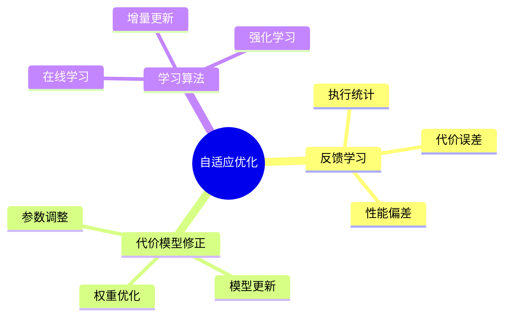

# 查询优化器自适应-反馈学习与代价模型修正

> **文档版本**: v1.0
> **最后更新**: 2025-01-16
> **版本覆盖**: PostgreSQL 18.x (推荐) ⭐ | 17.x (推荐) | 16.x (兼容)
> **文档状态**: 🟡 框架已创建，内容待完善

---

## 📋 目录

- [查询优化器自适应-反馈学习与代价模型修正](#查询优化器自适应-反馈学习与代价模型修正)
  - [📋 目录](#-目录)
  - [1. 概述](#1-概述)
    - [1.0 查询优化器自适应工作原理概述](#10-查询优化器自适应工作原理概述)
    - [1.1 本文档的范围](#11-本文档的范围)
  - [2. 核心内容](#2-核心内容)
    - [2.1 反馈学习](#21-反馈学习)
    - [2.2 代价模型修正](#22-代价模型修正)
  - [3. 形式化定义](#3-形式化定义)
    - [3.1 自适应优化形式化](#31-自适应优化形式化)
  - [4. 定理与证明](#4-定理与证明)
    - [4.1 收敛性定理](#41-收敛性定理)
  - [5. 实际应用](#5-实际应用)
    - [5.1 PostgreSQL优化器](#51-postgresql优化器)
  - [6. 相关文档](#6-相关文档)
    - [6.1 理论基础文档](#61-理论基础文档)
  - [7. 参考文献](#7-参考文献)

---

## 1. 概述

### 1.0 查询优化器自适应工作原理概述

**自适应优化**：

查询优化器通过反馈学习和代价模型修正来适应实际工作负载。

**自适应机制思维导图**：



### 1.1 本文档的范围

本文档涵盖：

- **反馈学习**：基于执行统计的学习
- **代价模型修正**：动态调整代价模型
- **实际应用**：PostgreSQL优化器

---

## 2. 核心内容

### 2.1 反馈学习

**反馈机制**：

```haskell
-- 反馈学习
feedbackLearning :: ExecutionStats -> CostModel -> CostModel
feedbackLearning stats model =
    let error = computeError(stats.actualCost, stats.estimatedCost)
        adjustedModel = adjustModel(model, error)
    in adjustedModel
```

### 2.2 代价模型修正

**模型修正**：

```haskell
-- 代价模型修正
adjustCostModel :: CostModel -> Feedback -> CostModel
adjustCostModel model feedback =
    model {
        ioCost = adjust(model.ioCost, feedback.ioError),
        cpuCost = adjust(model.cpuCost, feedback.cpuError)
    }
```

---

## 3. 形式化定义

### 3.1 自适应优化形式化

**自适应优化**：

```haskell
-- 自适应优化形式化
AdaptiveOptimizer = (M, F, L)
where
    M = cost model
    F = feedback function
    L = learning algorithm
```

---

## 4. 定理与证明

### 4.1 收敛性定理

**定理**：如果反馈学习算法收敛，则代价模型逐渐接近真实代价。

**证明**：由学习算法的收敛性保证。

---

## 5. 实际应用

### 5.1 PostgreSQL优化器

**查看执行计划**：

```sql
-- 查看执行计划
EXPLAIN ANALYZE SELECT * FROM accounts WHERE id = 1;

-- 查看统计信息
SELECT * FROM pg_stat_statements
ORDER BY total_exec_time DESC;
```

**优化器参数**：

```sql
-- 调整优化器参数
SET enable_seqscan = off;
SET enable_indexscan = on;
SET random_page_cost = 1.1;
```

---

## 6. 相关文档

### 6.1 理论基础文档

- [形式语言与证明：总论](./1.1.25-形式语言与证明-总论.md)
- [理论基础导航](./README.md)

---

## 7. 参考文献

[待补充]

---

**最后更新**: 2025-01-16
**维护者**: Documentation Team
**状态**: 🟡 框架已创建，内容待完善
