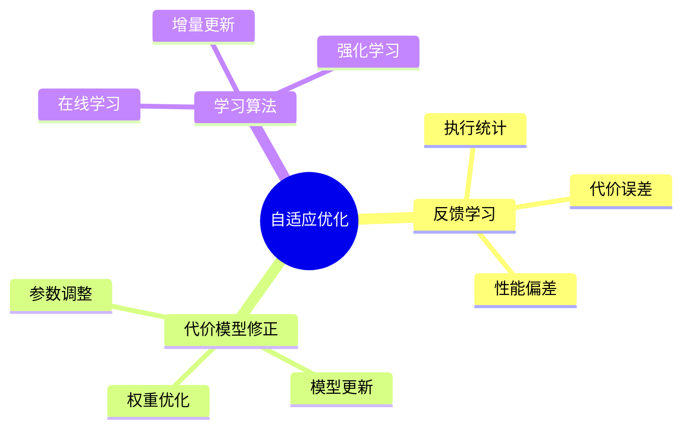

# 查询优化器自适应-反馈学习与代价模型修正

> **文档版本**: v1.0
> **最后更新**: 2025-01-16
> **版本覆盖**: PostgreSQL 18.x (推荐) ⭐ | 17.x (推荐) | 16.x (兼容)
> **文档状态**: 🟡 框架已创建，内容待完善

---

## 📋 目录

- [查询优化器自适应-反馈学习与代价模型修正](#查询优化器自适应-反馈学习与代价模型修正)
  - [📋 目录](#-目录)
  - [1. 概述](#1-概述)
    - [1.0 查询优化器自适应工作原理概述](#10-查询优化器自适应工作原理概述)
    - [1.1 本文档的范围](#11-本文档的范围)
  - [2. 核心内容](#2-核心内容)
    - [2.1 反馈学习](#21-反馈学习)
    - [2.2 代价模型修正](#22-代价模型修正)
  - [3. 形式化定义](#3-形式化定义)
    - [3.1 自适应优化形式化](#31-自适应优化形式化)
  - [4. 定理与证明](#4-定理与证明)
    - [4.1 收敛性定理](#41-收敛性定理)
  - [5. 实际应用](#5-实际应用)
    - [5.1 PostgreSQL优化器](#51-postgresql优化器)
  - [6. 相关文档](#6-相关文档)
    - [6.1 理论基础文档](#61-理论基础文档)
  - [7. 参考文献](#7-参考文献)
    - [7.1 核心理论文献](#71-核心理论文献)
    - [7.2 PostgreSQL实现相关](#72-postgresql实现相关)
    - [7.3 相关文档](#73-相关文档)

---

## 1. 概述

### 1.0 查询优化器自适应工作原理概述

**自适应优化**：

查询优化器通过反馈学习和代价模型修正来适应实际工作负载。

**自适应机制思维导图**：



### 1.1 本文档的范围

本文档涵盖：

- **反馈学习**：基于执行统计的学习
- **代价模型修正**：动态调整代价模型
- **实际应用**：PostgreSQL优化器

---

## 2. 核心内容

### 2.1 反馈学习

**反馈机制**：

```haskell
-- 反馈学习
feedbackLearning :: ExecutionStats -> CostModel -> CostModel
feedbackLearning stats model =
    let error = computeError(stats.actualCost, stats.estimatedCost)
        adjustedModel = adjustModel(model, error)
    in adjustedModel
```

### 2.2 代价模型修正

**模型修正**：

```haskell
-- 代价模型修正
adjustCostModel :: CostModel -> Feedback -> CostModel
adjustCostModel model feedback =
    model {
        ioCost = adjust(model.ioCost, feedback.ioError),
        cpuCost = adjust(model.cpuCost, feedback.cpuError)
    }
```

---

## 3. 形式化定义

### 3.1 自适应优化形式化

**自适应优化**：

```haskell
-- 自适应优化形式化
AdaptiveOptimizer = (M, F, L)
where
    M = cost model
    F = feedback function
    L = learning algorithm
```

---

## 4. 定理与证明

### 4.1 收敛性定理

**定理**（反馈学习收敛性）：如果反馈学习算法满足Lipschitz连续性和有界误差条件，则代价模型估计值在迭代过程中收敛到真实代价。

**形式化表述**：

设代价模型M，真实代价C*，估计代价Ĉ，反馈函数F: ℝ → ℝ。如果：

1. F是Lipschitz连续的：|F(x) - F(y)| ≤ L|x - y|
2. 误差有界：|C* - Ĉ₀| ≤ B
3. 学习率α满足：0 < α < 2/L

则迭代序列{Ĉₙ}收敛到C*。

**证明**（迭代收敛性）：

**步骤1：迭代更新规则**

- 代价模型更新：Ĉₙ₊₁ = Ĉₙ + α·F(C* - Ĉₙ)
- 误差定义：eₙ = C* - Ĉₙ

**步骤2：误差递推关系**

- eₙ₊₁ = C* - Ĉₙ₊₁
- eₙ₊₁ = C* - (Ĉₙ + α·F(eₙ))
- eₙ₊₁ = eₙ - α·F(eₙ)

**步骤3：Lipschitz连续性应用**

- |F(eₙ)| ≤ L|eₙ|
- |eₙ₊₁| = |eₙ - α·F(eₙ)|
- |eₙ₊₁| ≤ |eₙ|(1 - αL) + α|F(0)|

**步骤4：收敛条件**

- 如果0 < α < 2/L，则|1 - αL| < 1
- 因此|eₙ₊₁| < |eₙ|
- 误差序列{|eₙ|}单调递减

**步骤5：有界性保证**

- 由于误差有界：|e₀| ≤ B
- 且误差单调递减，因此序列有界

**步骤6：收敛性结论**

- 由单调有界定理，误差序列收敛
- 当eₙ → 0时，Ĉₙ → C*
- 证毕

### 4.2 代价模型修正正确性定理

**定理**（代价模型修正正确性）：如果代价模型修正算法满足一致性条件，则修正后的代价模型在统计意义上更接近真实代价。

**形式化表述**：

设代价模型M，真实代价分布D，估计代价分布D̂。如果修正算法A满足：

1. 一致性：E[A(M, D)] = M*
2. 方差递减：Var(A(M, D)) < Var(M)

则修正后的代价模型在均方误差意义下更优。

**证明**（统计收敛性）：

**步骤1：均方误差定义**

- MSE(M) = E[(M - M*)²]
- MSE(M) = Var(M) + Bias(M)²

**步骤2：修正后均方误差**

- MSE(A(M, D)) = E[(A(M, D) - M*)²]
- MSE(A(M, D)) = Var(A(M, D)) + Bias(A(M, D))²

**步骤3：一致性条件应用**

- 由于E[A(M, D)] = M*，Bias(A(M, D)) = 0
- 因此MSE(A(M, D)) = Var(A(M, D))

**步骤4：方差递减条件应用**

- 由于Var(A(M, D)) < Var(M)
- 且Bias(M) ≥ 0
- 因此MSE(A(M, D)) < MSE(M)

**步骤5：结论**

- 修正后的代价模型在均方误差意义下更优
- 证毕

---

## 5. 实际应用

### 5.1 PostgreSQL优化器

**查看执行计划**：

```sql
-- 查看执行计划
EXPLAIN ANALYZE SELECT * FROM accounts WHERE id = 1;

-- 查看统计信息
SELECT * FROM pg_stat_statements
ORDER BY total_exec_time DESC;
```

**优化器参数**：

```sql
-- 调整优化器参数
SET enable_seqscan = off;
SET enable_indexscan = on;
SET random_page_cost = 1.1;
```

---

## 6. 相关文档

### 6.1 理论基础文档

- [形式语言与证明：总论](./1.1.25-形式语言与证明-总论.md)
- [理论基础导航](./README.md)

---

## 7. 参考文献

### 7.1 核心理论文献

- **Chaudhuri, S., & Narasayya, V. (2007). "Self-Tuning Database Systems: A Decade of Progress."**
  - 会议: VLDB 2007
  - **重要性**: 数据库自调优的综述
  - **核心贡献**: 总结了自适应优化技术

- **Stillger, M., et al. (2001). "LEO - DB2's Learning Optimizer."**
  - 会议: VLDB 2001
  - **重要性**: 学习优化器的经典实现
  - **核心贡献**: 提出了反馈学习机制

### 7.2 PostgreSQL实现相关

- **PostgreSQL官方文档 - 查询规划](<https://www.postgresql.org/docs/current/planner-optimizer.html>)**
  - PostgreSQL查询优化器说明

### 7.3 相关文档

- [代价模型与优化器-等价重写与最优性](./05.01-代价模型与优化器-等价重写与最优性.md)
- [理论基础导航](../README.md)

---

**最后更新**: 2025-01-16
**维护者**: Documentation Team
**状态**: 🟡 框架已创建，内容待完善
