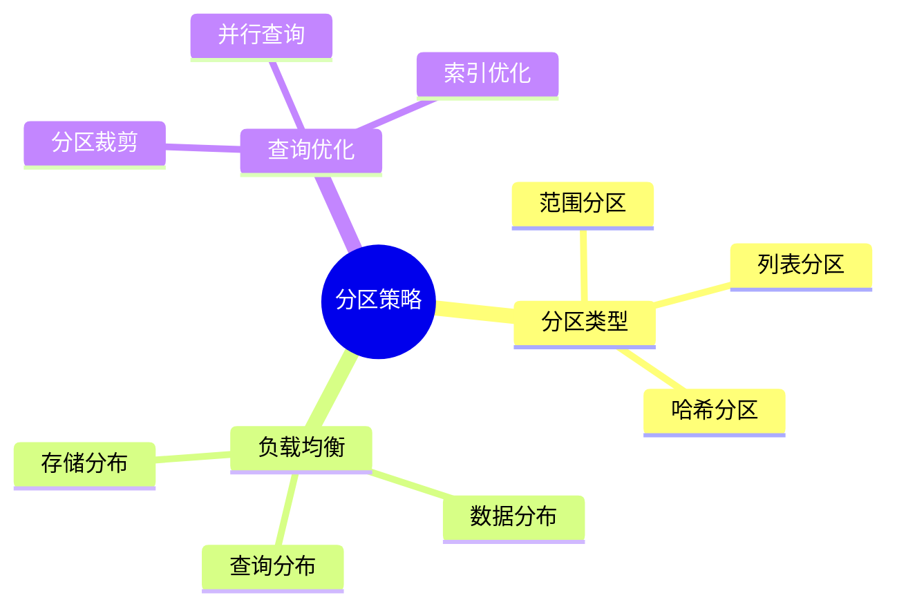

# 数据库分区策略-负载均衡与查询优化的权衡

> **文档版本**: v1.0
> **最后更新**: 2025-01-16
> **版本覆盖**: PostgreSQL 18.x (推荐) ⭐ | 17.x (推荐) | 16.x (兼容)
> **文档状态**: 🟡 框架已创建，内容待完善

---

## 📋 目录

- [数据库分区策略-负载均衡与查询优化的权衡](#数据库分区策略-负载均衡与查询优化的权衡)
  - [📋 目录](#-目录)
  - [1. 概述](#1-概述)
    - [1.0 数据库分区策略工作原理概述](#10-数据库分区策略工作原理概述)
    - [1.1 本文档的范围](#11-本文档的范围)
  - [2. 核心内容](#2-核心内容)
    - [2.1 分区类型](#21-分区类型)
    - [2.2 负载均衡](#22-负载均衡)
  - [3. 形式化定义](#3-形式化定义)
    - [3.1 分区形式化](#31-分区形式化)
  - [4. 实际应用](#4-实际应用)
    - [4.1 PostgreSQL分区](#41-postgresql分区)
  - [5. 相关文档](#5-相关文档)
    - [5.1 理论基础文档](#51-理论基础文档)
  - [6. 参考文献](#6-参考文献)

---

## 1. 概述

### 1.0 数据库分区策略工作原理概述

**分区策略**：

数据库分区通过将大表分割为多个小表来优化查询性能和负载均衡。

**分区策略思维导图**：



### 1.1 本文档的范围

本文档涵盖：

- **分区策略**：范围、列表、哈希分区
- **负载均衡**：数据分布和查询优化
- **实际应用**：PostgreSQL分区实现

---

## 2. 核心内容

### 2.1 分区类型

**分区类型对比**：

| 类型 | 方法 | 优点 | 缺点 | 适用场景 |
|------|------|------|------|---------|
| **范围分区** | 按值范围 | 查询优化好 | 可能不均匀 | 时间序列 |
| **列表分区** | 按值列表 | 精确控制 | 需要枚举 | 离散值 |
| **哈希分区** | 哈希函数 | 均匀分布 | 查询优化难 | 负载均衡 |

### 2.2 负载均衡

**负载均衡策略**：

```haskell
-- 负载均衡
loadBalance :: PartitionStrategy -> Query -> [Partition]
loadBalance strategy query =
    filter (matchesQuery query) (partitions strategy)
```

---

## 3. 形式化定义

### 3.1 分区形式化

**分区**：

```haskell
-- 分区形式化
Partition = (P, f)
where
    P = {p1, p2, ..., pn}  -- 分区集合
    f: Row -> Partition  -- 分区函数
```

---

## 4. 实际应用

### 4.1 PostgreSQL分区

**范围分区**：

```sql
-- 创建分区表
CREATE TABLE orders (
    id INTEGER,
    order_date DATE,
    amount NUMERIC
) PARTITION BY RANGE (order_date);

-- 创建分区
CREATE TABLE orders_2024_q1 PARTITION OF orders
FOR VALUES FROM ('2024-01-01') TO ('2024-04-01');

CREATE TABLE orders_2024_q2 PARTITION OF orders
FOR VALUES FROM ('2024-04-01') TO ('2024-07-01');
```

**哈希分区**：

```sql
-- 哈希分区
CREATE TABLE users (
    id INTEGER,
    name VARCHAR
) PARTITION BY HASH (id);

CREATE TABLE users_0 PARTITION OF users
FOR VALUES WITH (MODULUS 4, REMAINDER 0);
```

---

## 5. 相关文档

### 5.1 理论基础文档

- [形式语言与证明：总论](./1.1.25-形式语言与证明-总论.md)
- [理论基础导航](./README.md)

---

## 6. 参考文献

[待补充]

---

**最后更新**: 2025-01-16
**维护者**: Documentation Team
**状态**: 🟡 框架已创建，内容待完善
