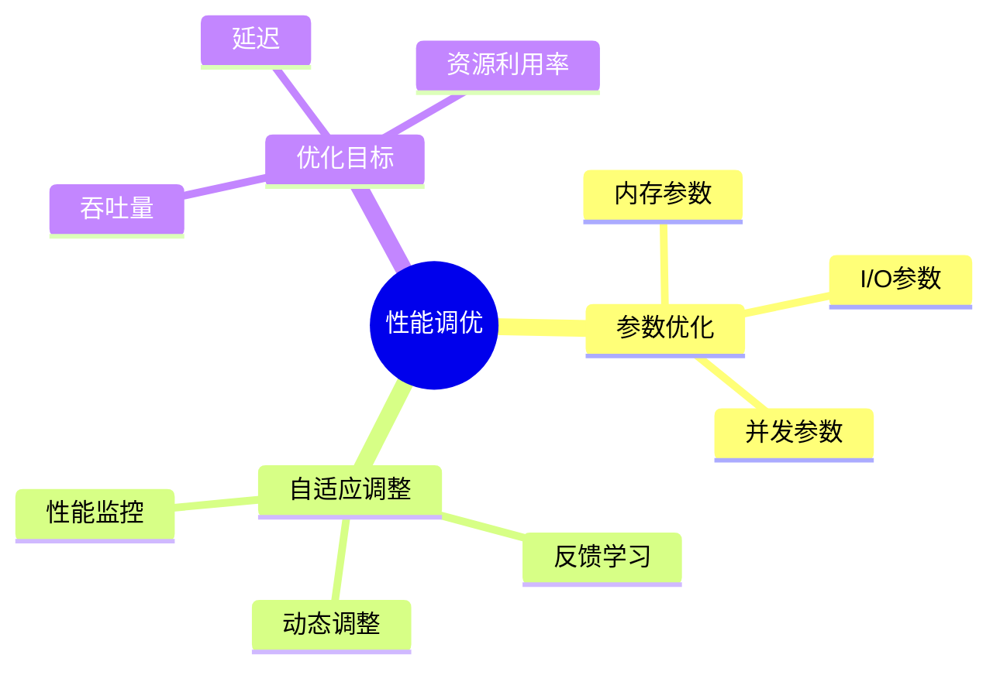

# 数据库性能调优-参数优化与自适应调整的形式化

> **文档版本**: v1.0
> **最后更新**: 2025-01-16
> **版本覆盖**: PostgreSQL 18.x (推荐) ⭐ | 17.x (推荐) | 16.x (兼容)
> **文档状态**: 🟡 框架已创建，内容待完善

---

## 📋 目录

- [数据库性能调优-参数优化与自适应调整的形式化](#数据库性能调优-参数优化与自适应调整的形式化)
  - [📋 目录](#-目录)
  - [1. 概述](#1-概述)
    - [1.0 数据库性能调优工作原理概述](#10-数据库性能调优工作原理概述)
    - [1.1 本文档的范围](#11-本文档的范围)
  - [2. 核心内容](#2-核心内容)
    - [2.1 参数优化](#21-参数优化)
    - [2.2 自适应调整](#22-自适应调整)
  - [3. 形式化定义](#3-形式化定义)
    - [3.1 优化目标形式化](#31-优化目标形式化)
  - [4. 实际应用](#4-实际应用)
    - [4.1 PostgreSQL调优](#41-postgresql调优)
  - [5. 相关文档](#5-相关文档)
    - [5.1 理论基础文档](#51-理论基础文档)
  - [6. 参考文献](#6-参考文献)
    - [6.1 核心理论文献](#61-核心理论文献)
    - [6.2 PostgreSQL实现相关](#62-postgresql实现相关)
    - [6.3 相关文档](#63-相关文档)

---

## 1. 概述

### 1.0 数据库性能调优工作原理概述

**性能调优**：

数据库性能调优通过参数优化和自适应调整来提升系统性能。

**调优策略思维导图**：



### 1.1 本文档的范围

本文档涵盖：

- **参数优化**：关键参数的形式化优化
- **自适应调整**：基于反馈的动态调整
- **实际应用**：PostgreSQL性能调优

---

## 2. 核心内容

### 2.1 参数优化

**关键参数**：

| 参数 | 影响 | 优化方法 | 默认值 |
|------|------|---------|--------|
| **shared_buffers** | 缓存大小 | 25%内存 | 128MB |
| **work_mem** | 排序内存 | 按查询数 | 4MB |
| **maintenance_work_mem** | 维护内存 | 按维护任务 | 64MB |

### 2.2 自适应调整

**自适应算法**：

```haskell
-- 自适应调整
adaptiveAdjust :: PerformanceMetrics -> Parameters -> Parameters
adaptiveAdjust metrics params =
    if metrics.throughput < threshold then
        adjustParams(params, increaseMemory)
    else
        params
```

---

## 3. 形式化定义

### 3.1 优化目标形式化

**优化目标**：

```haskell
-- 优化目标
optimize(params) = maximize(throughput(params))
                   subject to constraints(params)
```

---

## 4. 实际应用

### 4.1 PostgreSQL调优

**参数配置**：

```sql
-- 调整共享缓冲区
ALTER SYSTEM SET shared_buffers = '256MB';

-- 调整工作内存
ALTER SYSTEM SET work_mem = '16MB';

-- 查看参数
SHOW shared_buffers;
SHOW work_mem;
```

**性能监控**：

```sql
-- 查看性能统计
SELECT * FROM pg_stat_database;
SELECT * FROM pg_stat_statements;
```

---

## 5. 相关文档

### 5.1 理论基础文档

- [形式语言与证明：总论](./1.1.25-形式语言与证明-总论.md)
- [理论基础导航](./README.md)

---

## 6. 参考文献

### 6.1 核心理论文献

- **Duan, S., et al. (2009). "Tuning Database Configuration Parameters with iTuned."**
  - 会议: VLDB 2009
  - **重要性**: 数据库参数自动调优
  - **核心贡献**: 提出了参数优化方法

- **Van Aken, D., et al. (2017). "Automatic Database Management System Tuning Through Large-Scale Machine Learning."**
  - 会议: SIGMOD 2017
  - **重要性**: 基于机器学习的自动调优
  - **核心贡献**: 使用ML进行参数优化

### 6.2 PostgreSQL实现相关

- **PostgreSQL官方文档 - 配置参数](<https://www.postgresql.org/docs/current/runtime-config.html>)**
  - PostgreSQL配置参数说明

### 6.3 相关文档

- [查询优化器自适应-反馈学习与代价模型修正](./05.13-查询优化器自适应-反馈学习与代价模型修正.md)
- [理论基础导航](../README.md)

---

**最后更新**: 2025-01-16
**维护者**: Documentation Team
**状态**: 🟡 框架已创建，内容待完善
