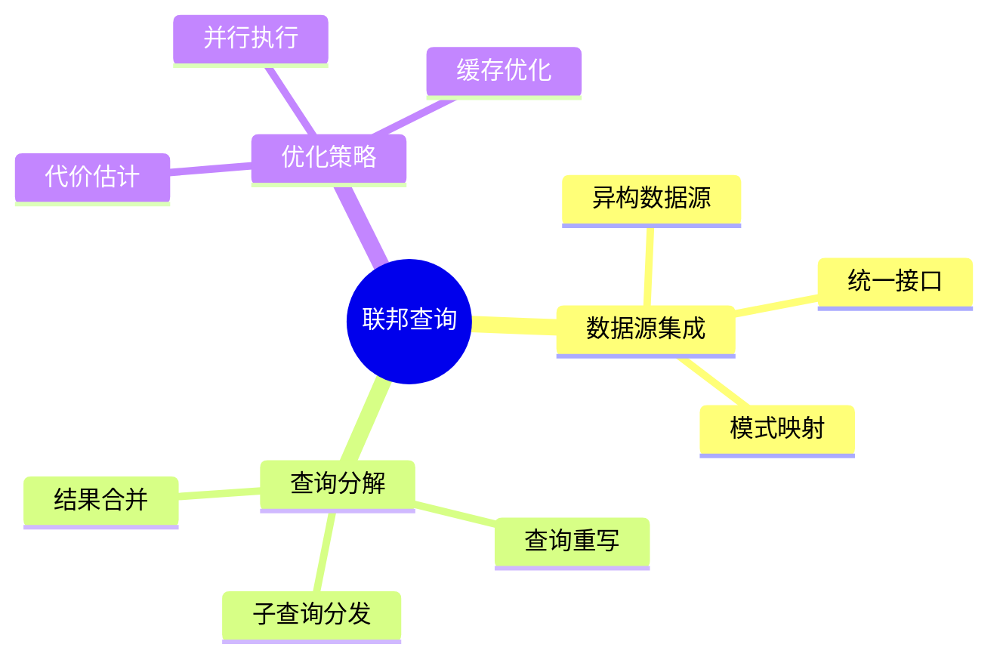

# 数据库联邦查询模型-多数据源集成与查询分解的形式化

> **文档版本**: v1.0
> **最后更新**: 2025-01-16
> **版本覆盖**: PostgreSQL 18.x (推荐) ⭐ | 17.x (推荐) | 16.x (兼容)
> **文档状态**: 🟡 框架已创建，内容待完善

---

## 📋 目录

- [数据库联邦查询模型-多数据源集成与查询分解的形式化](#数据库联邦查询模型-多数据源集成与查询分解的形式化)
  - [📋 目录](#-目录)
  - [1. 概述](#1-概述)
    - [1.0 数据库联邦查询工作原理概述](#10-数据库联邦查询工作原理概述)
    - [1.1 本文档的范围](#11-本文档的范围)
  - [2. 核心内容](#2-核心内容)
    - [2.1 查询分解](#21-查询分解)
    - [2.2 结果合并](#22-结果合并)
  - [3. 形式化定义](#3-形式化定义)
    - [3.1 联邦查询形式化](#31-联邦查询形式化)
  - [4. 实际应用](#4-实际应用)
    - [4.1 PostgreSQL联邦查询](#41-postgresql联邦查询)
  - [5. 相关文档](#5-相关文档)
    - [5.1 理论基础文档](#51-理论基础文档)
  - [6. 参考文献](#6-参考文献)

---

## 1. 概述

### 1.0 数据库联邦查询工作原理概述

**联邦查询**：

联邦查询允许在多个数据源上执行统一查询，通过查询分解和结果合并实现。

**联邦查询思维导图**：



### 1.1 本文档的范围

本文档涵盖：

- **数据源集成**：多数据源的统一访问
- **查询分解**：查询分解和结果合并
- **实际应用**：PostgreSQL联邦查询实现

---

## 2. 核心内容

### 2.1 查询分解

**查询分解算法**：

```haskell
-- 查询分解
decomposeQuery :: Query -> [DataSource] -> [SubQuery]
decomposeQuery query sources =
    let relevantSources = filter (relevantTo query) sources
        subQueries = map (rewriteQuery query) relevantSources
    in subQueries
```

### 2.2 结果合并

**结果合并**：

```haskell
-- 结果合并
mergeResults :: [ResultSet] -> ResultSet
mergeResults results =
    foldl union [] results
```

---

## 3. 形式化定义

### 3.1 联邦查询形式化

**联邦查询**：

```haskell
-- 联邦查询形式化
FederatedQuery = (Q, S, D, M)
where
    Q = query
    S = {s1, s2, ..., sn}  -- 数据源集合
    D = decompose function
    M = merge function
```

---

## 4. 实际应用

### 4.1 PostgreSQL联邦查询

**使用postgres_fdw**：

```sql
-- 创建外部服务器
CREATE SERVER foreign_server
FOREIGN DATA WRAPPER postgres_fdw
OPTIONS (host 'remote_host', dbname 'remote_db');

-- 创建用户映射
CREATE USER MAPPING FOR current_user
SERVER foreign_server
OPTIONS (user 'remote_user', password 'password');

-- 创建外部表
CREATE FOREIGN TABLE remote_table (
    id INTEGER,
    name VARCHAR
) SERVER foreign_server
OPTIONS (schema_name 'public', table_name 'remote_table');

-- 查询外部表
SELECT * FROM remote_table;
```

---

## 5. 相关文档

### 5.1 理论基础文档

- [形式语言与证明：总论](./1.1.25-形式语言与证明-总论.md)
- [理论基础导航](./README.md)

---

## 6. 参考文献

[待补充]

---

**最后更新**: 2025-01-16
**维护者**: Documentation Team
**状态**: 🟡 框架已创建，内容待完善
