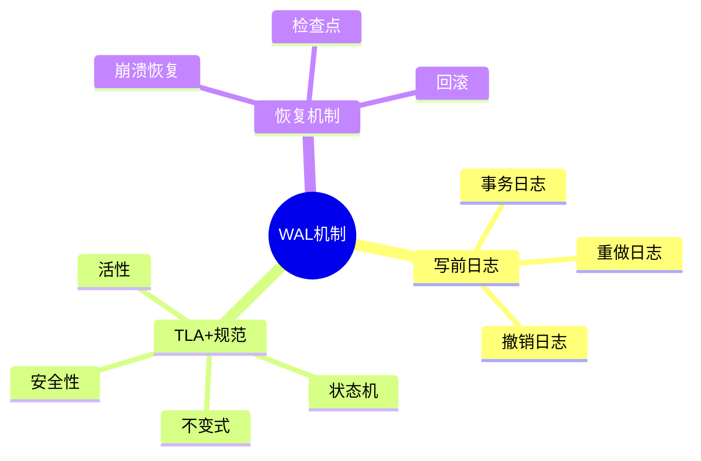
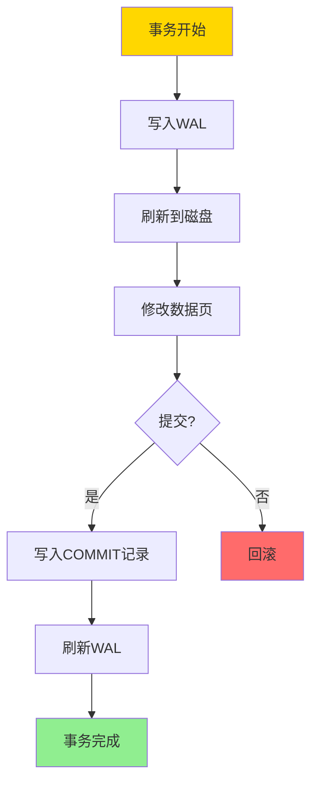
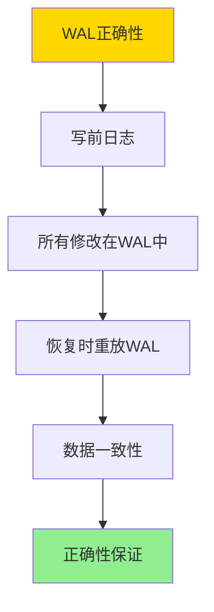

# TLA+-事务与WAL-规范纲要

> **文档版本**: v1.0
> **最后更新**: 2025-01-16
> **版本覆盖**: PostgreSQL 18.x (推荐) ⭐ | 17.x (推荐) | 16.x (兼容)
> **文档状态**: 🟡 框架已创建，内容待完善

---

## 📋 目录

- [TLA+-事务与WAL-规范纲要](#tla-事务与wal-规范纲要)
  - [📋 目录](#-目录)
  - [1. 概述](#1-概述)
    - [1.0 TLA+与WAL工作原理概述](#10-tla与wal工作原理概述)
    - [1.1 本文档的范围](#11-本文档的范围)
  - [2. 核心内容](#2-核心内容)
    - [2.1 TLA+规范结构](#21-tla规范结构)
    - [2.2 WAL不变式](#22-wal不变式)
    - [2.3 恢复机制](#23-恢复机制)
  - [3. 形式化定义](#3-形式化定义)
    - [3.1 WAL形式化](#31-wal形式化)
    - [3.2 持久性形式化](#32-持久性形式化)
    - [3.3 恢复形式化](#33-恢复形式化)
  - [4. 定理与证明](#4-定理与证明)
    - [4.1 WAL正确性定理](#41-wal正确性定理)
  - [5. 实际应用](#5-实际应用)
    - [5.1 PostgreSQL WAL](#51-postgresql-wal)
    - [5.2 WAL性能优化](#52-wal性能优化)
  - [6. 相关文档](#6-相关文档)
    - [6.1 理论基础文档](#61-理论基础文档)
  - [7. 参考文献](#7-参考文献)
    - [7.1 核心理论文献](#71-核心理论文献)
    - [7.2 WAL实现相关](#72-wal实现相关)
    - [7.3 PostgreSQL实现相关](#73-postgresql实现相关)
    - [7.4 相关文档](#74-相关文档)

---

## 1. 概述

### 1.0 TLA+与WAL工作原理概述

**TLA+规范**：

TLA+（Temporal Logic of Actions）是一种形式化规范语言，用于描述和验证并发和分布式系统。本文档使用TLA+规范事务和WAL（Write-Ahead Logging）机制。

**WAL机制思维导图**：



**WAL工作流程**：



### 1.1 本文档的范围

本文档涵盖：

- **TLA+规范**：使用TLA+形式化描述事务和WAL
- **WAL机制**：写前日志的工作原理和正确性
- **恢复机制**：崩溃恢复和检查点机制
- **实际应用**：PostgreSQL WAL的实现

---

## 2. 核心内容

### 2.1 TLA+规范结构

**TLA+模块结构**：

```tla
---- MODULE WAL ----
EXTENDS Naturals, Sequences

VARIABLES
    wal :: Seq(LogRecord),      \* WAL日志
    data :: [PageID -> Page],    \* 数据页
    transactions :: Set(TransID) \* 活跃事务

Init ==
    /\ wal = <<>>
    /\ data = [p \in PageID |-> EmptyPage]
    /\ transactions = {}

Next ==
    \/ WriteToWAL
    \/ WriteToData
    \/ Commit
    \/ Abort

Spec == Init /\ [][Next]_<<wal, data, transactions>>

====
```

**WAL操作规范**：

```tla
WriteToWAL ==
    /\ \E tx \in transactions:
        \E page \in PageID:
        \E value \in Value:
            /\ wal' = Append(wal, LogRecord(tx, page, value))
            /\ UNCHANGED <<data, transactions>>

WriteToData ==
    /\ \E rec \in wal:
        /\ data' = [data EXCEPT ![rec.page] = rec.value]
        /\ UNCHANGED <<wal, transactions>>
```

### 2.2 WAL不变式

**WAL不变式**：

```tla
WALInvariant ==
    /\ \A rec \in wal:
        IF rec.type = "COMMIT" THEN
            \A prev_rec \in wal:
                IF prev_rec.tx = rec.tx /\ prev_rec.seq < rec.seq THEN
                    prev_rec \in wal
        ELSE TRUE
```

**安全性性质**：

```tla
Safety ==
    /\ \A tx \in transactions:
        \A rec \in wal:
            IF rec.tx = tx THEN
                rec \in wal
```

### 2.3 恢复机制

**恢复规范**：

```tla
Recovery ==
    LET committed == {tx \in TransID:
                        \E rec \in wal: rec.type = "COMMIT" /\ rec.tx = tx}
    IN
        /\ \A tx \in committed:
            \A rec \in wal:
                IF rec.tx = tx THEN
                    data'[rec.page] = rec.value
        /\ transactions' = {}
```

---

## 3. 形式化定义

### 3.1 WAL形式化

**WAL**：

```haskell
-- WAL形式化
WAL = (L, D, T, →)
where
    L = log sequence  -- 日志序列
    D = data pages  -- 数据页
    T = active transactions  -- 活跃事务
    → = transition relation  -- 转换关系
```

### 3.2 持久性形式化

**持久性**：

```haskell
-- 持久性
durable(WAL) =
    forall committed transaction tx:
        exists log record r: r.tx = tx and r.type = COMMIT
        and
        forall data modification m in tx:
            m is in WAL before COMMIT
```

### 3.3 恢复形式化

**恢复**：

```haskell
-- 恢复
recover(WAL) =
    let committed = {tx | COMMIT record for tx in WAL}
    in
        forall tx in committed:
            apply all operations of tx to data
```

---

## 4. 定理与证明

### 4.1 WAL正确性定理

**定理**：如果所有数据修改都先写入WAL，则系统可以从WAL恢复。

**证明树**：



**证明**：

1. **写前日志**：所有数据修改都先写入WAL
2. **持久性**：WAL先于数据页刷新到磁盘
3. **恢复**：崩溃后可以从WAL重放所有已提交的事务
4. 因此系统可以从WAL恢复

---

## 5. 实际应用

### 5.1 PostgreSQL WAL

**PostgreSQL WAL配置**：

```sql
-- 查看WAL配置
SHOW wal_level;
SHOW max_wal_size;
SHOW min_wal_size;
SHOW checkpoint_timeout;

-- 查看WAL统计
SELECT * FROM pg_stat_wal;
```

**WAL归档**：

```sql
-- 配置WAL归档
ALTER SYSTEM SET wal_level = 'replica';
ALTER SYSTEM SET archive_mode = 'on';
ALTER SYSTEM SET archive_command = 'cp %p /path/to/archive/%f';

-- 查看归档状态
SELECT * FROM pg_stat_archiver;
```

### 5.2 WAL性能优化

**WAL性能调优**：

```sql
-- 调整WAL缓冲区
ALTER SYSTEM SET wal_buffers = '16MB';

-- 调整检查点频率
ALTER SYSTEM SET checkpoint_timeout = '15min';
ALTER SYSTEM SET max_wal_size = '1GB';

-- 异步提交（牺牲持久性换取性能）
ALTER SYSTEM SET synchronous_commit = 'off';
```

---

## 6. 相关文档

### 6.1 理论基础文档

- [ARIES日志恢复-正确性与不变式](./06.03-ARIES日志恢复-正确性与不变式.md)
- [理论基础导航](../README.md)

---

## 7. 参考文献

### 7.1 核心理论文献

- **Lamport, L. (2002). "Specifying Systems: The TLA+ Language and Tools for Hardware and Software Engineers."**
  - 出版社: Addison-Wesley
  - **重要性**: TLA+的权威教材
  - **核心贡献**: 系统阐述了TLA+语言和规范方法
  - **批判性分析**: TLA+适合系统级规范，但对于复杂业务逻辑可能过于底层

- **Gray, J., & Reuter, A. (1993). "Transaction Processing: Concepts and Techniques."**
  - 出版社: Morgan Kaufmann
  - **重要性**: 事务处理的权威教材
  - **核心贡献**: 详细阐述了WAL机制和恢复理论
  - **批判性分析**: WAL理论成熟，但实际实现中的性能优化仍需深入研究

### 7.2 WAL实现相关

- **Mohan, C., et al. (1992). "ARIES: A Transaction Recovery Method Supporting Fine-Granularity Locking and Partial Rollbacks."**
  - 会议: VLDB 1992
  - **重要性**: ARIES恢复算法的经典论文
  - **核心贡献**: 提出了ARIES恢复算法，被PostgreSQL等系统采用

### 7.3 PostgreSQL实现相关

- **[PostgreSQL官方文档 - WAL](<https://www.postgresql.org/docs/current/wal.html>)**
  - PostgreSQL WAL机制实现说明

### 7.4 相关文档

- [ARIES日志恢复-正确性与不变式](./06.03-ARIES日志恢复-正确性与不变式.md)
- [理论基础导航](../README.md)

---

**最后更新**: 2025-01-16
**维护者**: Documentation Team
**状态**: 🟡 框架已创建，内容待完善
