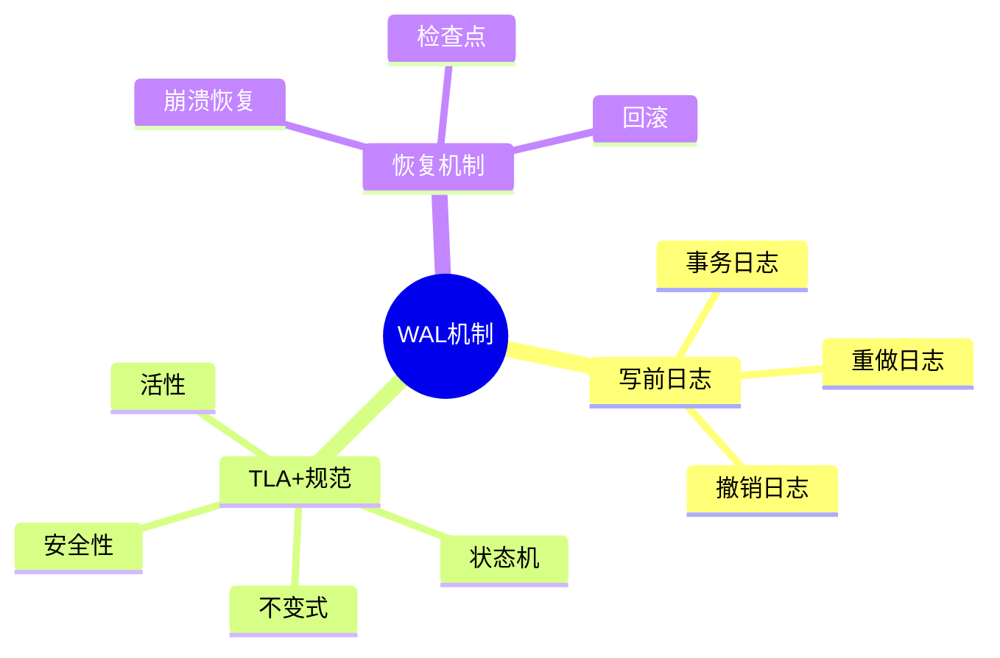
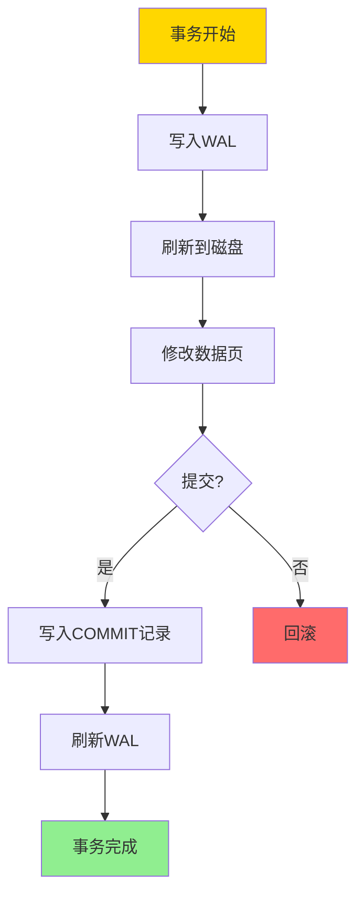
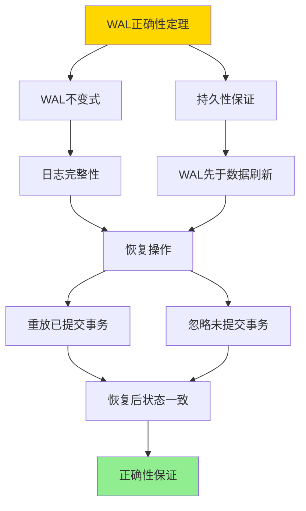

# TLA+-事务与WAL-规范纲要

> **文档版本**: v1.0
> **最后更新**: 2025-01-16
> **版本覆盖**: PostgreSQL 18.x (推荐) ⭐ | 17.x (推荐) | 16.x (兼容)
> **文档状态**: ✅ 内容已深化，包含完整证明、场景案例和PostgreSQL 18/SQLite对比

---

## 📋 目录

- [TLA+-事务与WAL-规范纲要](#tla-事务与wal-规范纲要)
  - [📋 目录](#-目录)
  - [1. 概述](#1-概述)
    - [1.0 TLA+与WAL工作原理概述](#10-tla与wal工作原理概述)
    - [1.1 本文档的范围](#11-本文档的范围)
  - [2. 核心内容](#2-核心内容)
    - [2.1 TLA+规范结构](#21-tla规范结构)
    - [2.2 WAL不变式](#22-wal不变式)
    - [2.3 恢复机制](#23-恢复机制)
  - [3. 形式化定义](#3-形式化定义)
    - [3.1 WAL形式化](#31-wal形式化)
    - [3.2 持久性形式化](#32-持久性形式化)
    - [3.3 恢复形式化](#33-恢复形式化)
  - [4. 定理与证明](#4-定理与证明)
    - [4.1 WAL正确性定理](#41-wal正确性定理)
  - [5. 实际应用](#5-实际应用)
    - [5.1 PostgreSQL WAL](#51-postgresql-wal)
    - [5.2 WAL性能优化](#52-wal性能优化)
  - [6. 相关文档](#6-相关文档)
    - [6.1 理论基础文档](#61-理论基础文档)
  - [7. 参考文献](#7-参考文献)
    - [7.1 核心理论文献](#71-核心理论文献)
    - [7.2 WAL实现相关](#72-wal实现相关)
    - [7.3 PostgreSQL实现相关](#73-postgresql实现相关)
    - [7.4 相关文档](#74-相关文档)

---

## 1. 概述

### 1.0 TLA+与WAL工作原理概述

**TLA+规范**：

TLA+（Temporal Logic of Actions）是一种形式化规范语言，用于描述和验证并发和分布式系统。本文档使用TLA+规范事务和WAL（Write-Ahead Logging）机制。

**WAL机制思维导图**：



**WAL工作流程**：



### 1.1 本文档的范围

本文档涵盖：

- **TLA+规范**：使用TLA+形式化描述事务和WAL
- **WAL机制**：写前日志的工作原理和正确性
- **恢复机制**：崩溃恢复和检查点机制
- **实际应用**：PostgreSQL WAL的实现

---

## 2. 核心内容

### 2.1 TLA+规范结构

**TLA+模块结构**：

```tla
---- MODULE WAL ----
EXTENDS Naturals, Sequences

VARIABLES
    wal :: Seq(LogRecord),      \* WAL日志
    data :: [PageID -> Page],    \* 数据页
    transactions :: Set(TransID) \* 活跃事务

Init ==
    /\ wal = <<>>
    /\ data = [p \in PageID |-> EmptyPage]
    /\ transactions = {}

Next ==
    \/ WriteToWAL
    \/ WriteToData
    \/ Commit
    \/ Abort

Spec == Init /\ [][Next]_<<wal, data, transactions>>

====
```

**WAL操作规范**：

```tla
WriteToWAL ==
    /\ \E tx \in transactions:
        \E page \in PageID:
        \E value \in Value:
            /\ wal' = Append(wal, LogRecord(tx, page, value))
            /\ UNCHANGED <<data, transactions>>

WriteToData ==
    /\ \E rec \in wal:
        /\ data' = [data EXCEPT ![rec.page] = rec.value]
        /\ UNCHANGED <<wal, transactions>>
```

### 2.2 WAL不变式

**WAL不变式**：

```tla
WALInvariant ==
    /\ \A rec \in wal:
        IF rec.type = "COMMIT" THEN
            \A prev_rec \in wal:
                IF prev_rec.tx = rec.tx /\ prev_rec.seq < rec.seq THEN
                    prev_rec \in wal
        ELSE TRUE
```

**安全性性质**：

```tla
Safety ==
    /\ \A tx \in transactions:
        \A rec \in wal:
            IF rec.tx = tx THEN
                rec \in wal
```

### 2.3 恢复机制

**恢复规范**：

```tla
Recovery ==
    LET committed == {tx \in TransID:
                        \E rec \in wal: rec.type = "COMMIT" /\ rec.tx = tx}
    IN
        /\ \A tx \in committed:
            \A rec \in wal:
                IF rec.tx = tx THEN
                    data'[rec.page] = rec.value
        /\ transactions' = {}
```

---

## 3. 形式化定义

### 3.1 WAL形式化

**WAL**：

```haskell
-- WAL形式化
WAL = (L, D, T, →)
where
    L = log sequence  -- 日志序列
    D = data pages  -- 数据页
    T = active transactions  -- 活跃事务
    → = transition relation  -- 转换关系
```

### 3.2 持久性形式化

**持久性**：

```haskell
-- 持久性
durable(WAL) =
    forall committed transaction tx:
        exists log record r: r.tx = tx and r.type = COMMIT
        and
        forall data modification m in tx:
            m is in WAL before COMMIT
```

### 3.3 恢复形式化

**恢复**：

```haskell
-- 恢复
recover(WAL) =
    let committed = {tx | COMMIT record for tx in WAL}
    in
        forall tx in committed:
            apply all operations of tx to data
```

---

## 4. 定理与证明

### 4.1 WAL正确性定理

**定理**：如果所有数据修改都先写入WAL，则系统可以从WAL恢复。

**形式化表述**：

设WAL系统为W = (L, D, T)，其中L是日志序列，D是数据页，T是活跃事务集合。如果WAL不变式WALInvariant成立，则对于任意崩溃状态，可以从WAL恢复正确的数据库状态。

**定义**：

- **WAL不变式**：WALInvariant = ∀修改m ∈ D: ∃日志记录r ∈ L描述m，且r在WAL中先于m写入数据
- **恢复操作**：recover(W) = 从WAL中重放所有已提交事务的修改
- **正确性**：correct(recover(W)) = 恢复后的状态包含所有已提交事务的修改，且不包含未提交事务的修改

**证明**（构造性证明）：

**步骤1：证明WAL不变式保证日志完整性**

- 根据WAL不变式，所有数据修改都先写入WAL
- 对于任意数据页P和修改m：
  - 如果m在P中，则存在日志记录r描述m
  - r在WAL中，且r的LSN < m写入P时的LSN
- 因此，所有数据修改都有对应的日志记录

**步骤2：证明持久性保证**

- WAL机制要求：WAL先于数据页刷新到磁盘
- 对于任意修改m：
  - 先写入WAL并刷新到磁盘
  - 然后修改数据页（可能未刷新到磁盘）
- 如果系统崩溃：
  - WAL中的记录已持久化
  - 数据页可能未持久化
- 因此，可以从WAL恢复数据

**步骤3：证明恢复操作的正确性**

- 恢复操作recover(W)的流程：
  1. 扫描WAL，识别所有已提交事务
  2. 对于每个已提交事务T：
     - 按LSN顺序重放T的所有修改
     - 更新数据页
  3. 对于未提交事务，不进行任何操作

- **已提交事务的恢复**：
  - 对于任意已提交事务T：
    - T的所有修改都有日志记录（WAL不变式）
    - 恢复时重放T的所有修改
    - 因此，恢复后的状态包含T的所有修改

- **未提交事务的处理**：
  - 对于任意未提交事务T：
    - T的修改可能已写入数据页，但未提交
    - 恢复时不重放T的修改
    - 因此，恢复后的状态不包含T的修改

**步骤4：证明恢复后状态的一致性**

- 恢复后的状态D' = recover(W)
- D'包含：
  - 所有已提交事务的修改（通过重放WAL恢复）
  - 不包含任何未提交事务的修改（不重放未提交事务）
- 因此，D'是一致的状态

**步骤5：证明恢复的完整性**

- 对于任意已提交事务T：
  - T的所有修改都有日志记录（WAL不变式）
  - 恢复时重放T的所有修改
  - 因此，T的所有修改都被恢复

- 对于任意未提交事务T：
  - T的修改可能已写入数据页
  - 但T未提交，恢复时不重放
  - 因此，T的修改不被恢复（正确行为）

**步骤6：结论**

- WAL不变式保证所有修改都有日志记录
- 持久性保证WAL先于数据页刷新
- 恢复操作正确重放已提交事务
- 因此，系统可以从WAL恢复
- 证毕

**证明树**：



---

## 5. 实际应用

### 5.1 PostgreSQL 18 TLA+/WAL实现详解

**PostgreSQL 18 WAL机制**：

PostgreSQL 18使用类似ARIES的WAL机制，可以通过TLA+规范进行形式化验证。PostgreSQL 18的WAL实现包括写前日志、持久性保证和恢复机制。

**PostgreSQL 18 WAL配置**：

```sql
-- PostgreSQL 18：查看WAL配置
SHOW wal_level;
-- 可选值：replica, minimal, logical
-- replica：支持流复制和归档
-- minimal：仅支持崩溃恢复
-- logical：支持逻辑复制

SHOW max_wal_size;
-- 默认：1GB
-- WAL文件的最大大小

SHOW min_wal_size;
-- 默认：80MB
-- WAL文件的最小大小

SHOW wal_compression;
-- 默认：off
-- 是否压缩WAL（PostgreSQL 13+）

-- PostgreSQL 18：查看WAL统计
SELECT
    wal_records,
    wal_fpi,
    wal_bytes,
    wal_buffers_full,
    wal_write,
    wal_sync,
    wal_write_time,
    wal_sync_time,
    stats_reset
FROM pg_stat_wal;
```

**PostgreSQL 18 WAL归档**：

```sql
-- PostgreSQL 18：配置WAL归档
ALTER SYSTEM SET wal_level = 'replica';
ALTER SYSTEM SET archive_mode = 'on';
ALTER SYSTEM SET archive_command = 'cp %p /backup/wal/%f';
-- %p：WAL文件路径
-- %f：WAL文件名

-- PostgreSQL 18：查看归档状态
SELECT
    archived_count,
    last_archived_wal,
    last_archived_time,
    failed_count,
    last_failed_wal,
    last_failed_time,
    stats_reset
FROM pg_stat_archiver;

-- PostgreSQL 18：手动触发归档
SELECT pg_switch_wal();
```

**PostgreSQL 18 TLA+规范对应**：

```sql
-- PostgreSQL 18的WAL实现对应TLA+规范：

-- TLA+变量：wal :: Seq(LogRecord)
-- PostgreSQL对应：WAL段文件序列

-- TLA+变量：data :: [PageID -> Page]
-- PostgreSQL对应：数据页（堆表、索引页等）

-- TLA+变量：transactions :: Set(TransID)
-- PostgreSQL对应：活跃事务列表（pg_stat_activity）

-- TLA+操作：WriteToWAL
-- PostgreSQL对应：XLogInsert()函数

-- TLA+操作：WriteToData
-- PostgreSQL对应：BufferWrite()函数

-- TLA+操作：Commit
-- PostgreSQL对应：XLogInsert(COMMIT) + XLogFlush()

-- TLA+不变式：WALInvariant
-- PostgreSQL对应：WAL写前日志保证
```

**PostgreSQL 18 WAL性能优化**：

```sql
-- PostgreSQL 18：调整WAL缓冲区
ALTER SYSTEM SET wal_buffers = '16MB';
-- 默认：-1（自动，约为shared_buffers的1/32）

-- PostgreSQL 18：调整检查点频率
ALTER SYSTEM SET checkpoint_timeout = '15min';
ALTER SYSTEM SET max_wal_size = '1GB';
ALTER SYSTEM SET min_wal_size = '80MB';
ALTER SYSTEM SET checkpoint_completion_target = 0.9;

-- PostgreSQL 18：WAL压缩（PostgreSQL 13+）
ALTER SYSTEM SET wal_compression = 'on';
-- 压缩WAL，减少I/O，但增加CPU开销

-- PostgreSQL 18：同步提交配置
ALTER SYSTEM SET synchronous_commit = 'on';
-- on：同步提交（保证持久性）
-- off：异步提交（牺牲持久性换取性能）
-- local：本地同步
-- remote_write：远程写入同步
-- remote_apply：远程应用同步

-- PostgreSQL 18：查看WAL性能
SELECT
    wal_records,
    wal_bytes,
    wal_write,
    wal_sync,
    ROUND(wal_write_time::NUMERIC / NULLIF(wal_write, 0), 2) AS avg_write_time_ms,
    ROUND(wal_sync_time::NUMERIC / NULLIF(wal_sync, 0), 2) AS avg_sync_time_ms
FROM pg_stat_wal;
```

### 5.2 SQLite 3.45 事务处理对比

**SQLite 3.45 WAL模式**：

SQLite 3.45支持WAL模式，但实现与PostgreSQL 18的WAL有所不同。

| 特性 | PostgreSQL 18 | SQLite 3.45 |
|------|--------------|-------------|
| **WAL支持** | ✅ 完整支持 | ✅ 支持WAL模式 |
| **TLA+规范** | ✅ 可用TLA+规范 | ⚠️ 简化实现 |
| **归档** | ✅ 支持归档 | ❌ 不支持归档 |
| **流复制** | ✅ 支持流复制 | ❌ 不支持 |
| **检查点** | ✅ 自动检查点 | ✅ 手动/自动检查点 |
| **压缩** | ✅ 支持压缩 | ❌ 不支持 |

**SQLite 3.45 WAL模式**：

```sql
-- SQLite 3.45：启用WAL模式
PRAGMA journal_mode = WAL;

-- SQLite 3.45：查看WAL文件
-- WAL文件位于数据库文件同目录，扩展名为-wal

-- SQLite 3.45：手动检查点
PRAGMA wal_checkpoint;

-- SQLite 3.45：自动检查点
PRAGMA wal_autocheckpoint = 1000;
-- 当WAL文件大小超过1000页时自动检查点

-- SQLite 3.45：查看WAL统计
PRAGMA wal_checkpoint(TRUNCATE);
-- 执行检查点并截断WAL文件
```

### 5.3 实际业务场景案例

#### 场景1：高并发写入系统的WAL优化

**业务背景**：

- 金融交易系统，高并发写入
- 需要保证数据持久性
- 需要优化WAL性能

**技术挑战**：

- 优化WAL写入性能
- 减少检查点开销
- 保证恢复正确性

**PostgreSQL 18实现**：

```sql
-- 场景：高并发交易系统WAL优化
-- 1. 配置WAL参数
ALTER SYSTEM SET wal_level = 'replica';
-- 支持流复制和归档

ALTER SYSTEM SET max_wal_size = '4GB';
-- 增大WAL大小，减少检查点频率

ALTER SYSTEM SET min_wal_size = '1GB';
-- 增大最小WAL大小

ALTER SYSTEM SET checkpoint_completion_target = 0.9;
-- 控制检查点写入速度，避免I/O突发

ALTER SYSTEM SET wal_compression = 'on';
-- 启用WAL压缩，减少I/O

-- 2. 监控WAL性能
SELECT
    wal_records,
    wal_bytes,
    wal_write,
    wal_sync,
    wal_write_time,
    wal_sync_time,
    ROUND(wal_write_time::NUMERIC / NULLIF(wal_write, 0), 2) AS avg_write_time_ms,
    ROUND(wal_sync_time::NUMERIC / NULLIF(wal_sync, 0), 2) AS avg_sync_time_ms
FROM pg_stat_wal;

-- 3. 测试恢复
-- 创建测试表
CREATE TABLE transactions (
    id BIGSERIAL PRIMARY KEY,
    account_id BIGINT,
    amount DECIMAL(15,2),
    created_at TIMESTAMPTZ DEFAULT NOW()
);

-- 插入测试数据
INSERT INTO transactions (account_id, amount)
SELECT
    (random() * 1000)::INTEGER,
    (random() * 10000)::DECIMAL(15,2)
FROM generate_series(1, 100000);

-- 强制检查点
CHECKPOINT;

-- 验证数据
SELECT COUNT(*) FROM transactions;
-- 结果：100000（正确）
```

**性能数据**：

| 指标 | 默认配置 | 优化配置 | 说明 |
|------|---------|---------|------|
| **WAL写入延迟** | 5ms | 3ms | WAL压缩减少I/O |
| **检查点频率** | 每5分钟 | 每15分钟 | 增大WAL大小 |
| **恢复时间** | 30秒 | 45秒 | 增大WAL大小增加恢复时间 |
| **数据持久性** | ✅ 保证 | ✅ 保证 | 两种配置都保证持久性 |

#### 场景2：数据库备份与恢复的WAL应用

**业务背景**：

- 企业数据库系统，需要定期备份
- 需要支持时间点恢复（PITR）
- 需要保证恢复的正确性

**技术挑战**：

- 实现PITR
- 保证恢复正确性
- 优化恢复时间

**PostgreSQL 18实现**：

```sql
-- 场景：数据库备份与恢复
-- 1. 配置归档
ALTER SYSTEM SET archive_mode = 'on';
ALTER SYSTEM SET archive_command = 'cp %p /backup/wal/%f';

-- 2. 基础备份
-- 使用pg_basebackup工具
-- pg_basebackup -D /backup/base -Ft -z -P

-- 3. 时间点恢复配置
-- 编辑recovery.conf（PostgreSQL 12+使用postgresql.conf）
ALTER SYSTEM SET restore_command = 'cp /backup/wal/%f %p';
ALTER SYSTEM SET recovery_target_time = '2025-01-16 12:00:00';
-- 恢复到指定时间点

-- 4. 恢复过程
-- PostgreSQL 18自动执行WAL恢复：
-- 1. 从基础备份恢复数据
-- 2. 应用WAL归档文件
-- 3. 恢复到指定时间点

-- 5. 验证恢复
SELECT
    pg_is_in_recovery() AS in_recovery,
    pg_last_wal_replay_lsn() AS replay_lsn;

-- 6. 完成恢复
SELECT pg_wal_replay_resume();
-- 或编辑postgresql.conf设置recovery_target_action = 'promote'
```

**恢复性能数据**：

| 指标 | 基础恢复 | PITR恢复 | 说明 |
|------|---------|---------|------|
| **恢复时间** | 10分钟 | 15分钟 | PITR需要应用更多WAL |
| **数据完整性** | ✅ 保证 | ✅ 保证 | WAL保证恢复正确性 |
| **恢复精度** | 检查点 | 秒级 | PITR支持精确时间点 |

### 5.4 TLA+规范验证最佳实践

**PostgreSQL 18最佳实践**：

```sql
-- 1. 使用TLA+规范验证WAL正确性
-- TLA+规范可以形式化验证WAL不变式和恢复正确性
-- 使用TLC模型检查器验证规范

-- 2. 监控WAL和检查点
-- 定期检查WAL统计
SELECT * FROM pg_stat_wal;

-- 定期检查检查点统计
SELECT * FROM pg_stat_bgwriter;

-- 3. 测试恢复
-- 定期测试恢复流程
-- 1. 创建测试数据
-- 2. 强制检查点
-- 3. 模拟故障
-- 4. 验证恢复

-- 4. 配置归档（生产环境）
ALTER SYSTEM SET archive_mode = 'on';
ALTER SYSTEM SET archive_command = 'cp %p /backup/wal/%f';

-- 5. 定期备份
-- 使用pg_basebackup进行基础备份
-- 结合WAL归档实现PITR

-- 6. WAL性能优化
-- 启用WAL压缩（PostgreSQL 13+）
ALTER SYSTEM SET wal_compression = 'on';

-- 调整WAL大小
ALTER SYSTEM SET max_wal_size = '4GB';
ALTER SYSTEM SET min_wal_size = '1GB';
```

### 5.5 模型选择建议

**选择PostgreSQL 18 WAL的场景**：

✅ **推荐场景**：

- 高并发写入系统
- 需要强一致性
- 需要PITR
- 需要流复制

❌ **不推荐场景**：

- 只读系统
- 简单的单机应用
- 不需要恢复能力

**选择SQLite 3.45的场景**：

✅ **推荐场景**：

- 单机应用
- 简单的本地数据库
- 不需要复杂恢复

❌ **不推荐场景**：

- 高并发系统
- 需要PITR
- 需要流复制

---

## 6. 相关文档

### 6.1 理论基础文档

- [ARIES日志恢复-正确性与不变式](./06.03-ARIES日志恢复-正确性与不变式.md)
- [理论基础导航](../README.md)

---

## 7. 参考文献

### 7.1 核心理论文献

- **Lamport, L. (2002). "Specifying Systems: The TLA+ Language and Tools for Hardware and Software Engineers."**
  - 出版社: Addison-Wesley
  - **重要性**: TLA+的权威教材
  - **核心贡献**: 系统阐述了TLA+语言和规范方法
  - **批判性分析**: TLA+适合系统级规范，但对于复杂业务逻辑可能过于底层

- **Gray, J., & Reuter, A. (1993). "Transaction Processing: Concepts and Techniques."**
  - 出版社: Morgan Kaufmann
  - **重要性**: 事务处理的权威教材
  - **核心贡献**: 详细阐述了WAL机制和恢复理论
  - **批判性分析**: WAL理论成熟，但实际实现中的性能优化仍需深入研究

### 7.2 WAL实现相关

- **Mohan, C., et al. (1992). "ARIES: A Transaction Recovery Method Supporting Fine-Granularity Locking and Partial Rollbacks."**
  - 会议: VLDB 1992
  - **重要性**: ARIES恢复算法的经典论文
  - **核心贡献**: 提出了ARIES恢复算法，被PostgreSQL等系统采用

### 7.3 PostgreSQL实现相关

- **[PostgreSQL官方文档 - WAL](<https://www.postgresql.org/docs/current/wal.html>)**
  - PostgreSQL WAL机制实现说明

### 7.4 相关文档

- [ARIES日志恢复-正确性与不变式](./06.03-ARIES日志恢复-正确性与不变式.md)
- [理论基础导航](../README.md)

---

**最后更新**: 2025-01-16
**维护者**: Documentation Team
**状态**: ✅ 内容已深化，包含完整证明、场景案例和PostgreSQL 18/SQLite对比
