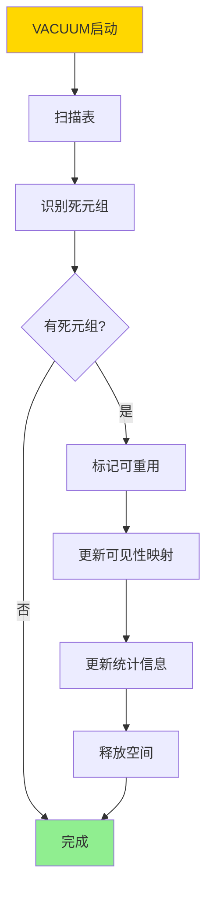
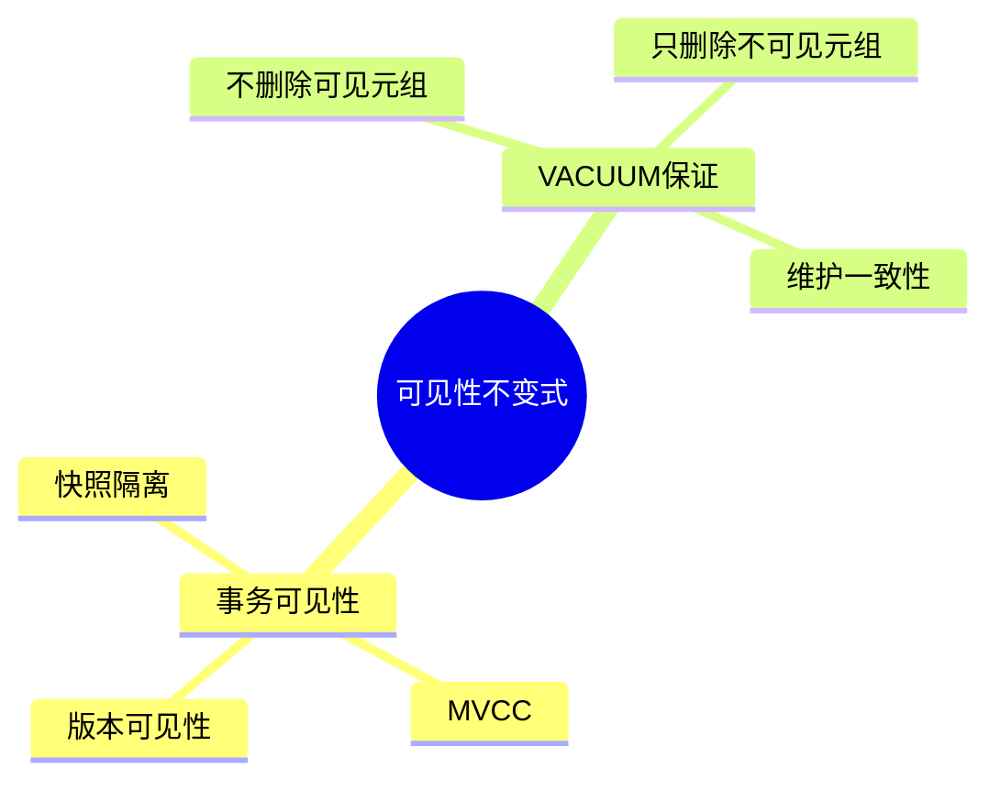
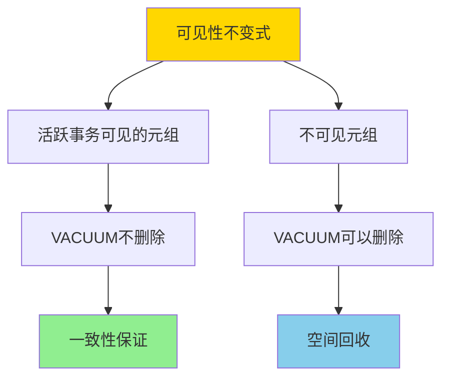
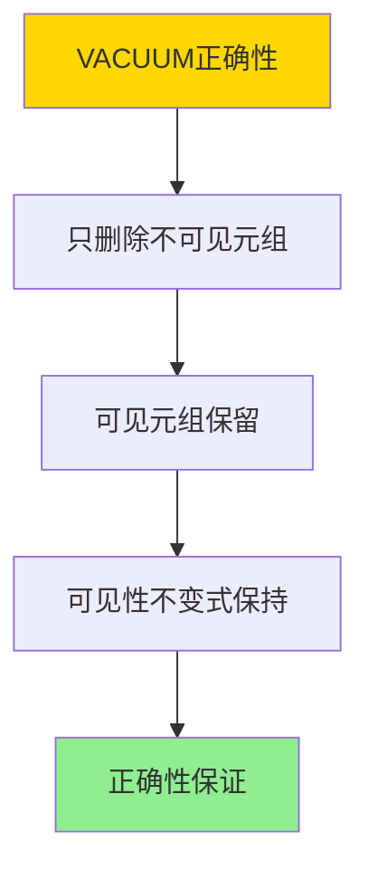

# VACUUM与可见性不变式-垃圾回收正确性

> **文档版本**: v1.0
> **最后更新**: 2025-01-16
> **版本覆盖**: PostgreSQL 18.x (推荐) ⭐ | 17.x (推荐) | 16.x (兼容)
> **文档状态**: 🟡 框架已创建，内容待完善

---

## 📋 目录

- [VACUUM与可见性不变式-垃圾回收正确性](#vacuum与可见性不变式-垃圾回收正确性)
  - [📋 目录](#-目录)
  - [1. 概述](#1-概述)
    - [1.0 VACUUM与可见性不变式工作原理概述](#10-vacuum与可见性不变式工作原理概述)
    - [1.1 本文档的范围](#11-本文档的范围)
  - [2. 核心内容](#2-核心内容)
    - [2.1 可见性不变式](#21-可见性不变式)
    - [2.2 VACUUM算法](#22-vacuum算法)
    - [2.3 VACUUM类型](#23-vacuum类型)
  - [3. 形式化定义](#3-形式化定义)
    - [3.1 可见性不变式形式化](#31-可见性不变式形式化)
    - [3.2 VACUUM形式化](#32-vacuum形式化)
    - [3.3 正确性形式化](#33-正确性形式化)
  - [4. 定理与证明](#4-定理与证明)
    - [4.1 VACUUM正确性定理](#41-vacuum正确性定理)
    - [4.2 空间回收定理](#42-空间回收定理)
  - [5. 实际应用](#5-实际应用)
    - [5.1 PostgreSQL VACUUM](#51-postgresql-vacuum)
    - [5.2 VACUUM性能优化](#52-vacuum性能优化)
    - [5.3 可见性映射](#53-可见性映射)
  - [6. 相关文档](#6-相关文档)
    - [6.1 理论基础文档](#61-理论基础文档)
  - [7. 参考文献](#7-参考文献)
    - [7.1 核心理论文献](#71-核心理论文献)
    - [7.2 MVCC相关文献](#72-mvcc相关文献)
    - [7.3 PostgreSQL实现相关](#73-postgresql实现相关)
    - [7.4 相关文档](#74-相关文档)

---

## 1. 概述

### 1.0 VACUUM与可见性不变式工作原理概述

**VACUUM机制**：

VACUUM是PostgreSQL的垃圾回收机制，用于清理死元组（dead tuples）并维护可见性不变式。本文档严格证明VACUUM的正确性。

**VACUUM工作流程**：



**可见性不变式**：



### 1.1 本文档的范围

本文档涵盖：

- **VACUUM机制**：垃圾回收的工作原理
- **可见性不变式**：MVCC可见性规则的严格定义
- **正确性证明**：VACUUM不违反可见性不变式
- **实际应用**：PostgreSQL VACUUM的实现和调优

---

## 2. 核心内容

### 2.1 可见性不变式

**可见性规则**：

```haskell
-- 可见性判断
visible :: Tuple -> Transaction -> Bool
visible tuple tx =
    tuple.xmin <= tx.snapshot.xmax &&
    (tuple.xmax = NULL || tuple.xmax > tx.snapshot.xmax) &&
    tuple.xmin not in tx.snapshot.active

-- 可见性不变式
visibilityInvariant :: Database -> Bool
visibilityInvariant db =
    forall active transaction tx:
        forall tuple t:
            if visible(t, tx) then
                t is not deleted by VACUUM
```

**可见性不变式保证**：



### 2.2 VACUUM算法

**VACUUM算法**：

```haskell
-- VACUUM算法
vacuum :: Table -> IO ()
vacuum table = do
    snapshot <- getCurrentSnapshot()
    deadTuples <- findDeadTuples(table, snapshot)
    markForReuse(deadTuples)
    updateVisibilityMap(table)
    updateStatistics(table)
```

**死元组识别**：

```haskell
-- 死元组识别
findDeadTuples :: Table -> Snapshot -> IO [Tuple]
findDeadTuples table snapshot =
    filter (\t -> not (visible(t, snapshot))) (allTuples table)
```

### 2.3 VACUUM类型

**VACUUM类型对比**：

| 类型 | 操作 | 锁级别 | 适用场景 |
|------|------|--------|---------|
| **VACUUM** | 清理死元组 | 共享锁 | 在线清理 |
| **VACUUM FULL** | 重建表 | 排他锁 | 离线清理 |
| **VACUUM ANALYZE** | 清理+统计 | 共享锁 | 维护统计 |
| **AUTO VACUUM** | 自动清理 | 共享锁 | 后台维护 |

---

## 3. 形式化定义

### 3.1 可见性不变式形式化

**可见性不变式**：

```haskell
-- 可见性不变式
visibilityInvariant(db) =
    forall active transaction tx:
        forall tuple t in db:
            if visible(t, tx) then
                t remains in db after VACUUM
```

### 3.2 VACUUM形式化

**VACUUM**：

```haskell
-- VACUUM操作
VACUUM(db) =
    let snapshot = currentSnapshot()
        deadTuples = {t | t in db and not visible(t, snapshot)}
    in
        db' = db - deadTuples
        and
        visibilityInvariant(db')
```

### 3.3 正确性形式化

**正确性**：

```haskell
-- VACUUM正确性
correct(VACUUM) =
    forall db, db' = VACUUM(db):
        visibilityInvariant(db')
        and
        forall active tx: result(tx, db) = result(tx, db')
```

---

## 4. 定理与证明

### 4.1 VACUUM正确性定理

**定理**：VACUUM操作不违反可见性不变式。

**证明树**：



**证明**：

1. **死元组识别**：VACUUM只识别对当前快照不可见的元组
2. **可见性检查**：删除前检查元组对所有活跃事务的可见性
3. **不变式保持**：只删除对所有活跃事务都不可见的元组
4. 因此VACUUM不违反可见性不变式

### 4.2 空间回收定理

**定理**：VACUUM可以安全地回收死元组的空间。

**证明**：

- 死元组对所有活跃事务不可见
- 删除死元组不影响任何活跃事务
- 因此可以安全回收空间

---

## 5. 实际应用

### 5.1 PostgreSQL VACUUM

**VACUUM命令**：

```sql
-- 基本VACUUM
VACUUM;

-- VACUUM特定表
VACUUM accounts;

-- VACUUM ANALYZE
VACUUM ANALYZE accounts;

-- VACUUM FULL（重建表）
VACUUM FULL accounts;

-- 查看VACUUM统计
SELECT * FROM pg_stat_user_tables
WHERE schemaname = 'public' AND relname = 'accounts';
```

**AUTO VACUUM配置**：

```sql
-- 启用AUTO VACUUM
ALTER TABLE accounts SET (
    autovacuum_enabled = true,
    autovacuum_vacuum_threshold = 50,
    autovacuum_vacuum_scale_factor = 0.2,
    autovacuum_analyze_threshold = 50,
    autovacuum_analyze_scale_factor = 0.1
);

-- 查看AUTO VACUUM状态
SELECT * FROM pg_stat_progress_vacuum;
```

### 5.2 VACUUM性能优化

**VACUUM调优**：

```sql
-- 调整VACUUM参数
ALTER SYSTEM SET autovacuum_max_workers = 3;
ALTER SYSTEM SET autovacuum_naptime = '10s';
ALTER SYSTEM SET vacuum_cost_delay = '20ms';
ALTER SYSTEM SET vacuum_cost_limit = 200;

-- 监控VACUUM性能
SELECT
    schemaname,
    relname,
    n_dead_tup,
    last_vacuum,
    last_autovacuum
FROM pg_stat_user_tables
WHERE n_dead_tup > 1000
ORDER BY n_dead_tup DESC;
```

### 5.3 可见性映射

**可见性映射**：

```sql
-- 查看可见性映射统计
SELECT
    schemaname,
    relname,
    n_live_tup,
    n_dead_tup,
    last_vacuum,
    vacuum_count
FROM pg_stat_user_tables
WHERE schemaname = 'public';

-- 检查表膨胀
SELECT
    schemaname,
    relname,
    pg_size_pretty(pg_total_relation_size(schemaname||'.'||relname)) AS size,
    n_dead_tup,
    n_live_tup,
    ROUND(n_dead_tup * 100.0 / NULLIF(n_live_tup + n_dead_tup, 0), 2) AS dead_pct
FROM pg_stat_user_tables
WHERE n_dead_tup > 0
ORDER BY dead_pct DESC;
```

---

## 6. 相关文档

### 6.1 理论基础文档

- [事务隔离与MVCC-统一形式模型与完备性证明](../03-事务与并发控制/03.03-事务隔离与MVCC-统一形式模型与完备性证明.md)
- [ARIES日志恢复-正确性与不变式](./06.03-ARIES日志恢复-正确性与不变式.md)
- [理论基础导航](../README.md)

---

## 7. 参考文献

### 7.1 核心理论文献

- **Bernstein, P. A., & Newcomer, E. (2009). "Principles of Transaction Processing."**
  - 出版社: Morgan Kaufmann
  - **重要性**: 事务处理的经典教材
  - **核心贡献**: 系统阐述了垃圾回收和可见性理论
  - **批判性分析**: 理论成熟，但实际系统中的VACUUM性能优化仍需深入研究

### 7.2 MVCC相关文献

- **Berenson, H., et al. (1995). "A Critique of ANSI SQL Isolation Levels."**
  - 会议: SIGMOD 1995
  - **重要性**: MVCC和可见性的经典论文
  - **核心贡献**: 提供了MVCC可见性规则的理论基础

### 7.3 PostgreSQL实现相关

- **[PostgreSQL官方文档 - VACUUM](<https://www.postgresql.org/docs/current/sql-vacuum.html>)**
  - PostgreSQL VACUUM机制实现说明

- **[PostgreSQL官方文档 - 可见性映射](<https://www.postgresql.org/docs/current/storage-vm.html>)**
  - PostgreSQL可见性映射实现说明

### 7.4 相关文档

- [事务隔离与MVCC-统一形式模型与完备性证明](../03-事务与并发控制/03.03-事务隔离与MVCC-统一形式模型与完备性证明.md)
- [ARIES日志恢复-正确性与不变式](./06.03-ARIES日志恢复-正确性与不变式.md)
- [理论基础导航](../README.md)

---

**最后更新**: 2025-01-16
**维护者**: Documentation Team
**状态**: 🟡 框架已创建，内容待完善
