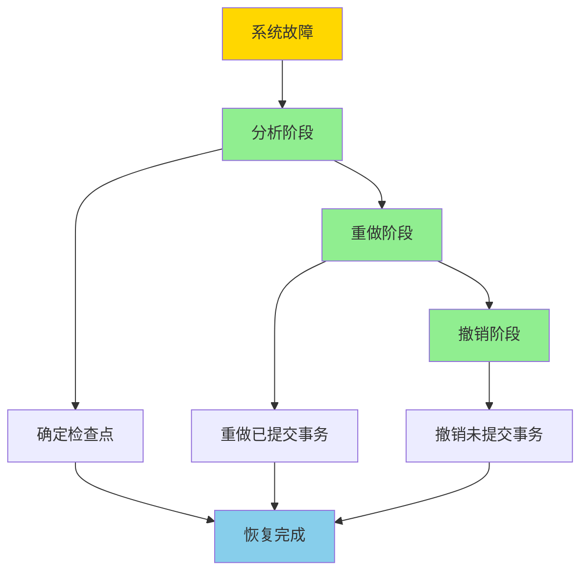
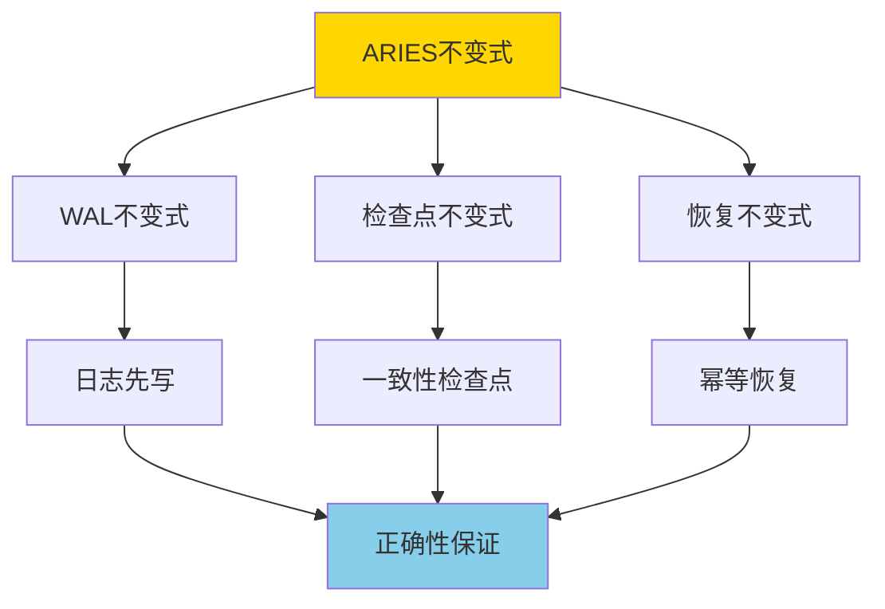
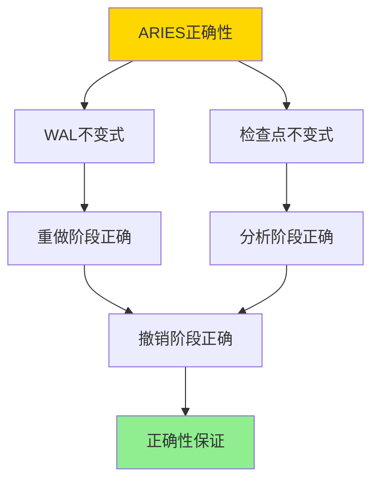

# ARIES日志恢复-正确性与不变式

> **文档版本**: v1.0
> **最后更新**: 2025-01-16
> **版本覆盖**: PostgreSQL 18.x (推荐) ⭐ | 17.x (推荐) | 16.x (兼容)
> **文档状态**: 🟡 框架已创建，内容待完善

---

## 📋 目录

- [ARIES日志恢复-正确性与不变式](#aries日志恢复-正确性与不变式)
  - [📋 目录](#-目录)
  - [1. 概述](#1-概述)
    - [1.0 ARIES日志恢复工作原理概述](#10-aries日志恢复工作原理概述)
    - [1.1 本文档的范围](#11-本文档的范围)
  - [2. 核心内容](#2-核心内容)
    - [2.1 ARIES三个阶段](#21-aries三个阶段)
    - [2.2 ARIES不变式](#22-aries不变式)
    - [2.3 日志记录类型](#23-日志记录类型)
  - [3. 形式化定义](#3-形式化定义)
    - [3.1 ARIES形式化](#31-aries形式化)
    - [3.2 恢复形式化](#32-恢复形式化)
    - [3.3 正确性形式化](#33-正确性形式化)
  - [4. 定理与证明](#4-定理与证明)
    - [4.1 ARIES正确性定理](#41-aries正确性定理)
    - [4.2 幂等性定理](#42-幂等性定理)
  - [5. 实际应用](#5-实际应用)
    - [5.1 PostgreSQL恢复](#51-postgresql恢复)
    - [5.2 检查点配置](#52-检查点配置)
    - [5.3 恢复测试](#53-恢复测试)
  - [6. 相关文档](#6-相关文档)
    - [6.1 理论基础文档](#61-理论基础文档)
  - [7. 参考文献](#7-参考文献)
    - [7.1 核心理论文献](#71-核心理论文献)
    - [7.2 PostgreSQL实现相关](#72-postgresql实现相关)
    - [7.3 相关文档](#73-相关文档)

---

## 1. 概述

### 1.0 ARIES日志恢复工作原理概述

**ARIES算法**：

ARIES（Algorithm for Recovery and Isolation Exploiting Semantics）是数据库恢复算法的经典实现。它使用Write-Ahead Logging（WAL）机制，保证数据库在故障后能够正确恢复。

**ARIES恢复流程**：



**ARIES不变式**：



### 1.1 本文档的范围

本文档涵盖：

- **ARIES算法**：ARIES恢复算法的完整描述
- **不变式定义**：ARIES算法的不变式严格定义
- **正确性证明**：严格证明ARIES算法的正确性
- **实际应用**：ARIES在PostgreSQL中的应用

---

## 2. 核心内容

### 2.1 ARIES三个阶段

**分析阶段（Analysis）**：

```haskell
-- 分析阶段
analysisPhase :: Log -> (Checkpoint, Set Transaction)
analysisPhase log =
    let checkpoint = findLastCheckpoint(log)
        activeTransactions = findActiveTransactions(log, checkpoint)
    in (checkpoint, activeTransactions)
```

**重做阶段（Redo）**：

```haskell
-- 重做阶段
redoPhase :: Log -> Checkpoint -> IO ()
redoPhase log checkpoint = do
    let records = logRecordsAfter(log, checkpoint)
    forM_ records $ \record -> do
        if needsRedo(record) then
            redo(record)
        else
            skip
```

**撤销阶段（Undo）**：

```haskell
-- 撤销阶段
undoPhase :: Set Transaction -> IO ()
undoPhase activeTransactions = do
    forM_ activeTransactions $ \tx -> do
        let records = logRecordsFor(tx)
        forM_ (reverse records) $ \record -> do
            undo(record)
```

### 2.2 ARIES不变式

**WAL不变式**：

```haskell
-- WAL不变式
walInvariant :: Database -> Bool
walInvariant db =
    forall data modification m:
        if m is in data then
            exists log record r: r describes m
            and
            r is in WAL before m is in data
```

**检查点不变式**：

```haskell
-- 检查点不变式
checkpointInvariant :: Checkpoint -> Database -> Bool
checkpointInvariant cp db =
    cp.state is consistent
    and
    forall transaction tx active at cp:
        tx.state is recorded in cp
```

### 2.3 日志记录类型

**日志记录类型**：

| 类型 | 用途 | 内容 |
|------|------|------|
| **UPDATE** | 数据更新 | 旧值、新值 |
| **COMMIT** | 事务提交 | 事务ID |
| **ABORT** | 事务中止 | 事务ID |
| **CHECKPOINT** | 检查点 | 活跃事务列表 |
| **CLR** | 补偿日志 | 撤销信息 |

---

## 3. 形式化定义

### 3.1 ARIES形式化

**ARIES**：

```haskell
-- ARIES形式化
ARIES = (L, D, C, Analysis, Redo, Undo)
where
    L = log sequence
    D = database state
    C = checkpoint
    Analysis = analysis function
    Redo = redo function
    Undo = undo function
```

### 3.2 恢复形式化

**恢复**：

```haskell
-- 恢复操作
recover(db, log) =
    let (checkpoint, active) = Analysis(log)
        db1 = Redo(log, checkpoint, db)
        db2 = Undo(active, db1)
    in db2
```

### 3.3 正确性形式化

**正确性**：

```haskell
-- ARIES正确性
correct(ARIES) =
    forall database db, log log:
        let db' = recover(db, log)
        in
            db' contains all committed transactions
            and
            db' contains no uncommitted transactions
```

---

## 4. 定理与证明

### 4.1 ARIES正确性定理

**定理**：ARIES算法保证数据库恢复的正确性。

**证明树**：



**证明**：

1. **WAL不变式**：所有数据修改都先写入WAL
2. **重做阶段**：重做所有已提交事务的修改
3. **撤销阶段**：撤销所有未提交事务的修改
4. 因此恢复后的数据库状态是正确的

### 4.2 幂等性定理

**定理**：ARIES的重做和撤销操作是幂等的。

**证明**：

- 重做操作检查LSN（Log Sequence Number），避免重复重做
- 撤销操作使用CLR（Compensation Log Record），避免重复撤销
- 因此操作是幂等的

---

## 5. 实际应用

### 5.1 PostgreSQL恢复

**PostgreSQL恢复机制**：

```sql
-- PostgreSQL使用类似ARIES的恢复机制
-- 查看WAL配置
SHOW wal_level;
SHOW max_wal_size;

-- 查看恢复状态
SELECT * FROM pg_stat_recovery;

-- 手动触发检查点
CHECKPOINT;
```

**恢复日志**：

```sql
-- 查看WAL文件
SELECT * FROM pg_ls_waldir();

-- 查看WAL统计
SELECT * FROM pg_stat_wal;
```

### 5.2 检查点配置

**检查点优化**：

```sql
-- 调整检查点参数
ALTER SYSTEM SET checkpoint_timeout = '15min';
ALTER SYSTEM SET max_wal_size = '1GB';
ALTER SYSTEM SET min_wal_size = '80MB';
ALTER SYSTEM SET checkpoint_completion_target = 0.9;

-- 查看检查点统计
SELECT * FROM pg_stat_bgwriter;
```

### 5.3 恢复测试

**恢复测试**：

```sql
-- 模拟故障恢复
-- 1. 创建测试数据
CREATE TABLE test_recovery AS SELECT generate_series(1, 1000) AS id;

-- 2. 强制检查点
CHECKPOINT;

-- 3. 模拟故障（停止数据库）

-- 4. 恢复后验证数据
SELECT COUNT(*) FROM test_recovery;  -- 应该返回1000
```

---

## 6. 相关文档

### 6.1 理论基础文档

- [TLA+-事务与WAL-规范纲要](./06.01-TLA+-事务与WAL-规范纲要.md)
- [VACUUM与可见性不变式-垃圾回收正确性](./06.02-VACUUM与可见性不变式-垃圾回收正确性.md)
- [理论基础导航](../README.md)

---

## 7. 参考文献

### 7.1 核心理论文献

- **Mohan, C., et al. (1992). "ARIES: A Transaction Recovery Method Supporting Fine-Granularity Locking and Partial Rollbacks Using Write-Ahead Logging."**
  - 会议: TODS 1992
  - **重要性**: ARIES算法的经典论文
  - **核心贡献**: 提出了ARIES恢复算法和不变式

- **Gray, J., & Reuter, A. (1993). "Transaction Processing: Concepts and Techniques."**
  - 出版社: Morgan Kaufmann
  - **重要性**: 事务处理的经典教材
  - **核心贡献**: 系统阐述了恢复算法理论

### 7.2 PostgreSQL实现相关

- **[PostgreSQL官方文档 - WAL](<https://www.postgresql.org/docs/current/wal.html>)**
  - PostgreSQL WAL机制实现说明

### 7.3 相关文档

- [TLA+-事务与WAL-规范纲要](./06.01-TLA+-事务与WAL-规范纲要.md)
- [VACUUM与可见性不变式-垃圾回收正确性](./06.02-VACUUM与可见性不变式-垃圾回收正确性.md)
- [理论基础导航](../README.md)

---

**最后更新**: 2025-01-16
**维护者**: Documentation Team
**状态**: 🟡 框架已创建，内容待完善
