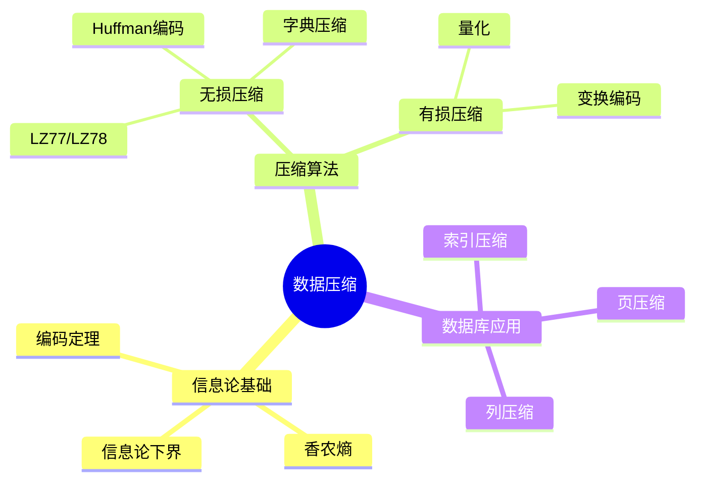
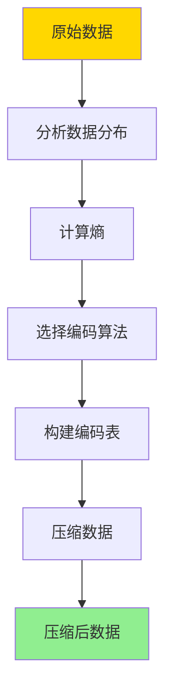

# 数据库压缩与编码-信息论下界与最优编码

> **文档版本**: v1.0
> **最后更新**: 2025-01-16
> **版本覆盖**: PostgreSQL 18.x (推荐) ⭐ | 17.x (推荐) | 16.x (兼容)
> **文档状态**: 🟡 框架已创建，内容待完善

---

## 📋 目录

- [数据库压缩与编码-信息论下界与最优编码](#数据库压缩与编码-信息论下界与最优编码)
  - [📋 目录](#-目录)
  - [1. 概述](#1-概述)
    - [1.0 数据库压缩与编码工作原理概述](#10-数据库压缩与编码工作原理概述)
    - [1.1 本文档的范围](#11-本文档的范围)
  - [2. 核心内容](#2-核心内容)
    - [2.1 信息论基础](#21-信息论基础)
    - [2.2 最优编码算法](#22-最优编码算法)
    - [2.3 数据库压缩](#23-数据库压缩)
  - [3. 形式化定义](#3-形式化定义)
    - [3.1 信息论形式化](#31-信息论形式化)
    - [3.2 编码形式化](#32-编码形式化)
    - [3.3 最优性形式化](#33-最优性形式化)
  - [4. 实际应用](#4-实际应用)
    - [4.1 PostgreSQL压缩](#41-postgresql压缩)
    - [4.2 压缩优化](#42-压缩优化)
  - [5. 相关文档](#5-相关文档)
    - [5.1 理论基础文档](#51-理论基础文档)
  - [6. 参考文献](#6-参考文献)
    - [6.1 核心理论文献](#61-核心理论文献)
    - [6.2 压缩算法相关](#62-压缩算法相关)
    - [6.3 PostgreSQL实现相关](#63-postgresql实现相关)
    - [6.4 相关文档](#64-相关文档)

---

## 1. 概述

### 1.0 数据库压缩与编码工作原理概述

**数据压缩**：

数据压缩通过消除冗余来减少存储空间。信息论提供了压缩的理论下界（香农熵），最优编码算法（如Huffman编码、LZ77）接近这个下界。

**压缩算法思维导图**：



**压缩工作流程**：



### 1.1 本文档的范围

本文档涵盖：

- **信息论基础**：香农熵和信息论下界
- **最优编码**：Huffman编码、算术编码等
- **数据库压缩**：列压缩、页压缩等应用
- **实际应用**：PostgreSQL压缩实现

---

## 2. 核心内容

### 2.1 信息论基础

**香农熵**：

```haskell
-- 香农熵
entropy :: [Symbol] -> Double
entropy symbols =
    let frequencies = countFrequencies(symbols)
        probabilities = map (\f -> f / total) frequencies
    in -sum [p * log2 p | p <- probabilities]

-- 信息论下界
compressionLowerBound :: [Symbol] -> Double
compressionLowerBound symbols =
    entropy symbols  -- 平均码长不能低于熵
```

**编码效率**：

```haskell
-- 编码效率
efficiency :: Encoding -> [Symbol] -> Double
efficiency encoding symbols =
    entropy(symbols) / averageCodeLength(encoding, symbols)
```

### 2.2 最优编码算法

**Huffman编码**：

```haskell
-- Huffman树
data HuffmanTree =
    Leaf Symbol Frequency
  | Node HuffmanTree HuffmanTree Frequency

-- 构建Huffman树
buildHuffmanTree :: [(Symbol, Frequency)] -> HuffmanTree
buildHuffmanTree symbols =
    let forest = map (uncurry Leaf) symbols
    in buildTree(forest)
    where
        buildTree [tree] = tree
        buildTree trees =
            let (t1, t2) = extractTwoSmallest(trees)
                newTree = Node t1 t2 (frequency t1 + frequency t2)
            in buildTree(insert newTree (remove [t1, t2] trees))
```

**压缩算法对比**：

| 算法 | 类型 | 压缩比 | 速度 | 适用场景 |
|------|------|--------|------|---------|
| **Huffman** | 无损 | 中 | 快 | 文本数据 |
| **LZ77** | 无损 | 高 | 中 | 通用数据 |
| **算术编码** | 无损 | 高 | 慢 | 高压缩比需求 |
| **字典压缩** | 无损 | 中 | 快 | 重复数据 |

### 2.3 数据库压缩

**列压缩**：

```haskell
-- 列压缩
compressColumn :: Column -> CompressedColumn
compressColumn column =
    let encoding = buildOptimalEncoding(column.values)
        compressed = map (encode encoding) column.values
    in CompressedColumn {
        encoding = encoding,
        data = compressed
    }
```

---

## 3. 形式化定义

### 3.1 信息论形式化

**香农熵**：

```haskell
-- 香农熵形式化
H(X) = -Σ P(x) * log2(P(x))
where
    X = random variable
    P(x) = probability of x
```

### 3.2 编码形式化

**编码**：

```haskell
-- 编码形式化
Encoding = (S, C, f)
where
    S = symbol set
    C = code set
    f: S → C = encoding function
```

### 3.3 最优性形式化

**最优编码**：

```haskell
-- 最优编码
optimal(encoding) =
    forall symbol s:
        codeLength(encoding, s) = -log2(P(s))
        and
        averageCodeLength(encoding) = H(X)
```

---

## 4. 实际应用

### 4.1 PostgreSQL压缩

**PostgreSQL TOAST压缩**：

```sql
-- 查看TOAST压缩
SELECT
    schemaname,
    tablename,
    attname,
    attstorage  -- 'x' = extended (compressed)
FROM pg_attribute
WHERE attstorage = 'x';

-- 查看压缩统计
SELECT
    schemaname,
    relname,
    pg_size_pretty(pg_total_relation_size(schemaname||'.'||relname)) AS total_size,
    pg_size_pretty(pg_relation_size(schemaname||'.'||relname)) AS table_size,
    pg_size_pretty(pg_total_relation_size(schemaname||'.'||relname) -
                   pg_relation_size(schemaname||'.'||relname)) AS toast_size
FROM pg_stat_user_tables;
```

**列压缩**：

```sql
-- 使用压缩表
CREATE TABLE compressed_table (
    id INTEGER,
    data TEXT
) WITH (compression = 'pglz');

-- 查看压缩效果
SELECT
    pg_size_pretty(pg_total_relation_size('compressed_table')) AS compressed_size;
```

### 4.2 压缩优化

**压缩策略选择**：

```sql
-- 选择压缩算法
ALTER TABLE my_table SET (compression = 'lz4');  -- 快速压缩
-- 或
ALTER TABLE my_table SET (compression = 'pglz');  -- 高压缩比

-- 查看压缩统计
SELECT
    schemaname,
    relname,
    pg_size_pretty(pg_total_relation_size(schemaname||'.'||relname)) AS size
FROM pg_stat_user_tables
ORDER BY pg_total_relation_size(schemaname||'.'||relname) DESC;
```

---

## 5. 相关文档

### 5.1 理论基础文档

- [理论基础导航](../README.md)

---

## 6. 参考文献

### 6.1 核心理论文献

- **Shannon, C. E. (1948). "A Mathematical Theory of Communication."**
  - 期刊: Bell System Technical Journal 1948
  - **重要性**: 信息论的奠基性论文
  - **核心贡献**: 提出了香农熵和编码定理
  - **批判性分析**: 理论完美，但实际压缩算法需要考虑计算复杂度

- **Huffman, D. A. (1952). "A Method for the Construction of Minimum-Redundancy Codes."**
  - 期刊: Proceedings of the IRE 1952
  - **重要性**: Huffman编码的经典论文
  - **核心贡献**: 提出了最优前缀编码算法

### 6.2 压缩算法相关

- **Ziv, J., & Lempel, A. (1977). "A Universal Algorithm for Sequential Data Compression."**
  - 期刊: IEEE Transactions on Information Theory 1977
  - **重要性**: LZ77算法的经典论文
  - **核心贡献**: 提出了字典压缩算法

### 6.3 PostgreSQL实现相关

- **[PostgreSQL官方文档 - TOAST](<https://www.postgresql.org/docs/current/storage-toast.html>)**
  - PostgreSQL TOAST压缩实现说明

### 6.4 相关文档

- [理论基础导航](../README.md)

---

**最后更新**: 2025-01-16
**维护者**: Documentation Team
**状态**: 🟡 框架已创建，内容待完善
