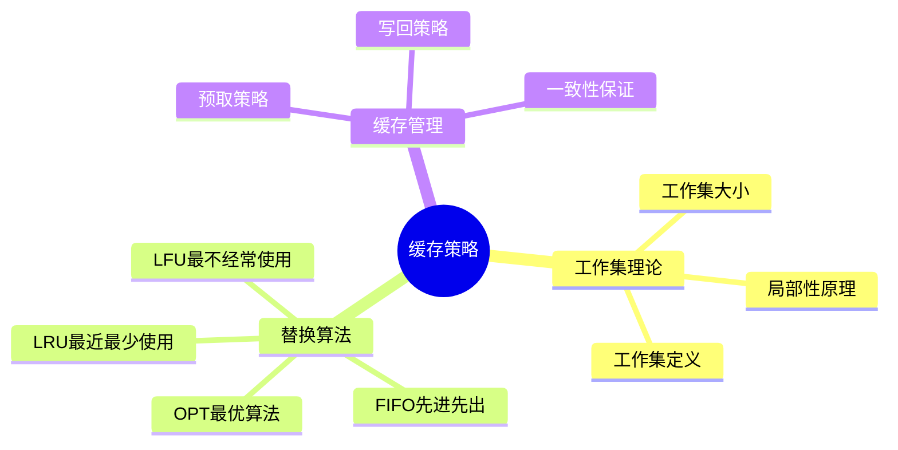
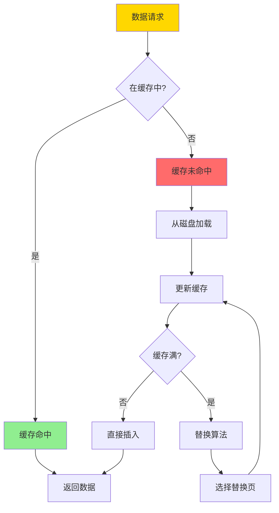

# 数据库缓存策略-工作集理论与最优替换算法

> **文档版本**: v1.0
> **最后更新**: 2025-01-16
> **版本覆盖**: PostgreSQL 18.x (推荐) ⭐ | 17.x (推荐) | 16.x (兼容)
> **文档状态**: 🟡 框架已创建，内容待完善

---

## 📋 目录

- [数据库缓存策略-工作集理论与最优替换算法](#数据库缓存策略-工作集理论与最优替换算法)
  - [📋 目录](#-目录)
  - [1. 概述](#1-概述)
    - [1.0 数据库缓存策略工作原理概述](#10-数据库缓存策略工作原理概述)
    - [1.1 本文档的范围](#11-本文档的范围)
  - [2. 核心内容](#2-核心内容)
    - [2.1 工作集理论](#21-工作集理论)
    - [2.2 替换算法](#22-替换算法)
    - [2.3 最优替换算法](#23-最优替换算法)
  - [3. 形式化定义](#3-形式化定义)
    - [3.1 工作集形式化](#31-工作集形式化)
    - [3.2 替换算法形式化](#32-替换算法形式化)
    - [3.3 最优性形式化](#33-最优性形式化)
  - [4. 实际应用](#4-实际应用)
    - [4.1 PostgreSQL缓存](#41-postgresql缓存)
    - [4.2 预取策略](#42-预取策略)
  - [5. 相关文档](#5-相关文档)
    - [5.1 理论基础文档](#51-理论基础文档)
  - [6. 参考文献](#6-参考文献)
    - [6.1 核心理论文献](#61-核心理论文献)
    - [6.2 替换算法相关](#62-替换算法相关)
    - [6.3 PostgreSQL实现相关](#63-postgresql实现相关)
    - [6.4 相关文档](#64-相关文档)

---

## 1. 概述

### 1.0 数据库缓存策略工作原理概述

**缓存策略**：

数据库缓存使用工作集理论来预测访问模式，并使用最优替换算法（如LRU、LFU）来管理缓存空间。

**缓存策略思维导图**：



**缓存工作流程**：



### 1.1 本文档的范围

本文档涵盖：

- **工作集理论**：工作集的定义和性质
- **替换算法**：LRU、LFU、OPT等算法
- **最优性分析**：替换算法的最优性证明
- **实际应用**：PostgreSQL缓存实现

---

## 2. 核心内容

### 2.1 工作集理论

**工作集定义**：

```haskell
-- 工作集
workingSet :: TimeWindow -> AccessSequence -> Set Page
workingSet window accesses =
    let recentAccesses = take window accesses
    in set(recentAccesses)

-- 工作集大小
workingSetSize :: TimeWindow -> AccessSequence -> Int
workingSetSize window accesses =
    size(workingSet window accesses)
```

**工作集性质**：

```haskell
-- 工作集单调性
workingSetMonotonic :: TimeWindow1 -> TimeWindow2 -> Bool
workingSetMonotonic w1 w2 =
    if w1 <= w2 then
        workingSet w1 ⊆ workingSet w2
    else
        True
```

### 2.2 替换算法

**LRU算法**：

```haskell
-- LRU缓存
data LRUCache = LRUCache {
    pages :: Map Page Timestamp,
    capacity :: Int
}

-- LRU替换
lruReplace :: LRUCache -> Page -> LRUCache
lruReplace cache newPage =
    if size(cache.pages) >= cache.capacity then
        let oldestPage = findOldest(cache.pages)
            newPages = remove oldestPage cache.pages
        in cache {pages = insert newPage (currentTime()) newPages}
    else
        cache {pages = insert newPage (currentTime()) cache.pages}
```

**替换算法对比**：

| 算法 | 策略 | 复杂度 | 命中率 | 适用场景 |
|------|------|--------|--------|---------|
| **LRU** | 最近最少使用 | O(1) | 高 | 通用 |
| **LFU** | 最不经常使用 | O(log n) | 中 | 稳定访问模式 |
| **FIFO** | 先进先出 | O(1) | 低 | 简单场景 |
| **OPT** | 最优算法 | O(n²) | 最高 | 理论分析 |

### 2.3 最优替换算法

**OPT算法**：

```haskell
-- OPT算法（理论最优）
optReplace :: Cache -> AccessSequence -> Page
optReplace cache futureAccesses =
    let pagesInCache = keys(cache.pages)
        futureAccesses = drop (currentIndex) allAccesses
        replacePage = findPageNotUsedLongest(pagesInCache, futureAccesses)
    in replacePage
```

---

## 3. 形式化定义

### 3.1 工作集形式化

**工作集**：

```haskell
-- 工作集形式化
W(t, Δ) = {pages accessed in time window [t-Δ, t]}
where
    t = current time
    Δ = time window size
```

### 3.2 替换算法形式化

**替换算法**：

```haskell
-- 替换算法形式化
ReplaceAlgorithm = (C, R, f)
where
    C = cache state
    R = replacement rule
    f: C × Request → C' = replacement function
```

### 3.3 最优性形式化

**最优替换**：

```haskell
-- 最优替换
optimal(replace) =
    forall access sequence A:
        missCount(replace, A) ≤ missCount(anyReplace, A)
```

---

## 4. 实际应用

### 4.1 PostgreSQL缓存

**PostgreSQL共享缓冲区**：

```sql
-- 查看共享缓冲区配置
SHOW shared_buffers;
SHOW effective_cache_size;

-- 查看缓存统计
SELECT * FROM pg_stat_bgwriter;

-- 查看表缓存统计
SELECT
    schemaname,
    relname,
    heap_blks_read,
    heap_blks_hit,
    ROUND(100.0 * heap_blks_hit / NULLIF(heap_blks_hit + heap_blks_read, 0), 2) AS hit_rate
FROM pg_statio_user_tables
ORDER BY heap_blks_read DESC;
```

**缓存命中率优化**：

```sql
-- 调整共享缓冲区
ALTER SYSTEM SET shared_buffers = '256MB';
ALTER SYSTEM SET effective_cache_size = '1GB';

-- 查看缓存命中率
SELECT
    SUM(heap_blks_hit) / NULLIF(SUM(heap_blks_hit) + SUM(heap_blks_read), 0) * 100 AS cache_hit_rate
FROM pg_statio_user_tables;
```

### 4.2 预取策略

**顺序预取**：

```sql
-- 启用顺序扫描预取
ALTER SYSTEM SET effective_io_concurrency = 2;

-- 查看I/O统计
SELECT * FROM pg_stat_io;
```

---

## 5. 相关文档

### 5.1 理论基础文档

- [理论基础导航](../README.md)

---

## 6. 参考文献

### 6.1 核心理论文献

- **Denning, P. J. (1968). "The Working Set Model for Program Behavior."**
  - 期刊: Communications of the ACM 1968
  - **重要性**: 工作集理论的经典论文
  - **核心贡献**: 提出了工作集模型
  - **批判性分析**: 工作集理论为缓存管理提供了理论基础，但实际应用中需要结合具体访问模式

- **Belady, L. A. (1966). "A Study of Replacement Algorithms for a Virtual-Storage Computer."**
  - 期刊: IBM Systems Journal 1966
  - **重要性**: 页面替换算法的经典研究
  - **核心贡献**: 提出了OPT算法和Belady异常

### 6.2 替换算法相关

- **O'Neil, E. J., et al. (1993). "The LRU-K Page Replacement Algorithm for Database Disk Buffering."**
  - 会议: SIGMOD 1993
  - **重要性**: LRU-K算法的经典论文
  - **核心贡献**: 提出了改进的LRU算法

### 6.3 PostgreSQL实现相关

- **[PostgreSQL官方文档 - 共享缓冲区](<https://www.postgresql.org/docs/current/runtime-config-resource.html#GUC-SHARED-BUFFERS>)**
  - PostgreSQL共享缓冲区配置说明

### 6.4 相关文档

- [理论基础导航](../README.md)

---

**最后更新**: 2025-01-16
**维护者**: Documentation Team
**状态**: 🟡 框架已创建，内容待完善
