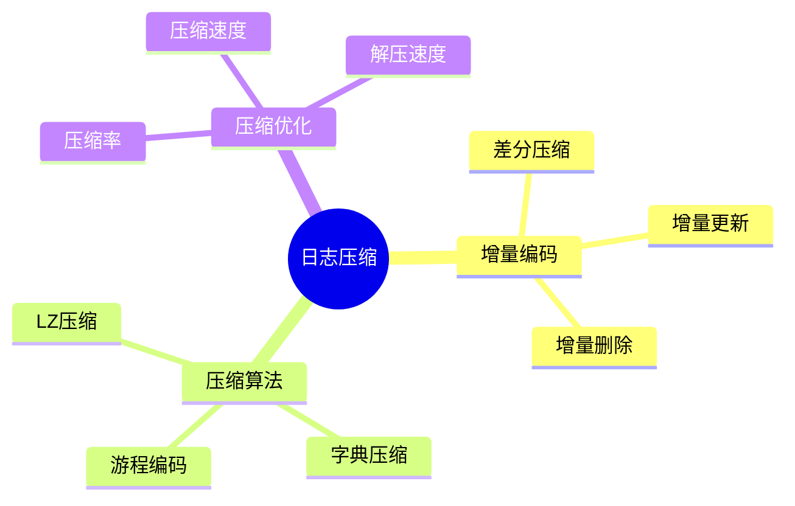

# 数据库日志压缩-增量编码与压缩率优化

> **文档版本**: v1.0
> **最后更新**: 2025-01-16
> **版本覆盖**: PostgreSQL 18.x (推荐) ⭐ | 17.x (推荐) | 16.x (兼容)
> **文档状态**: 🟡 框架已创建，内容待完善

---

## 📋 目录

- [数据库日志压缩-增量编码与压缩率优化](#数据库日志压缩-增量编码与压缩率优化)
  - [📋 目录](#-目录)
  - [1. 概述](#1-概述)
    - [1.0 数据库日志压缩工作原理概述](#10-数据库日志压缩工作原理概述)
    - [1.1 本文档的范围](#11-本文档的范围)
  - [2. 核心内容](#2-核心内容)
    - [2.1 增量编码](#21-增量编码)
    - [2.2 压缩算法](#22-压缩算法)
  - [3. 形式化定义](#3-形式化定义)
    - [3.1 增量编码形式化](#31-增量编码形式化)
  - [4. 实际应用](#4-实际应用)
    - [4.1 PostgreSQL WAL压缩](#41-postgresql-wal压缩)
  - [5. 相关文档](#5-相关文档)
    - [5.1 理论基础文档](#51-理论基础文档)
  - [6. 参考文献](#6-参考文献)

---

## 1. 概述

### 1.0 数据库日志压缩工作原理概述

**日志压缩**：

数据库日志压缩使用增量编码和差分压缩来减少WAL日志的存储空间，同时保持恢复能力。

**压缩策略思维导图**：



### 1.1 本文档的范围

本文档涵盖：

- **增量编码**：差分压缩和增量更新
- **压缩算法**：日志压缩的具体算法
- **压缩优化**：压缩率和性能的权衡
- **实际应用**：PostgreSQL WAL压缩实现

---

## 2. 核心内容

### 2.1 增量编码

**增量编码定义**：

```haskell
-- 增量编码
deltaEncode :: LogRecord -> LogRecord -> DeltaRecord
deltaEncode prevRecord currentRecord =
    DeltaRecord {
        base = prevRecord.id,
        changes = diff(prevRecord.data, currentRecord.data)
    }
```

### 2.2 压缩算法

**压缩算法对比**：

| 算法 | 压缩比 | 速度 | 适用场景 |
|------|--------|------|---------|
| **LZ4** | 中 | 快 | 实时压缩 |
| **PGLZ** | 高 | 中 | 高压缩比 |
| **Zstd** | 高 | 快 | 平衡场景 |

---

## 3. 形式化定义

### 3.1 增量编码形式化

**增量编码**：

```haskell
-- 增量编码形式化
deltaEncode(prev, curr) = diff(prev.data, curr.data)
```

---

## 4. 实际应用

### 4.1 PostgreSQL WAL压缩

**WAL压缩配置**：

```sql
-- 启用WAL压缩
ALTER SYSTEM SET wal_compression = on;

-- 查看WAL统计
SELECT * FROM pg_stat_wal;
```

---

## 5. 相关文档

### 5.1 理论基础文档

- [形式语言与证明：总论](./1.1.25-形式语言与证明-总论.md)
- [理论基础导航](./README.md)

---

## 6. 参考文献

[待补充]

---

**最后更新**: 2025-01-16
**维护者**: Documentation Team
**状态**: 🟡 框架已创建，内容待完善
