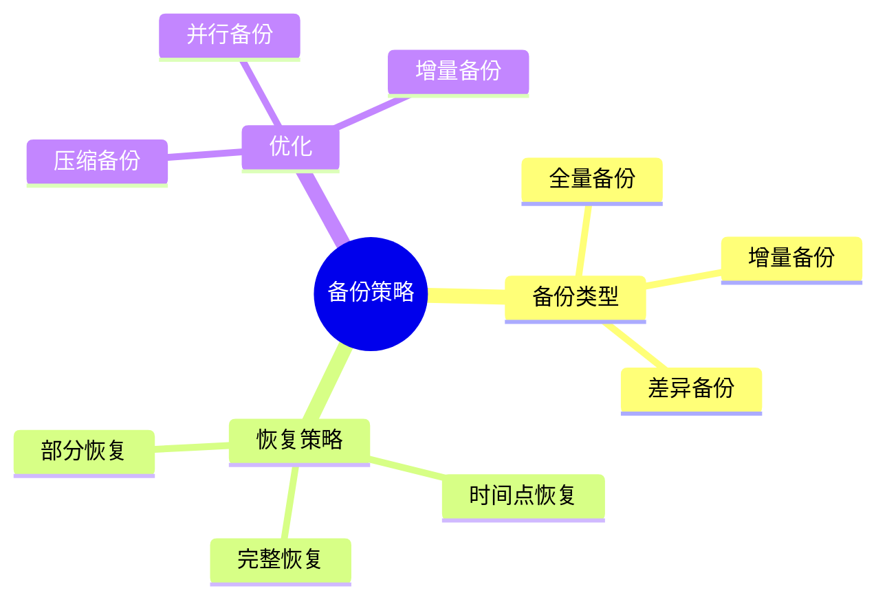
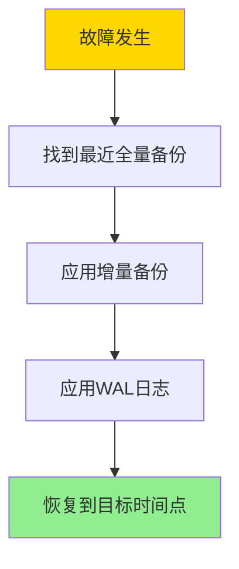

# 数据库备份与恢复-增量备份与时间点恢复的优化

> **文档版本**: v1.0
> **最后更新**: 2025-01-16
> **版本覆盖**: PostgreSQL 18.x (推荐) ⭐ | 17.x (推荐) | 16.x (兼容)
> **文档状态**: 🟡 框架已创建，内容待完善

---

## 📋 目录

- [数据库备份与恢复-增量备份与时间点恢复的优化](#数据库备份与恢复-增量备份与时间点恢复的优化)
  - [📋 目录](#-目录)
  - [1. 概述](#1-概述)
    - [1.0 数据库备份与恢复工作原理概述](#10-数据库备份与恢复工作原理概述)
    - [1.1 本文档的范围](#11-本文档的范围)
  - [2. 核心内容](#2-核心内容)
    - [2.1 备份类型](#21-备份类型)
    - [2.2 时间点恢复](#22-时间点恢复)
  - [3. 形式化定义](#3-形式化定义)
    - [3.1 备份形式化](#31-备份形式化)
  - [4. 实际应用](#4-实际应用)
    - [4.1 PostgreSQL备份](#41-postgresql备份)
  - [5. 相关文档](#5-相关文档)
    - [5.1 理论基础文档](#51-理论基础文档)
  - [6. 参考文献](#6-参考文献)

---

## 1. 概述

### 1.0 数据库备份与恢复工作原理概述

**备份策略**：

数据库备份使用全量备份和增量备份的组合，支持时间点恢复（PITR）来最小化数据丢失。

**备份策略思维导图**：



### 1.1 本文档的范围

本文档涵盖：

- **备份策略**：全量、增量、差异备份
- **时间点恢复**：PITR的实现和优化
- **实际应用**：PostgreSQL备份恢复实现

---

## 2. 核心内容

### 2.1 备份类型

**备份类型对比**：

| 类型 | 内容 | 大小 | 恢复时间 | 适用场景 |
|------|------|------|---------|---------|
| **全量备份** | 完整数据 | 大 | 快 | 定期备份 |
| **增量备份** | 变更数据 | 小 | 慢 | 频繁备份 |
| **差异备份** | 上次全量后的变更 | 中 | 中 | 平衡场景 |

### 2.2 时间点恢复

**PITR流程**：



---

## 3. 形式化定义

### 3.1 备份形式化

**备份**：

```haskell
-- 备份形式化
Backup = (type, timestamp, data, wal)
where
    type = Full | Incremental | Differential
```

---

## 4. 实际应用

### 4.1 PostgreSQL备份

**pg_basebackup**：

```bash
# 全量备份
pg_basebackup -D /backup/base -Ft -z -P

# 增量备份（使用WAL归档）
# 配置WAL归档
archive_mode = on
archive_command = 'cp %p /backup/wal/%f'
```

**时间点恢复**：

```bash
# 恢复配置
restore_command = 'cp /backup/wal/%f %p'
recovery_target_time = '2025-01-16 12:00:00'
```

---

## 5. 相关文档

### 5.1 理论基础文档

- [形式语言与证明：总论](./1.1.25-形式语言与证明-总论.md)
- [理论基础导航](./README.md)

---

## 6. 参考文献

[待补充]

---

**最后更新**: 2025-01-16
**维护者**: Documentation Team
**状态**: 🟡 框架已创建，内容待完善
