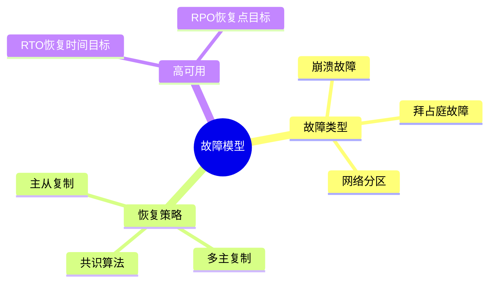

# 数据库容错与高可用-故障模型与恢复策略的形式化

> **文档版本**: v1.0
> **最后更新**: 2025-01-16
> **版本覆盖**: PostgreSQL 18.x (推荐) ⭐ | 17.x (推荐) | 16.x (兼容)
> **文档状态**: 🟡 框架已创建，内容待完善

---

## 📋 目录

- [数据库容错与高可用-故障模型与恢复策略的形式化](#数据库容错与高可用-故障模型与恢复策略的形式化)
  - [📋 目录](#-目录)
  - [1. 概述](#1-概述)
    - [1.0 数据库容错与高可用工作原理概述](#10-数据库容错与高可用工作原理概述)
    - [1.1 本文档的范围](#11-本文档的范围)
  - [2. 核心内容](#2-核心内容)
    - [2.1 故障模型](#21-故障模型)
    - [2.2 恢复策略](#22-恢复策略)
  - [3. 形式化定义](#3-形式化定义)
    - [3.1 故障模型形式化](#31-故障模型形式化)
  - [4. 实际应用](#4-实际应用)
    - [4.1 PostgreSQL高可用](#41-postgresql高可用)
  - [5. 相关文档](#5-相关文档)
    - [5.1 理论基础文档](#51-理论基础文档)
  - [6. 参考文献](#6-参考文献)

---

## 1. 概述

### 1.0 数据库容错与高可用工作原理概述

**容错模型**：

数据库容错通过故障模型分类和恢复策略来保证系统的高可用性。

**故障模型思维导图**：



### 1.1 本文档的范围

本文档涵盖：

- **故障模型**：故障分类和形式化
- **恢复策略**：各种恢复策略的形式化
- **高可用性**：RTO和RPO的保证
- **实际应用**：PostgreSQL高可用实现

---

## 2. 核心内容

### 2.1 故障模型

**故障类型**：

| 类型 | 描述 | 检测 | 恢复 |
|------|------|------|------|
| **崩溃故障** | 节点停止 | 心跳超时 | 重启 |
| **拜占庭故障** | 恶意行为 | 共识算法 | 隔离 |
| **网络分区** | 网络断开 | 连接检测 | 等待恢复 |

### 2.2 恢复策略

**恢复策略对比**：

| 策略 | RTO | RPO | 复杂度 |
|------|-----|-----|--------|
| **主从复制** | 低 | 低 | 低 |
| **多主复制** | 低 | 低 | 高 |
| **共识算法** | 中 | 低 | 高 |

---

## 3. 形式化定义

### 3.1 故障模型形式化

**故障**：

```haskell
-- 故障形式化
Fault = Crash | Byzantine | Partition
```

---

## 4. 实际应用

### 4.1 PostgreSQL高可用

**流复制**：

```sql
-- 主节点配置
wal_level = replica
max_wal_senders = 3

-- 从节点配置
primary_conninfo = 'host=master port=5432'
```

**故障转移**：

```bash
# 使用pg_auto_failover
pg_autoctl create monitor --pgdata /data/monitor
pg_autoctl create postgres --pgdata /data/primary --monitor 'postgres://...'
```

---

## 5. 相关文档

### 5.1 理论基础文档

- [形式语言与证明：总论](./1.1.25-形式语言与证明-总论.md)
- [理论基础导航](./README.md)

---

## 6. 参考文献

[待补充]

---

**最后更新**: 2025-01-16
**维护者**: Documentation Team
**状态**: 🟡 框架已创建，内容待完善
