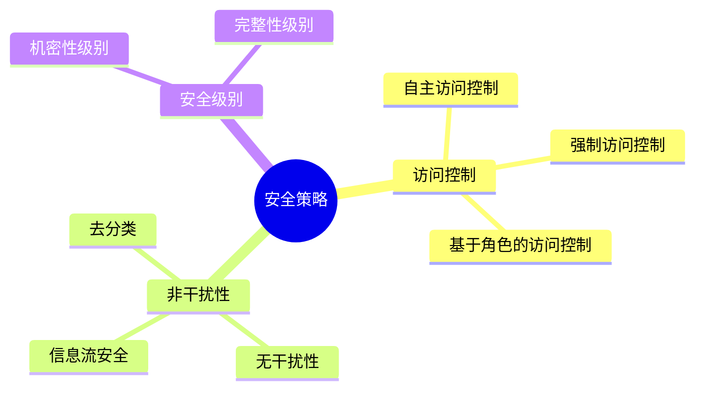

# 安全策略与非干扰-逻辑框架与证明

> **文档版本**: v1.0
> **最后更新**: 2025-01-16
> **版本覆盖**: PostgreSQL 18.x (推荐) ⭐ | 17.x (推荐) | 16.x (兼容)
> **文档状态**: 🟡 框架已创建，内容待完善

---

## 📋 目录

- [安全策略与非干扰-逻辑框架与证明](#安全策略与非干扰-逻辑框架与证明)
  - [📋 目录](#-目录)
  - [1. 概述](#1-概述)
    - [1.0 安全策略与非干扰工作原理概述](#10-安全策略与非干扰工作原理概述)
    - [1.1 本文档的范围](#11-本文档的范围)
  - [2. 核心内容](#2-核心内容)
    - [2.1 非干扰性](#21-非干扰性)
    - [2.2 安全策略](#22-安全策略)
  - [3. 形式化定义](#3-形式化定义)
    - [3.1 非干扰性形式化](#31-非干扰性形式化)
  - [4. 定理与证明](#4-定理与证明)
    - [4.1 非干扰性定理](#41-非干扰性定理)
  - [5. 实际应用](#5-实际应用)
    - [5.1 PostgreSQL安全](#51-postgresql安全)
  - [6. 相关文档](#6-相关文档)
    - [6.1 理论基础文档](#61-理论基础文档)
  - [7. 参考文献](#7-参考文献)
    - [7.1 核心理论文献](#71-核心理论文献)
    - [7.2 PostgreSQL实现相关](#72-postgresql实现相关)
    - [7.3 相关文档](#73-相关文档)

---

## 1. 概述

### 1.0 安全策略与非干扰工作原理概述

**非干扰性**：

非干扰性（Non-interference）是信息安全的重要性质，确保高安全级别的操作不会影响低安全级别的观察。

**安全模型思维导图**：



### 1.1 本文档的范围

本文档涵盖：

- **安全策略**：访问控制和安全级别
- **非干扰性**：信息流安全和形式化定义
- **实际应用**：PostgreSQL安全实现

---

## 2. 核心内容

### 2.1 非干扰性

**非干扰性定义**：

```haskell
-- 非干扰性
nonInterference :: System -> Bool
nonInterference sys =
    forall highLevelAction a, lowLevelObserver o:
        result(o, sys) = result(o, sys after a)
```

### 2.2 安全策略

**访问控制模型**：

| 模型 | 控制方式 | 灵活性 | 安全性 |
|------|---------|--------|--------|
| **DAC** | 自主控制 | 高 | 中 |
| **MAC** | 强制控制 | 低 | 高 |
| **RBAC** | 基于角色 | 中 | 高 |

---

## 3. 形式化定义

### 3.1 非干扰性形式化

**非干扰性**：

```haskell
-- 非干扰性形式化
nonInterference(sys) =
    forall H-action a, L-observer o:
        view(o, sys) = view(o, sys after a)
```

---

## 4. 定理与证明

### 4.1 非干扰性定理

**定理**：如果系统满足非干扰性，则高安全级别操作不影响低安全级别观察。

**证明**：由非干扰性定义直接得出。

---

## 5. 实际应用

### 5.1 PostgreSQL安全

**行级安全**：

```sql
-- 启用RLS
ALTER TABLE accounts ENABLE ROW LEVEL SECURITY;

-- 创建策略
CREATE POLICY account_policy ON accounts
    FOR SELECT
    USING (user_id = current_user_id());
```

**角色管理**：

```sql
-- 创建角色
CREATE ROLE analyst;
GRANT SELECT ON accounts TO analyst;
```

---

## 6. 相关文档

### 6.1 理论基础文档

- [形式语言与证明：总论](./1.1.25-形式语言与证明-总论.md)
- [理论基础导航](./README.md)

---

## 7. 参考文献

### 7.1 核心理论文献

- **Goguen, J. A., & Meseguer, J. (1982). "Security Policies and Security Models."**
  - 会议: IEEE Symposium on Security and Privacy 1982
  - **重要性**: 安全策略和模型的经典论文
  - **核心贡献**: 提出了非干扰性概念

- **McLean, J. (1994). "A General Theory of Composition for a Class of 'Possibilistic' Properties."**
  - 会议: IEEE Transactions on Software Engineering 1994
  - **重要性**: 非干扰性的形式化理论
  - **核心贡献**: 形式化了非干扰性

### 7.2 PostgreSQL实现相关

- **PostgreSQL官方文档 - 安全](<https://www.postgresql.org/docs/current/security.html>)**
  - PostgreSQL安全实现说明

### 7.3 相关文档

- [行级安全-RLS策略语义与不可逃逸性证明](./07.03-行级安全-RLS策略语义与不可逃逸性证明.md)
- [理论基础导航](../README.md)

---

**最后更新**: 2025-01-16
**维护者**: Documentation Team
**状态**: 🟡 框架已创建，内容待完善
