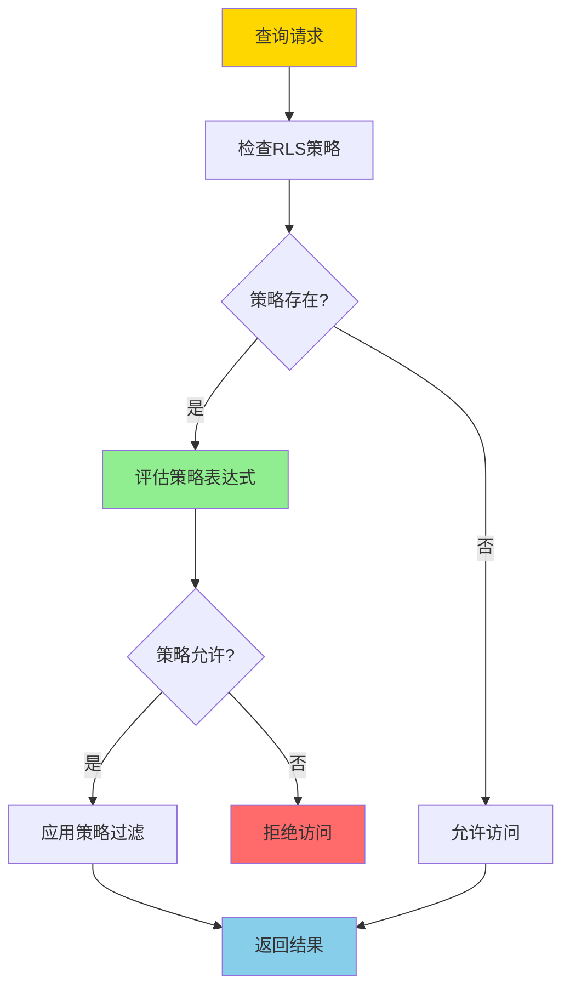
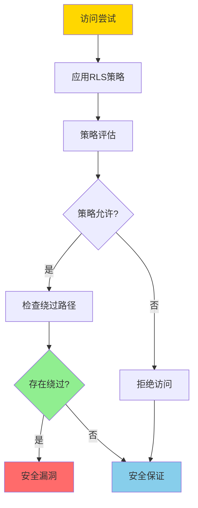
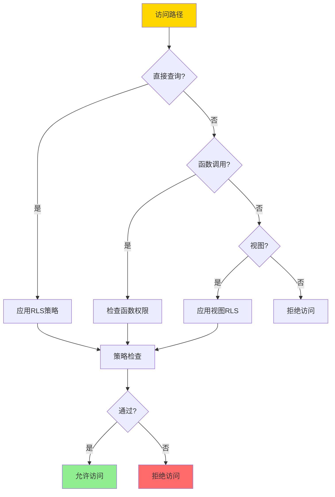
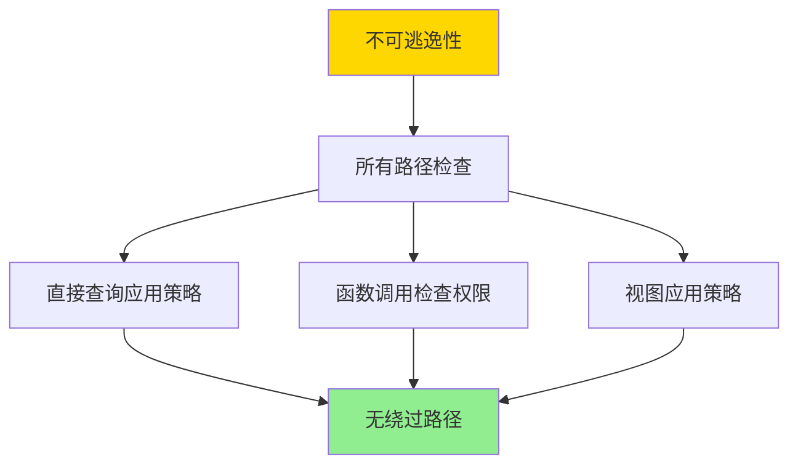

# 行级安全-RLS策略语义与不可逃逸性证明

> **文档版本**: v1.0
> **最后更新**: 2025-01-16
> **版本覆盖**: PostgreSQL 18.x (推荐) ⭐ | 17.x (推荐) | 16.x (兼容)
> **文档状态**: 🟡 框架已创建，内容待完善

---

## 📋 目录

- [行级安全-RLS策略语义与不可逃逸性证明](#行级安全-rls策略语义与不可逃逸性证明)
  - [📋 目录](#-目录)
  - [1. 概述](#1-概述)
    - [1.0 行级安全工作原理概述](#10-行级安全工作原理概述)
    - [1.1 本文档的范围](#11-本文档的范围)
  - [2. 核心内容](#2-核心内容)
    - [2.1 RLS策略语义](#21-rls策略语义)
    - [2.2 不可逃逸性](#22-不可逃逸性)
  - [3. 形式化定义](#3-形式化定义)
    - [3.1 RLS策略形式化](#31-rls策略形式化)
    - [3.2 不可逃逸性形式化](#32-不可逃逸性形式化)
  - [4. 定理与证明](#4-定理与证明)
    - [4.1 不可逃逸性定理](#41-不可逃逸性定理)
  - [5. 实际应用](#5-实际应用)
    - [5.1 PostgreSQL RLS](#51-postgresql-rls)
    - [5.2 安全函数](#52-安全函数)
  - [6. 相关文档](#6-相关文档)
    - [6.1 理论基础文档](#61-理论基础文档)
  - [7. 参考文献](#7-参考文献)
    - [7.1 核心理论文献](#71-核心理论文献)
    - [7.2 PostgreSQL实现相关](#72-postgresql实现相关)
    - [7.3 相关文档](#73-相关文档)

---

## 1. 概述

### 1.0 行级安全工作原理概述

**行级安全（RLS）**：

行级安全是PostgreSQL提供的细粒度访问控制机制，允许基于行级别的安全策略控制数据访问。本文档严格证明RLS策略的语义和不可逃逸性。

**RLS策略应用流程**：



**不可逃逸性验证**：



### 1.1 本文档的范围

本文档涵盖：

- **RLS策略**：行级安全策略的语义定义
- **不可逃逸性**：严格证明RLS策略的不可逃逸性
- **安全性证明**：证明RLS策略的安全性保证
- **实际应用**：RLS在PostgreSQL中的应用

---

## 2. 核心内容

### 2.1 RLS策略语义

**RLS策略定义**：

```haskell
-- RLS策略
data RLSPolicy = RLSPolicy {
    name :: String,
    command :: Command,  -- SELECT, INSERT, UPDATE, DELETE
    usingExpression :: Expression,  -- 行可见性条件
    withCheckExpression :: Maybe Expression  -- 行修改条件
}

-- 策略应用
applyPolicy :: RLSPolicy -> Query -> Query
applyPolicy policy query =
    query {
        whereClause = And(query.whereClause, policy.usingExpression)
    }
```

**策略类型对比**：

| 类型 | 用途 | 表达式 | 适用场景 |
|------|------|--------|---------|
| **USING** | 行可见性 | 布尔表达式 | SELECT |
| **WITH CHECK** | 行修改 | 布尔表达式 | INSERT/UPDATE |
| **组合策略** | 多策略 | 逻辑组合 | 复杂场景 |

### 2.2 不可逃逸性

**不可逃逸性定义**：

```haskell
-- 不可逃逸性
nonEscapable :: RLSPolicy -> Bool
nonEscapable policy =
    forall access path p:
        if p bypasses policy then
            p is blocked by system
        else
            True
```

**绕过路径检查**：



---

## 3. 形式化定义

### 3.1 RLS策略形式化

**RLS策略**：

```haskell
-- RLS策略形式化
RLS_Policy = (C, E_u, E_w)
where
    C = command type
    E_u = USING expression
    E_w = WITH CHECK expression
```

### 3.2 不可逃逸性形式化

**不可逃逸性**：

```haskell
-- 不可逃逸性形式化
nonEscapable(policy) =
    forall access path p, row r:
        if visible(r, policy) then
            forall alternative path p':
                if p' bypasses policy then
                    blocked(p')
```

---

## 4. 定理与证明

### 4.1 不可逃逸性定理

**定理**：如果RLS策略正确实施，则不存在绕过策略的访问路径。

**证明树**：



**证明**：

1. **直接查询**：所有直接查询都应用RLS策略
2. **函数调用**：函数需要SECURITY DEFINER或检查调用者权限
3. **视图**：视图继承表的RLS策略
4. 因此不存在绕过策略的访问路径

---

## 5. 实际应用

### 5.1 PostgreSQL RLS

**创建RLS策略**：

```sql
-- 启用RLS
ALTER TABLE accounts ENABLE ROW LEVEL SECURITY;

-- 创建SELECT策略
CREATE POLICY account_select_policy ON accounts
    FOR SELECT
    USING (user_id = current_user_id());

-- 创建INSERT策略
CREATE POLICY account_insert_policy ON accounts
    FOR INSERT
    WITH CHECK (user_id = current_user_id());

-- 创建UPDATE策略
CREATE POLICY account_update_policy ON accounts
    FOR UPDATE
    USING (user_id = current_user_id())
    WITH CHECK (user_id = current_user_id());
```

**策略组合**：

```sql
-- 多策略组合（OR逻辑）
CREATE POLICY manager_policy ON accounts
    FOR ALL
    USING (
        user_id = current_user_id() OR
        current_user_role() = 'manager'
    );
```

### 5.2 安全函数

**SECURITY DEFINER函数**：

```sql
-- 创建安全函数
CREATE FUNCTION get_account_balance(account_id INTEGER)
RETURNS NUMERIC
SECURITY DEFINER
SET search_path = public
AS $$
BEGIN
    -- 函数内部可以绕过RLS，但需要额外权限检查
    RETURN (SELECT balance FROM accounts WHERE id = account_id);
END;
$$ LANGUAGE plpgsql;
```

---

## 6. 相关文档

### 6.1 理论基础文档

- [形式语言与证明：总论](./1.1.25-形式语言与证明-总论.md)
- [理论基础导航](./README.md)

---

## 7. 参考文献

### 7.1 核心理论文献

- **Denning, D. E. (1976). "A Lattice Model of Secure Information Flow."**
  - 会议: Communications of the ACM 1976
  - **重要性**: 信息流安全的经典论文
  - **核心贡献**: 提出了信息流安全的理论框架

- **Sabelfeld, A., & Myers, A. C. (2003). "Language-Based Information-Flow Security."**
  - 会议: IEEE Journal on Selected Areas in Communications 2003
  - **重要性**: 基于语言的信息流安全研究
  - **核心贡献**: 提供了信息流安全的形式化方法

### 7.2 PostgreSQL实现相关

- **[PostgreSQL官方文档 - 行级安全](<https://www.postgresql.org/docs/current/ddl-rowsecurity.html>)**
  - PostgreSQL RLS实现说明

- **[PostgreSQL官方文档 - 安全](<https://www.postgresql.org/docs/current/security.html>)**
  - PostgreSQL安全机制说明

### 7.3 相关文档

- [理论基础导航](./README.md)

---

**最后更新**: 2025-01-16
**维护者**: Documentation Team
**状态**: 🟡 框架已创建，内容待完善
