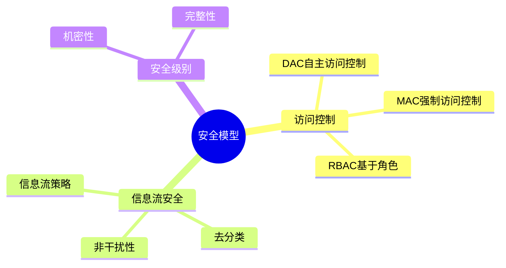

# 数据库安全模型-访问控制与信息流安全的形式化

> **文档版本**: v1.0
> **最后更新**: 2025-01-16
> **版本覆盖**: PostgreSQL 18.x (推荐) ⭐ | 17.x (推荐) | 16.x (兼容)
> **文档状态**: 🟡 框架已创建，内容待完善

---

## 📋 目录

- [数据库安全模型-访问控制与信息流安全的形式化](#数据库安全模型-访问控制与信息流安全的形式化)
  - [📋 目录](#-目录)
  - [1. 概述](#1-概述)
    - [1.0 数据库安全模型工作原理概述](#10-数据库安全模型工作原理概述)
    - [1.1 本文档的范围](#11-本文档的范围)
  - [2. 核心内容](#2-核心内容)
    - [2.1 访问控制模型](#21-访问控制模型)
    - [2.2 信息流安全](#22-信息流安全)
  - [3. 形式化定义](#3-形式化定义)
    - [3.1 访问控制形式化](#31-访问控制形式化)
  - [4. 实际应用](#4-实际应用)
    - [4.1 PostgreSQL访问控制](#41-postgresql访问控制)
  - [5. 相关文档](#5-相关文档)
    - [5.1 理论基础文档](#51-理论基础文档)
  - [6. 参考文献](#6-参考文献)
    - [6.1 核心理论文献](#61-核心理论文献)
    - [6.2 PostgreSQL实现相关](#62-postgresql实现相关)
    - [6.3 相关文档](#63-相关文档)

---

## 1. 概述

### 1.0 数据库安全模型工作原理概述

**安全模型**：

数据库安全模型包括访问控制和信息流安全，确保数据机密性和完整性。

**安全模型思维导图**：



### 1.1 本文档的范围

本文档涵盖：

- **访问控制**：DAC、MAC、RBAC模型
- **信息流安全**：信息流策略和去分类
- **实际应用**：PostgreSQL安全实现

---

## 2. 核心内容

### 2.1 访问控制模型

**访问控制模型对比**：

| 模型 | 控制方式 | 灵活性 | 安全性 | 适用场景 |
|------|---------|--------|--------|---------|
| **DAC** | 自主控制 | 高 | 中 | 小型系统 |
| **MAC** | 强制控制 | 低 | 高 | 军事/政府 |
| **RBAC** | 基于角色 | 中 | 高 | 企业系统 |

### 2.2 信息流安全

**信息流策略**：

```haskell
-- 信息流策略
data InformationFlow = InformationFlow {
    source :: SecurityLevel,
    sink :: SecurityLevel,
    policy :: FlowPolicy  -- NoWriteDown, NoReadUp
}

-- 信息流检查
checkInformationFlow :: InformationFlow -> Bool
checkInformationFlow flow =
    case flow.policy of
        NoWriteDown -> flow.source <= flow.sink
        NoReadUp -> flow.source >= flow.sink
```

---

## 3. 形式化定义

### 3.1 访问控制形式化

**访问控制**：

```haskell
-- 访问控制形式化
AccessControl = (S, O, A, P)
where
    S = subject set
    O = object set
    A = action set
    P = permission matrix
```

---

## 4. 实际应用

### 4.1 PostgreSQL访问控制

**角色和权限**：

```sql
-- 创建角色
CREATE ROLE analyst;
CREATE ROLE manager;

-- 授予权限
GRANT SELECT ON accounts TO analyst;
GRANT ALL ON accounts TO manager;

-- 基于角色的访问
REVOKE ALL ON accounts FROM PUBLIC;
GRANT SELECT ON accounts TO analyst;
```

**安全级别**：

```sql
-- 使用RLS实现MAC
CREATE POLICY mac_policy ON sensitive_data
    FOR ALL
    USING (user_clearance >= data_classification);
```

---

## 5. 相关文档

### 5.1 理论基础文档

- [形式语言与证明：总论](./1.1.25-形式语言与证明-总论.md)
- [理论基础导航](./README.md)

---

## 6. 参考文献

### 6.1 核心理论文献

- **Bell, D. E., & LaPadula, L. J. (1973). "Secure Computer Systems: Mathematical Foundations."**
  - 报告: MITRE Technical Report 1973
  - **重要性**: 访问控制模型的经典论文
  - **核心贡献**: 提出了Bell-LaPadula模型

- **Denning, D. E. (1976). "A Lattice Model of Secure Information Flow."**
  - 会议: CACM 1976
  - **重要性**: 信息流安全的经典模型
  - **核心贡献**: 提出了格模型

### 6.2 PostgreSQL实现相关

- **PostgreSQL官方文档 - 访问控制](<https://www.postgresql.org/docs/current/user-manag.html>)**
  - PostgreSQL访问控制实现说明

### 6.3 相关文档

- [安全策略与非干扰-逻辑框架与证明](./07.01-安全策略与非干扰-逻辑框架与证明.md)
- [理论基础导航](../README.md)

---

**最后更新**: 2025-01-16
**维护者**: Documentation Team
**状态**: 🟡 框架已创建，内容待完善
