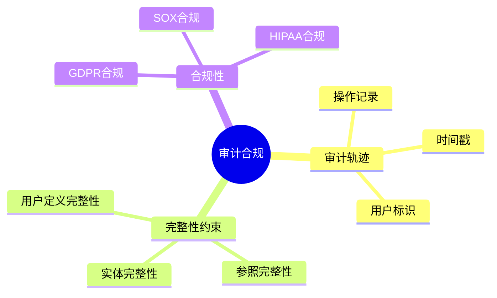

# 数据库审计与合规-完整性约束与审计轨迹的形式化

> **文档版本**: v1.0
> **最后更新**: 2025-01-16
> **版本覆盖**: PostgreSQL 18.x (推荐) ⭐ | 17.x (推荐) | 16.x (兼容)
> **文档状态**: 🟡 框架已创建，内容待完善

---

## 📋 目录

- [数据库审计与合规-完整性约束与审计轨迹的形式化](#数据库审计与合规-完整性约束与审计轨迹的形式化)
  - [📋 目录](#-目录)
  - [1. 概述](#1-概述)
    - [1.0 数据库审计与合规工作原理概述](#10-数据库审计与合规工作原理概述)
    - [1.1 本文档的范围](#11-本文档的范围)
  - [2. 核心内容](#2-核心内容)
    - [2.1 审计轨迹](#21-审计轨迹)
    - [2.2 完整性约束](#22-完整性约束)
  - [3. 形式化定义](#3-形式化定义)
    - [3.1 审计轨迹形式化](#31-审计轨迹形式化)
  - [4. 实际应用](#4-实际应用)
    - [4.1 PostgreSQL审计](#41-postgresql审计)
  - [5. 相关文档](#5-相关文档)
    - [5.1 理论基础文档](#51-理论基础文档)
  - [6. 参考文献](#6-参考文献)
    - [6.1 核心理论文献](#61-核心理论文献)
    - [6.2 PostgreSQL实现相关](#62-postgresql实现相关)
    - [6.3 相关文档](#63-相关文档)

---

## 1. 概述

### 1.0 数据库审计与合规工作原理概述

**审计与合规**：

数据库审计记录所有数据访问和修改操作，确保合规性和可追溯性。

**审计模型思维导图**：



### 1.1 本文档的范围

本文档涵盖：

- **审计轨迹**：操作记录和审计日志
- **完整性约束**：约束的形式化定义
- **合规性**：法规合规的实现
- **实际应用**：PostgreSQL审计实现

---

## 2. 核心内容

### 2.1 审计轨迹

**审计记录**：

```haskell
-- 审计记录
data AuditRecord = AuditRecord {
    timestamp :: Timestamp,
    user :: User,
    action :: Action,
    object :: Object,
    result :: Result
}
```

### 2.2 完整性约束

**约束类型**：

| 类型 | 定义 | 检查时机 | 示例 |
|------|------|---------|------|
| **实体完整性** | 主键唯一 | 插入/更新 | PRIMARY KEY |
| **参照完整性** | 外键约束 | 插入/更新/删除 | FOREIGN KEY |
| **用户定义** | 自定义规则 | 插入/更新 | CHECK约束 |

---

## 3. 形式化定义

### 3.1 审计轨迹形式化

**审计轨迹**：

```haskell
-- 审计轨迹形式化
AuditTrail = [AuditRecord]
where
    AuditRecord = (t, u, a, o, r)
```

---

## 4. 实际应用

### 4.1 PostgreSQL审计

**启用审计**：

```sql
-- 启用审计扩展
CREATE EXTENSION IF NOT EXISTS pg_audit;

-- 配置审计
ALTER SYSTEM SET log_statement = 'all';
ALTER SYSTEM SET log_min_duration_statement = 0;

-- 查看审计日志
SELECT * FROM pg_stat_statements;
```

**完整性约束**：

```sql
-- 主键约束
ALTER TABLE accounts ADD PRIMARY KEY (id);

-- 外键约束
ALTER TABLE transactions
ADD CONSTRAINT fk_account
FOREIGN KEY (account_id) REFERENCES accounts(id);

-- CHECK约束
ALTER TABLE accounts
ADD CONSTRAINT balance_check
CHECK (balance >= 0);
```

---

## 5. 相关文档

### 5.1 理论基础文档

- [形式语言与证明：总论](./1.1.25-形式语言与证明-总论.md)
- [理论基础导航](./README.md)

---

## 6. 参考文献

### 6.1 核心理论文献

- **Date, C. J. (2003). "An Introduction to Database Systems."**
  - 出版社: Addison-Wesley
  - **重要性**: 数据库系统经典教材
  - **核心贡献**: 系统阐述了完整性约束

- **Sandhu, R. S., & Jajodia, S. (1993). "Integrity Mechanisms in Database Management Systems."**
  - 会议: IFIP WG 11.3 1993
  - **重要性**: 数据库完整性机制
  - **核心贡献**: 总结了完整性约束方法

### 6.2 PostgreSQL实现相关

- **PostgreSQL官方文档 - 约束](<https://www.postgresql.org/docs/current/ddl-constraints.html>)**
  - PostgreSQL约束实现说明

### 6.3 相关文档

- [数据库审计与合规-完整性约束与审计轨迹的形式化](./07.05-数据库审计与合规-完整性约束与审计轨迹的形式化.md)
- [理论基础导航](../README.md)

---

**最后更新**: 2025-01-16
**维护者**: Documentation Team
**状态**: 🟡 框架已创建，内容待完善
