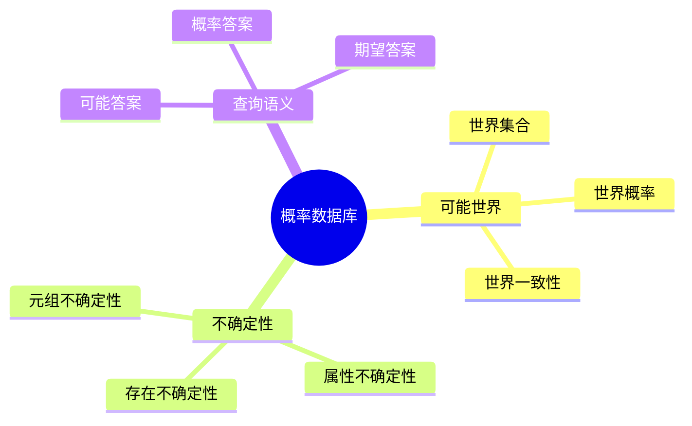

# 概率数据库与不确定性查询-可能世界语义

> **文档版本**: v1.0
> **最后更新**: 2025-01-16
> **版本覆盖**: PostgreSQL 18.x (推荐) ⭐ | 17.x (推荐) | 16.x (兼容)
> **文档状态**: 🟡 框架已创建，内容待完善

---

## 📋 目录

- [概率数据库与不确定性查询-可能世界语义](#概率数据库与不确定性查询-可能世界语义)
  - [📋 目录](#-目录)
  - [1. 概述](#1-概述)
    - [1.0 概率数据库工作原理概述](#10-概率数据库工作原理概述)
    - [1.1 本文档的范围](#11-本文档的范围)
  - [2. 核心内容](#2-核心内容)
    - [2.1 可能世界语义](#21-可能世界语义)
    - [2.2 概率查询](#22-概率查询)
  - [3. 形式化定义](#3-形式化定义)
    - [3.1 可能世界语义形式化](#31-可能世界语义形式化)
  - [4. 定理与证明](#4-定理与证明)
    - [4.1 概率查询正确性定理](#41-概率查询正确性定理)
  - [5. 实际应用](#5-实际应用)
    - [5.1 概率数据库实现](#51-概率数据库实现)
  - [6. 相关文档](#6-相关文档)
    - [6.1 理论基础文档](#61-理论基础文档)
  - [7. 参考文献](#7-参考文献)

---

## 1. 概述

### 1.0 概率数据库工作原理概述

**概率数据库**：

概率数据库处理不确定数据，使用可能世界语义来定义查询结果。

**可能世界语义思维导图**：



### 1.1 本文档的范围

本文档涵盖：

- **可能世界语义**：可能世界的定义和概率
- **不确定性查询**：概率查询的语义
- **实际应用**：概率数据库实现

---

## 2. 核心内容

### 2.1 可能世界语义

**可能世界定义**：

```haskell
-- 可能世界
data PossibleWorld = PossibleWorld {
    world :: Database,
    probability :: Double
}

-- 可能世界集合
possibleWorlds :: ProbabilisticDatabase -> [PossibleWorld]
possibleWorlds db =
    generateAllConsistentWorlds(db)
```

### 2.2 概率查询

**概率查询语义**：

```haskell
-- 概率查询
probabilisticQuery :: Query -> ProbabilisticDatabase -> [(Result, Double)]
probabilisticQuery query db =
    let worlds = possibleWorlds(db)
        results = map (executeQuery query) worlds
    in aggregateResults(results, worlds)
```

---

## 3. 形式化定义

### 3.1 可能世界语义形式化

**可能世界语义**：

```haskell
-- 可能世界语义形式化
query(PDB) = {(r, p) | r in result(w), w in Worlds(PDB), p = P(w)}
where
    Worlds(PDB) = {w | w is consistent world of PDB}
    P(w) = probability of world w
```

---

## 4. 定理与证明

### 4.1 概率查询正确性定理

**定理**：概率查询结果正确当且仅当所有可能世界的概率之和为1。

**证明**：由概率论的公理保证。

---

## 5. 实际应用

### 5.1 概率数据库实现

**使用概率扩展**：

```sql
-- 创建概率表
CREATE TABLE probabilistic_events (
    event_id INTEGER,
    event_name VARCHAR,
    probability DOUBLE PRECISION
);

-- 概率查询
SELECT event_name, probability
FROM probabilistic_events
WHERE probability > 0.5;
```

---

## 6. 相关文档

### 6.1 理论基础文档

- [形式语言与证明：总论](./1.1.25-形式语言与证明-总论.md)
- [理论基础导航](./README.md)

---

## 7. 参考文献

[待补充]

---

**最后更新**: 2025-01-16
**维护者**: Documentation Team
**状态**: 🟡 框架已创建，内容待完善
