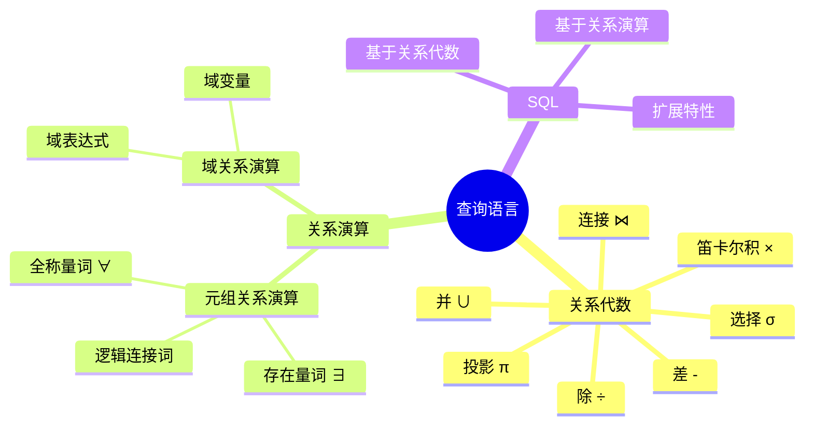
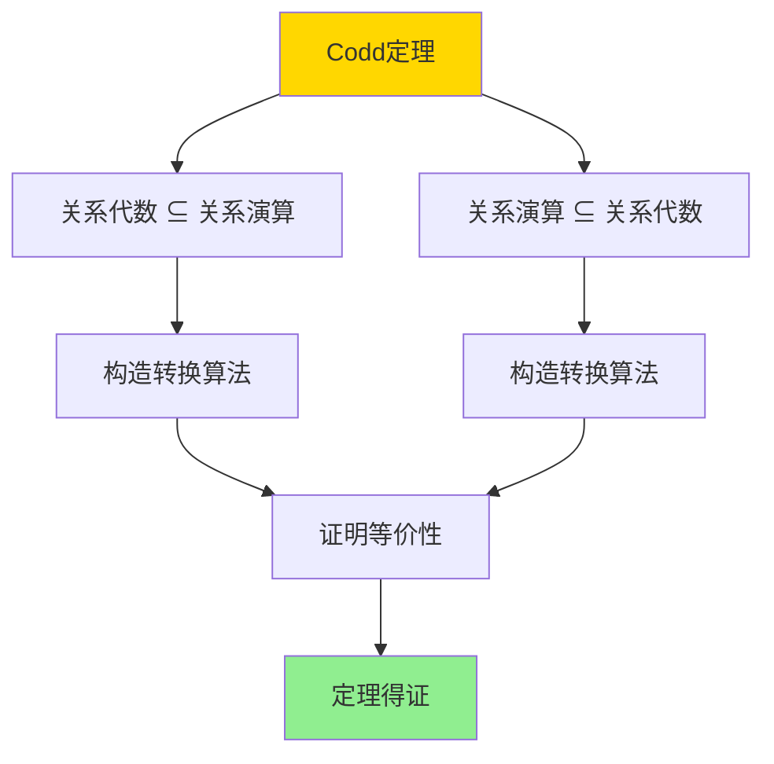
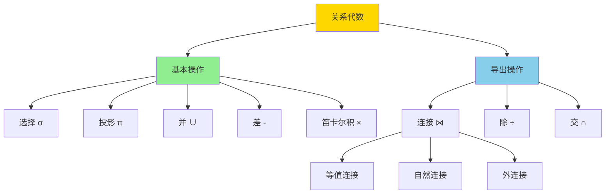
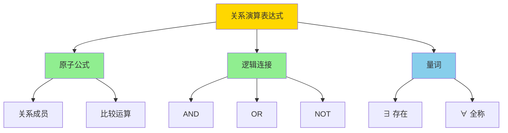
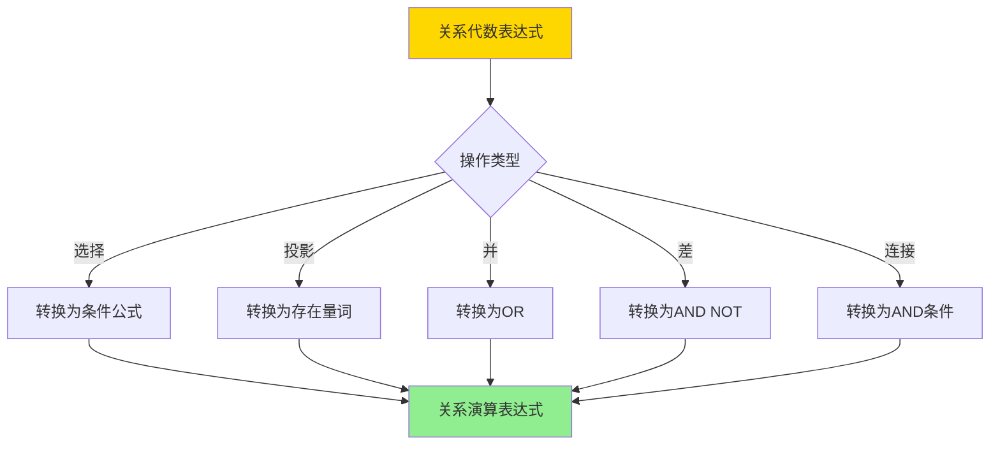
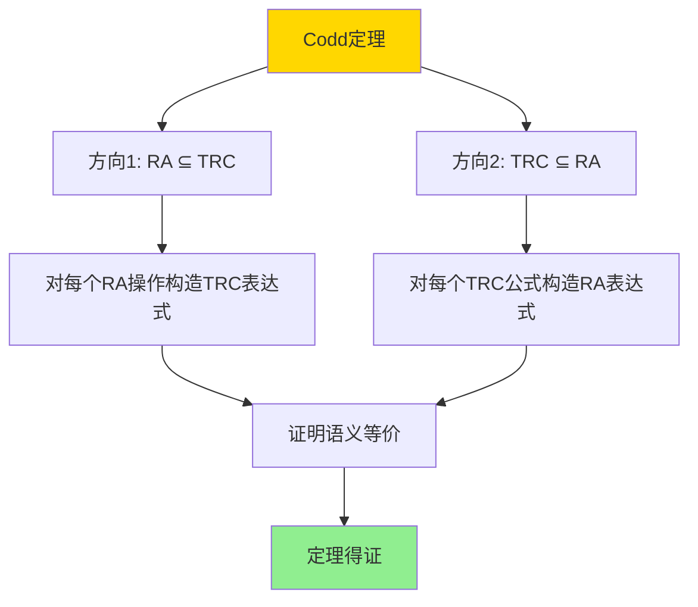
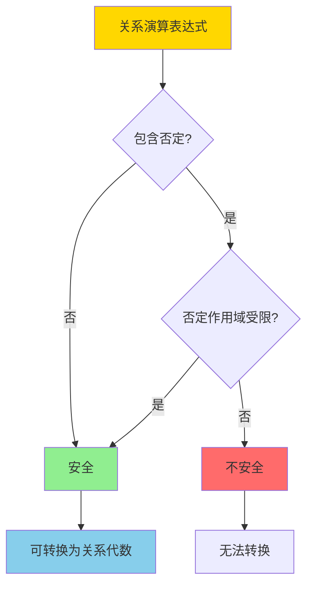

# 关系代数与关系演算-科德定理与可表达性

> **文档版本**: v1.0
> **最后更新**: 2025-01-16
> **版本覆盖**: PostgreSQL 18.x (推荐) ⭐ | 17.x (推荐) | 16.x (兼容)
> **文档状态**: 🟡 框架已创建，内容待完善

---

## 📋 目录

- [关系代数与关系演算-科德定理与可表达性](#关系代数与关系演算-科德定理与可表达性)
  - [📋 目录](#-目录)
  - [1. 概述](#1-概述)
    - [1.0 关系代数与关系演算工作原理概述](#10-关系代数与关系演算工作原理概述)
    - [1.1 本文档的范围](#11-本文档的范围)
  - [2. 核心内容](#2-核心内容)
    - [2.1 关系代数操作](#21-关系代数操作)
    - [2.2 关系演算](#22-关系演算)
    - [2.3 转换算法](#23-转换算法)
  - [3. 形式化定义](#3-形式化定义)
    - [3.1 关系代数形式化](#31-关系代数形式化)
    - [3.2 关系演算形式化](#32-关系演算形式化)
    - [3.3 等价性定义](#33-等价性定义)
  - [4. 定理与证明](#4-定理与证明)
    - [4.1 Codd定理](#41-codd定理)
    - [4.2 安全表达式](#42-安全表达式)
  - [5. 实际应用](#5-实际应用)
    - [5.1 SQL实现](#51-sql实现)
    - [5.2 查询优化](#52-查询优化)
    - [5.3 PostgreSQL查询规划](#53-postgresql查询规划)
  - [6. 相关文档](#6-相关文档)
    - [6.1 理论基础文档](#61-理论基础文档)
  - [7. 参考文献](#7-参考文献)
    - [7.1 核心理论文献](#71-核心理论文献)
    - [7.2 关系演算相关](#72-关系演算相关)
    - [7.3 相关文档](#73-相关文档)

---

## 1. 概述

### 1.0 关系代数与关系演算工作原理概述

**Codd定理**：

Codd定理是关系数据库理论的基石，它证明了关系代数和关系演算在表达能力上的等价性。本文档提供Codd定理的完整证明。

**查询语言分类思维导图**：



**关系代数 vs 关系演算对比矩阵**：

| 维度 | 关系代数 | 关系演算 |
|------|---------|---------|
| **表示方式** | 过程式 | 声明式 |
| **操作符** | 集合运算 | 逻辑公式 |
| **表达能力** | 等价 | 等价 |
| **可读性** | 中等 | 高 |
| **实现难度** | 中等 | 较高 |
| **优化难度** | 中等 | 较高 |

**Codd定理证明结构图**：



### 1.1 本文档的范围

本文档涵盖：

- **关系代数**：关系代数的基本操作和语义
- **关系演算**：元组关系演算和域关系演算
- **Codd定理**：关系代数和关系演算等价性的严格证明
- **实际应用**：Codd定理在SQL实现中的应用

---

## 2. 核心内容

### 2.1 关系代数操作

**关系代数基本操作**：

```haskell
-- 关系代数操作
data RelationalAlgebra =
    Select Condition Relation
  | Project [Attribute] Relation
  | Union Relation Relation
  | Difference Relation Relation
  | CartesianProduct Relation Relation
  | Join Condition Relation Relation
  | Division Relation Relation
```

**关系代数操作层次图**：



### 2.2 关系演算

**元组关系演算**：

```haskell
-- 元组关系演算
data TupleCalculus =
    TupleVariable String
  | RelationName String
  | Condition TupleCalculus
  | Exists String TupleCalculus
  | ForAll String TupleCalculus
  | And TupleCalculus TupleCalculus
  | Or TupleCalculus TupleCalculus
  | Not TupleCalculus
```

**关系演算表达式树**：



### 2.3 转换算法

**关系代数到关系演算转换决策树**：



---

## 3. 形式化定义

### 3.1 关系代数形式化

**关系代数语义**：

```haskell
-- 关系代数语义
· : RelationalAlgebra → Database → Relation

Select cond R(DB) = {t | t ∈ R(DB), cond(t) = TRUE}
Project attrs R(DB) = {t[attrs] | t ∈ R(DB)}
Union R1 R2(DB) = R1(DB) ∪ R2(DB)
Difference R1 R2(DB) = R1(DB) - R2(DB)
CartesianProduct R1 R2(DB) = R1(DB) × R2(DB)
```

### 3.2 关系演算形式化

**元组关系演算语义**：

```haskell
-- 元组关系演算语义
· : TupleCalculus → Database → Relation

{t | φ(t)}(DB) = {t | φ(DB, t) = TRUE}
```

### 3.3 等价性定义

**表达等价**：

```haskell
-- 关系代数表达式E和关系演算表达式F等价
E ≡ F iff forall DB: E(DB) = F(DB)
```

---

## 4. 定理与证明

### 4.1 Codd定理

**定理（Codd定理）**：关系代数和关系演算在表达能力上等价。

**证明结构**：



**证明步骤**：

1. **方向1：关系代数 ⊆ 关系演算**
   - 对每个关系代数操作，构造等价的关系演算表达式
   - 选择：{t | t ∈ R ∧ cond(t)}
   - 投影：{t[attrs] | t ∈ R}
   - 并：{t | t ∈ R1 ∨ t ∈ R2}
   - 差：{t | t ∈ R1 ∧ t ∉ R2}
   - 笛卡尔积：{t1 ∪ t2 | t1 ∈ R1 ∧ t2 ∈ R2}

2. **方向2：关系演算 ⊆ 关系代数**
   - 对每个关系演算公式，构造等价的关系代数表达式
   - 原子公式：直接对应关系
   - 逻辑连接：对应关系代数操作
   - 量词：通过关系代数操作实现

### 4.2 安全表达式

**安全表达式定义**：

关系演算表达式是安全的，当且仅当结果关系是有限的。

**安全表达式判定决策树**：



---

## 5. 实际应用

### 5.1 SQL实现

**SQL基于关系代数和关系演算**：

```sql
-- 关系代数: 选择 + 投影
SELECT name, age
FROM students
WHERE age > 18;

-- 对应关系演算: {t[name, age] | t ∈ students ∧ t.age > 18}

-- 关系代数: 连接
SELECT s.name, c.course_name
FROM students s
JOIN enrollments e ON s.id = e.student_id
JOIN courses c ON e.course_id = c.id;

-- 对应关系演算: {t[s.name, c.course_name] |
--                  s ∈ students ∧ e ∈ enrollments ∧ c ∈ courses ∧
--                  s.id = e.student_id ∧ e.course_id = c.id}
```

### 5.2 查询优化

**基于关系代数的优化**：

```sql
-- 原始查询（关系演算风格）
SELECT * FROM orders o
WHERE EXISTS (
    SELECT 1 FROM customers c
    WHERE c.id = o.customer_id AND c.city = 'NYC'
);

-- 优化为关系代数（连接）
SELECT o.*
FROM orders o
JOIN customers c ON o.customer_id = c.id
WHERE c.city = 'NYC';
```

### 5.3 PostgreSQL查询规划

**查询规划器使用关系代数**：

```sql
-- PostgreSQL查询规划器将SQL转换为关系代数
EXPLAIN (ANALYZE, BUFFERS, VERBOSE)
SELECT s.name, COUNT(e.id) as course_count
FROM students s
LEFT JOIN enrollments e ON s.id = e.student_id
GROUP BY s.id, s.name;

-- 规划器会：
-- 1. 将SQL解析为关系代数树
-- 2. 应用关系代数等价变换优化
-- 3. 选择最优执行计划
```

---

## 6. 相关文档

### 6.1 理论基础文档

- [查询语言的形式语义与等价律](../01-形式化方法与基础理论/01.06-查询语言的形式语义与等价律.md)
- [形式语言与证明：总论](../01-形式化方法与基础理论/01.05-形式语言与证明-总论.md)
- [理论基础导航](../README.md)

---

## 7. 参考文献

### 7.1 核心理论文献

- **Codd, E. F. (1972). "Relational Completeness of Data Base Sublanguages."**
  - 会议: Database Systems, Courant Computer Science Symposia 1972
  - **重要性**: Codd定理的原始论文
  - **核心贡献**: 提出了关系代数和关系演算的等价性定理

- **Codd, E. F. (1970). "A Relational Model of Data for Large Shared Data Banks."**
  - 会议: Communications of the ACM 1970
  - **重要性**: 关系模型的奠基性论文
  - **核心贡献**: 提出了关系模型和关系代数

### 7.2 关系演算相关

- **Abiteboul, S., et al. (1995). "Foundations of Databases."**
  - 出版社: Addison-Wesley
  - **重要性**: 数据库理论的经典教材
  - **核心贡献**: 详细阐述了关系演算和Codd定理

### 7.3 相关文档

- [查询语言的形式语义与等价律](../01-形式化方法与基础理论/01.06-查询语言的形式语义与等价律.md)
- [理论基础导航](../README.md)

---

**最后更新**: 2025-01-16
**维护者**: Documentation Team
**状态**: 🟡 框架已创建，内容待完善
