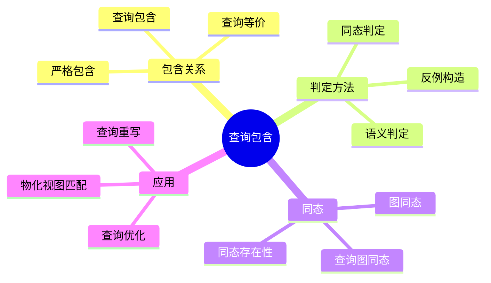
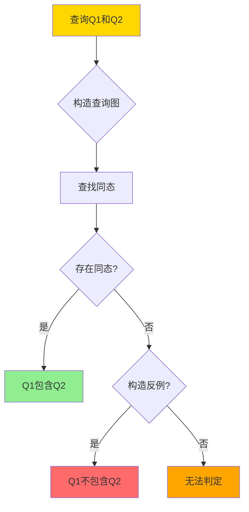
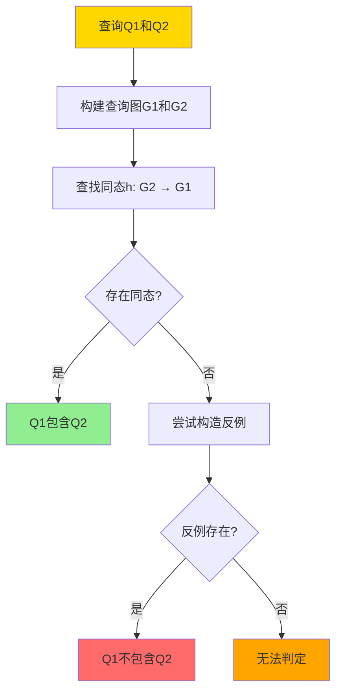
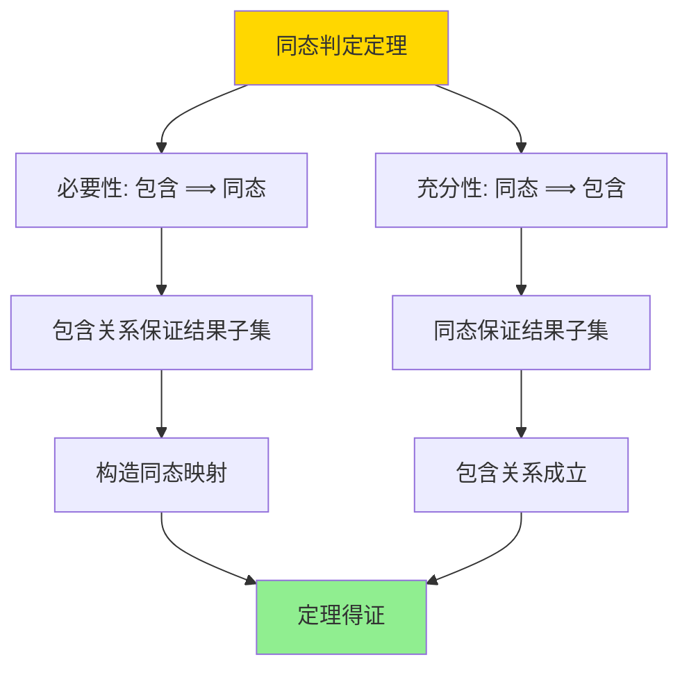

# 同态与查询包含-Containment_Equivalence判定

> **文档版本**: v1.0
> **最后更新**: 2025-01-16
> **版本覆盖**: PostgreSQL 18.x (推荐) ⭐ | 17.x (推荐) | 16.x (兼容)
> **文档状态**: 🟡 框架已创建，内容待完善

---

## 📋 目录

- [同态与查询包含-Containment\_Equivalence判定](#同态与查询包含-containment_equivalence判定)
  - [📋 目录](#-目录)
  - [1. 概述](#1-概述)
    - [1.0 同态与查询包含工作原理概述](#10-同态与查询包含工作原理概述)
    - [1.1 本文档的范围](#11-本文档的范围)
  - [2. 核心内容](#2-核心内容)
    - [2.1 查询包含](#21-查询包含)
    - [2.2 同态](#22-同态)
    - [2.3 查询等价](#23-查询等价)
  - [3. 形式化定义](#3-形式化定义)
    - [3.1 查询包含形式化](#31-查询包含形式化)
    - [3.2 同态形式化](#32-同态形式化)
    - [3.3 查询等价形式化](#33-查询等价形式化)
  - [4. 定理与证明](#4-定理与证明)
    - [4.1 同态判定定理](#41-同态判定定理)
    - [4.2 查询等价判定定理](#42-查询等价判定定理)
  - [5. 实际应用](#5-实际应用)
    - [5.1 查询优化](#51-查询优化)
    - [5.2 物化视图匹配](#52-物化视图匹配)
    - [5.3 查询包含检查](#53-查询包含检查)
  - [6. 相关文档](#6-相关文档)
    - [6.1 理论基础文档](#61-理论基础文档)
  - [7. 参考文献](#7-参考文献)
    - [7.1 核心理论文献](#71-核心理论文献)
    - [7.2 查询包含相关](#72-查询包含相关)
    - [7.3 查询优化相关](#73-查询优化相关)
    - [7.4 相关文档](#74-相关文档)

---

## 1. 概述

### 1.0 同态与查询包含工作原理概述

**查询包含**：

查询包含是指一个查询的结果总是另一个查询结果的子集。同态是判定查询包含的核心工具，通过构造查询图之间的同态映射来判定包含关系。

**查询包含体系思维导图**：



**查询包含判定决策树**：



**查询包含判定方法对比矩阵**：

| 方法 | 复杂度 | 适用场景 | 准确性 |
|------|--------|---------|--------|
| **同态判定** | NP完全 | 连接查询 | 精确 |
| **语义判定** | 不可判定 | 一般查询 | 精确 |
| **启发式方法** | 多项式 | 特定查询 | 近似 |

### 1.1 本文档的范围

本文档涵盖：

- **查询包含**：查询包含关系的定义和判定
- **同态**：查询图同态的定义和构造
- **查询等价**：查询等价的判定方法
- **实际应用**：查询优化和重写中的应用

---

## 2. 核心内容

### 2.1 查询包含

**包含关系定义**：

```haskell
-- 查询包含
contains :: Query -> Query -> Bool
contains Q1 Q2 =
    forall DB: Q2(DB) ⊆ Q1(DB)

-- 查询等价
equivalent :: Query -> Query -> Bool
equivalent Q1 Q2 =
    contains(Q1, Q2) && contains(Q2, Q1)
```

**查询包含判定流程**：



### 2.2 同态

**查询图同态**：

```haskell
-- 查询图
data QueryGraph = QueryGraph {
    nodes :: [Variable],
    edges :: [Atom],
    conditions :: [Condition]
}

-- 同态
homomorphism :: QueryGraph -> QueryGraph -> Maybe Homomorphism
homomorphism G1 G2 =
    findHomomorphism(G2, G1)

-- 同态条件
validHomomorphism :: Homomorphism -> QueryGraph -> QueryGraph -> Bool
validHomomorphism h G1 G2 =
    -- 节点映射保持
    forall v ∈ G2.nodes: h(v) ∈ G1.nodes &&
    -- 边映射保持
    forall atom ∈ G2.edges: h(atom) ∈ G1.edges &&
    -- 条件映射保持
    forall cond ∈ G2.conditions: h(cond) implies G1.conditions
```

**同态构造算法**：

```haskell
-- 同态构造
constructHomomorphism :: QueryGraph -> QueryGraph -> Maybe Homomorphism
constructHomomorphism G1 G2 =
    let candidates = generateCandidates(G2.nodes, G1.nodes)
    in findValidHomomorphism(candidates, G1, G2)
```

### 2.3 查询等价

**等价判定**：

```haskell
-- 查询等价
equivalent :: Query -> Query -> Bool
equivalent Q1 Q2 =
    contains(Q1, Q2) && contains(Q2, Q1)

-- 等价判定（通过同态）
equivalentByHomomorphism :: Query -> Query -> Bool
equivalentByHomomorphism Q1 Q2 =
    exists h1: homomorphism(Q1.graph, Q2.graph) &&
    exists h2: homomorphism(Q2.graph, Q1.graph)
```

---

## 3. 形式化定义

### 3.1 查询包含形式化

**包含关系**：

```haskell
-- 查询包含
Q1 ⊇ Q2 iff
    forall DB: Q2(DB) ⊆ Q1(DB)
```

### 3.2 同态形式化

**查询图同态**：

```haskell
-- 同态
h: G2 → G1 is homomorphism iff
    forall variable v ∈ G2: h(v) ∈ G1.variables &&
    forall atom R(v1, ..., vn) ∈ G2: R(h(v1), ..., h(vn)) ∈ G1.atoms &&
    forall condition cond ∈ G2: h(cond) implies G1.conditions
```

### 3.3 查询等价形式化

**等价关系**：

```haskell
-- 查询等价
Q1 ≡ Q2 iff
    Q1 ⊇ Q2 && Q2 ⊇ Q1
```

---

## 4. 定理与证明

### 4.1 同态判定定理

**定理**：查询Q1包含查询Q2当且仅当存在从Q2的查询图到Q1的查询图的同态。

**证明树**：



**证明**：

1. **必要性**：如果Q1包含Q2，则对于任意数据库，Q2的结果是Q1结果的子集，这要求存在同态映射
2. **充分性**：如果存在同态h: G2 → G1，则对于任意数据库，Q2的结果映射到Q1的结果中，Q1包含Q2

### 4.2 查询等价判定定理

**定理**：查询Q1和Q2等价当且仅当存在双向同态。

**证明**：

1. 如果Q1和Q2等价，则Q1包含Q2且Q2包含Q1
2. 根据同态判定定理，存在同态h1: G2 → G1和h2: G1 → G2
3. 因此存在双向同态

---

## 5. 实际应用

### 5.1 查询优化

**查询重写**：

```sql
-- 原始查询
SELECT c.customer_id, c.customer_name, o.order_id
FROM customers c
JOIN orders o ON c.customer_id = o.customer_id
WHERE c.city = 'NYC';

-- 优化后的查询（通过同态判定可以重写）
SELECT c.customer_id, c.customer_name, o.order_id
FROM (SELECT * FROM customers WHERE city = 'NYC') c
JOIN orders o ON c.customer_id = o.customer_id;

-- 两个查询等价（存在双向同态）
```

### 5.2 物化视图匹配

**视图匹配**：

```sql
-- 物化视图
CREATE MATERIALIZED VIEW mv_customer_orders AS
SELECT
    c.customer_id,
    c.customer_name,
    o.order_id,
    o.order_date
FROM customers c
JOIN orders o ON c.customer_id = o.customer_id;

-- 查询（通过同态判定可以匹配视图）
SELECT
    customer_id,
    customer_name,
    order_id
FROM customers
JOIN orders ON customers.customer_id = orders.customer_id;

-- 查询包含在视图中（存在同态）
```

### 5.3 查询包含检查

**包含关系验证**：

```sql
-- 查询1：更具体的查询
SELECT * FROM customers WHERE city = 'NYC' AND status = 'active';

-- 查询2：更一般的查询
SELECT * FROM customers WHERE city = 'NYC';

-- 查询2包含查询1（存在同态：查询1的图是查询2的子图）
-- 验证：查询1的结果总是查询2结果的子集
```

---

## 6. 相关文档

### 6.1 理论基础文档

- [查询重写等价性-基于同构的充分必要条件](../05-索引与查询优化/05.10-查询重写等价性-基于同构的充分必要条件.md)
- [理论基础导航](../README.md)

---

## 7. 参考文献

### 7.1 核心理论文献

- **Chandra, A. K., & Merlin, P. M. (1977). "Optimal Implementation of Conjunctive Queries in Relational Data Bases."**
  - 会议: STOC 1977
  - **重要性**: 查询包含的经典论文
  - **核心贡献**: 提出了同态判定查询包含的方法

- **Sagiv, Y., & Yannakakis, M. (1980). "Equivalences Among Relational Expressions with the Union and Difference Operations."**
  - 会议: JACM 1980
  - **重要性**: 查询等价的经典研究
  - **核心贡献**: 提供了查询等价的判定方法

### 7.2 查询包含相关

- **Abiteboul, S., et al. (1995). "Foundations of Databases."**
  - 出版社: Addison-Wesley 1995
  - **重要性**: 数据库理论的经典教材
  - **核心贡献**: 详细阐述了查询包含和同态理论

### 7.3 查询优化相关

- **Levy, A. Y., et al. (1995). "Query Optimization by Predicate Move-Around."**
  - 会议: VLDB 1995
  - **重要性**: 查询优化的经典研究
  - **核心贡献**: 应用查询包含进行查询优化

### 7.4 相关文档

- [查询重写等价性-基于同构的充分必要条件](../05-索引与查询优化/05.10-查询重写等价性-基于同构的充分必要条件.md)
- [理论基础导航](../README.md)

---

**最后更新**: 2025-01-16
**维护者**: Documentation Team
**状态**: 🟡 框架已创建，内容待完善
