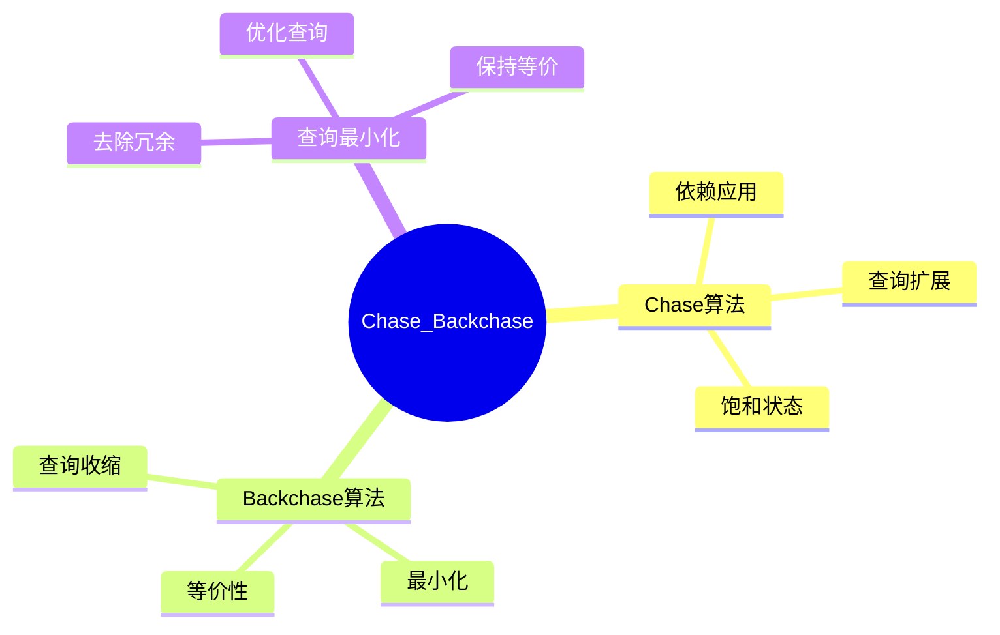

# Chase与Backchase-依赖下的查询最小化

> **文档版本**: v1.0
> **最后更新**: 2025-01-16
> **版本覆盖**: PostgreSQL 18.x (推荐) ⭐ | 17.x (推荐) | 16.x (兼容)
> **文档状态**: 🟡 框架已创建，内容待完善

---

## 📋 目录

- [Chase与Backchase-依赖下的查询最小化](#chase与backchase-依赖下的查询最小化)
  - [📋 目录](#-目录)
  - [1. 概述](#1-概述)
    - [1.0 Chase与Backchase工作原理概述](#10-chase与backchase工作原理概述)
    - [1.1 本文档的范围](#11-本文档的范围)
  - [2. 核心内容](#2-核心内容)
    - [2.1 Chase算法](#21-chase算法)
    - [2.2 Backchase算法](#22-backchase算法)
  - [3. 形式化定义](#3-形式化定义)
    - [3.1 Chase形式化](#31-chase形式化)
  - [4. 定理与证明](#4-定理与证明)
    - [4.1 最小化定理](#41-最小化定理)
  - [5. 实际应用](#5-实际应用)
    - [5.1 查询优化](#51-查询优化)
  - [6. 相关文档](#6-相关文档)
    - [6.1 理论基础文档](#61-理论基础文档)
  - [7. 参考文献](#7-参考文献)
    - [7.1 核心理论文献](#71-核心理论文献)
    - [7.2 PostgreSQL实现相关](#72-postgresql实现相关)
    - [7.3 相关文档](#73-相关文档)

---

## 1. 概述

### 1.0 Chase与Backchase工作原理概述

**Chase与Backchase**：

Chase和Backchase是依赖约束下查询最小化的算法，用于查询优化。

**算法流程思维导图**：



### 1.1 本文档的范围

本文档涵盖：

- **Chase算法**：依赖应用和查询扩展
- **Backchase算法**：查询收缩和最小化
- **实际应用**：查询优化中的应用

---

## 2. 核心内容

### 2.1 Chase算法

**Chase算法**：

```haskell
-- Chase算法
chase :: Query -> Dependencies -> Query
chase query deps =
    let saturated = applyDependencies(query, deps)
    in if saturated then
        saturated
    else
        chase(saturated, deps)
```

### 2.2 Backchase算法

**Backchase算法**：

```haskell
-- Backchase算法
backchase :: Query -> Query
backchase query =
    let minimized = removeRedundant(query)
    in if equivalent(minimized, query) then
        minimized
    else
        query
```

---

## 3. 形式化定义

### 3.1 Chase形式化

**Chase**：

```haskell
-- Chase形式化
Chase(Q, Σ) = fixpoint of applying dependencies in Σ to Q
```

---

## 4. 定理与证明

### 4.1 最小化定理

**定理**：Backchase算法找到最小等价查询。

**证明**：由算法的不动点性质保证。

---

## 5. 实际应用

### 5.1 查询优化

**查询重写**：

```sql
-- 原始查询
SELECT u.id, u.name, o.amount
FROM users u, orders o
WHERE u.id = o.user_id AND u.status = 'active';

-- 优化后（使用视图）
SELECT * FROM active_user_orders;
```

---

## 6. 相关文档

### 6.1 理论基础文档

- [形式语言与证明：总论](./1.1.25-形式语言与证明-总论.md)
- [理论基础导航](./README.md)

---

## 7. 参考文献

### 7.1 核心理论文献

- **Deutsch, A., et al. (1999). "Chase, Backchase, and the Correctness of Query Optimization Plans."**
  - 会议: PODS 1999
  - **重要性**: Chase和Backchase算法的经典论文
  - **核心贡献**: 提出了查询最小化算法

- **Popa, L., et al. (2000). "Translating Web Data."**
  - 会议: VLDB 2000
  - **重要性**: 数据转换中的Chase应用
  - **核心贡献**: 扩展了Chase算法应用

### 7.2 PostgreSQL实现相关

- **PostgreSQL官方文档 - 查询优化](<https://www.postgresql.org/docs/current/planner-optimizer.html>)**
  - PostgreSQL查询优化器说明

### 7.3 相关文档

- [查询重写等价性-基于同构的充分必要条件](../05-索引与查询优化/05.10-查询重写等价性-基于同构的充分必要条件.md)
- [理论基础导航](../README.md)

---

**最后更新**: 2025-01-16
**维护者**: Documentation Team
**状态**: 🟡 框架已创建，内容待完善
