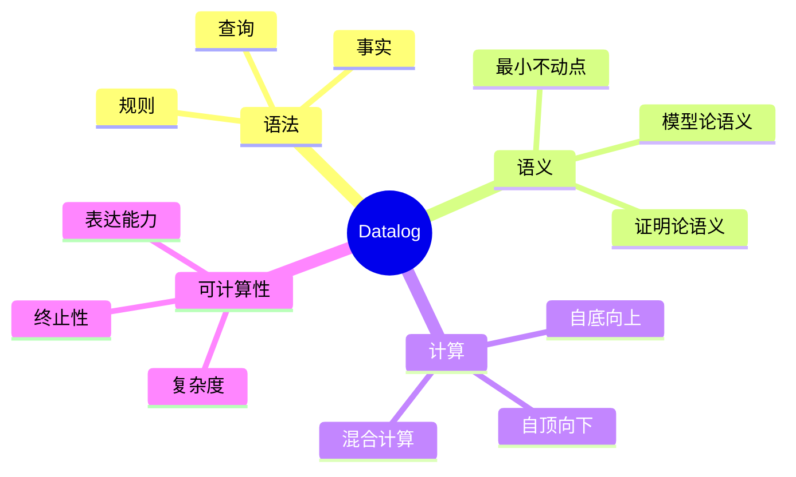
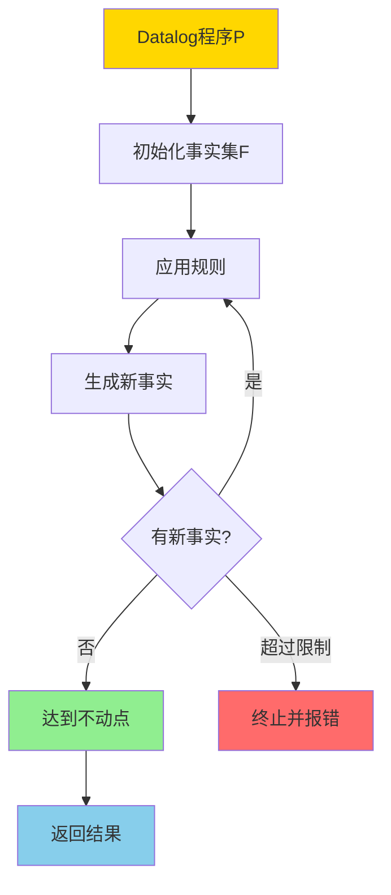
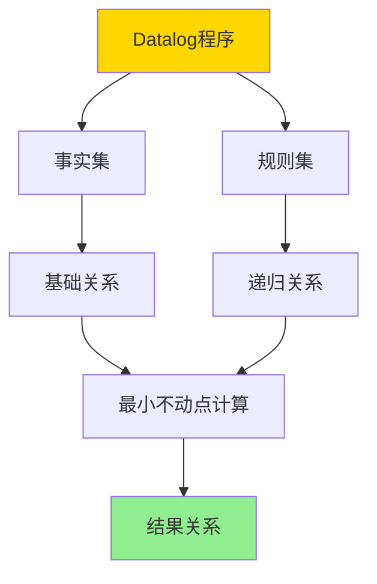
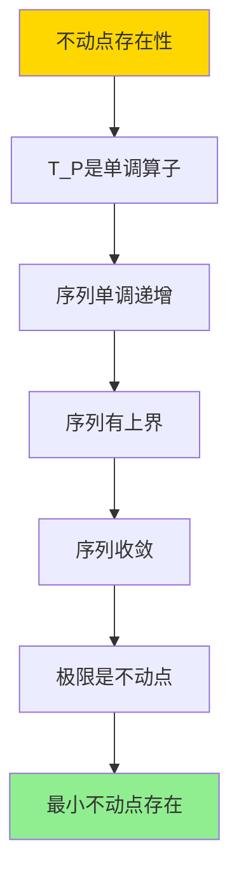

# Datalog与递归查询-不动点语义与可计算性

> **文档版本**: v1.0
> **最后更新**: 2025-01-16
> **版本覆盖**: PostgreSQL 18.x (推荐) ⭐ | 17.x (推荐) | 16.x (兼容)
> **文档状态**: 🟡 框架已创建，内容待完善

---

## 📋 目录

- [Datalog与递归查询-不动点语义与可计算性](#datalog与递归查询-不动点语义与可计算性)
  - [📋 目录](#-目录)
  - [1. 概述](#1-概述)
    - [1.0 Datalog与递归查询工作原理概述](#10-datalog与递归查询工作原理概述)
    - [1.1 本文档的范围](#11-本文档的范围)
  - [2. 核心内容](#2-核心内容)
    - [2.1 Datalog语法](#21-datalog语法)
    - [2.2 不动点语义](#22-不动点语义)
    - [2.3 可计算性](#23-可计算性)
  - [3. 形式化定义](#3-形式化定义)
    - [3.1 Datalog语法形式化](#31-datalog语法形式化)
    - [3.2 不动点语义形式化](#32-不动点语义形式化)
    - [3.3 可计算性形式化](#33-可计算性形式化)
  - [4. 定理与证明](#4-定理与证明)
    - [4.1 不动点存在性定理](#41-不动点存在性定理)
    - [4.2 可计算性定理](#42-可计算性定理)
  - [5. 实际应用](#5-实际应用)
    - [5.1 Datalog在数据库中的应用](#51-datalog在数据库中的应用)
    - [5.2 PostgreSQL中的递归查询](#52-postgresql中的递归查询)
    - [5.3 Datalog扩展](#53-datalog扩展)
  - [6. 相关文档](#6-相关文档)
    - [6.1 理论基础文档](#61-理论基础文档)
  - [7. 参考文献](#7-参考文献)
    - [7.1 核心理论文献](#71-核心理论文献)
    - [7.2 Datalog相关](#72-datalog相关)
    - [7.3 递归查询相关](#73-递归查询相关)
    - [7.4 相关文档](#74-相关文档)

---

## 1. 概述

### 1.0 Datalog与递归查询工作原理概述

**Datalog**：

Datalog是一种声明式逻辑编程语言，用于表达递归查询。它通过最小不动点语义计算递归关系，具有可计算性保证。

**Datalog体系思维导图**：



**Datalog计算决策树**：



**Datalog计算策略对比矩阵**：

| 策略 | 方法 | 复杂度 | 适用场景 |
|------|------|--------|---------|
| **自底向上** | 从事实推导 | 多项式 | 数据密集型 |
| **自顶向下** | 从查询推导 | 指数 | 查询密集型 |
| **混合计算** | 结合两者 | 中等 | 平衡场景 |

### 1.1 本文档的范围

本文档涵盖：

- **Datalog语法**：规则、事实、查询的语法
- **不动点语义**：最小不动点的定义和计算
- **可计算性**：Datalog的终止性和复杂度
- **实际应用**：Datalog在数据库中的应用

---

## 2. 核心内容

### 2.1 Datalog语法

**规则和事实**：

```haskell
-- Datalog规则
-- 形式: head :- body1, body2, ..., bodyn
ancestor(X, Y) :- parent(X, Y).
ancestor(X, Z) :- parent(X, Y), ancestor(Y, Z).

-- 事实
parent(alice, bob).
parent(bob, charlie).

-- 查询
?- ancestor(X, charlie).
```

**Datalog程序结构**：



### 2.2 不动点语义

**最小不动点**：

```haskell
-- Datalog程序的不动点
lfp(P) = ∪_{i≥0} T_P^i(∅)

其中:
  T_P(R) = {head | head :- body ∈ P, body satisfied in R}
  T_P^0(∅) = facts(P)
  T_P^{i+1}(∅) = T_P^i(∅) ∪ T_P(T_P^i(∅))
```

**不动点计算流程**：

```mermaid
graph TD
    A[Datalog程序P] --> B[I₀ = facts(P)]
    B --> C[I₁ = I₀ ∪ T_P(I₀)]
    C --> D[I₂ = I₁ ∪ T_P(I₁)]
    D --> E{Iᵢ = Iᵢ₋₁?}
    E -->|否| F[i = i + 1]
    F --> D
    E -->|是| G[不动点Iᵢ]
    G --> H[返回结果]

    style A fill:#FFD700
    style G fill:#90EE90
    style H fill:#87CEEB
```

### 2.3 可计算性

**终止性**：

```haskell
-- 终止性判定
terminates :: DatalogProgram -> Bool
terminates P =
    exists n: T_P^n(∅) = T_P^{n+1}(∅)

-- 单调性保证终止
monotonic :: DatalogProgram -> Bool
monotonic P =
    forall R1, R2: R1 ⊆ R2 ⟹ T_P(R1) ⊆ T_P(R2)
```

**复杂度分析**：

```haskell
-- Datalog复杂度
-- 线性Datalog: PTIME
-- 一般Datalog: EXPTIME
complexity :: DatalogProgram -> Complexity
complexity P =
    if linear(P) then PTIME
    else EXPTIME
```

---

## 3. 形式化定义

### 3.1 Datalog语法形式化

**Datalog程序**：

```haskell
-- Datalog程序
P = (F, R)

其中:
  F是事实集
  R是规则集
```

**规则**：

```haskell
-- 规则
head :- body1, body2, ..., bodyn

语义:
  if body1, body2, ..., bodyn are true then head is true
```

### 3.2 不动点语义形式化

**最小不动点**：

```haskell
-- 最小不动点
lfp(P) = lfp(T_P)

其中T_P是立即后果算子:
  T_P(R) = {head | head :- body ∈ P, R ⊨ body}
```

### 3.3 可计算性形式化

**可计算性**：

```haskell
-- Datalog可计算性
computable(P) iff
    exists algorithm A: A computes lfp(P) and terminates
```

---

## 4. 定理与证明

### 4.1 不动点存在性定理

**定理**：Datalog程序的最小不动点存在。

**证明树**：



**证明**：

1. T_P是单调算子，序列I_i = T_P^i(∅)单调递增
2. 关系集合有上界，序列有上界
3. 因此序列收敛到某个关系I*
4. I* = ∪_{i≥0} I_i是不动点，且是最小不动点

### 4.2 可计算性定理

**定理**：线性Datalog程序在PTIME内可计算。

**证明**：

1. 线性Datalog的规则体最多包含一个递归谓词
2. 每次迭代最多增加多项式数量的事实
3. 迭代次数多项式有界
4. 因此总复杂度是PTIME

---

## 5. 实际应用

### 5.1 Datalog在数据库中的应用

**传递闭包查询**：

```datalog
% 边关系
edge(a, b).
edge(b, c).
edge(c, d).

% 传递闭包规则
path(X, Y) :- edge(X, Y).
path(X, Z) :- edge(X, Y), path(Y, Z).

% 查询
?- path(X, d).
```

**层次查询**：

```datalog
% 员工关系
manager(alice, bob).
manager(bob, charlie).

% 下属关系
subordinate(X, Y) :- manager(Y, X).
subordinate(X, Z) :- manager(Y, X), subordinate(Y, Z).

% 查询所有下属
?- subordinate(X, alice).
```

### 5.2 PostgreSQL中的递归查询

**使用递归CTE实现Datalog语义**：

```sql
-- 传递闭包
WITH RECURSIVE path AS (
    -- 基础事实
    SELECT from_node, to_node, 1 as distance
    FROM edges

    UNION ALL

    -- 递归规则
    SELECT p.from_node, e.to_node, p.distance + 1
    FROM path p
    JOIN edges e ON p.to_node = e.from_node
    WHERE p.distance < 10
)
SELECT * FROM path;
```

### 5.3 Datalog扩展

**带聚合的Datalog**：

```datalog
% 计数聚合
count_paths(X, Y, N) :-
    path(X, Y),
    COUNT(path(X, Y)) = N.

% 最大路径长度
max_path_length(X, Y, M) :-
    path(X, Y, L),
    MAX(L) = M.
```

---

## 6. 相关文档

### 6.1 理论基础文档

- [CTE与递归查询-关系代数不动点语义](./08.08-CTE与递归查询-关系代数不动点语义.md)
- [理论基础导航](../README.md)

---

## 7. 参考文献

### 7.1 核心理论文献

- **Ceri, S., et al. (1989). "Logic Programming and Databases."**
  - 出版社: Springer 1989
  - **重要性**: Datalog的经典教材
  - **核心贡献**: 系统阐述了Datalog的语法和语义

- **Abiteboul, S., et al. (1995). "Foundations of Databases."**
  - 出版社: Addison-Wesley 1995
  - **重要性**: 数据库理论的经典教材
  - **核心贡献**: 详细阐述了Datalog的不动点语义

### 7.2 Datalog相关

- **Ullman, J. D. (1989). "Principles of Database and Knowledge-Base Systems."**
  - 出版社: Computer Science Press 1989
  - **重要性**: 数据库和知识库系统的经典教材
  - **核心贡献**: 提供了Datalog的可计算性分析

### 7.3 递归查询相关

- **Naughton, J. F. (1991). "Data Independent Recursion in Deductive Databases."**
  - 期刊: Journal of Computer and System Sciences 1991
  - **重要性**: 递归查询优化的经典研究
  - **核心贡献**: 提供了递归查询的优化方法

### 7.4 相关文档

- [CTE与递归查询-关系代数不动点语义](./08.08-CTE与递归查询-关系代数不动点语义.md)
- [理论基础导航](../README.md)

---

**最后更新**: 2025-01-16
**维护者**: Documentation Team
**状态**: 🟡 框架已创建，内容待完善
