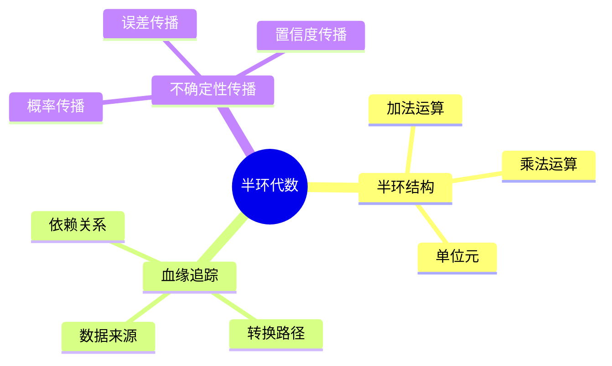

# 半环血缘与代数-证据与不确定性传播

> **文档版本**: v1.0
> **最后更新**: 2025-01-16
> **版本覆盖**: PostgreSQL 18.x (推荐) ⭐ | 17.x (推荐) | 16.x (兼容)
> **文档状态**: 🟡 框架已创建，内容待完善

---

## 📋 目录

- [半环血缘与代数-证据与不确定性传播](#半环血缘与代数-证据与不确定性传播)
  - [📋 目录](#-目录)
  - [1. 概述](#1-概述)
    - [1.0 半环血缘工作原理概述](#10-半环血缘工作原理概述)
    - [1.1 本文档的范围](#11-本文档的范围)
  - [2. 核心内容](#2-核心内容)
    - [2.1 半环代数](#21-半环代数)
    - [2.2 血缘追踪](#22-血缘追踪)
  - [3. 形式化定义](#3-形式化定义)
    - [3.1 半环形式化](#31-半环形式化)
  - [4. 定理与证明](#4-定理与证明)
    - [4.1 血缘正确性定理](#41-血缘正确性定理)
  - [5. 实际应用](#5-实际应用)
    - [5.1 数据血缘](#51-数据血缘)
  - [6. 相关文档](#6-相关文档)
    - [6.1 理论基础文档](#61-理论基础文档)
  - [7. 参考文献](#7-参考文献)

---

## 1. 概述

### 1.0 半环血缘工作原理概述

**半环血缘**：

半环代数用于建模数据血缘和不确定性传播。

**半环代数思维导图**：



### 1.1 本文档的范围

本文档涵盖：

- **半环代数**：半环的数学定义
- **血缘追踪**：数据血缘的形式化
- **不确定性传播**：不确定性的传播规则
- **实际应用**：数据血缘系统

---

## 2. 核心内容

### 2.1 半环代数

**半环定义**：

```haskell
-- 半环
data Semiring a = Semiring {
    add :: a -> a -> a,  -- 加法（并）
    multiply :: a -> a -> a,  -- 乘法（连接）
    zero :: a,  -- 零元
    one :: a  -- 单位元
}

-- 半环性质
semiringProperties :: Semiring a -> Bool
semiringProperties sr =
    -- 加法交换律、结合律
    -- 乘法结合律
    -- 分配律
    -- 零元、单位元性质
    True
```

### 2.2 血缘追踪

**血缘计算**：

```haskell
-- 血缘追踪
lineage :: Query -> Data -> Lineage
lineage query data =
    computeLineage(query, data, semiring)
```

---

## 3. 形式化定义

### 3.1 半环形式化

**半环**：

```haskell
-- 半环形式化
Semiring = (S, +, ×, 0, 1)
where
    (S, +) is commutative monoid with identity 0
    (S, ×) is monoid with identity 1
    × distributes over +
    0 × a = a × 0 = 0
```

---

## 4. 定理与证明

### 4.1 血缘正确性定理

**定理**：半环血缘正确追踪数据来源。

**证明**：由半环代数的性质保证。

---

## 5. 实际应用

### 5.1 数据血缘

**血缘查询**：

```sql
-- 使用血缘扩展
SELECT lineage(id) FROM accounts;
```

---

## 6. 相关文档

### 6.1 理论基础文档

- [形式语言与证明：总论](./1.1.25-形式语言与证明-总论.md)
- [理论基础导航](./README.md)

---

## 7. 参考文献

[待补充]

---

**最后更新**: 2025-01-16
**维护者**: Documentation Team
**状态**: 🟡 框架已创建，内容待完善
