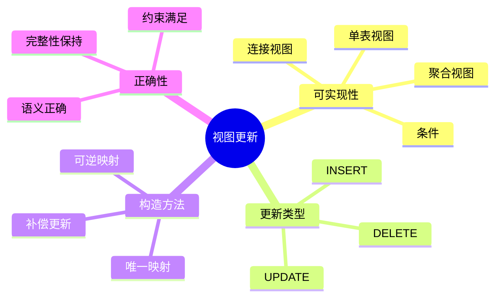
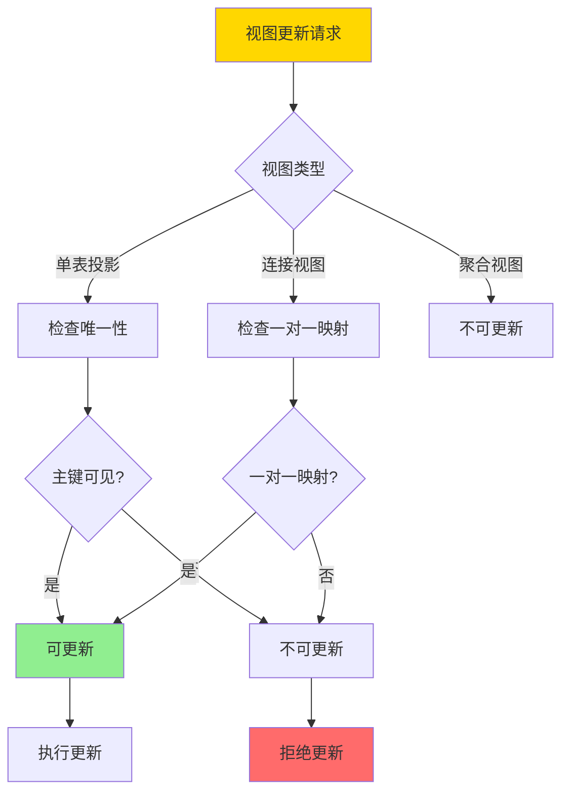
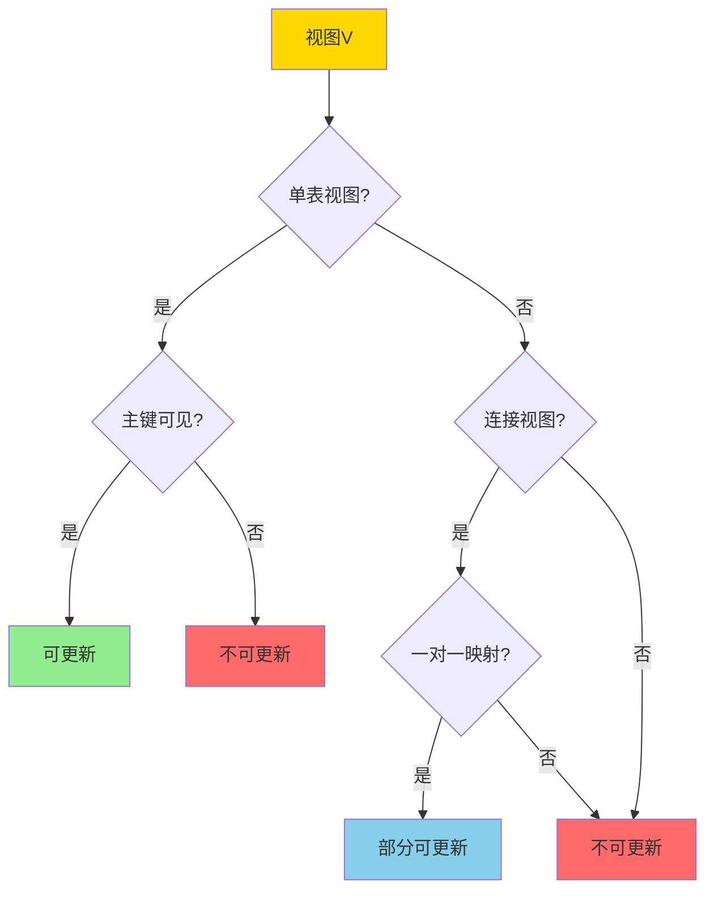
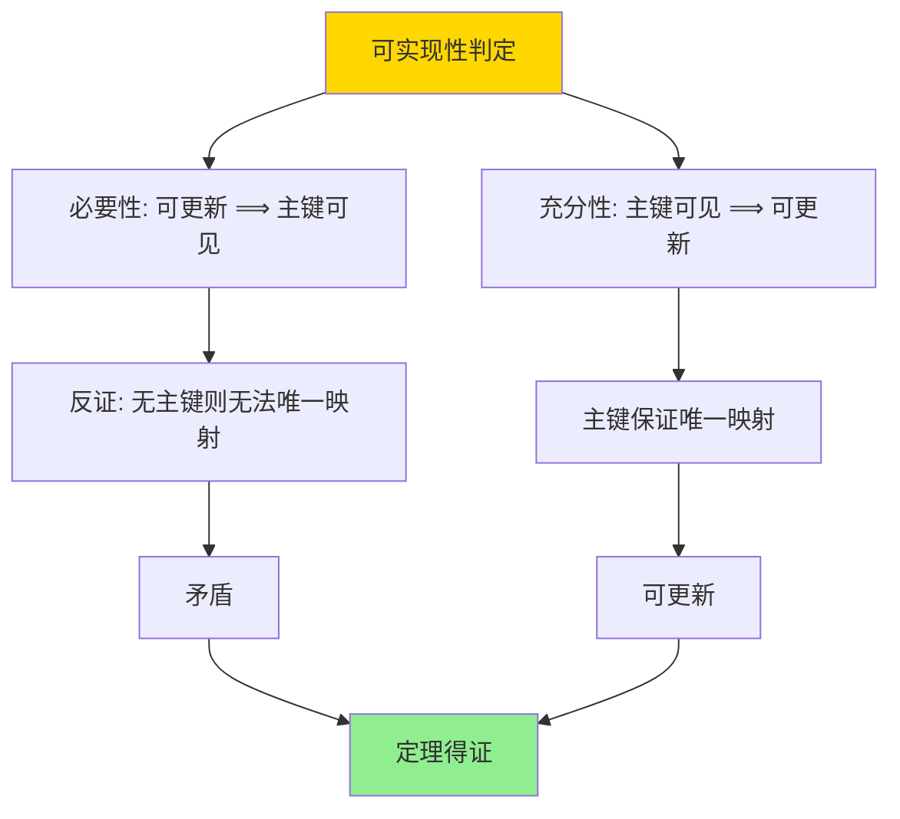

# 视图更新与可实现性-必要条件与构造

> **文档版本**: v1.0
> **最后更新**: 2025-01-16
> **版本覆盖**: PostgreSQL 18.x (推荐) ⭐ | 17.x (推荐) | 16.x (兼容)
> **文档状态**: 🟡 框架已创建，内容待完善

---

## 📋 目录

- [视图更新与可实现性-必要条件与构造](#视图更新与可实现性-必要条件与构造)
  - [📋 目录](#-目录)
  - [1. 概述](#1-概述)
    - [1.0 视图更新工作原理概述](#10-视图更新工作原理概述)
    - [1.1 本文档的范围](#11-本文档的范围)
  - [2. 核心内容](#2-核心内容)
    - [2.1 可实现性条件](#21-可实现性条件)
    - [2.2 构造方法](#22-构造方法)
    - [2.3 更新语义](#23-更新语义)
  - [3. 形式化定义](#3-形式化定义)
    - [3.1 可实现性形式化](#31-可实现性形式化)
    - [3.2 更新映射形式化](#32-更新映射形式化)
    - [3.3 正确性形式化](#33-正确性形式化)
  - [4. 定理与证明](#4-定理与证明)
    - [4.1 可实现性判定定理](#41-可实现性判定定理)
    - [4.2 更新正确性定理](#42-更新正确性定理)
  - [5. 实际应用](#5-实际应用)
    - [5.1 PostgreSQL视图更新](#51-postgresql视图更新)
    - [5.2 视图更新规则](#52-视图更新规则)
    - [5.3 视图更新检查](#53-视图更新检查)
  - [6. 相关文档](#6-相关文档)
    - [6.1 理论基础文档](#61-理论基础文档)
  - [7. 参考文献](#7-参考文献)
    - [7.1 核心理论文献](#71-核心理论文献)
    - [7.2 视图更新相关](#72-视图更新相关)
    - [7.3 PostgreSQL实现相关](#73-postgresql实现相关)
    - [7.4 相关文档](#74-相关文档)

---

## 1. 概述

### 1.0 视图更新工作原理概述

**视图更新**：

视图更新是指通过视图修改底层基表数据。并非所有视图都可以更新，需要满足特定的可实现性条件。

**视图更新体系思维导图**：



**视图更新判定决策树**：



**视图类型更新能力对比矩阵**：

| 视图类型 | INSERT | UPDATE | DELETE | 条件 |
|---------|--------|--------|--------|------|
| **单表投影** | 是 | 是 | 是 | 主键可见 |
| **单表选择** | 是 | 是 | 是 | 主键可见 |
| **连接视图** | 否 | 部分 | 部分 | 一对一映射 |
| **聚合视图** | 否 | 否 | 否 | 不可更新 |
| **UNION视图** | 否 | 否 | 否 | 不可更新 |

### 1.1 本文档的范围

本文档涵盖：

- **可实现性条件**：视图可更新的必要和充分条件
- **构造方法**：构造可更新视图的方法
- **更新语义**：视图更新的语义定义
- **实际应用**：PostgreSQL视图更新的实现

---

## 2. 核心内容

### 2.1 可实现性条件

**必要条件**：

```haskell
-- 视图可更新条件
updatable :: View -> Bool
updatable V =
    -- 条件1: 视图定义不包含聚合
    not (hasAggregation(V.definition)) &&
    -- 条件2: 视图定义不包含DISTINCT
    not (hasDistinct(V.definition)) &&
    -- 条件3: 视图定义不包含UNION
    not (hasUnion(V.definition)) &&
    -- 条件4: 基表主键在视图中可见
    hasPrimaryKey(V)
```

**充分条件**：

```haskell
-- 单表视图可更新
singleTableUpdatable :: View -> Bool
singleTableUpdatable V =
    isSingleTable(V) &&
    hasPrimaryKey(V) &&
    not (hasAggregation(V.definition))
```

**视图更新判定流程**：



### 2.2 构造方法

**可更新视图构造**：

```haskell
-- 构造可更新视图
constructUpdatable :: Table -> Attributes -> View
constructUpdatable T attrs =
    View {
        definition = π_attrs(T),
        baseTable = T,
        primaryKey = getPrimaryKey(T)
    }
```

**更新映射**：

```haskell
-- 视图更新到基表更新
mapUpdate :: View -> Update -> Update
mapUpdate V (Update viewAttrs newVals) =
    Update V.baseTable (mapToBaseAttrs(V, viewAttrs)) (mapToBaseVals(V, newVals))
```

### 2.3 更新语义

**INSERT语义**：

```haskell
-- 视图INSERT
insertIntoView :: View -> Tuple -> Database -> Database
insertIntoView V t db =
    let baseTuple = mapToBaseTuple(V, t)
    in insertIntoTable(V.baseTable, baseTuple, db)
```

**UPDATE语义**：

```haskell
-- 视图UPDATE
updateView :: View -> Condition -> Update -> Database -> Database
updateView V cond update db =
    let baseCond = mapToBaseCondition(V, cond)
        baseUpdate = mapToBaseUpdate(V, update)
    in updateTable(V.baseTable, baseCond, baseUpdate, db)
```

---

## 3. 形式化定义

### 3.1 可实现性形式化

**可更新性**：

```haskell
-- 视图可更新
updatable(V) iff
    exists function f: ViewUpdate -> BaseUpdate such that:
      forall DB: V(f(update, DB)) = update(V(DB))
```

### 3.2 更新映射形式化

**更新映射**：

```haskell
-- 更新映射
mapUpdate(V, u) = u' such that:
    forall DB: V(u'(DB)) = u(V(DB))
```

### 3.3 正确性形式化

**更新正确性**：

```haskell
-- 视图更新正确
correct(V, u) iff
    forall DB: V(mapUpdate(V, u)(DB)) = u(V(DB))
```

---

## 4. 定理与证明

### 4.1 可实现性判定定理

**定理**：单表视图可更新当且仅当主键在视图中可见。

**证明树**：



**证明**：

1. **必要性**：如果视图可更新，则必须能够唯一确定基表行，这要求主键可见
2. **充分性**：如果主键可见，则可以通过主键唯一映射到基表行，视图可更新

### 4.2 更新正确性定理

**定理**：可更新视图的更新映射是正确的。

**证明**：

1. 可更新视图满足可实现性条件
2. 更新映射保证视图更新与基表更新一致
3. 因此更新映射正确

---

## 5. 实际应用

### 5.1 PostgreSQL视图更新

**创建可更新视图**：

```sql
-- 单表视图（可更新）
CREATE VIEW active_customers AS
SELECT customer_id, customer_name, email
FROM customers
WHERE status = 'active';

-- 视图更新
INSERT INTO active_customers (customer_name, email)
VALUES ('Alice', 'alice@example.com');

UPDATE active_customers
SET email = 'newemail@example.com'
WHERE customer_id = 1;

DELETE FROM active_customers
WHERE customer_id = 1;
```

**不可更新视图**：

```sql
-- 聚合视图（不可更新）
CREATE VIEW customer_stats AS
SELECT
    customer_id,
    COUNT(*) as order_count,
    SUM(total) as total_amount
FROM orders
GROUP BY customer_id;

-- 尝试更新会失败
UPDATE customer_stats SET order_count = 10;  -- 错误：不可更新

-- 连接视图（部分可更新）
CREATE VIEW customer_orders AS
SELECT
    c.customer_id,
    c.customer_name,
    o.order_id,
    o.order_date
FROM customers c
JOIN orders o ON c.customer_id = o.customer_id;

-- 只能更新某些列
UPDATE customer_orders
SET customer_name = 'New Name'
WHERE customer_id = 1;  -- 可能成功，取决于实现
```

### 5.2 视图更新规则

**INSTEAD OF触发器**：

```sql
-- 使用INSTEAD OF触发器实现复杂视图更新
CREATE VIEW customer_order_summary AS
SELECT
    c.customer_id,
    c.customer_name,
    COUNT(o.order_id) as order_count
FROM customers c
LEFT JOIN orders o ON c.customer_id = o.customer_id
GROUP BY c.customer_id, c.customer_name;

-- 创建INSTEAD OF触发器
CREATE OR REPLACE FUNCTION update_customer_order_summary()
RETURNS TRIGGER AS $$
BEGIN
    -- 实现更新逻辑
    UPDATE customers
    SET customer_name = NEW.customer_name
    WHERE customer_id = NEW.customer_id;
    RETURN NEW;
END;
$$ LANGUAGE plpgsql;

CREATE TRIGGER instead_of_update_customer_order_summary
INSTEAD OF UPDATE ON customer_order_summary
FOR EACH ROW
EXECUTE FUNCTION update_customer_order_summary();
```

### 5.3 视图更新检查

**检查视图可更新性**：

```sql
-- 查看视图定义
SELECT definition
FROM pg_views
WHERE viewname = 'active_customers';

-- 检查视图是否可更新（PostgreSQL不直接支持，需要手动分析）
-- 条件：
-- 1. 单表或简单连接
-- 2. 不包含聚合、DISTINCT、UNION
-- 3. 主键或唯一键可见
```

---

## 6. 相关文档

### 6.1 理论基础文档

- [关系代数与关系演算-科德定理与可表达性](./08.02-关系代数与关系演算-科德定理与可表达性.md)
- [理论基础导航](../README.md)

---

## 7. 参考文献

### 7.1 核心理论文献

- **Dayal, U., & Bernstein, P. A. (1982). "On the Correct Translation of Update Operations on Relational Views."**
  - 会议: TODS 1982
  - **重要性**: 视图更新的经典论文
  - **核心贡献**: 提出了视图更新的可实现性条件

- **Keller, A. M. (1985). "Algorithms for Translating View Updates to Database Updates for Views Involving Selections, Projections, and Joins."**
  - 会议: PODS 1985
  - **重要性**: 视图更新算法的经典研究
  - **核心贡献**: 提供了视图更新的构造算法

### 7.2 视图更新相关

- **Abiteboul, S., et al. (1995). "Foundations of Databases."**
  - 出版社: Addison-Wesley 1995
  - **重要性**: 数据库理论的经典教材
  - **核心贡献**: 详细阐述了视图更新的理论

### 7.3 PostgreSQL实现相关

- **[PostgreSQL官方文档 - 视图](<https://www.postgresql.org/docs/current/sql-createview.html>)**
  - PostgreSQL视图实现说明

### 7.4 相关文档

- [关系代数与关系演算-科德定理与可表达性](./08.02-关系代数与关系演算-科德定理与可表达性.md)
- [理论基础导航](../README.md)

---

**最后更新**: 2025-01-16
**维护者**: Documentation Team
**状态**: 🟡 框架已创建，内容待完善
