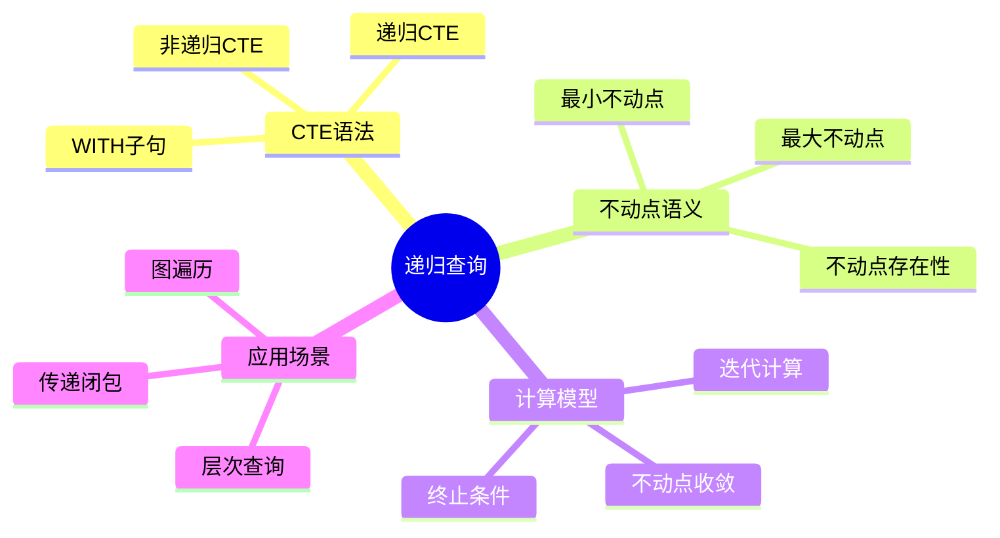
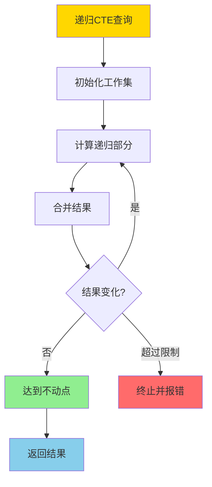
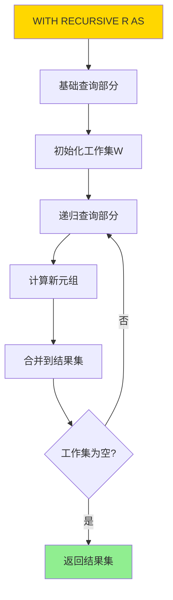
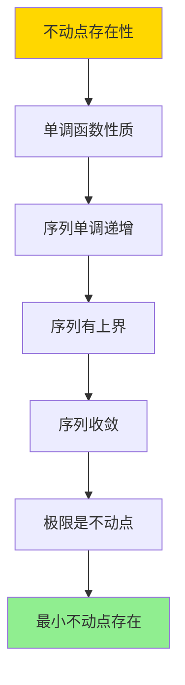

# CTE与递归查询-关系代数不动点语义

> **文档版本**: v1.0
> **最后更新**: 2025-01-16
> **版本覆盖**: PostgreSQL 18.x (推荐) ⭐ | 17.x (推荐) | 16.x (兼容)
> **文档状态**: 🟡 框架已创建，内容待完善

---

## 📋 目录

- [CTE与递归查询-关系代数不动点语义](#cte与递归查询-关系代数不动点语义)
  - [📋 目录](#-目录)
  - [1. 概述](#1-概述)
    - [1.0 CTE与递归查询工作原理概述](#10-cte与递归查询工作原理概述)
    - [1.1 本文档的范围](#11-本文档的范围)
  - [2. 核心内容](#2-核心内容)
    - [2.1 不动点语义](#21-不动点语义)
    - [2.2 CTE语法](#22-cte语法)
    - [2.3 终止性](#23-终止性)
  - [3. 形式化定义](#3-形式化定义)
    - [3.1 不动点形式化](#31-不动点形式化)
    - [3.2 递归查询形式化](#32-递归查询形式化)
    - [3.3 终止性形式化](#33-终止性形式化)
  - [4. 定理与证明](#4-定理与证明)
    - [4.1 不动点存在性定理](#41-不动点存在性定理)
    - [4.2 终止性定理](#42-终止性定理)
  - [5. 实际应用](#5-实际应用)
    - [5.1 PostgreSQL递归查询](#51-postgresql递归查询)
    - [5.2 传递闭包](#52-传递闭包)
    - [5.3 递归查询优化](#53-递归查询优化)
  - [6. 相关文档](#6-相关文档)
    - [6.1 理论基础文档](#61-理论基础文档)
  - [7. 参考文献](#7-参考文献)
    - [7.1 核心理论文献](#71-核心理论文献)
    - [7.2 递归查询相关](#72-递归查询相关)
    - [7.3 PostgreSQL实现相关](#73-postgresql实现相关)
    - [7.4 相关文档](#74-相关文档)

---

## 1. 概述

### 1.0 CTE与递归查询工作原理概述

**递归查询**：

递归查询通过不动点语义计算递归关系。CTE（Common Table Expression）提供递归查询的语法支持，通过迭代计算直到达到不动点。

**递归查询体系思维导图**：



**递归查询计算决策树**：



**递归查询类型对比矩阵**：

| 类型 | 语义 | 计算方式 | 终止性 |
|------|------|---------|--------|
| **线性递归** | 单递归引用 | 迭代 | 保证终止 |
| **非线性递归** | 多递归引用 | 迭代 | 可能不终止 |
| **互递归** | 相互递归 | 交替迭代 | 可能不终止 |

### 1.1 本文档的范围

本文档涵盖：

- **CTE语法**：WITH子句和递归CTE的语法
- **不动点语义**：最小不动点和最大不动点的定义
- **计算模型**：递归查询的迭代计算和收敛性
- **实际应用**：PostgreSQL递归查询的实现和应用

---

## 2. 核心内容

### 2.1 不动点语义

**最小不动点**：

```haskell
-- 递归关系
recursiveRelation :: Query -> Relation
recursiveRelation Q = lfp(λR. base(Q) ∪ recursive(Q, R))

-- 最小不动点
lfp :: (Relation -> Relation) -> Relation
lfp f = ∪_{i≥0} f^i(∅)

其中:
  f^0(∅) = ∅
  f^{i+1}(∅) = f(f^i(∅))
```

**不动点计算流程**：

```mermaid
graph TD
    A[递归查询Q] --> B[R₀ = ∅]
    B --> C[R₁ = base(Q)]
    C --> D[R₂ = base(Q) ∪ recursive(Q, R₁)]
    D --> E{Rᵢ = Rᵢ₋₁?}
    E -->|否| F[i = i + 1]
    F --> D
    E -->|是| G[不动点Rᵢ]
    G --> H[返回结果]

    style A fill:#FFD700
    style G fill:#90EE90
    style H fill:#87CEEB
```

### 2.2 CTE语法

**递归CTE结构**：

```haskell
-- 递归CTE
WITH RECURSIVE R AS (
    -- 基础查询
    SELECT ... FROM base_tables
    UNION ALL
    -- 递归查询
    SELECT ... FROM R, other_tables WHERE condition
)
SELECT * FROM R;
```

**CTE执行流程图**：



### 2.3 终止性

**终止条件**：

```haskell
-- 终止性判定
terminates :: Query -> Bool
terminates Q =
    exists n: f^n(∅) = f^{n+1}(∅)

-- 单调性保证终止
monotonic :: (Relation -> Relation) -> Bool
monotonic f =
    forall R1, R2: R1 ⊆ R2 ⟹ f(R1) ⊆ f(R2)
```

---

## 3. 形式化定义

### 3.1 不动点形式化

**最小不动点**：

```haskell
-- 最小不动点
lfp(f) = ∪_{i≥0} f^i(∅)

其中f是单调函数: Relation -> Relation
```

**最大不动点**：

```haskell
-- 最大不动点
gfp(f) = ∩_{i≥0} f^i(Universal)

其中Universal是所有可能元组的集合
```

### 3.2 递归查询形式化

**递归关系**：

```haskell
-- 递归关系
R = base ∪ recursive(R)

等价于:
R = lfp(λR'. base ∪ recursive(R'))
```

### 3.3 终止性形式化

**终止性**：

```haskell
-- 查询终止
terminates(Q) iff
    exists n: Q^n(∅) = Q^{n+1}(∅)
```

---

## 4. 定理与证明

### 4.1 不动点存在性定理

**定理**：单调函数的最小不动点存在。

**证明树**：



**证明**：

1. 设f是单调函数，序列R_i = f^i(∅)
2. 由于f单调，R_i ⊆ R_{i+1}，序列单调递增
3. 关系集合有上界（所有可能元组），序列有上界
4. 因此序列收敛到某个关系R*
5. R* = ∪_{i≥0} R_i是不动点，且是最小不动点

### 4.2 终止性定理

**定理**：如果递归查询是单调的，则保证终止。

**证明**：

1. 单调查询产生单调递增的序列
2. 关系集合有限或可数，序列有上界
3. 因此序列在有限步内收敛
4. 查询终止

---

## 5. 实际应用

### 5.1 PostgreSQL递归查询

**层次查询示例**：

```sql
-- 员工层次结构
CREATE TABLE employees (
    employee_id INTEGER PRIMARY KEY,
    employee_name VARCHAR(100),
    manager_id INTEGER REFERENCES employees(employee_id)
);

-- 递归查询：查找所有下属
WITH RECURSIVE subordinates AS (
    -- 基础查询：直接下属
    SELECT employee_id, employee_name, manager_id, 0 as level
    FROM employees
    WHERE manager_id = 1

    UNION ALL

    -- 递归查询：间接下属
    SELECT e.employee_id, e.employee_name, e.manager_id, s.level + 1
    FROM employees e
    JOIN subordinates s ON e.manager_id = s.employee_id
)
SELECT * FROM subordinates ORDER BY level;
```

### 5.2 传递闭包

**图传递闭包**：

```sql
-- 图边关系
CREATE TABLE edges (
    from_node INTEGER,
    to_node INTEGER
);

-- 递归查询：计算传递闭包
WITH RECURSIVE reachable AS (
    -- 基础查询：直接可达
    SELECT from_node, to_node, 1 as distance
    FROM edges

    UNION ALL

    -- 递归查询：间接可达
    SELECT r.from_node, e.to_node, r.distance + 1
    FROM reachable r
    JOIN edges e ON r.to_node = e.from_node
    WHERE r.distance < 10  -- 限制深度
)
SELECT DISTINCT from_node, to_node, MIN(distance) as min_distance
FROM reachable
GROUP BY from_node, to_node;
```

### 5.3 递归查询优化

**性能优化**：

```sql
-- 使用UNION而非UNION ALL（去重，但更慢）
WITH RECURSIVE ... UNION ...

-- 使用UNION ALL（不去重，但更快）
WITH RECURSIVE ... UNION ALL ...

-- 添加终止条件
WITH RECURSIVE ... WHERE condition AND depth < MAX_DEPTH

-- 使用索引加速递归部分
CREATE INDEX idx_manager ON employees(manager_id);
```

---

## 6. 相关文档

### 6.1 理论基础文档

- [Datalog与递归查询-不动点语义与可计算性](./08.05-Datalog与递归查询-不动点语义与可计算性.md)
- [理论基础导航](../README.md)

---

## 7. 参考文献

### 7.1 核心理论文献

- **Aho, A. V., & Ullman, J. D. (1979). "Universality of Data Retrieval Languages."**
  - 会议: POPL 1979
  - **重要性**: 递归查询的经典论文
  - **核心贡献**: 提出了不动点语义

- **Abiteboul, S., et al. (1995). "Foundations of Databases."**
  - 出版社: Addison-Wesley 1995
  - **重要性**: 数据库理论的经典教材
  - **核心贡献**: 详细阐述了不动点语义和递归查询

### 7.2 递归查询相关

- **Naughton, J. F. (1991). "Data Independent Recursion in Deductive Databases."**
  - 期刊: Journal of Computer and System Sciences 1991
  - **重要性**: 递归查询优化的经典研究
  - **核心贡献**: 提供了递归查询的优化方法

### 7.3 PostgreSQL实现相关

- **[PostgreSQL官方文档 - WITH查询](<https://www.postgresql.org/docs/current/queries-with.html>)**
  - PostgreSQL递归查询实现说明

### 7.4 相关文档

- [Datalog与递归查询-不动点语义与可计算性](./08.05-Datalog与递归查询-不动点语义与可计算性.md)
- [理论基础导航](../README.md)

---

**最后更新**: 2025-01-16
**维护者**: Documentation Team
**状态**: 🟡 框架已创建，内容待完善
