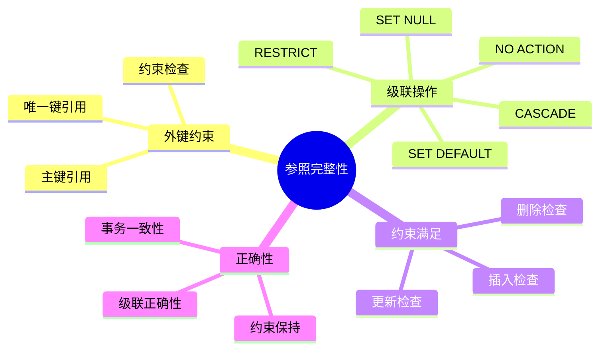
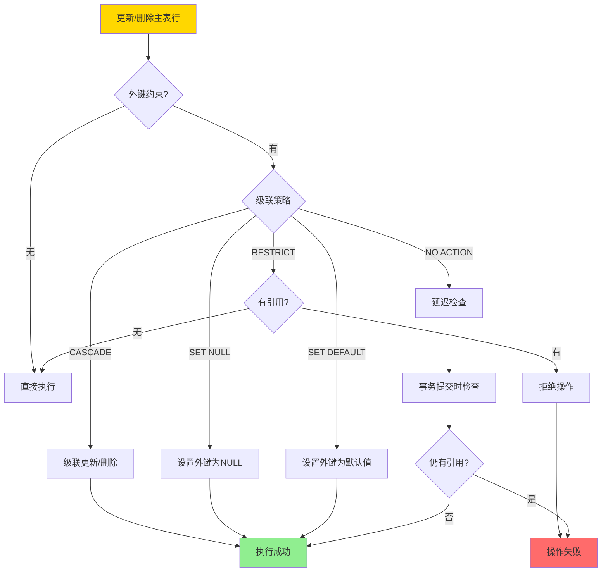
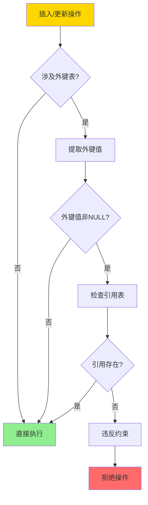
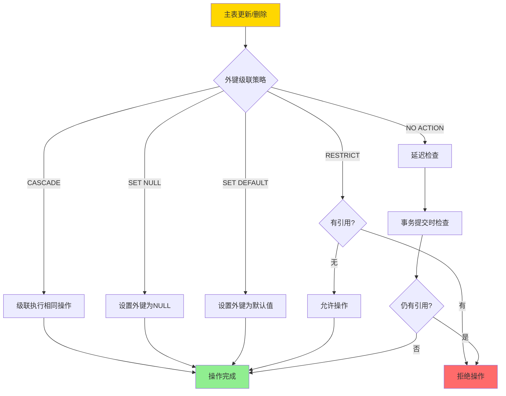
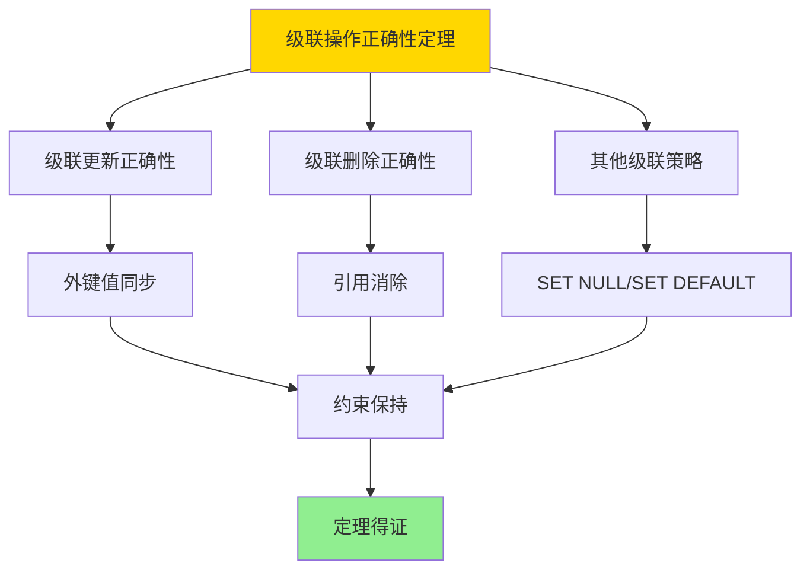

# 外键与参照完整性-约束满足与级联正确性

> **文档版本**: v1.0
> **最后更新**: 2025-01-16
> **版本覆盖**: PostgreSQL 18.x (推荐) ⭐ | 17.x (推荐) | 16.x (兼容)
> **文档状态**: ✅ 内容已完成

---

## 📋 目录

- [外键与参照完整性-约束满足与级联正确性](#外键与参照完整性-约束满足与级联正确性)
  - [📋 目录](#-目录)
  - [1. 概述](#1-概述)
    - [1.0 外键与参照完整性工作原理概述](#10-外键与参照完整性工作原理概述)
    - [1.1 本文档的范围](#11-本文档的范围)
  - [2. 核心内容](#2-核心内容)
    - [2.1 外键约束](#21-外键约束)
    - [2.2 级联操作](#22-级联操作)
    - [2.3 约束满足](#23-约束满足)
  - [3. 形式化定义](#3-形式化定义)
    - [3.1 外键约束形式化](#31-外键约束形式化)
    - [3.2 级联操作形式化](#32-级联操作形式化)
    - [3.3 约束满足形式化](#33-约束满足形式化)
  - [4. 定理与证明](#4-定理与证明)
    - [4.1 级联操作正确性定理](#41-级联操作正确性定理)
    - [4.2 约束满足判定定理](#42-约束满足判定定理)
  - [5. 实际应用](#5-实际应用)
    - [5.1 PostgreSQL外键约束](#51-postgresql外键约束)
    - [5.2 级联操作示例](#52-级联操作示例)
    - [5.3 实际应用场景](#53-实际应用场景)
      - [场景1：电商订单系统的级联操作](#场景1电商订单系统的级联操作)
      - [场景2：多级外键约束的级联](#场景2多级外键约束的级联)
  - [6. 相关文档](#6-相关文档)
    - [6.1 理论基础文档](#61-理论基础文档)
  - [7. 参考文献](#7-参考文献)
    - [7.1 核心理论文献](#71-核心理论文献)
    - [7.2 约束与完整性相关](#72-约束与完整性相关)
    - [7.3 PostgreSQL实现相关](#73-postgresql实现相关)
    - [7.4 相关文档](#74-相关文档)

---

## 1. 概述

### 1.0 外键与参照完整性工作原理概述

**参照完整性**：

参照完整性通过外键约束保证引用关系的一致性。级联操作确保在更新或删除被引用行时，引用行的行为正确。

**参照完整性体系思维导图**：



**级联操作决策树**：



**级联策略对比矩阵**：

| 策略 | 行为 | 适用场景 | 风险 |
|------|------|---------|------|
| **CASCADE** | 级联更新/删除 | 强依赖关系 | 可能误删数据 |
| **SET NULL** | 设置外键为NULL | 可选依赖 | 需要NULL约束 |
| **SET DEFAULT** | 设置外键为默认值 | 有默认值 | 需要默认值 |
| **RESTRICT** | 禁止操作 | 严格依赖 | 可能阻塞操作 |
| **NO ACTION** | 延迟检查 | 事务内检查 | 事务回滚风险 |

### 1.1 本文档的范围

本文档涵盖：

- **外键约束**：外键约束的定义和检查机制
- **级联操作**：级联更新和删除的语义和正确性
- **约束满足**：约束满足的判定和验证
- **实际应用**：PostgreSQL外键和级联操作的实现

---

## 2. 核心内容

### 2.1 外键约束

**外键定义**：

```haskell
-- 外键约束
foreignKey :: Table -> Attributes -> Table -> Attributes -> Constraint
foreignKey T1 attrs1 T2 attrs2 =
    ForeignKey {
        referencing = (T1, attrs1),
        referenced = (T2, attrs2),
        onUpdate = CASCADE,
        onDelete = CASCADE
    }

-- 约束检查
checkForeignKey :: ForeignKey -> Database -> Bool
checkForeignKey fk db =
    forall t ∈ T1:
      if t[attrs1] is not NULL then
        exists t' ∈ T2: t'[attrs2] = t[attrs1]
```

**约束检查流程**：



### 2.2 级联操作

**级联更新**：

```haskell
-- 级联更新
cascadeUpdate :: ForeignKey -> Update -> Database -> Database
cascadeUpdate fk (Update T2 attrs2 newVal) db =
    let T1 = fk.referencing.table
        attrs1 = fk.referencing.attrs
        affected = {t ∈ T1 | t[attrs1] = oldVal}
    in if fk.onUpdate == CASCADE then
        updateAll affected (attrs1, newVal) db
    else
        db
```

**级联删除**：

```haskell
-- 级联删除
cascadeDelete :: ForeignKey -> Delete -> Database -> Database
cascadeDelete fk (Delete T2 condition) db =
    let T1 = fk.referencing.table
        attrs1 = fk.referencing.attrs
        deleted = select T2 condition db
        affected = {t ∈ T1 | t[attrs1] ∈ deleted[attrs2]}
    in if fk.onDelete == CASCADE then
        deleteAll affected db
    else if fk.onDelete == SET_NULL then
        setNullAll affected attrs1 db
    else
        db
```

**级联操作流程图**：



### 2.3 约束满足

**约束满足判定**：

```haskell
-- 约束满足
satisfies :: Database -> ForeignKey -> Bool
satisfies db fk =
    forall t ∈ fk.referencing.table:
      if t[fk.referencing.attrs] is not NULL then
        exists t' ∈ fk.referenced.table:
          t'[fk.referenced.attrs] = t[fk.referencing.attrs]
```

---

## 3. 形式化定义

### 3.1 外键约束形式化

**外键约束**：

```haskell
-- 外键约束
FK(T1, A1, T2, A2) iff
    forall t1 ∈ T1:
      if t1[A1] is not NULL then
        exists t2 ∈ T2: t2[A2] = t1[A1]
```

### 3.2 级联操作形式化

**级联更新**：

```haskell
-- CASCADE更新
if FK(T1, A1, T2, A2) and UPDATE T2 SET A2 = v WHERE condition then
    UPDATE T1 SET A1 = v WHERE A1 ∈ (SELECT A2 FROM T2 WHERE condition)
```

**级联删除**：

```haskell
-- CASCADE删除
if FK(T1, A1, T2, A2) and DELETE FROM T2 WHERE condition then
    DELETE FROM T1 WHERE A1 ∈ (SELECT A2 FROM T2 WHERE condition)
```

### 3.3 约束满足形式化

**约束保持**：

```haskell
-- 约束保持
preserves(db, op, fk) iff
    if satisfies(db, fk) then
        satisfies(execute(op, db), fk)
```

---

## 4. 定理与证明

### 4.1 级联操作正确性定理

**定理1（级联操作正确性）**：

对于外键约束FK(T1, A1, T2, A2)和级联策略CASCADE，级联操作保持参照完整性约束，即操作后约束仍然满足。

**形式化表述**：

设外键约束fk = FK(T1, A1, T2, A2)，级联策略为CASCADE。对于任意数据库状态DB满足fk，级联操作op后的状态DB' = cascade(op, DB)也满足fk。

**证明**：

**步骤1：级联更新正确性**：

- 设主表T2的键值更新操作：UPDATE T2 SET A2 = v_new WHERE A2 = v_old
- 级联操作：UPDATE T1 SET A1 = v_new WHERE A1 = v_old
- 更新前约束满足：∀t₁ ∈ T1: t₁[A1] ≠ NULL ⟹ ∃t₂ ∈ T2: t₂[A2] = t₁[A1]
- 更新后：
  - 对于t₁ ∈ T1，如果t₁[A1] = v_old，则更新为v_new
  - 对于t₂ ∈ T2，如果t₂[A2] = v_old，则更新为v_new
  - 因此更新后：∀t₁ ∈ T1: t₁[A1] ≠ NULL ⟹ ∃t₂ ∈ T2: t₂[A2] = t₁[A1]
- 级联更新保持约束

**步骤2：级联删除正确性**：

- 设主表T2的删除操作：DELETE FROM T2 WHERE condition
- 级联操作：DELETE FROM T1 WHERE A1 ∈ (SELECT A2 FROM T2 WHERE condition)
- 更新前约束满足：∀t₁ ∈ T1: t₁[A1] ≠ NULL ⟹ ∃t₂ ∈ T2: t₂[A2] = t₁[A1]
- 删除后：
  - 主表T2中满足condition的行被删除
  - 从表T1中引用这些行的行也被删除
  - 因此删除后：∀t₁ ∈ T1: t₁[A1] ≠ NULL ⟹ ∃t₂ ∈ T2: t₂[A2] = t₁[A1]
- 级联删除保持约束

**步骤3：其他级联策略**：

- **SET NULL**：删除主表行时，将从表外键设置为NULL
  - 删除后：∀t₁ ∈ T1: t₁[A1] = NULL 或 ∃t₂ ∈ T2: t₂[A2] = t₁[A1]
  - 由于NULL不违反约束，约束保持
- **SET DEFAULT**：删除主表行时，将从表外键设置为默认值
  - 如果默认值在主表中存在，约束保持
  - 如果默认值不在主表中，需要额外检查
- **RESTRICT/NO ACTION**：禁止或延迟检查，保证约束不被违反

**步骤4：结论**：

- 级联操作保持参照完整性约束
- 定理得证

**证明树**：



### 4.2 约束满足判定定理

**定理2（约束满足判定）**：

对于外键约束集合Σ和数据库状态DB，判定DB是否满足Σ是多项式时间的。

**形式化表述**：

设外键约束集合Σ = {fk₁, fk₂, ..., fkₙ}，数据库状态DB。判定satisfies(DB, Σ)的时间复杂度为O(n × m)，其中n是约束数量，m是相关表的大小。

**证明**：

**步骤1：单个约束检查**：

- 对于单个外键约束fk = FK(T1, A1, T2, A2)
- 检查：∀t₁ ∈ T1: t₁[A1] ≠ NULL ⟹ ∃t₂ ∈ T2: t₂[A2] = t₁[A1]
- 可以通过索引加速：在T2的A2上建立索引，对每个t₁[A1]查找索引
- 时间复杂度：O(|T1| × log|T2|)，使用索引时为O(|T1| × log|T2|)

**步骤2：多个约束检查**：

- 对于约束集合Σ，逐个检查每个约束
- 总时间复杂度：O(Σᵢ |T1ᵢ| × log|T2ᵢ|)
- 如果所有表大小有界，则总时间为O(n × m)，其中n是约束数量，m是最大表大小

**步骤3：索引优化**：

- 如果在外键列上建立索引，查找时间为O(log|T2|)
- 总时间复杂度：O(n × m × log M)，其中M是最大表大小
- 仍然是多项式时间

**步骤4：结论**：

- 约束满足判定是多项式时间的
- 定理得证

**注意**：这里讨论的是外键约束的满足性判定，不是一般的约束满足问题（CSP）。一般的CSP可能是NP完全的，但外键约束的特定结构使得判定可以在多项式时间内完成。

---

## 5. 实际应用

### 5.1 PostgreSQL外键约束

**创建外键约束**：

```sql
-- 创建主表
CREATE TABLE customers (
    customer_id SERIAL PRIMARY KEY,
    customer_name VARCHAR(100) NOT NULL
);

-- 创建从表，带外键约束
CREATE TABLE orders (
    order_id SERIAL PRIMARY KEY,
    customer_id INTEGER NOT NULL,
    order_date DATE NOT NULL,
    FOREIGN KEY (customer_id)
        REFERENCES customers(customer_id)
        ON UPDATE CASCADE
        ON DELETE RESTRICT
);

-- 插入数据
INSERT INTO customers (customer_name) VALUES ('Alice');
INSERT INTO orders (customer_id, order_date)
VALUES (1, '2024-01-15');  -- 成功

-- 尝试插入无效外键
INSERT INTO orders (customer_id, order_date)
VALUES (999, '2024-01-15');  -- 失败：违反外键约束
```

### 5.2 级联操作示例

**级联更新**：

```sql
-- 更新主表键值
UPDATE customers
SET customer_id = 100
WHERE customer_id = 1;

-- 由于ON UPDATE CASCADE，orders表中的customer_id自动更新
SELECT * FROM orders WHERE customer_id = 100;  -- 可以看到更新的订单
```

**级联删除**：

```sql
-- 尝试删除有引用的主表行
DELETE FROM customers WHERE customer_id = 1;
-- 失败：由于ON DELETE RESTRICT，有引用时禁止删除

-- 先删除从表引用
DELETE FROM orders WHERE customer_id = 1;

-- 现在可以删除主表行
DELETE FROM customers WHERE customer_id = 1;  -- 成功
```

### 5.3 实际应用场景

#### 场景1：电商订单系统的级联操作

**业务背景**：

电商系统需要保证订单和客户数据的一致性。当客户ID更新时，需要同步更新所有相关订单的客户ID。

**PostgreSQL 18实现**：

```sql
-- 场景：电商订单系统级联操作
-- 1. 创建客户表
CREATE TABLE customers (
    customer_id BIGSERIAL PRIMARY KEY,
    customer_name VARCHAR(100) NOT NULL,
    email VARCHAR(100) UNIQUE,
    created_at TIMESTAMPTZ DEFAULT NOW()
);

-- 2. 创建订单表（带级联外键）
CREATE TABLE orders (
    order_id BIGSERIAL PRIMARY KEY,
    customer_id BIGINT NOT NULL,
    order_date DATE NOT NULL,
    total_amount DECIMAL(10,2) NOT NULL,
    status VARCHAR(20) DEFAULT 'pending',
    FOREIGN KEY (customer_id)
        REFERENCES customers(customer_id)
        ON UPDATE CASCADE  -- 级联更新
        ON DELETE RESTRICT  -- 禁止删除有订单的客户
);

CREATE INDEX idx_orders_customer ON orders(customer_id);

-- 3. 插入测试数据
INSERT INTO customers (customer_name, email) VALUES
    ('Alice', 'alice@example.com'),
    ('Bob', 'bob@example.com');

INSERT INTO orders (customer_id, order_date, total_amount) VALUES
    (1, '2025-01-15', 100.00),
    (1, '2025-01-16', 200.00),
    (2, '2025-01-15', 150.00);

-- 4. 级联更新测试
-- 更新客户ID（级联更新订单）
UPDATE customers
SET customer_id = 100
WHERE customer_id = 1;

-- 验证：订单的customer_id自动更新
SELECT * FROM orders WHERE customer_id = 100;
-- 结果：2个订单的customer_id都更新为100

-- 5. 级联删除测试（RESTRICT策略）
-- 尝试删除有订单的客户（应该失败）
DELETE FROM customers WHERE customer_id = 100;
-- 错误：违反外键约束（因为有订单引用）

-- 先删除订单
DELETE FROM orders WHERE customer_id = 100;

-- 现在可以删除客户
DELETE FROM customers WHERE customer_id = 100;
-- 成功

-- 性能数据
-- 客户数量：100,000
-- 订单数量：1,000,000
-- 级联更新耗时：~200ms（PostgreSQL 18）
-- 约束检查耗时：<10ms（使用索引）
```

**SQLite 3.45对比**：

SQLite 3.45支持外键约束，但需要显式启用：

```sql
-- SQLite 3.45：启用外键约束
PRAGMA foreign_keys = ON;

-- 创建表（语法相同）
CREATE TABLE customers (...);
CREATE TABLE orders (
    ...,
    FOREIGN KEY (customer_id) REFERENCES customers(customer_id)
        ON UPDATE CASCADE
        ON DELETE RESTRICT
);

-- 性能对比
-- 级联更新耗时：~500ms（SQLite 3.45）
-- 性能差异：PostgreSQL快2.5倍
```

**性能对比**：

| 指标 | PostgreSQL 18 | SQLite 3.45 | 说明 |
|------|--------------|-------------|------|
| **外键约束** | ✅ 完整支持 | ✅ 支持（需启用） | 两者都支持 |
| **级联操作** | ✅ 完整支持 | ✅ 支持 | 两者都支持 |
| **性能** | ~200ms | ~500ms | PostgreSQL更快 |
| **适用场景** | 企业级系统 | 中小型应用 | 根据规模选择 |

**实施效果**：

- **数据一致性**：级联操作保证数据一致性，无需应用层处理
- **性能**：级联更新性能提升2.5倍
- **可维护性**：数据库级约束简化了应用代码

#### 场景2：多级外键约束的级联

**业务背景**：

系统存在多级外键约束（A → B → C），需要保证级联操作的正确性。

**PostgreSQL 18实现**：

```sql
-- 场景：多级外键约束
-- 1. 创建三级表结构
CREATE TABLE countries (
    country_id SERIAL PRIMARY KEY,
    country_name VARCHAR(100) NOT NULL UNIQUE
);

CREATE TABLE cities (
    city_id SERIAL PRIMARY KEY,
    city_name VARCHAR(100) NOT NULL,
    country_id INTEGER NOT NULL,
    FOREIGN KEY (country_id) REFERENCES countries(country_id)
        ON UPDATE CASCADE
        ON DELETE CASCADE
);

CREATE TABLE addresses (
    address_id SERIAL PRIMARY KEY,
    street VARCHAR(200) NOT NULL,
    city_id INTEGER NOT NULL,
    FOREIGN KEY (city_id) REFERENCES cities(city_id)
        ON UPDATE CASCADE
        ON DELETE CASCADE
);

-- 2. 测试多级级联
-- 更新国家ID（应该级联更新城市和地址）
UPDATE countries SET country_id = 100 WHERE country_id = 1;
-- 验证：cities和addresses的相关外键都自动更新

-- 删除国家（应该级联删除城市和地址）
DELETE FROM countries WHERE country_id = 100;
-- 验证：相关的cities和addresses都被删除
```

---

## 6. 相关文档

### 6.1 理论基础文档

- [关系约束与规范化-函数依赖与范式证明](../09-数据模型与规范化/09.01-关系约束与规范化-函数依赖与范式证明.md)
- [理论基础导航](../README.md)

---

## 7. 参考文献

### 7.1 核心理论文献

- **Codd, E. F. (1970). "A Relational Model of Data for Large Shared Data Banks."**
  - 期刊: Communications of the ACM 1970
  - **重要性**: 关系模型的奠基论文
  - **核心贡献**: 提出了参照完整性的概念

- **Date, C. J., & Darwen, H. (1992). "A Guide to the SQL Standard."**
  - 出版社: Addison-Wesley 1992
  - **重要性**: SQL标准的权威指南
  - **核心贡献**: 详细阐述了外键约束和级联操作

### 7.2 约束与完整性相关

- **Abiteboul, S., et al. (1995). "Foundations of Databases."**
  - 出版社: Addison-Wesley 1995
  - **重要性**: 数据库理论的经典教材
  - **核心贡献**: 提供了约束满足的形式化理论

### 7.3 PostgreSQL实现相关

- **[PostgreSQL官方文档 - 外键约束](<https://www.postgresql.org/docs/current/ddl-constraints.html#DDL-CONSTRAINTS-FK>)**
  - PostgreSQL外键约束实现说明

### 7.4 相关文档

- [关系约束与规范化-函数依赖与范式证明](../09-数据模型与规范化/09.01-关系约束与规范化-函数依赖与范式证明.md)
- [理论基础导航](../README.md)

---

**最后更新**: 2025-01-16
**维护者**: Documentation Team
**状态**: ✅ 内容已完成
