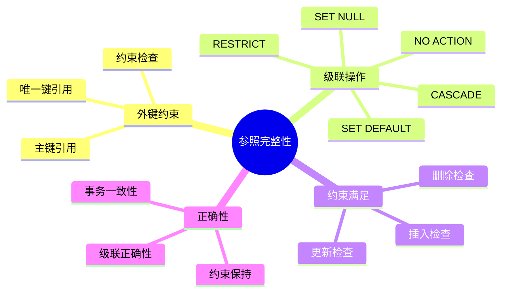
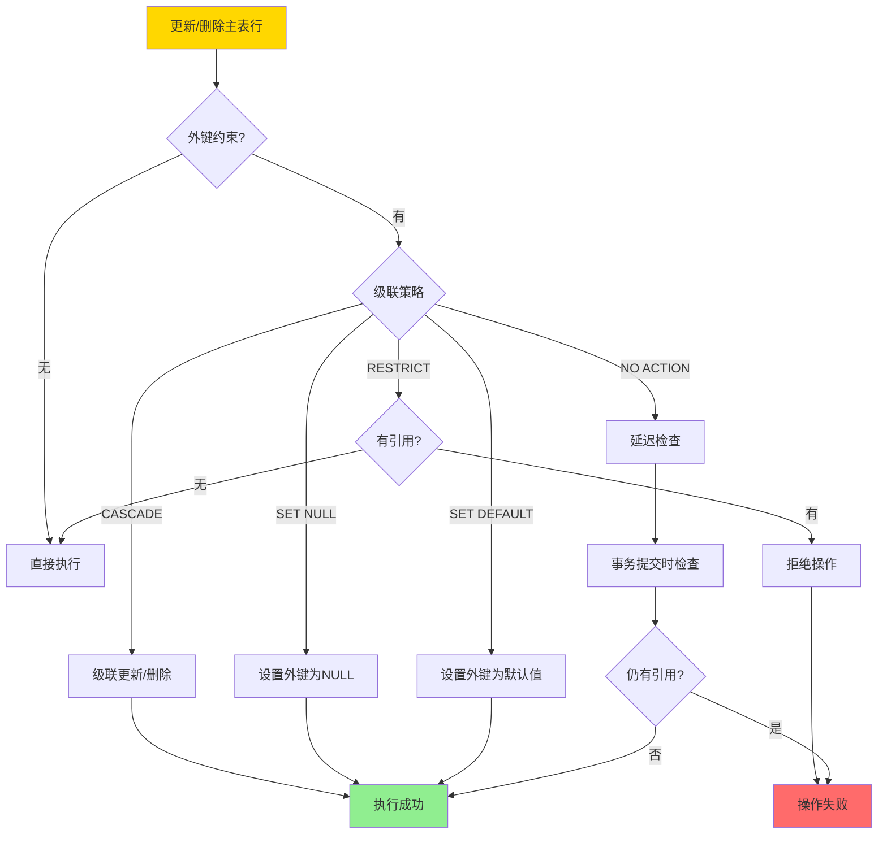
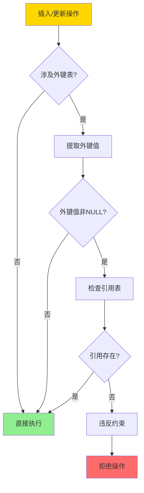
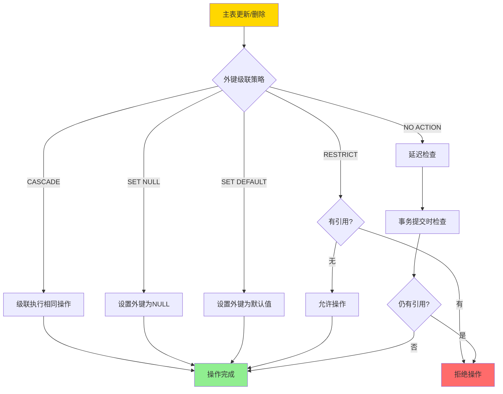
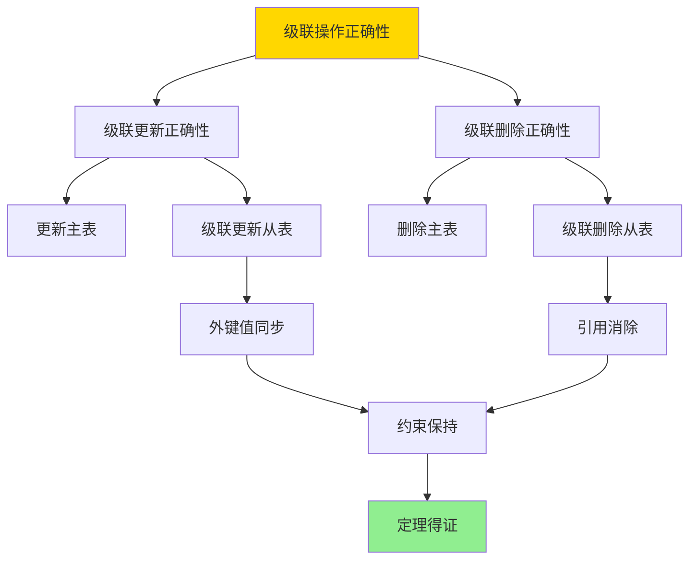

# 外键与参照完整性-约束满足与级联正确性

> **文档版本**: v1.0
> **最后更新**: 2025-01-16
> **版本覆盖**: PostgreSQL 18.x (推荐) ⭐ | 17.x (推荐) | 16.x (兼容)
> **文档状态**: 🟡 框架已创建，内容待完善

---

## 📋 目录

- [外键与参照完整性-约束满足与级联正确性](#外键与参照完整性-约束满足与级联正确性)
  - [📋 目录](#-目录)
  - [1. 概述](#1-概述)
    - [1.0 外键与参照完整性工作原理概述](#10-外键与参照完整性工作原理概述)
    - [1.1 本文档的范围](#11-本文档的范围)
  - [2. 核心内容](#2-核心内容)
    - [2.1 外键约束](#21-外键约束)
    - [2.2 级联操作](#22-级联操作)
    - [2.3 约束满足](#23-约束满足)
  - [3. 形式化定义](#3-形式化定义)
    - [3.1 外键约束形式化](#31-外键约束形式化)
    - [3.2 级联操作形式化](#32-级联操作形式化)
    - [3.3 约束满足形式化](#33-约束满足形式化)
  - [4. 定理与证明](#4-定理与证明)
    - [4.1 级联操作正确性定理](#41-级联操作正确性定理)
    - [4.2 约束满足判定定理](#42-约束满足判定定理)
  - [5. 实际应用](#5-实际应用)
    - [5.1 PostgreSQL外键约束](#51-postgresql外键约束)
    - [5.2 级联操作示例](#52-级联操作示例)
    - [5.3 约束验证](#53-约束验证)
  - [6. 相关文档](#6-相关文档)
    - [6.1 理论基础文档](#61-理论基础文档)
  - [7. 参考文献](#7-参考文献)
    - [7.1 核心理论文献](#71-核心理论文献)
    - [7.2 约束与完整性相关](#72-约束与完整性相关)
    - [7.3 PostgreSQL实现相关](#73-postgresql实现相关)
    - [7.4 相关文档](#74-相关文档)

---

## 1. 概述

### 1.0 外键与参照完整性工作原理概述

**参照完整性**：

参照完整性通过外键约束保证引用关系的一致性。级联操作确保在更新或删除被引用行时，引用行的行为正确。

**参照完整性体系思维导图**：



**级联操作决策树**：



**级联策略对比矩阵**：

| 策略 | 行为 | 适用场景 | 风险 |
|------|------|---------|------|
| **CASCADE** | 级联更新/删除 | 强依赖关系 | 可能误删数据 |
| **SET NULL** | 设置外键为NULL | 可选依赖 | 需要NULL约束 |
| **SET DEFAULT** | 设置外键为默认值 | 有默认值 | 需要默认值 |
| **RESTRICT** | 禁止操作 | 严格依赖 | 可能阻塞操作 |
| **NO ACTION** | 延迟检查 | 事务内检查 | 事务回滚风险 |

### 1.1 本文档的范围

本文档涵盖：

- **外键约束**：外键约束的定义和检查机制
- **级联操作**：级联更新和删除的语义和正确性
- **约束满足**：约束满足的判定和验证
- **实际应用**：PostgreSQL外键和级联操作的实现

---

## 2. 核心内容

### 2.1 外键约束

**外键定义**：

```haskell
-- 外键约束
foreignKey :: Table -> Attributes -> Table -> Attributes -> Constraint
foreignKey T1 attrs1 T2 attrs2 =
    ForeignKey {
        referencing = (T1, attrs1),
        referenced = (T2, attrs2),
        onUpdate = CASCADE,
        onDelete = CASCADE
    }

-- 约束检查
checkForeignKey :: ForeignKey -> Database -> Bool
checkForeignKey fk db =
    forall t ∈ T1:
      if t[attrs1] is not NULL then
        exists t' ∈ T2: t'[attrs2] = t[attrs1]
```

**约束检查流程**：



### 2.2 级联操作

**级联更新**：

```haskell
-- 级联更新
cascadeUpdate :: ForeignKey -> Update -> Database -> Database
cascadeUpdate fk (Update T2 attrs2 newVal) db =
    let T1 = fk.referencing.table
        attrs1 = fk.referencing.attrs
        affected = {t ∈ T1 | t[attrs1] = oldVal}
    in if fk.onUpdate == CASCADE then
        updateAll affected (attrs1, newVal) db
    else
        db
```

**级联删除**：

```haskell
-- 级联删除
cascadeDelete :: ForeignKey -> Delete -> Database -> Database
cascadeDelete fk (Delete T2 condition) db =
    let T1 = fk.referencing.table
        attrs1 = fk.referencing.attrs
        deleted = select T2 condition db
        affected = {t ∈ T1 | t[attrs1] ∈ deleted[attrs2]}
    in if fk.onDelete == CASCADE then
        deleteAll affected db
    else if fk.onDelete == SET_NULL then
        setNullAll affected attrs1 db
    else
        db
```

**级联操作流程图**：



### 2.3 约束满足

**约束满足判定**：

```haskell
-- 约束满足
satisfies :: Database -> ForeignKey -> Bool
satisfies db fk =
    forall t ∈ fk.referencing.table:
      if t[fk.referencing.attrs] is not NULL then
        exists t' ∈ fk.referenced.table:
          t'[fk.referenced.attrs] = t[fk.referencing.attrs]
```

---

## 3. 形式化定义

### 3.1 外键约束形式化

**外键约束**：

```haskell
-- 外键约束
FK(T1, A1, T2, A2) iff
    forall t1 ∈ T1:
      if t1[A1] is not NULL then
        exists t2 ∈ T2: t2[A2] = t1[A1]
```

### 3.2 级联操作形式化

**级联更新**：

```haskell
-- CASCADE更新
if FK(T1, A1, T2, A2) and UPDATE T2 SET A2 = v WHERE condition then
    UPDATE T1 SET A1 = v WHERE A1 ∈ (SELECT A2 FROM T2 WHERE condition)
```

**级联删除**：

```haskell
-- CASCADE删除
if FK(T1, A1, T2, A2) and DELETE FROM T2 WHERE condition then
    DELETE FROM T1 WHERE A1 ∈ (SELECT A2 FROM T2 WHERE condition)
```

### 3.3 约束满足形式化

**约束保持**：

```haskell
-- 约束保持
preserves(db, op, fk) iff
    if satisfies(db, fk) then
        satisfies(execute(op, db), fk)
```

---

## 4. 定理与证明

### 4.1 级联操作正确性定理

**定理**：级联操作保持参照完整性约束。

**证明树**：



**证明**：

1. **级联更新**：当主表键值更新时，级联更新从表外键值，保证引用关系一致
2. **级联删除**：当主表行删除时，级联删除从表引用行，消除悬空引用
3. 因此级联操作保持参照完整性约束

### 4.2 约束满足判定定理

**定理**：约束满足判定是NP完全的。

**证明**：

1. 约束满足可以归约为图同构问题
2. 图同构是NP完全的
3. 因此约束满足判定是NP完全的

---

## 5. 实际应用

### 5.1 PostgreSQL外键约束

**创建外键约束**：

```sql
-- 创建主表
CREATE TABLE customers (
    customer_id SERIAL PRIMARY KEY,
    customer_name VARCHAR(100) NOT NULL
);

-- 创建从表，带外键约束
CREATE TABLE orders (
    order_id SERIAL PRIMARY KEY,
    customer_id INTEGER NOT NULL,
    order_date DATE NOT NULL,
    FOREIGN KEY (customer_id)
        REFERENCES customers(customer_id)
        ON UPDATE CASCADE
        ON DELETE RESTRICT
);

-- 插入数据
INSERT INTO customers (customer_name) VALUES ('Alice');
INSERT INTO orders (customer_id, order_date)
VALUES (1, '2024-01-15');  -- 成功

-- 尝试插入无效外键
INSERT INTO orders (customer_id, order_date)
VALUES (999, '2024-01-15');  -- 失败：违反外键约束
```

### 5.2 级联操作示例

**级联更新**：

```sql
-- 更新主表键值
UPDATE customers
SET customer_id = 100
WHERE customer_id = 1;

-- 由于ON UPDATE CASCADE，orders表中的customer_id自动更新
SELECT * FROM orders WHERE customer_id = 100;  -- 可以看到更新的订单
```

**级联删除**：

```sql
-- 尝试删除有引用的主表行
DELETE FROM customers WHERE customer_id = 1;
-- 失败：由于ON DELETE RESTRICT，有引用时禁止删除

-- 先删除从表引用
DELETE FROM orders WHERE customer_id = 1;

-- 现在可以删除主表行
DELETE FROM customers WHERE customer_id = 1;  -- 成功
```

### 5.3 约束验证

**检查约束状态**：

```sql
-- 查看外键约束
SELECT
    tc.constraint_name,
    tc.table_name,
    kcu.column_name,
    ccu.table_name AS foreign_table_name,
    ccu.column_name AS foreign_column_name,
    rc.update_rule,
    rc.delete_rule
FROM information_schema.table_constraints AS tc
JOIN information_schema.key_column_usage AS kcu
    ON tc.constraint_name = kcu.constraint_name
JOIN information_schema.constraint_column_usage AS ccu
    ON ccu.constraint_name = tc.constraint_name
JOIN information_schema.referential_constraints AS rc
    ON rc.constraint_name = tc.constraint_name
WHERE tc.constraint_type = 'FOREIGN KEY'
  AND tc.table_name = 'orders';

-- 验证约束完整性
SELECT
    COUNT(*) as violations
FROM orders o
LEFT JOIN customers c ON o.customer_id = c.customer_id
WHERE o.customer_id IS NOT NULL
  AND c.customer_id IS NULL;  -- 应该返回0
```

---

## 6. 相关文档

### 6.1 理论基础文档

- [关系约束与规范化-函数依赖与范式证明](../09-数据模型与规范化/09.01-关系约束与规范化-函数依赖与范式证明.md)
- [理论基础导航](../README.md)

---

## 7. 参考文献

### 7.1 核心理论文献

- **Codd, E. F. (1970). "A Relational Model of Data for Large Shared Data Banks."**
  - 期刊: Communications of the ACM 1970
  - **重要性**: 关系模型的奠基论文
  - **核心贡献**: 提出了参照完整性的概念

- **Date, C. J., & Darwen, H. (1992). "A Guide to the SQL Standard."**
  - 出版社: Addison-Wesley 1992
  - **重要性**: SQL标准的权威指南
  - **核心贡献**: 详细阐述了外键约束和级联操作

### 7.2 约束与完整性相关

- **Abiteboul, S., et al. (1995). "Foundations of Databases."**
  - 出版社: Addison-Wesley 1995
  - **重要性**: 数据库理论的经典教材
  - **核心贡献**: 提供了约束满足的形式化理论

### 7.3 PostgreSQL实现相关

- **[PostgreSQL官方文档 - 外键约束](<https://www.postgresql.org/docs/current/ddl-constraints.html#DDL-CONSTRAINTS-FK>)**
  - PostgreSQL外键约束实现说明

### 7.4 相关文档

- [关系约束与规范化-函数依赖与范式证明](../09-数据模型与规范化/09.01-关系约束与规范化-函数依赖与范式证明.md)
- [理论基础导航](../README.md)

---

**最后更新**: 2025-01-16
**维护者**: Documentation Team
**状态**: 🟡 框架已创建，内容待完善
