# 窗口聚合语义-稳定性与等价变换

> **文档版本**: v1.0
> **最后更新**: 2025-01-16
> **版本覆盖**: PostgreSQL 18.x (推荐) ⭐ | 17.x (推荐) | 16.x (兼容)
> **文档状态**: 🟡 框架已创建，内容待完善

---

## 📋 目录

- [窗口聚合语义-稳定性与等价变换](#窗口聚合语义-稳定性与等价变换)
  - [📋 目录](#-目录)
  - [1. 概述](#1-概述)
    - [1.0 窗口聚合语义工作原理概述](#10-窗口聚合语义工作原理概述)
    - [1.1 本文档的范围](#11-本文档的范围)
  - [2. 核心内容](#2-核心内容)
    - [2.1 窗口语义](#21-窗口语义)
    - [2.2 稳定性](#22-稳定性)
    - [2.3 等价变换](#23-等价变换)
  - [3. 形式化定义](#3-形式化定义)
    - [3.1 窗口语义形式化](#31-窗口语义形式化)
    - [3.2 稳定性形式化](#32-稳定性形式化)
    - [3.3 等价变换形式化](#33-等价变换形式化)
  - [4. 定理与证明](#4-定理与证明)
    - [4.1 窗口函数稳定性定理](#41-窗口函数稳定性定理)
    - [4.2 等价变换定理](#42-等价变换定理)
  - [5. 实际应用](#5-实际应用)
    - [5.1 PostgreSQL窗口函数](#51-postgresql窗口函数)
    - [5.2 窗口框架](#52-窗口框架)
    - [5.3 窗口函数优化](#53-窗口函数优化)
  - [6. 相关文档](#6-相关文档)
    - [6.1 理论基础文档](#61-理论基础文档)
  - [7. 参考文献](#7-参考文献)
    - [7.1 核心理论文献](#71-核心理论文献)
    - [7.2 窗口函数相关](#72-窗口函数相关)
    - [7.3 PostgreSQL实现相关](#73-postgresql实现相关)
    - [7.4 相关文档](#74-相关文档)

---

## 1. 概述

### 1.0 窗口聚合语义工作原理概述

**窗口函数**：

窗口函数在查询结果的窗口（分区）上计算聚合值，而不改变结果集的行数。窗口聚合的语义稳定性保证在等价变换下结果一致。

**窗口函数体系思维导图**：

```mermaid
mindmap
  root((窗口函数))
    窗口定义
      分区PARTITION BY
      排序ORDER BY
      窗口框架
    窗口框架
      ROWS
      RANGE
      GROUPS
    聚合函数
      排名函数
      聚合函数
      值函数
    语义稳定性
      等价变换
      结果一致性
      优化安全性
```



**窗口函数计算决策树**：

```mermaid
flowchart TD
    A[窗口函数查询] --> B[分区数据]
    B --> C[对每个分区]
    C --> D[排序数据]
    D --> E[定义窗口框架]
    E --> F[计算窗口函数]
    F --> G{所有分区处理完?}
    G -->|否| C
    G -->|是| H[合并结果]
    H --> I[返回结果集]

    style A fill:#FFD700
    style I fill:#90EE90
```



**窗口框架类型对比矩阵**：

| 类型 | 语义 | 性能 | 适用场景 |
|------|------|------|---------|
| **ROWS** | 物理行数 | 高 | 固定行数窗口 |
| **RANGE** | 逻辑值范围 | 中 | 值范围窗口 |
| **GROUPS** | 组数 | 中 | 分组窗口 |

### 1.1 本文档的范围

本文档涵盖：

- **窗口语义**：窗口函数的定义和计算语义
- **稳定性**：窗口聚合在等价变换下的稳定性
- **等价变换**：窗口查询的等价变换规则
- **实际应用**：PostgreSQL窗口函数的实现和应用

---

## 2. 核心内容

### 2.1 窗口语义

**窗口函数定义**：

```haskell
-- 窗口函数
windowFunction :: Aggregation -> Window -> Relation -> Relation
windowFunction agg window r =
    map (λt. t ∪ {agg_name: agg(window(t, r))}) r

-- 窗口定义
window :: Tuple -> Relation -> Relation
window t r =
    filter (λt'. inWindow(t', t, windowDef)) r

-- 窗口框架
inWindow :: Tuple -> Tuple -> WindowFrame -> Bool
inWindow t' t (ROWS n PRECEDING) =
    rowNumber(t') >= rowNumber(t) - n
inWindow t' t (RANGE value PRECEDING) =
    t'.value >= t.value - value
```

**窗口计算流程**：

```mermaid
graph TD
    A[查询结果集] --> B[按PARTITION BY分区]
    B --> C[对每个分区]
    C --> D[按ORDER BY排序]
    D --> E[对每行定义窗口]
    E --> F[计算窗口函数值]
    F --> G{所有行处理完?}
    G -->|否| E
    G -->|是| H{所有分区处理完?}
    H -->|否| C
    H -->|是| I[返回结果]

    style A fill:#FFD700
    style I fill:#90EE90
```



### 2.2 稳定性

**稳定性定义**：

```haskell
-- 窗口函数稳定性
stable :: Query -> Query -> Bool
stable Q1 Q2 =
    if Q1 ≡ Q2 then
        forall DB: windowResult(Q1, DB) = windowResult(Q2, DB)
    else
        False
```

**稳定性判定矩阵**：

| 变换类型 | 是否稳定 | 条件 |
|---------|---------|------|
| **选择下推** | 是 | 选择条件不涉及窗口函数 |
| **投影下推** | 是 | 投影包含窗口函数 |
| **连接交换** | 否 | 窗口函数依赖连接顺序 |
| **排序交换** | 否 | 窗口函数依赖排序 |

### 2.3 等价变换

**等价变换规则**：

```haskell
-- 窗口函数等价变换
-- 规则1: 分区不变性
window(agg, partition, r) = window(agg, partition, filter(cond, r))
  if cond does not affect partition

-- 规则2: 排序不变性
window(agg, partition, order, r) =
    window(agg, partition, order', r)
  if order and order' are equivalent for window
```

---

## 3. 形式化定义

### 3.1 窗口语义形式化

**窗口函数**：

```haskell
-- 窗口函数
WINDOW agg OVER (PARTITION BY p ORDER BY o ROWS BETWEEN n1 AND n2)

语义:
  for each tuple t:
    window(t) = {t' | t' in partition(t.p) and
                     row_number(t') between row_number(t) + n1 and row_number(t) + n2}
    result(t) = agg(window(t))
```

### 3.2 稳定性形式化

**稳定性**：

```haskell
-- 窗口函数稳定性
stable(Q) iff
    forall Q' such that Q ≡ Q':
        windowResult(Q) = windowResult(Q')
```

### 3.3 等价变换形式化

**等价变换**：

```haskell
-- 窗口查询等价
Q1 ≡_window Q2 iff
    forall DB: windowResult(Q1, DB) = windowResult(Q2, DB)
```

---

## 4. 定理与证明

### 4.1 窗口函数稳定性定理

**定理**：窗口函数在等价查询变换下保持稳定。

**证明树**：

```mermaid
graph TD
    A[窗口函数稳定性] --> B[分区不变性]
    A --> C[排序不变性]
    A --> D[框架不变性]
    B --> E[等价变换保持分区]
    C --> F[等价变换保持排序]
    D --> G[等价变换保持框架]
    E --> H[窗口结果一致]
    F --> H
    G --> H
    H --> I[稳定性得证]

    style A fill:#FFD700
    style I fill:#90EE90
```



**证明**：

1. 窗口函数的结果只依赖于分区、排序和窗口框架
2. 等价变换保持这些属性
3. 因此窗口函数结果在等价变换下保持不变

### 4.2 等价变换定理

**定理**：窗口查询的等价变换规则是正确的。

**证明**：

1. 每个等价变换规则都有对应的语义等价性
2. 语义等价性保证结果一致
3. 因此等价变换规则正确

---

## 5. 实际应用

### 5.1 PostgreSQL窗口函数

**基本窗口函数**：

```sql
-- 排名函数
SELECT
    employee_id,
    employee_name,
    salary,
    ROW_NUMBER() OVER (PARTITION BY department_id ORDER BY salary DESC) as rank,
    RANK() OVER (PARTITION BY department_id ORDER BY salary DESC) as rank_with_ties,
    DENSE_RANK() OVER (PARTITION BY department_id ORDER BY salary DESC) as dense_rank
FROM employees;

-- 聚合函数
SELECT
    order_id,
    order_date,
    amount,
    SUM(amount) OVER (PARTITION BY customer_id ORDER BY order_date
                       ROWS BETWEEN UNBOUNDED PRECEDING AND CURRENT ROW) as running_total,
    AVG(amount) OVER (PARTITION BY customer_id) as avg_amount
FROM orders;
```

### 5.2 窗口框架

**不同窗口框架**：

```sql
-- ROWS框架：物理行数
SELECT
    date,
    sales,
    SUM(sales) OVER (ORDER BY date
                     ROWS BETWEEN 2 PRECEDING AND CURRENT ROW) as moving_avg_3days
FROM daily_sales;

-- RANGE框架：逻辑值范围
SELECT
    date,
    sales,
    SUM(sales) OVER (ORDER BY date
                     RANGE BETWEEN INTERVAL '2 days' PRECEDING AND CURRENT ROW) as moving_avg_range
FROM daily_sales;

-- GROUPS框架：组数
SELECT
    category,
    product,
    sales,
    SUM(sales) OVER (ORDER BY category
                     GROUPS BETWEEN 1 PRECEDING AND 1 FOLLOWING) as group_sum
FROM products;
```

### 5.3 窗口函数优化

**性能优化**：

```sql
-- 使用索引加速窗口函数
CREATE INDEX idx_dept_salary ON employees(department_id, salary DESC);

-- 窗口函数查询
SELECT
    employee_id,
    salary,
    RANK() OVER (PARTITION BY department_id ORDER BY salary DESC)
FROM employees
WHERE department_id = 1;  -- 索引可以加速分区和排序

-- 避免重复计算
WITH ranked AS (
    SELECT
        employee_id,
        RANK() OVER (PARTITION BY department_id ORDER BY salary DESC) as rank
    FROM employees
)
SELECT * FROM ranked WHERE rank <= 10;
```

---

## 6. 相关文档

### 6.1 理论基础文档

- [多重集语义-SQL与关系代数的bag形式化](./08.11-多重集语义-SQL与关系代数的bag形式化.md)
- [理论基础导航](../README.md)

---

## 7. 参考文献

### 7.1 核心理论文献

- **Leis, V., et al. (2015). "How Good Are Query Optimizers, Really?"**
  - 会议: VLDB 2015
  - **重要性**: 查询优化器评估的经典研究
  - **核心贡献**: 评估了窗口函数的优化效果

- **Leis, V., et al. (2018). "Query Optimization Through the Looking Glass, and What We Found Running the Join Order Benchmark."**
  - 会议: VLDB 2018
  - **重要性**: 查询优化的深入分析
  - **核心贡献**: 分析了窗口函数的优化策略

### 7.2 窗口函数相关

- **ISO/IEC 9075:2016. "Information technology — Database languages — SQL."**
  - 标准: SQL标准
  - **重要性**: SQL窗口函数的官方规范
  - **核心贡献**: 定义了窗口函数的语义

### 7.3 PostgreSQL实现相关

- **[PostgreSQL官方文档 - 窗口函数](<https://www.postgresql.org/docs/current/tutorial-window.html>)**
  - PostgreSQL窗口函数实现说明

### 7.4 相关文档

- [多重集语义-SQL与关系代数的bag形式化](./08.11-多重集语义-SQL与关系代数的bag形式化.md)
- [理论基础导航](../README.md)

---

**最后更新**: 2025-01-16
**维护者**: Documentation Team
**状态**: 🟡 框架已创建，内容待完善
