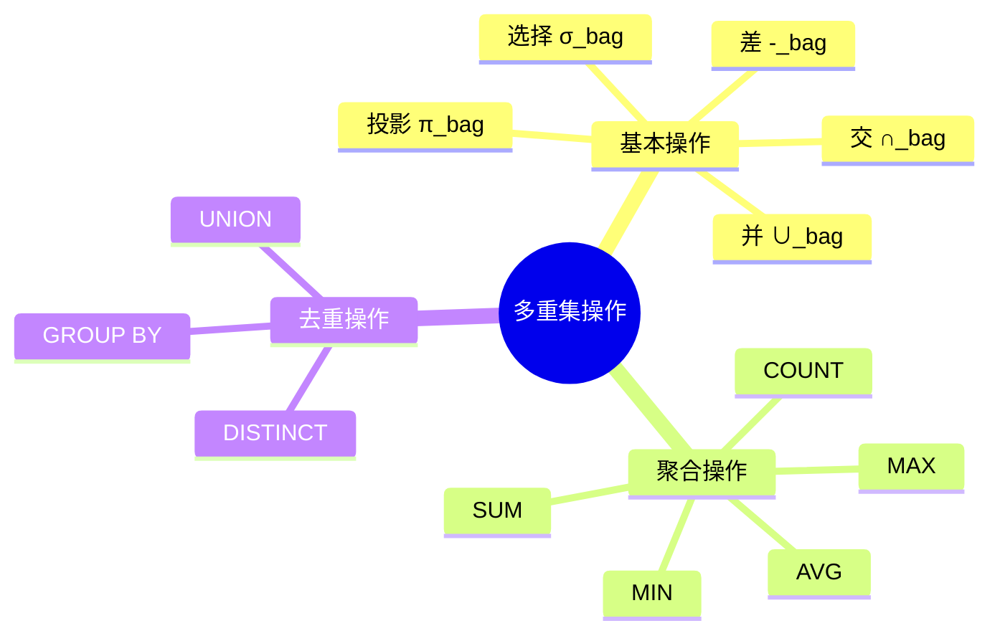
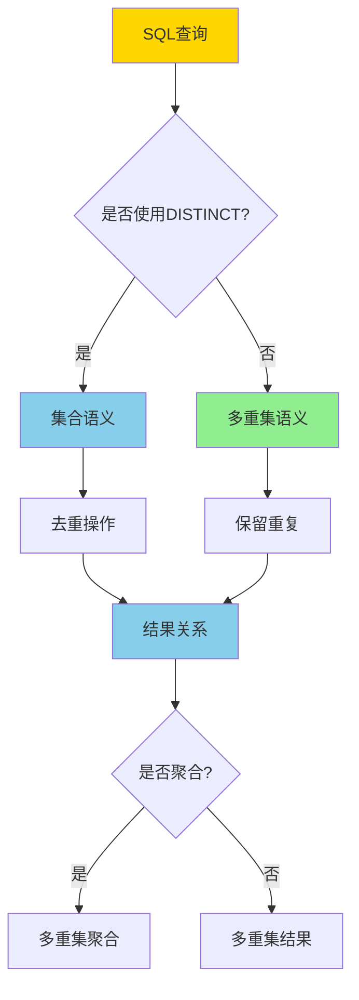
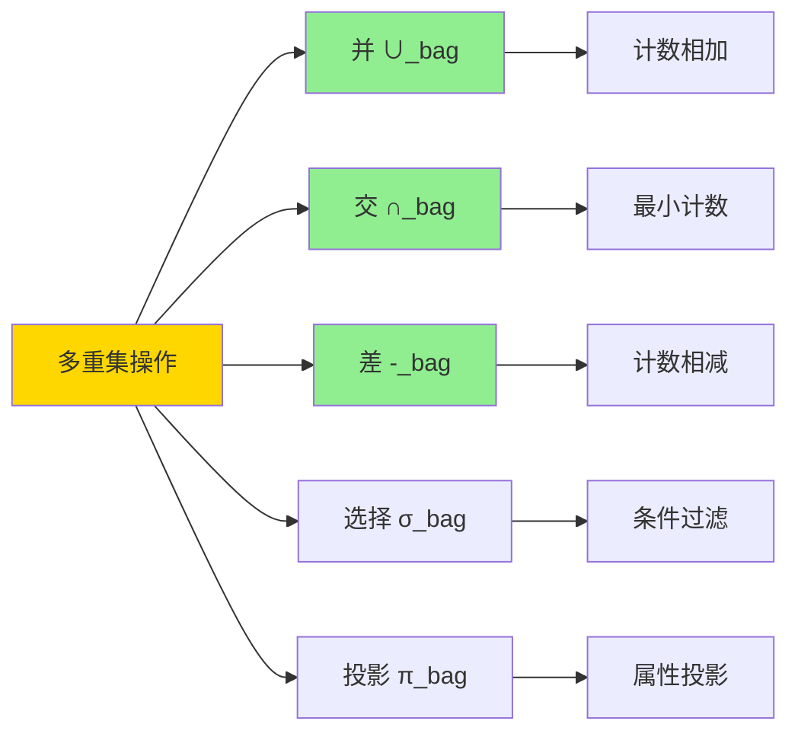

# 多重集语义-SQL与关系代数的bag形式化

> **文档版本**: v1.0
> **最后更新**: 2025-01-16
> **版本覆盖**: PostgreSQL 18.x (推荐) ⭐ | 17.x (推荐) | 16.x (兼容)
> **文档状态**: 🟡 框架已创建，内容待完善

---

## 📋 目录

- [多重集语义-SQL与关系代数的bag形式化](#多重集语义-sql与关系代数的bag形式化)
  - [📋 目录](#-目录)
  - [1. 概述](#1-概述)
    - [1.0 多重集语义工作原理概述](#10-多重集语义工作原理概述)
    - [1.1 本文档的范围](#11-本文档的范围)
  - [2. 核心内容](#2-核心内容)
    - [2.1 多重集定义](#21-多重集定义)
    - [2.2 SQL多重集语义](#22-sql多重集语义)
    - [2.3 关系代数到多重集代数](#23-关系代数到多重集代数)
  - [3. 形式化定义](#3-形式化定义)
    - [3.1 多重集形式化](#31-多重集形式化)
    - [3.2 多重集操作形式化](#32-多重集操作形式化)
    - [3.3 SQL语义形式化](#33-sql语义形式化)
  - [4. 定理与证明](#4-定理与证明)
    - [4.1 多重集代数完备性](#41-多重集代数完备性)
    - [4.2 集合与多重集关系](#42-集合与多重集关系)
  - [5. 实际应用](#5-实际应用)
    - [5.1 PostgreSQL多重集语义](#51-postgresql多重集语义)
    - [5.2 聚合函数与多重集](#52-聚合函数与多重集)
    - [5.3 GROUP BY的多重集语义](#53-group-by的多重集语义)
  - [6. 相关文档](#6-相关文档)
    - [6.1 理论基础文档](#61-理论基础文档)
  - [7. 参考文献](#7-参考文献)
    - [7.1 核心理论文献](#71-核心理论文献)
    - [7.2 SQL语义相关](#72-sql语义相关)
    - [7.3 PostgreSQL实现相关](#73-postgresql实现相关)
    - [7.4 相关文档](#74-相关文档)

---

## 1. 概述

### 1.0 多重集语义工作原理概述

**多重集（Bag）语义**：

SQL使用多重集语义而非集合语义，允许重复元组。本文档提供SQL多重集语义的形式化定义和与关系代数的对应关系。

**集合 vs 多重集对比矩阵**：

| 特性 | 集合（Set） | 多重集（Bag） |
|------|------------|--------------|
| **重复元组** | 不允许 | 允许 |
| **基数** | 唯一计数 | 多重计数 |
| **并运算** | 去重 | 保留重复 |
| **交运算** | 集合交 | 最小计数 |
| **差运算** | 集合差 | 计数差 |
| **SQL默认** | 需要DISTINCT | 默认行为 |

**多重集操作思维导图**：



**多重集语义决策树**：



### 1.1 本文档的范围

本文档涵盖：

- **多重集语义**：多重集的形式化定义和操作
- **SQL语义**：SQL查询的多重集语义解释
- **关系代数扩展**：关系代数到多重集代数的扩展
- **实际应用**：多重集语义在PostgreSQL中的应用

---

## 2. 核心内容

### 2.1 多重集定义

**多重集形式化**：

```haskell
-- 多重集（Bag）
type Bag a = Map a Int  -- 元素到计数的映射

-- 多重集操作
bagUnion :: Bag a -> Bag a -> Bag a
bagUnion b1 b2 = Map.unionWith (+) b1 b2

bagIntersection :: Bag a -> Bag a -> Bag a
bagIntersection b1 b2 = Map.intersectionWith min b1 b2

bagDifference :: Bag a -> Bag a -> Bag a
bagDifference b1 b2 = Map.differenceWith (\c1 c2 ->
    let diff = c1 - c2 in if diff > 0 then Just diff else Nothing) b1 b2
```

**多重集操作可视化**：



### 2.2 SQL多重集语义

**SQL查询的多重集解释**：

```haskell
-- SQL查询的多重集语义
SELECT * FROM R_bag(DB) = bag(R(DB))  -- 转换为多重集

-- UNION ALL (多重集并)
SELECT * FROM R1 UNION ALL SELECT * FROM R2_bag(DB) =
    bagUnion(R1_bag(DB), R2_bag(DB))

-- UNION (集合并，去重)
SELECT * FROM R1 UNION SELECT * FROM R2_bag(DB) =
    setToBag(setUnion(R1(DB), R2(DB)))
```

**SQL操作对比矩阵**：

| SQL操作 | 集合语义 | 多重集语义 |
|---------|---------|-----------|
| **SELECT** | 去重 | 保留重复 |
| **UNION** | 集合并 | 去重后并 |
| **UNION ALL** | N/A | 多重集并 |
| **INTERSECT** | 集合交 | 去重后交 |
| **EXCEPT** | 集合差 | 去重后差 |
| **GROUP BY** | N/A | 分组聚合 |

### 2.3 关系代数到多重集代数

**扩展关系代数**：

```haskell
-- 多重集关系代数
data BagAlgebra =
    BagSelect Condition BagRelation
  | BagProject [Attribute] BagRelation
  | BagUnion BagRelation BagRelation
  | BagIntersection BagRelation BagRelation
  | BagDifference BagRelation BagRelation
  | BagJoin Condition BagRelation BagRelation
```

---

## 3. 形式化定义

### 3.1 多重集形式化

**多重集定义**：

```haskell
-- 多重集
Bag(R) = {(t, count(t, R)) | t ∈ R}

-- 多重集相等
Bag(R1) = Bag(R2) iff
    forall t: count(t, R1) = count(t, R2)
```

### 3.2 多重集操作形式化

**多重集并**：

```haskell
-- 多重集并
R1 ∪_bag R2 = {(t, count(t, R1) + count(t, R2)) | t ∈ R1 ∪ R2}
```

**多重集交**：

```haskell
-- 多重集交
R1 ∩_bag R2 = {(t, min(count(t, R1), count(t, R2))) | t ∈ R1 ∩ R2}
```

**多重集差**：

```haskell
-- 多重集差
R1 -_bag R2 = {(t, max(0, count(t, R1) - count(t, R2))) | t ∈ R1}
```

### 3.3 SQL语义形式化

**SQL查询的多重集语义**：

```haskell
-- SQL查询语义
SELECT * FROM R_bag(DB) = Bag(R(DB))

-- DISTINCT语义
SELECT DISTINCT * FROM R_bag(DB) = Set(R(DB))
```

---

## 4. 定理与证明

### 4.1 多重集代数完备性

**定理**：多重集关系代数可以表达所有SQL查询。

**证明**：

1. SQL查询可以转换为关系代数
2. 关系代数可以扩展为多重集代数
3. 因此SQL查询可以转换为多重集代数

### 4.2 集合与多重集关系

**定理**：集合是多重集的特殊情况（所有计数为1）。

**证明**：

- 对于集合R，Bag(R) = {(t, 1) | t ∈ R}
- 因此集合可以视为多重集的特例

---

## 5. 实际应用

### 5.1 PostgreSQL多重集语义

**默认行为（保留重复）**：

```sql
-- 默认多重集语义
SELECT name FROM students;
-- 如果students表中有重复的name，结果会保留重复

-- 去重（集合语义）
SELECT DISTINCT name FROM students;
-- 结果去重，每个name只出现一次
```

**UNION vs UNION ALL**：

```sql
-- UNION ALL (多重集并，保留重复)
SELECT name FROM students
UNION ALL
SELECT name FROM teachers;
-- 结果包含所有重复的name

-- UNION (集合并，去重)
SELECT name FROM students
UNION
SELECT name FROM teachers;
-- 结果去重，每个name只出现一次
```

### 5.2 聚合函数与多重集

**COUNT的行为**：

```sql
-- COUNT(*) 计算所有行（包括重复）
SELECT COUNT(*) FROM students;  -- 返回总行数

-- COUNT(column) 计算非NULL值（包括重复）
SELECT COUNT(name) FROM students;  -- 返回非NULL的name数量

-- COUNT(DISTINCT column) 计算唯一值（集合计数）
SELECT COUNT(DISTINCT name) FROM students;  -- 返回唯一的name数量
```

### 5.3 GROUP BY的多重集语义

**分组聚合**：

```sql
-- GROUP BY创建分组多重集
SELECT
    dept_id,
    COUNT(*) as student_count,
    AVG(age) as avg_age
FROM students
GROUP BY dept_id;

-- 每个dept_id形成一个分组多重集
-- COUNT(*)计算每个分组中的行数（包括重复）
-- AVG计算每个分组中age的平均值
```

---

## 6. 相关文档

### 6.1 理论基础文档

- [关系代数与关系演算-科德定理与可表达性](./08.02-关系代数与关系演算-科德定理与可表达性.md)
- [形式语言与证明：总论](../01-形式化方法与基础理论/01.05-形式语言与证明-总论.md)
- [理论基础导航](../README.md)

---

## 7. 参考文献

### 7.1 核心理论文献

- **Dayal, U., et al. (1982). "On the Correct Translation of Update Operations on Relational Views."**
  - 会议: ACM TODS 1982
  - **重要性**: 多重集语义的早期研究
  - **核心贡献**: 讨论了视图更新的多重集语义

- **Albert, J. (1991). "Algebraic Properties of Bag Data Types."**
  - 会议: VLDB 1991
  - **重要性**: 多重集代数的经典论文
  - **核心贡献**: 提出了多重集代数的形式化定义

### 7.2 SQL语义相关

- **Grust, T., & van Keulen, M. (2002). "On the Correctness of SQL Bag Semantics."**
  - 会议: SIGMOD 2002
  - **重要性**: SQL多重集语义的正确性研究
  - **核心贡献**: 证明了SQL多重集语义的正确性

### 7.3 PostgreSQL实现相关

- **[PostgreSQL官方文档 - 查询](<https://www.postgresql.org/docs/current/queries.html>)**
  - PostgreSQL查询语义说明

### 7.4 相关文档

- [关系代数与关系演算-科德定理与可表达性](./08.02-关系代数与关系演算-科德定理与可表达性.md)
- [外连接与NULL-三值逻辑的形式语义](./08.12-外连接与NULL-三值逻辑的形式语义.md)
- [理论基础导航](../README.md)

---

**最后更新**: 2025-01-16
**维护者**: Documentation Team
**状态**: 🟡 框架已创建，内容待完善
