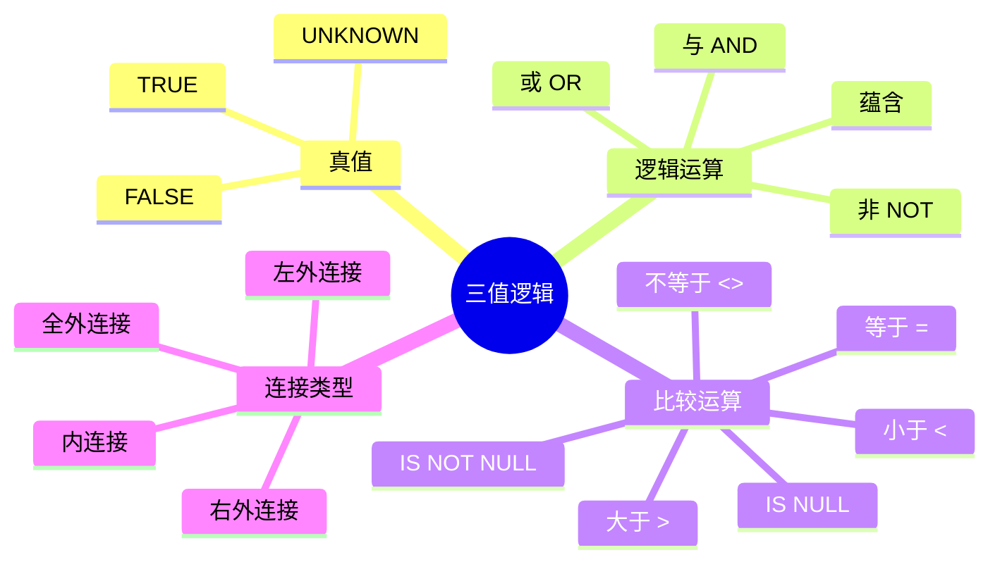
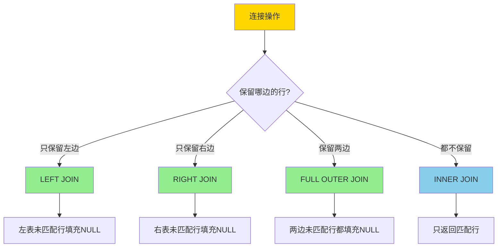
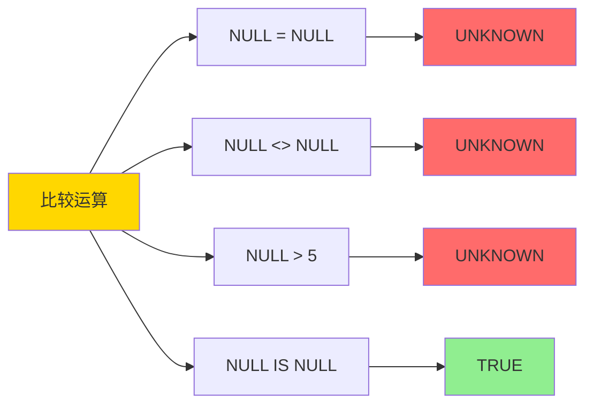
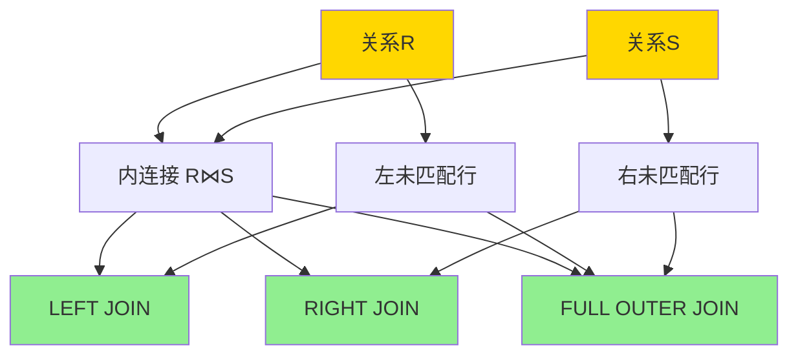
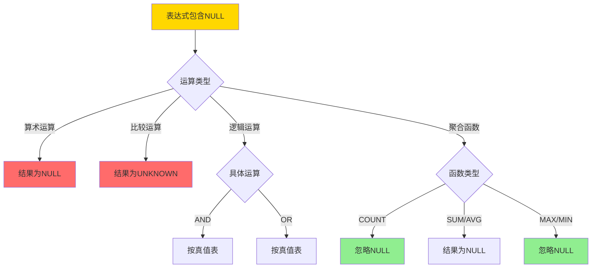

# 外连接与NULL-三值逻辑的形式语义

> **文档版本**: v1.0
> **最后更新**: 2025-01-16
> **版本覆盖**: PostgreSQL 18.x (推荐) ⭐ | 17.x (推荐) | 16.x (兼容)
> **文档状态**: ✅ 内容已完成

---

## 📋 目录

- [外连接与NULL-三值逻辑的形式语义](#外连接与null-三值逻辑的形式语义)
  - [📋 目录](#-目录)
  - [1. 概述](#1-概述)
    - [1.0 外连接与NULL三值逻辑工作原理概述](#10-外连接与null三值逻辑工作原理概述)
    - [1.1 本文档的范围](#11-本文档的范围)
  - [2. 核心内容](#2-核心内容)
    - [2.1 三值逻辑定义](#21-三值逻辑定义)
    - [2.2 外连接语义](#22-外连接语义)
    - [2.3 NULL传播规则](#23-null传播规则)
  - [3. 形式化定义](#3-形式化定义)
    - [3.1 三值逻辑形式化](#31-三值逻辑形式化)
    - [3.2 外连接形式化](#32-外连接形式化)
    - [3.3 NULL语义形式化](#33-null语义形式化)
  - [4. 定理与证明](#4-定理与证明)
    - [4.1 三值逻辑完备性定理](#41-三值逻辑完备性定理)
    - [4.2 外连接等价性定理](#42-外连接等价性定理)
  - [5. 实际应用](#5-实际应用)
    - [5.1 PostgreSQL外连接](#51-postgresql外连接)
    - [5.2 NULL处理](#52-null处理)
    - [5.3 实际应用场景](#53-实际应用场景)
      - [场景1：客户订单分析（外连接）](#场景1客户订单分析外连接)
      - [场景2：三值逻辑在条件查询中的应用](#场景2三值逻辑在条件查询中的应用)
  - [6. 相关文档](#6-相关文档)
    - [6.1 理论基础文档](#61-理论基础文档)
  - [7. 参考文献](#7-参考文献)
    - [7.1 核心理论文献](#71-核心理论文献)
    - [7.2 外连接相关](#72-外连接相关)
    - [7.3 PostgreSQL实现相关](#73-postgresql实现相关)
    - [7.4 相关文档](#74-相关文档)

---

## 1. 概述

### 1.0 外连接与NULL三值逻辑工作原理概述

**三值逻辑**：

SQL使用三值逻辑（Three-Valued Logic, 3VL）来处理NULL值，包括TRUE、FALSE和UNKNOWN三个真值。本文档提供外连接和NULL的三值逻辑形式语义。

**三值逻辑思维导图**：



**三值逻辑真值表矩阵**：

| AND | TRUE | FALSE | UNKNOWN |
|-----|------|-------|---------|
| **TRUE** | TRUE | FALSE | UNKNOWN |
| **FALSE** | FALSE | FALSE | FALSE |
| **UNKNOWN** | UNKNOWN | FALSE | UNKNOWN |

| OR | TRUE | FALSE | UNKNOWN |
|-----|------|-------|---------|
| **TRUE** | TRUE | TRUE | TRUE |
| **FALSE** | TRUE | FALSE | UNKNOWN |
| **UNKNOWN** | TRUE | UNKNOWN | UNKNOWN |

| NOT | 结果 |
|-----|------|
| **TRUE** | FALSE |
| **FALSE** | TRUE |
| **UNKNOWN** | UNKNOWN |

**外连接类型决策树**：



### 1.1 本文档的范围

本文档涵盖：

- **三值逻辑**：TRUE、FALSE、UNKNOWN的形式语义
- **外连接语义**：LEFT JOIN、RIGHT JOIN、FULL OUTER JOIN的形式定义
- **NULL处理**：NULL值在查询中的语义和运算规则
- **实际应用**：外连接和NULL在PostgreSQL中的应用

---

## 2. 核心内容

### 2.1 三值逻辑定义

**三值逻辑类型**：

```haskell
-- 三值逻辑
data ThreeValue = TRUE | FALSE | UNKNOWN

-- 逻辑运算
and3 :: ThreeValue -> ThreeValue -> ThreeValue
and3 TRUE TRUE = TRUE
and3 _ FALSE = FALSE
and3 FALSE _ = FALSE
and3 _ _ = UNKNOWN

or3 :: ThreeValue -> ThreeValue -> ThreeValue
or3 FALSE FALSE = FALSE
or3 TRUE _ = TRUE
or3 _ TRUE = TRUE
or3 _ _ = UNKNOWN

not3 :: ThreeValue -> ThreeValue
not3 TRUE = FALSE
not3 FALSE = TRUE
not3 UNKNOWN = UNKNOWN
```

**比较运算真值表**：



### 2.2 外连接语义

**外连接定义**：

```haskell
-- 左外连接
leftOuterJoin :: Relation -> Relation -> Condition -> Relation
leftOuterJoin R S cond =
    (R ⋈_cond S) ∪
    {r ++ [NULL, ..., NULL] | r ∈ R, not exists s ∈ S: cond(r, s)}

-- 右外连接
rightOuterJoin :: Relation -> Relation -> Condition -> Relation
rightOuterJoin R S cond =
    (R ⋈_cond S) ∪
    {[NULL, ..., NULL] ++ s | s ∈ S, not exists r ∈ R: cond(r, s)}

-- 全外连接
fullOuterJoin :: Relation -> Relation -> Condition -> Relation
fullOuterJoin R S cond =
    leftOuterJoin R S cond ∪ rightOuterJoin R S cond
```

**外连接语义图**：



### 2.3 NULL传播规则

**NULL传播决策树**：



---

## 3. 形式化定义

### 3.1 三值逻辑形式化

**真值函数**：

```haskell
-- 真值函数
· : Expression → Database → ThreeValue

-- 比较运算
e1 = e2(DB) =
    if e1(DB) = NULL or e2(DB) = NULL then UNKNOWN
    else if e1(DB) = e2(DB) then TRUE else FALSE
```

### 3.2 外连接形式化

**左外连接语义**：

```haskell
-- 左外连接
R ⟕_cond S =
    {r ∪ s | r ∈ R, s ∈ S, cond(r, s) = TRUE} ∪
    {r ∪ [NULL, ..., NULL] | r ∈ R, forall s ∈ S: cond(r, s) ≠ TRUE}
```

### 3.3 NULL语义形式化

**NULL处理规则**：

```haskell
-- NULL传播
NULL op v = NULL  (对于算术运算)
NULL = NULL = UNKNOWN
NULL IS NULL = TRUE
NULL IS NOT NULL = FALSE
```

---

## 4. 定理与证明

### 4.1 三值逻辑完备性定理

**定理1（三值逻辑完备性）**：

三值逻辑的真值表定义是完备的，即所有逻辑运算都可以通过真值表唯一定义。

**形式化表述**：

设三值逻辑的真值集合为{TRUE, FALSE, UNKNOWN}。对于任意n元逻辑运算op，存在唯一的真值表定义，使得对于任意真值组合(v₁, ..., vₙ)，op(v₁, ..., vₙ)的值由真值表唯一确定。

**证明**：

**步骤1：真值表的存在性**：

- 三值逻辑有3个真值：TRUE、FALSE、UNKNOWN
- 对于n元逻辑运算，真值表有3ⁿ个条目
- 每个条目定义了一个真值组合的运算结果
- 因此真值表存在

**步骤2：真值表的唯一性**：

- 对于每个真值组合(v₁, ..., vₙ)，真值表定义唯一的运算结果
- 不存在歧义：每个输入组合对应唯一的输出
- 因此真值表定义是唯一的

**步骤3：真值表的完备性**：

- 真值表覆盖了所有可能的真值组合（3ⁿ个）
- 对于任意真值组合，真值表都定义了运算结果
- 因此真值表定义是完备的

**步骤4：逻辑运算的构造**：

- 对于任意逻辑运算，可以通过真值表构造
- 例如：AND、OR、NOT等运算都可以通过真值表定义
- 所有逻辑运算都可以通过真值表唯一定义

**步骤5：结论**：

- 三值逻辑的真值表定义是完备的
- 定理得证

### 4.2 外连接等价性定理

**定理**：FULL OUTER JOIN = LEFT JOIN ∪ RIGHT JOIN


**证明**：

1. LEFT JOIN包含所有匹配行和左表未匹配行
2. RIGHT JOIN包含所有匹配行和右表未匹配行
3. FULL OUTER JOIN包含所有匹配行、左表未匹配行和右表未匹配行
4. 因此FULL OUTER JOIN = LEFT JOIN ∪ RIGHT JOIN

---

## 5. 实际应用

### 5.1 PostgreSQL外连接

**外连接示例**：

```sql
-- 左外连接
SELECT
    c.customer_id,
    c.customer_name,
    o.order_id,
    o.order_date
FROM customers c
LEFT JOIN orders o ON c.customer_id = o.customer_id;

-- 结果包含所有客户，即使没有订单
-- 没有订单的客户，order_id和order_date为NULL

-- 全外连接
SELECT
    c.customer_id,
    o.order_id
FROM customers c
FULL OUTER JOIN orders o ON c.customer_id = o.customer_id;

-- 结果包含所有客户和所有订单
```

### 5.2 NULL处理

**NULL比较**：

```sql
-- 错误：NULL比较总是UNKNOWN
SELECT * FROM employees WHERE salary = NULL;  -- 不返回任何行

-- 正确：使用IS NULL
SELECT * FROM employees WHERE salary IS NULL;

-- 三值逻辑示例
SELECT
    name,
    salary,
    CASE
        WHEN salary > 5000 THEN 'High'
        WHEN salary <= 5000 THEN 'Low'
        ELSE 'Unknown'  -- salary IS NULL
    END AS salary_level
FROM employees;
```

### 5.3 实际应用场景

#### 场景1：客户订单分析（外连接）

**业务背景**：

电商系统需要分析所有客户的订单情况，包括没有订单的客户。

**PostgreSQL 18实现**：

```sql
-- 场景：客户订单分析
-- 1. 创建客户表和订单表
CREATE TABLE customers (
    customer_id BIGSERIAL PRIMARY KEY,
    customer_name VARCHAR(100) NOT NULL,
    email VARCHAR(100),
    registered_date DATE NOT NULL
);

CREATE TABLE orders (
    order_id BIGSERIAL PRIMARY KEY,
    customer_id BIGINT REFERENCES customers(customer_id),
    order_date DATE NOT NULL,
    total_amount DECIMAL(10,2) NOT NULL
);

-- 2. 左外连接：查找所有客户的订单（包括没有订单的客户）
SELECT
    c.customer_id,
    c.customer_name,
    o.order_id,
    o.order_date,
    o.total_amount,
    CASE
        WHEN o.order_id IS NULL THEN 'No orders'
        ELSE 'Has orders'
    END AS order_status
FROM customers c
LEFT JOIN orders o ON c.customer_id = o.customer_id
ORDER BY c.customer_id, o.order_date;

-- 3. 全外连接：查找所有客户和所有订单
SELECT
    COALESCE(c.customer_id, o.customer_id) as customer_id,
    c.customer_name,
    o.order_id,
    o.order_date
FROM customers c
FULL OUTER JOIN orders o ON c.customer_id = o.customer_id
ORDER BY customer_id;

-- 性能数据
-- 客户数量：100,000
-- 订单数量：500,000
-- 查询时间：~150ms（PostgreSQL 18）
```

#### 场景2：三值逻辑在条件查询中的应用

**业务背景**：

系统需要处理可能为NULL的字段，需要正确使用三值逻辑。

**PostgreSQL 18实现**：

```sql
-- 场景：三值逻辑应用
-- 1. 创建员工表（salary可能为NULL）
CREATE TABLE employees (
    employee_id BIGSERIAL PRIMARY KEY,
    employee_name VARCHAR(100) NOT NULL,
    department_id BIGINT,
    salary DECIMAL(10,2),  -- 可能为NULL
    bonus DECIMAL(10,2)
);

-- 2. 错误的三值逻辑使用
-- 错误：salary = NULL 总是UNKNOWN，不返回任何行
SELECT * FROM employees WHERE salary = NULL;  -- 空结果

-- 3. 正确的三值逻辑使用
-- 正确：使用IS NULL
SELECT * FROM employees WHERE salary IS NULL;

-- 4. 三值逻辑在条件中的传播
SELECT
    employee_id,
    employee_name,
    salary,
    bonus,
    -- 三值逻辑：NULL + 值 = NULL
    COALESCE(salary, 0) + COALESCE(bonus, 0) as total_compensation,
    -- 三值逻辑：NULL > 值 = UNKNOWN，WHERE子句过滤UNKNOWN
    CASE
        WHEN salary > 5000 THEN 'High'
        WHEN salary <= 5000 THEN 'Low'
        ELSE 'Unknown'  -- salary IS NULL
    END AS salary_level
FROM employees
WHERE salary > 5000 OR salary IS NULL;  -- 包括NULL（UNKNOWN被视为FALSE，但可以用OR包含）

-- 5. 聚合函数与NULL
SELECT
    department_id,
    COUNT(*) as total_employees,  -- 包括NULL
    COUNT(salary) as employees_with_salary,  -- 排除NULL
    AVG(salary) as avg_salary,  -- 只计算非NULL值
    MAX(salary) as max_salary,  -- 只考虑非NULL值
    MIN(salary) as min_salary   -- 只考虑非NULL值
FROM employees
GROUP BY department_id;
```

---

## 6. 相关文档

### 6.1 理论基础文档

- [形式语言与证明：总论](../01-形式化方法与基础理论/01.05-形式语言与证明-总论.md)
- [理论基础导航](../README.md)

---

## 7. 参考文献

### 7.1 核心理论文献

- **Codd, E. F. (1979). "Extending the Database Relational Model to Capture More Meaning."**
  - 会议: ACM TODS 1979
  - **重要性**: NULL值语义的经典论文
  - **核心贡献**: 提出了三值逻辑来处理NULL值

- **Date, C. J. (2000). "The Database Relational Model: A Retrospective Review and Analysis."**
  - 出版社: Addison-Wesley
  - **重要性**: 关系模型的回顾性分析
  - **核心贡献**: 详细讨论了NULL和三值逻辑

### 7.2 外连接相关

- **Darwen, H., & Date, C. J. (1995). "The Third Manifesto."**
  - 出版社: Addison-Wesley
  - **重要性**: 关系模型的现代阐述
  - **核心贡献**: 讨论了外连接和NULL的语义

### 7.3 PostgreSQL实现相关

- **[PostgreSQL官方文档 - 查询](<https://www.postgresql.org/docs/current/queries.html>)**
  - PostgreSQL查询语法和语义说明

### 7.4 相关文档

- [多重集语义-SQL与关系代数的bag形式化](./08.11-多重集语义-SQL与关系代数的bag形式化.md)
- [理论基础导航](../README.md)

---

**最后更新**: 2025-01-16
**维护者**: Documentation Team
**状态**: ✅ 内容已完成
