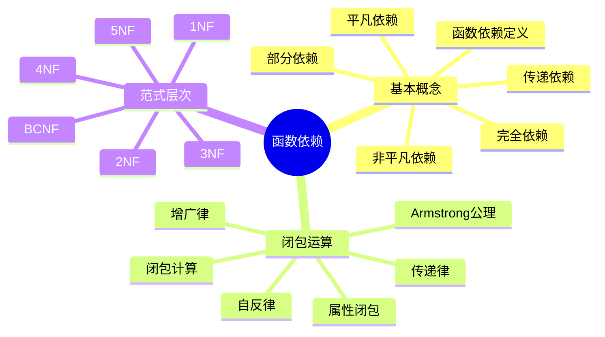
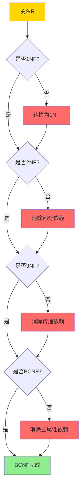
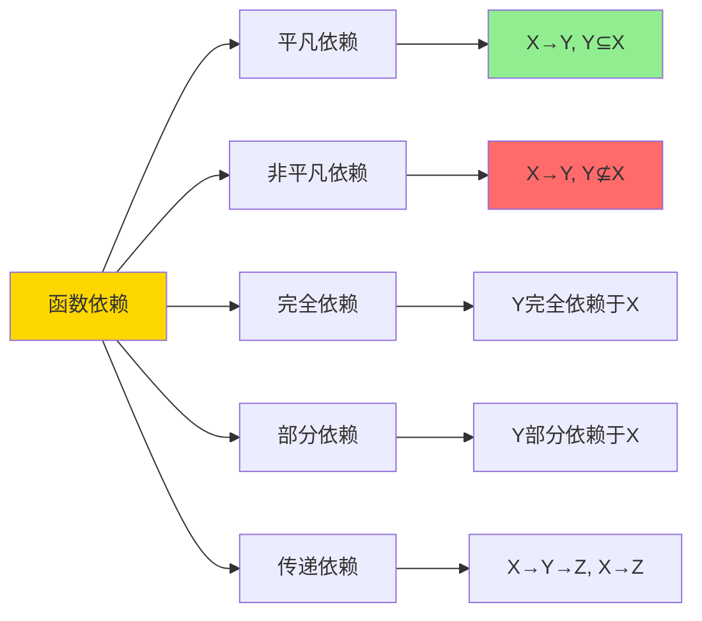
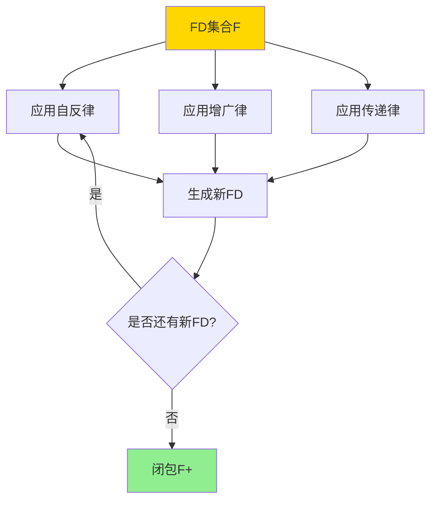
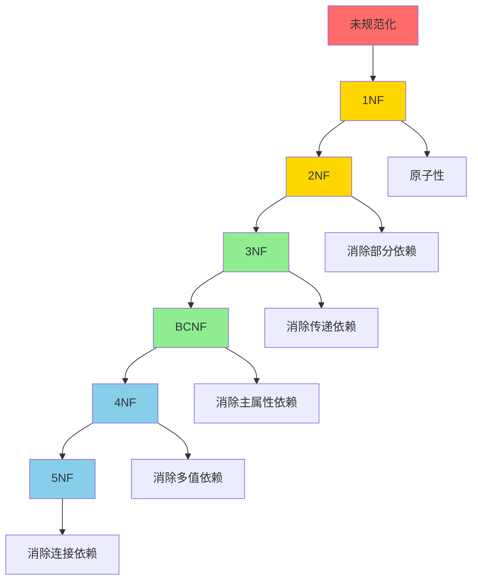
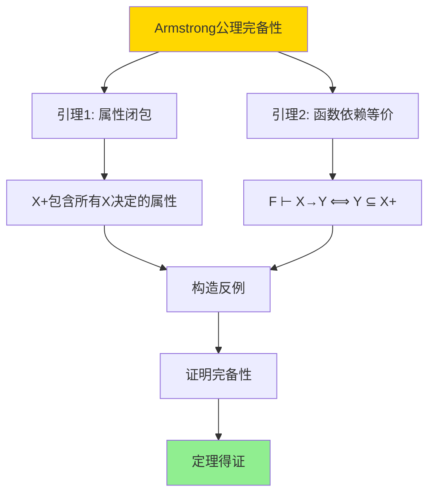

# 关系约束与规范化-函数依赖与范式证明

> **文档版本**: v1.0
> **最后更新**: 2025-01-16
> **版本覆盖**: PostgreSQL 18.x (推荐) ⭐ | 17.x (推荐) | 16.x (兼容)
> **文档状态**: 🟡 框架已创建，内容待完善

---

## 📋 目录

- [关系约束与规范化-函数依赖与范式证明](#关系约束与规范化-函数依赖与范式证明)
  - [📋 目录](#-目录)
  - [1. 概述](#1-概述)
    - [1.0 关系约束与规范化工作原理概述](#10-关系约束与规范化工作原理概述)
    - [1.1 本文档的范围](#11-本文档的范围)
  - [2. 核心内容](#2-核心内容)
    - [2.1 函数依赖定义](#21-函数依赖定义)
    - [2.2 Armstrong公理](#22-armstrong公理)
    - [2.3 范式层次](#23-范式层次)
  - [3. 形式化定义](#3-形式化定义)
    - [3.1 函数依赖形式化](#31-函数依赖形式化)
    - [3.2 闭包形式化](#32-闭包形式化)
    - [3.3 范式形式化](#33-范式形式化)
  - [4. 定理与证明](#4-定理与证明)
    - [4.1 Armstrong公理完备性定理](#41-armstrong公理完备性定理)
    - [4.2 范式包含关系定理](#42-范式包含关系定理)
  - [5. 实际应用](#5-实际应用)
    - [5.1 PostgreSQL中的函数依赖](#51-postgresql中的函数依赖)
  - [6. 相关文档](#6-相关文档)
    - [6.1 理论基础文档](#61-理论基础文档)
  - [7. 参考文献](#7-参考文献)
    - [7.1 核心理论文献](#71-核心理论文献)
    - [7.2 规范化相关](#72-规范化相关)
    - [7.3 相关文档](#73-相关文档)

---

## 1. 概述

### 1.0 关系约束与规范化工作原理概述

**函数依赖理论**：

函数依赖是关系数据库规范化的基础，用于描述属性之间的依赖关系。本文档提供函数依赖的形式化定义和范式证明。

**函数依赖思维导图**：



**函数依赖类型对比矩阵**：

| 依赖类型 | 定义 | 示例 | 问题 |
|---------|------|------|------|
| **完全依赖** | Y完全依赖于X | {学号,课程}→成绩 | 无 |
| **部分依赖** | Y部分依赖于X | {学号,课程}→姓名 | 冗余 |
| **传递依赖** | X→Y, Y→Z, X→Z | 学号→系号→系名 | 冗余 |
| **多值依赖** | X→→Y | 课程→→教师 | 冗余 |

**范式判定决策树**：



### 1.1 本文档的范围

本文档涵盖：

- **函数依赖**：函数依赖的形式化定义和性质
- **Armstrong公理**：函数依赖推理的公理系统
- **范式理论**：1NF到BCNF的范式定义和证明
- **实际应用**：函数依赖在数据库设计中的应用

---

## 2. 核心内容

### 2.1 函数依赖定义

**函数依赖形式化**：

```haskell
-- 函数依赖
type FunctionalDependency = (AttributeSet, AttributeSet)

-- 函数依赖满足
satisfies :: Relation -> FunctionalDependency -> Bool
satisfies R (X, Y) =
    forall t1, t2 in R:
      if t1[X] = t2[X] then t1[Y] = t2[Y]
```

**函数依赖类型**：



### 2.2 Armstrong公理

**Armstrong公理系统**：

```haskell
-- Armstrong公理
data ArmstrongAxiom =
    Reflexivity AttributeSet AttributeSet      -- 自反律
  | Augmentation FunctionalDependency AttributeSet  -- 增广律
  | Transitivity FunctionalDependency FunctionalDependency  -- 传递律

-- 自反律: 如果Y ⊆ X，则X → Y
reflexivity :: AttributeSet -> AttributeSet -> FunctionalDependency
reflexivity X Y = (X, Y) where Y ⊆ X

-- 增广律: 如果X → Y，则XZ → YZ
augmentation :: FunctionalDependency -> AttributeSet -> FunctionalDependency
augmentation (X, Y) Z = (X ∪ Z, Y ∪ Z)

-- 传递律: 如果X → Y且Y → Z，则X → Z
transitivity :: FunctionalDependency -> FunctionalDependency -> FunctionalDependency
transitivity (X, Y) (Y', Z) = (X, Z) where Y = Y'
```

**公理推导证明树**：



### 2.3 范式层次

**范式层次图**：



---

## 3. 形式化定义

### 3.1 函数依赖形式化

**函数依赖语义**：

```haskell
-- 函数依赖语义
R ⊨ X → Y  iff
    forall t1, t2 ∈ R:
      if t1[X] = t2[X] then t1[Y] = t2[Y]
```

### 3.2 闭包形式化

**函数依赖闭包**：

```haskell
-- 函数依赖闭包
F+ = {X → Y | F ⊢ X → Y}

-- 属性闭包
X+ = {A | F ⊢ X → A}
```

### 3.3 范式形式化

**1NF定义**：

```haskell
-- 1NF: 所有属性都是原子的
is1NF R = forall attr in attributes(R): isAtomic(attr)
```

**2NF定义**：

```haskell
-- 2NF: 1NF + 消除部分依赖
is2NF R FDs =
    is1NF R &&
    forall (X → A) in FDs:
      if A is non-prime then X is not proper subset of key
```

**3NF定义**：

```haskell
-- 3NF: 2NF + 消除传递依赖
is3NF R FDs =
    is2NF R FDs &&
    forall (X → A) in FDs:
      if A is non-prime then X is superkey or A is prime
```

---

## 4. 定理与证明

### 4.1 Armstrong公理完备性定理

**定理**：Armstrong公理是完备的，即所有从F逻辑推导出的函数依赖都可以通过Armstrong公理推导。

**证明树**：



### 4.2 范式包含关系定理

**定理**：BCNF ⊆ 3NF ⊆ 2NF ⊆ 1NF

**证明**：

1. **BCNF ⊆ 3NF**：
   - BCNF要求每个决定因子都是超键
   - 3NF允许非主属性传递依赖
   - 因此BCNF更严格

2. **3NF ⊆ 2NF**：
   - 3NF要求消除传递依赖
   - 2NF只要求消除部分依赖
   - 因此3NF更严格

3. **2NF ⊆ 1NF**：
   - 2NF在1NF基础上消除部分依赖
   - 因此2NF包含1NF

---

## 5. 实际应用

### 5.1 PostgreSQL中的函数依赖

**函数依赖检测**：

```sql
-- PostgreSQL支持函数依赖检测（统计信息）
-- 创建表
CREATE TABLE students (
    student_id SERIAL PRIMARY KEY,
    student_name VARCHAR(100),
    dept_id INT,
    dept_name VARCHAR(100)
);

-- 添加函数依赖约束（通过唯一约束）
ALTER TABLE students
ADD CONSTRAINT fd_dept_name
UNIQUE (dept_id, dept_name);

-- 验证函数依赖
-- 如果dept_id相同，dept_name必须相同
```

**范式设计示例**：

```sql
-- 1NF: 消除重复组
-- 违反1NF
CREATE TABLE orders_bad (
    order_id INT,
    items VARCHAR(500)  -- 包含多个值
);

-- 1NF设计
CREATE TABLE orders (
    order_id INT,
    item_id INT,
    quantity INT
);

-- 2NF: 消除部分依赖
-- 违反2NF: {order_id, item_id} → quantity, {order_id} → order_date
CREATE TABLE order_items_bad (
    order_id INT,
    item_id INT,
    quantity INT,
    order_date DATE
);

-- 2NF设计
CREATE TABLE orders (
    order_id INT PRIMARY KEY,
    order_date DATE
);

CREATE TABLE order_items (
    order_id INT REFERENCES orders(order_id),
    item_id INT,
    quantity INT,
    PRIMARY KEY (order_id, item_id)
);
```

---

## 6. 相关文档

### 6.1 理论基础文档

- [形式语言与证明：总论](./1.1.25-形式语言与证明-总论.md)
- [理论基础导航](./README.md)

---

## 7. 参考文献

### 7.1 核心理论文献

- **Codd, E. F. (1970). "A Relational Model of Data for Large Shared Data Banks."**
  - 会议: Communications of the ACM 1970
  - **重要性**: 关系模型的奠基性论文
  - **核心贡献**: 提出了关系模型和规范化理论

- **Armstrong, W. W. (1974). "Dependency Structures of Data Base Relationships."**
  - 会议: IFIP Congress 1974
  - **重要性**: 函数依赖理论的经典论文
  - **核心贡献**: 提出了Armstrong公理系统

### 7.2 规范化相关

- **Maier, D. (1983). "The Theory of Relational Databases."**
  - 出版社: Computer Science Press
  - **重要性**: 关系数据库理论的经典教材
  - **核心贡献**: 系统阐述了规范化理论

### 7.3 相关文档

- [BCNF与3NF-完整证明稿](./09.02-BCNF与3NF-完整证明稿.md)
- [理论基础导航](../README.md)

---

**最后更新**: 2025-01-16
**维护者**: Documentation Team
**状态**: 🟡 框架已创建，内容待完善
