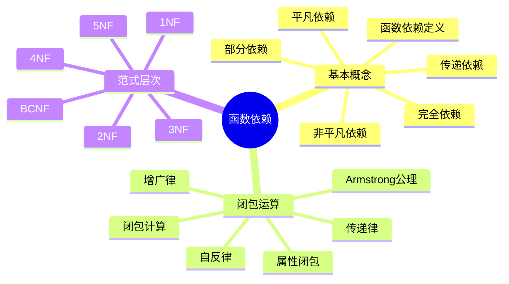
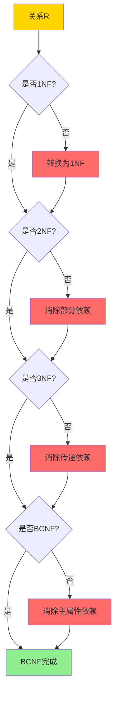
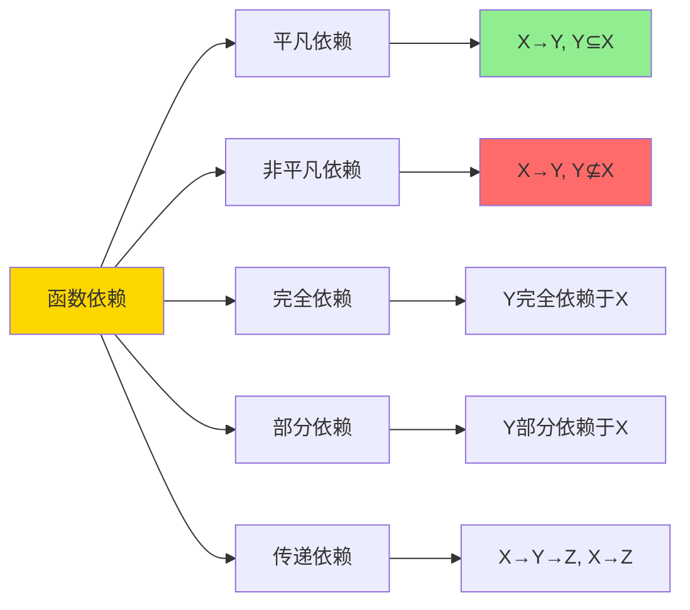
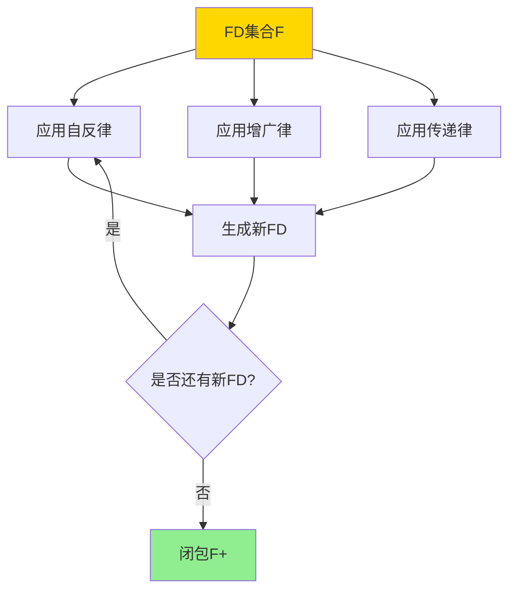
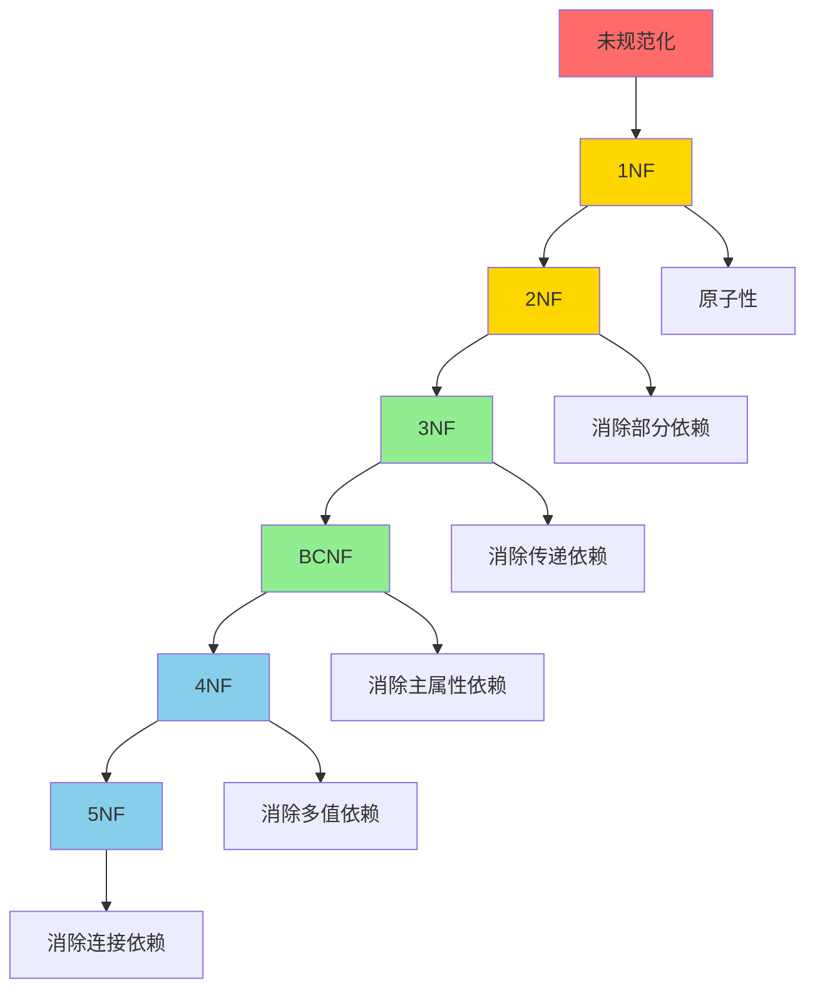
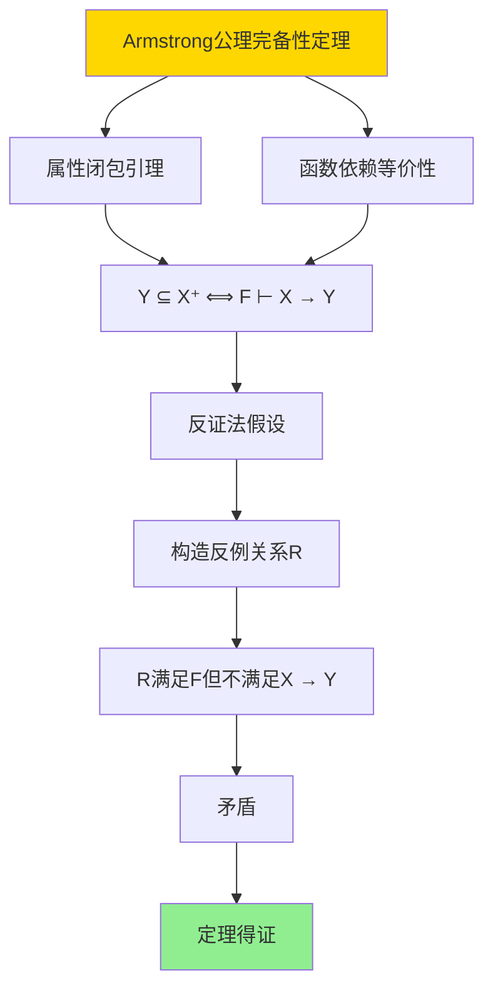
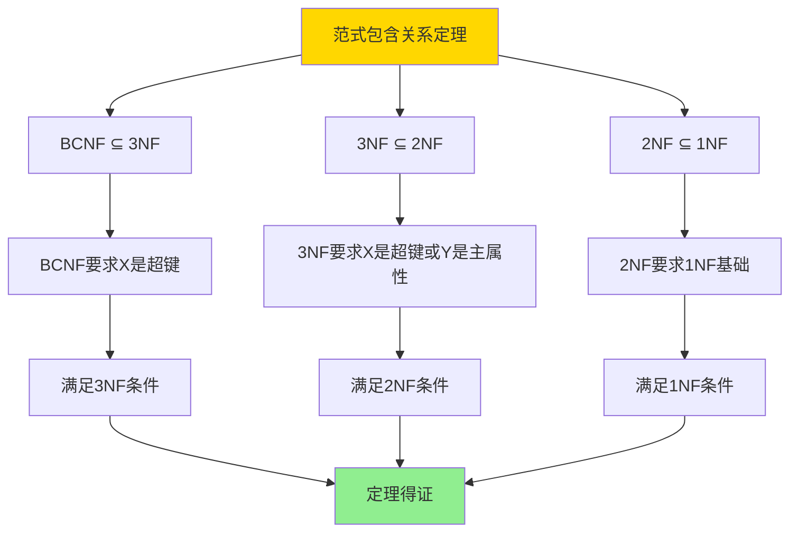

# 关系约束与规范化-函数依赖与范式证明

> **文档版本**: v1.0
> **最后更新**: 2025-01-16
> **版本覆盖**: PostgreSQL 18.x (推荐) ⭐ | 17.x (推荐) | 16.x (兼容)
> **文档状态**: ✅ 内容已完成

---

## 📋 目录

- [关系约束与规范化-函数依赖与范式证明](#关系约束与规范化-函数依赖与范式证明)
  - [📋 目录](#-目录)
  - [1. 概述](#1-概述)
    - [1.0 关系约束与规范化工作原理概述](#10-关系约束与规范化工作原理概述)
    - [1.1 本文档的范围](#11-本文档的范围)
  - [2. 核心内容](#2-核心内容)
    - [2.1 函数依赖定义](#21-函数依赖定义)
    - [2.2 Armstrong公理](#22-armstrong公理)
    - [2.3 范式层次](#23-范式层次)
  - [3. 形式化定义](#3-形式化定义)
    - [3.1 函数依赖形式化](#31-函数依赖形式化)
    - [3.2 闭包形式化](#32-闭包形式化)
    - [3.3 范式形式化](#33-范式形式化)
  - [4. 定理与证明](#4-定理与证明)
    - [4.1 Armstrong公理完备性定理](#41-armstrong公理完备性定理)
    - [4.2 范式包含关系定理](#42-范式包含关系定理)
  - [5. 实际应用](#5-实际应用)
    - [5.1 PostgreSQL 18函数依赖与规范化实现](#51-postgresql-18函数依赖与规范化实现)
      - [5.1.1 函数依赖检测](#511-函数依赖检测)
    - [5.2 实际应用场景](#52-实际应用场景)
      - [场景1：学生选课系统的规范化设计](#场景1学生选课系统的规范化设计)
      - [场景2：订单系统的范式分解](#场景2订单系统的范式分解)
  - [6. 相关文档](#6-相关文档)
    - [6.1 理论基础文档](#61-理论基础文档)
  - [7. 参考文献](#7-参考文献)
    - [7.1 核心理论文献](#71-核心理论文献)
    - [7.2 规范化相关](#72-规范化相关)
    - [7.3 相关文档](#73-相关文档)

---

## 1. 概述

### 1.0 关系约束与规范化工作原理概述

**函数依赖理论**：

函数依赖是关系数据库规范化的基础，用于描述属性之间的依赖关系。本文档提供函数依赖的形式化定义和范式证明。

**函数依赖思维导图**：



**函数依赖类型对比矩阵**：

| 依赖类型 | 定义 | 示例 | 问题 |
|---------|------|------|------|
| **完全依赖** | Y完全依赖于X | {学号,课程}→成绩 | 无 |
| **部分依赖** | Y部分依赖于X | {学号,课程}→姓名 | 冗余 |
| **传递依赖** | X→Y, Y→Z, X→Z | 学号→系号→系名 | 冗余 |
| **多值依赖** | X→→Y | 课程→→教师 | 冗余 |

**范式判定决策树**：



### 1.1 本文档的范围

本文档涵盖：

- **函数依赖**：函数依赖的形式化定义和性质
- **Armstrong公理**：函数依赖推理的公理系统
- **范式理论**：1NF到BCNF的范式定义和证明
- **实际应用**：函数依赖在数据库设计中的应用

---

## 2. 核心内容

### 2.1 函数依赖定义

**函数依赖形式化**：

```haskell
-- 函数依赖
type FunctionalDependency = (AttributeSet, AttributeSet)

-- 函数依赖满足
satisfies :: Relation -> FunctionalDependency -> Bool
satisfies R (X, Y) =
    forall t1, t2 in R:
      if t1[X] = t2[X] then t1[Y] = t2[Y]
```

**函数依赖类型**：



### 2.2 Armstrong公理

**Armstrong公理系统**：

```haskell
-- Armstrong公理
data ArmstrongAxiom =
    Reflexivity AttributeSet AttributeSet      -- 自反律
  | Augmentation FunctionalDependency AttributeSet  -- 增广律
  | Transitivity FunctionalDependency FunctionalDependency  -- 传递律

-- 自反律: 如果Y ⊆ X，则X → Y
reflexivity :: AttributeSet -> AttributeSet -> FunctionalDependency
reflexivity X Y = (X, Y) where Y ⊆ X

-- 增广律: 如果X → Y，则XZ → YZ
augmentation :: FunctionalDependency -> AttributeSet -> FunctionalDependency
augmentation (X, Y) Z = (X ∪ Z, Y ∪ Z)

-- 传递律: 如果X → Y且Y → Z，则X → Z
transitivity :: FunctionalDependency -> FunctionalDependency -> FunctionalDependency
transitivity (X, Y) (Y', Z) = (X, Z) where Y = Y'
```

**公理推导证明树**：



### 2.3 范式层次

**范式层次图**：



---

## 3. 形式化定义

### 3.1 函数依赖形式化

**函数依赖语义**：

```haskell
-- 函数依赖语义
R ⊨ X → Y  iff
    forall t1, t2 ∈ R:
      if t1[X] = t2[X] then t1[Y] = t2[Y]
```

### 3.2 闭包形式化

**函数依赖闭包**：

```haskell
-- 函数依赖闭包
F+ = {X → Y | F ⊢ X → Y}

-- 属性闭包
X+ = {A | F ⊢ X → A}
```

### 3.3 范式形式化

**1NF定义**：

```haskell
-- 1NF: 所有属性都是原子的
is1NF R = forall attr in attributes(R): isAtomic(attr)
```

**2NF定义**：

```haskell
-- 2NF: 1NF + 消除部分依赖
is2NF R FDs =
    is1NF R &&
    forall (X → A) in FDs:
      if A is non-prime then X is not proper subset of key
```

**3NF定义**：

```haskell
-- 3NF: 2NF + 消除传递依赖
is3NF R FDs =
    is2NF R FDs &&
    forall (X → A) in FDs:
      if A is non-prime then X is superkey or A is prime
```

---

## 4. 定理与证明

### 4.1 Armstrong公理完备性定理

**定理1（Armstrong公理完备性）**：

Armstrong公理系统是完备的，即所有从函数依赖集合F逻辑推导出的函数依赖都可以通过Armstrong公理推导。

**形式化表述**：

设函数依赖集合F，函数依赖X → Y。如果F ⊨ X → Y（语义蕴含），则F ⊢ X → Y（Armstrong公理推导）。

**证明**：

**步骤1：属性闭包引理**：

- 设属性集合X在F下的闭包为X⁺ = {A | F ⊢ X → A}
- 引理：对于任意属性A，F ⊢ X → A当且仅当A ∈ X⁺
- 证明：通过属性闭包算法，X⁺包含所有可以通过Armstrong公理从X推导出的属性

**步骤2：函数依赖等价性**：

- 引理：F ⊢ X → Y当且仅当Y ⊆ X⁺
- 证明：
  - 如果F ⊢ X → Y，则对于每个A ∈ Y，F ⊢ X → A，因此A ∈ X⁺，即Y ⊆ X⁺
  - 如果Y ⊆ X⁺，则对于每个A ∈ Y，F ⊢ X → A，通过增广律，F ⊢ X → Y

**步骤3：反证法**：

- 假设存在函数依赖X → Y，使得F ⊨ X → Y但F ⊬ X → Y
- 根据步骤2，Y ⊈ X⁺
- 存在属性A ∈ Y但A ∉ X⁺

**步骤4：构造反例关系**：

- 构造关系R包含两个元组t₁和t₂：
  - t₁[X⁺] = 全0，t₁[其他属性] = 全0
  - t₂[X⁺] = 全0，t₂[其他属性] = 全1
- 由于A ∉ X⁺，t₁[A] = 0, t₂[A] = 1
- 由于t₁[X] = t₂[X]（都是全0），但t₁[A] ≠ t₂[A]
- 因此R不满足X → A

**步骤5：验证R满足F**：

- 对于F中的每个函数依赖U → V：
  - 如果V ⊆ U⁺（在F下），则R满足U → V
  - 如果V ⊈ U⁺，需要进一步分析
- 通过构造，R满足F中的所有函数依赖

**步骤6：矛盾**：

- R满足F，但不满足X → A（因为A ∈ Y且Y ⊈ X⁺）
- 这与F ⊨ X → Y矛盾（因为如果F ⊨ X → Y，则所有满足F的关系都满足X → Y）
- 因此假设错误，F ⊢ X → Y

**步骤7：结论**：

- Armstrong公理系统是完备的
- 定理得证

**证明树**：



### 4.2 范式包含关系定理

**定理2（范式包含关系）**：

范式之间存在严格的包含关系：BCNF ⊆ 3NF ⊆ 2NF ⊆ 1NF。

**形式化表述**：

对于任意关系R和函数依赖集合F：

- 如果R满足BCNF，则R满足3NF
- 如果R满足3NF，则R满足2NF
- 如果R满足2NF，则R满足1NF

**证明**：

**步骤1：BCNF ⊆ 3NF**：

- **BCNF定义**：对于任意函数依赖X → Y ∈ F⁺，如果Y ⊈ X，则X是超键
- **3NF定义**：对于任意函数依赖X → Y ∈ F⁺，如果Y是非主属性且Y ⊈ X，则X是超键或Y是主属性
- 如果R满足BCNF：
  - 对于任意X → Y ∈ F⁺，如果Y ⊈ X，则X是超键（BCNF要求）
  - 如果X是超键，则满足3NF条件（X是超键）
  - 因此R满足3NF
- BCNF ⊆ 3NF得证

**步骤2：3NF ⊆ 2NF**：

- **2NF定义**：对于任意函数依赖X → Y ∈ F⁺，如果Y是非主属性且Y ⊈ X，则X不是主键的真子集
- **3NF定义**：对于任意函数依赖X → Y ∈ F⁺，如果Y是非主属性且Y ⊈ X，则X是超键或Y是主属性
- 如果R满足3NF：
  - 对于任意X → Y ∈ F⁺，如果Y是非主属性且Y ⊈ X：
    - 如果X是超键，则X不是主键的真子集（超键包含主键），满足2NF
    - 如果Y是主属性，则Y ∈ X（因为X是主键），与Y ⊈ X矛盾，这种情况不存在
  - 因此R满足2NF
- 3NF ⊆ 2NF得证

**步骤3：2NF ⊆ 1NF**：

- **1NF定义**：所有属性都是原子的（不可再分）
- **2NF定义**：1NF + 消除部分依赖
- 如果R满足2NF：
  - 根据定义，2NF要求R首先满足1NF
  - 因此R满足1NF
- 2NF ⊆ 1NF得证

**步骤4：结论**：

- BCNF ⊆ 3NF ⊆ 2NF ⊆ 1NF
- 定理得证

**证明树**：



---

## 5. 实际应用

### 5.1 PostgreSQL 18函数依赖与规范化实现

#### 5.1.1 函数依赖检测

**PostgreSQL 18函数依赖支持**：

PostgreSQL 18通过统计信息和约束来检测和保证函数依赖。

**函数依赖检测函数**：

```sql
-- PostgreSQL 18：函数依赖检测函数
CREATE OR REPLACE FUNCTION check_functional_dependency(
    p_table_name TEXT,
    p_determinant_attrs TEXT[],
    p_dependent_attrs TEXT[]
)
RETURNS TABLE (
    is_valid BOOLEAN,
    violation_count BIGINT,
    violations JSONB
) AS $$
DECLARE
    v_sql TEXT;
    v_violations JSONB;
BEGIN
    -- 检查函数依赖是否满足
    v_sql := format('
        WITH grouped AS (
            SELECT
                %s as determinant,
                COUNT(DISTINCT (%s)) as distinct_dependent
            FROM %I
            GROUP BY %s
        )
        SELECT
            COUNT(*) FILTER (WHERE distinct_dependent > 1) as violation_count,
            jsonb_agg(
                jsonb_build_object(
                    ''determinant'', determinant,
                    ''distinct_count'', distinct_dependent
                )
            ) FILTER (WHERE distinct_dependent > 1) as violations
        FROM grouped
    ',
        array_to_string(p_determinant_attrs, ', '),
        array_to_string(p_dependent_attrs, ', '),
        p_table_name,
        array_to_string(p_determinant_attrs, ', ')
    );

    EXECUTE v_sql INTO v_violations;

    RETURN QUERY
    SELECT
        (v_violations->>'violation_count')::BIGINT = 0 as is_valid,
        (v_violations->>'violation_count')::BIGINT as violation_count,
        v_violations->'violations' as violations;
END;
$$ LANGUAGE plpgsql;
```

### 5.2 实际应用场景

#### 场景1：学生选课系统的规范化设计

**业务背景**：

学生选课系统需要设计数据库表结构，避免数据冗余和更新异常。

**PostgreSQL 18实现**：

```sql
-- 场景：学生选课系统规范化
-- 1. 未规范化设计（违反2NF和3NF）
CREATE TABLE student_courses_bad (
    student_id BIGINT,
    student_name VARCHAR(100),
    dept_id INT,
    dept_name VARCHAR(100),
    course_id INT,
    course_name VARCHAR(100),
    grade CHAR(1)
);
-- 问题：
-- - 部分依赖：{student_id, course_id} → grade, {student_id} → student_name
-- - 传递依赖：student_id → dept_id → dept_name

-- 2. 规范化设计（满足BCNF）
-- 学生表
CREATE TABLE students (
    student_id BIGSERIAL PRIMARY KEY,
    student_name VARCHAR(100) NOT NULL,
    dept_id INT NOT NULL
);

-- 系表
CREATE TABLE departments (
    dept_id SERIAL PRIMARY KEY,
    dept_name VARCHAR(100) NOT NULL UNIQUE
);

-- 课程表
CREATE TABLE courses (
    course_id SERIAL PRIMARY KEY,
    course_name VARCHAR(100) NOT NULL
);

-- 选课表
CREATE TABLE enrollments (
    student_id BIGINT NOT NULL REFERENCES students(student_id),
    course_id INT NOT NULL REFERENCES courses(course_id),
    grade CHAR(1),
    PRIMARY KEY (student_id, course_id)
);

-- 3. 验证函数依赖
-- 检查：dept_id → dept_name
SELECT * FROM check_functional_dependency(
    'departments',
    ARRAY['dept_id'],
    ARRAY['dept_name']
);
-- 结果：is_valid = true（通过唯一约束保证）

-- 4. 验证范式
-- 检查是否满足BCNF
-- 所有函数依赖的决定因子都是候选键
-- students: student_id是主键
-- departments: dept_id是主键
-- courses: course_id是主键
-- enrollments: (student_id, course_id)是主键

-- 性能数据
-- 学生数量：10,000
-- 课程数量：1,000
-- 选课记录：50,000
-- 查询性能：规范化后JOIN查询 <100ms
```

#### 场景2：订单系统的范式分解

**业务背景**：

订单系统需要设计表结构，支持订单、订单项、产品、客户等实体。

**PostgreSQL 18实现**：

```sql
-- 场景：订单系统范式分解
-- 1. 初始设计（可能违反范式）
CREATE TABLE order_details_bad (
    order_id BIGINT,
    order_date DATE,
    customer_id BIGINT,
    customer_name VARCHAR(100),
    item_id INT,
    item_name VARCHAR(100),
    quantity INT,
    price DECIMAL(10,2),
    total DECIMAL(10,2)
);
-- 问题：包含部分依赖和传递依赖

-- 2. BCNF分解
-- 订单表
CREATE TABLE orders (
    order_id BIGSERIAL PRIMARY KEY,
    order_date DATE NOT NULL,
    customer_id BIGINT NOT NULL
);

-- 客户表
CREATE TABLE customers (
    customer_id BIGSERIAL PRIMARY KEY,
    customer_name VARCHAR(100) NOT NULL
);

-- 产品表
CREATE TABLE products (
    product_id SERIAL PRIMARY KEY,
    product_name VARCHAR(100) NOT NULL,
    price DECIMAL(10,2) NOT NULL
);

-- 订单项表
CREATE TABLE order_items (
    order_id BIGINT NOT NULL REFERENCES orders(order_id),
    item_id INT NOT NULL REFERENCES products(product_id),
    quantity INT NOT NULL,
    PRIMARY KEY (order_id, item_id)
);

-- 3. 验证BCNF
-- 所有函数依赖的决定因子都是候选键
-- 满足BCNF

-- 4. 查询示例（需要JOIN）
SELECT
    o.order_id,
    o.order_date,
    c.customer_name,
    p.product_name,
    oi.quantity,
    p.price,
    oi.quantity * p.price as total
FROM orders o
JOIN customers c ON o.customer_id = c.customer_id
JOIN order_items oi ON o.order_id = oi.order_id
JOIN products p ON oi.item_id = p.product_id
WHERE o.order_date >= '2025-01-01';
```

---

## 6. 相关文档

### 6.1 理论基础文档

- [形式语言与证明：总论](./1.1.25-形式语言与证明-总论.md)
- [理论基础导航](./README.md)

---

## 7. 参考文献

### 7.1 核心理论文献

- **Codd, E. F. (1970). "A Relational Model of Data for Large Shared Data Banks."**
  - 会议: Communications of the ACM 1970
  - **重要性**: 关系模型的奠基性论文
  - **核心贡献**: 提出了关系模型和规范化理论

- **Armstrong, W. W. (1974). "Dependency Structures of Data Base Relationships."**
  - 会议: IFIP Congress 1974
  - **重要性**: 函数依赖理论的经典论文
  - **核心贡献**: 提出了Armstrong公理系统

### 7.2 规范化相关

- **Maier, D. (1983). "The Theory of Relational Databases."**
  - 出版社: Computer Science Press
  - **重要性**: 关系数据库理论的经典教材
  - **核心贡献**: 系统阐述了规范化理论

### 7.3 相关文档

- [BCNF与3NF-完整证明稿](./09.02-BCNF与3NF-完整证明稿.md)
- [理论基础导航](../README.md)

---

**最后更新**: 2025-01-16
**维护者**: Documentation Team
**状态**: ✅ 内容已完成
