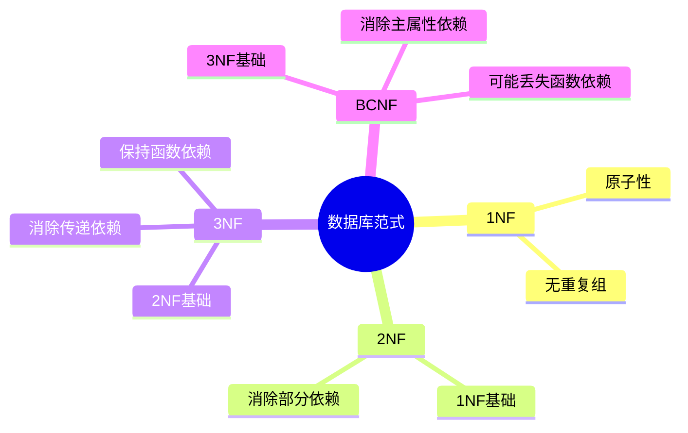
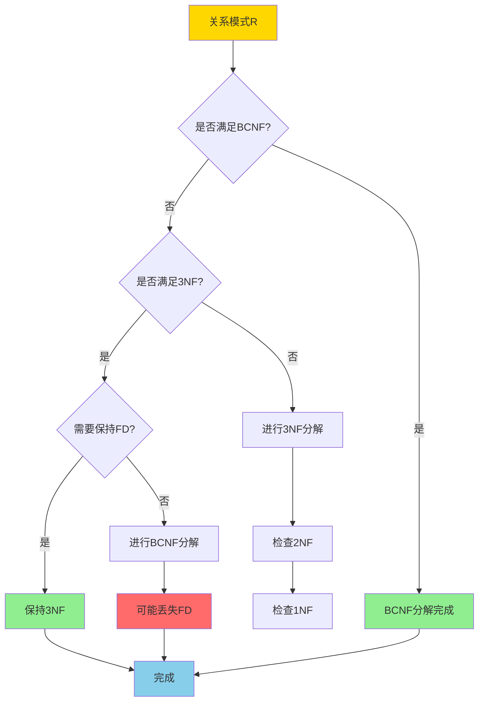
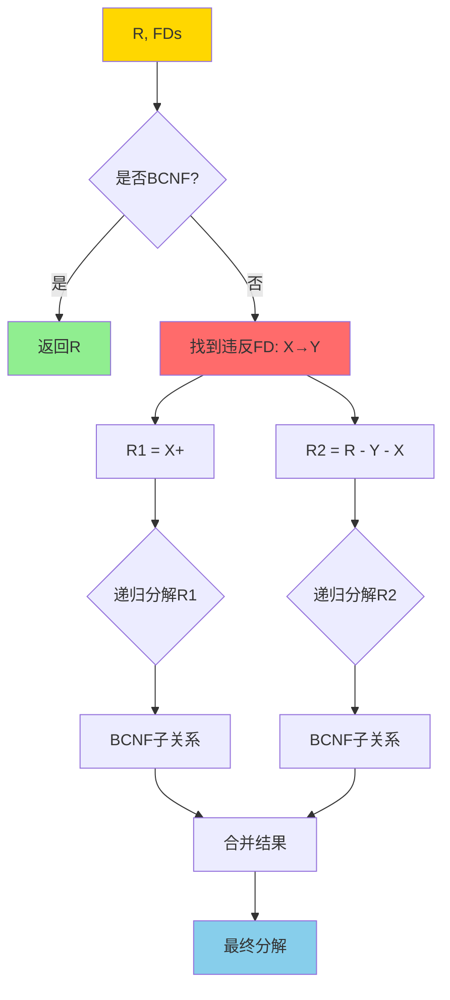
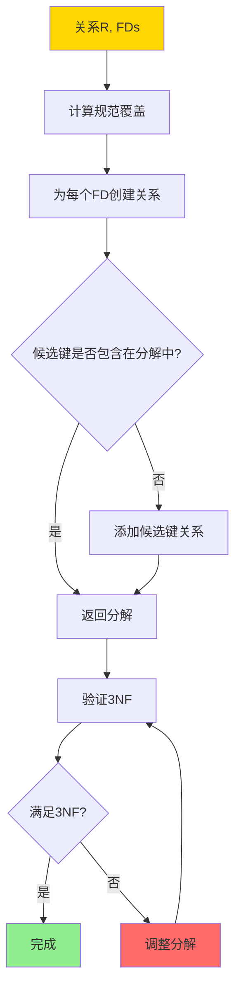
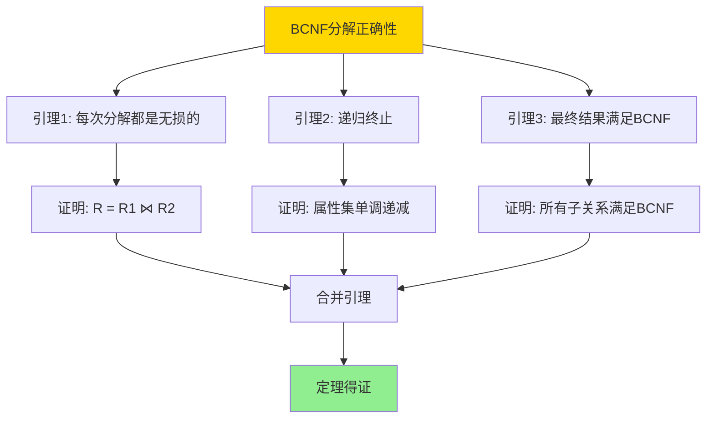
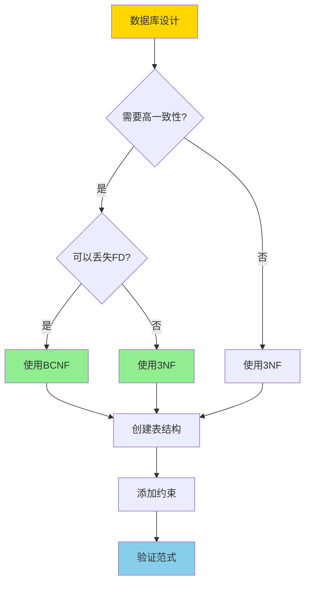

# BCNF与3NF-完整证明稿

> **文档版本**: v1.0
> **最后更新**: 2025-01-16
> **版本覆盖**: PostgreSQL 18.x (推荐) ⭐ | 17.x (推荐) | 16.x (兼容)
> **文档状态**: 🟡 框架已创建，内容待完善

---

## 📋 目录

- [BCNF与3NF-完整证明稿](#bcnf与3nf-完整证明稿)
  - [📋 目录](#-目录)
  - [1. 概述](#1-概述)
    - [1.0 BCNF与3NF工作原理概述](#10-bcnf与3nf工作原理概述)
    - [1.1 本文档的范围](#11-本文档的范围)
  - [2. 核心内容](#2-核心内容)
    - [2.1 BCNF分解算法](#21-bcnf分解算法)
    - [2.2 3NF分解算法](#22-3nf分解算法)
    - [2.3 算法对比](#23-算法对比)
  - [3. 形式化定义](#3-形式化定义)
    - [3.1 BCNF形式化](#31-bcnf形式化)
    - [3.2 3NF形式化](#32-3nf形式化)
  - [4. 定理与证明](#4-定理与证明)
    - [4.1 BCNF分解正确性定理](#41-bcnf分解正确性定理)
    - [4.2 3NF分解保持函数依赖定理](#42-3nf分解保持函数依赖定理)
    - [4.3 BCNF可能丢失函数依赖](#43-bcnf可能丢失函数依赖)
  - [5. 实际应用](#5-实际应用)
    - [5.1 PostgreSQL中的范式设计](#51-postgresql中的范式设计)
    - [5.2 范式验证](#52-范式验证)
  - [6. 相关文档](#6-相关文档)
    - [6.1 理论基础文档](#61-理论基础文档)
  - [7. 参考文献](#7-参考文献)
    - [7.1 核心理论文献](#71-核心理论文献)
    - [7.2 规范化算法相关](#72-规范化算法相关)
    - [7.3 相关文档](#73-相关文档)

---

## 1. 概述

### 1.0 BCNF与3NF工作原理概述

**范式分解**：

BCNF（Boyce-Codd Normal Form）和3NF（Third Normal Form）是关系数据库规范化的重要范式。本文档提供BCNF和3NF分解算法的完整证明。

**范式层次思维导图**：



**范式选择决策树**：



**BCNF vs 3NF 对比矩阵**：

| 维度 | BCNF | 3NF |
|------|------|-----|
| **定义** | 每个决定因子都是候选键 | 非主属性不传递依赖于主键 |
| **消除异常** | 完全消除冗余 | 基本消除冗余 |
| **函数依赖保持** | 可能丢失 | 保持 |
| **分解唯一性** | 不唯一 | 不唯一 |
| **适用场景** | 对一致性要求极高 | 需要保持函数依赖 |
| **复杂度** | O(n²) | O(n²) |

### 1.1 本文档的范围

本文档涵盖：

- **BCNF分解算法**：BCNF分解的完整算法和证明
- **3NF分解算法**：3NF分解的完整算法和证明
- **算法正确性**：分解算法的正确性证明
- **实际应用**：范式分解在数据库设计中的应用

---

## 2. 核心内容

### 2.1 BCNF分解算法

**BCNF分解算法流程**：

```haskell
-- BCNF分解算法
bcnfDecompose :: Relation -> FunctionalDependencies -> [Relation]
bcnfDecompose R FDs =
    if isBCNF R FDs then [R]
    else
        let (X -> Y) = findViolatingFD R FDs
            R1 = closure(X, FDs)
            R2 = (attributes R) - (Y - X)
        in bcnfDecompose R1 FDs ++ bcnfDecompose R2 FDs
```

**BCNF分解证明树**：



### 2.2 3NF分解算法

**3NF分解算法流程**：

```haskell
-- 3NF分解算法（保持函数依赖）
threeNFDecompose :: Relation -> FunctionalDependencies -> [Relation]
threeNFDecompose R FDs =
    let canonicalFDs = canonicalCover FDs
        decomposed = [attributes(fd) | fd <- canonicalFDs]
        key = candidateKey R FDs
        result = if key `subset` (union decomposed)
                 then decomposed
                 else decomposed ++ [key]
    in result
```

**3NF分解决策流程**：



### 2.3 算法对比

**BCNF vs 3NF 算法对比矩阵**：

| 特性 | BCNF算法 | 3NF算法 |
|------|----------|---------|
| **输入** | 关系R, FDs | 关系R, FDs |
| **输出** | BCNF分解 | 3NF分解（保持FD） |
| **时间复杂度** | O(n²) | O(n²) |
| **空间复杂度** | O(n) | O(n) |
| **函数依赖保持** | 不保证 | 保证 |
| **分解唯一性** | 不唯一 | 不唯一 |
| **适用场景** | 高一致性要求 | 需要保持FD |

---

## 3. 形式化定义

### 3.1 BCNF形式化

**BCNF定义**：

```haskell
-- BCNF条件
isBCNF :: Relation -> FunctionalDependencies -> Bool
isBCNF R FDs =
    forall (X -> Y) in FDs:
      (X -> Y is trivial) or (X is superkey of R)
```

**BCNF形式化**：

关系R满足BCNF，当且仅当对于每个非平凡函数依赖X→Y，X都是R的超键。

### 3.2 3NF形式化

**3NF定义**：

```haskell
-- 3NF条件
is3NF :: Relation -> FunctionalDependencies -> Bool
is3NF R FDs =
    forall (X -> A) in FDs:
      (X -> A is trivial) or
      (X is superkey) or
      (A is prime attribute)
```

**3NF形式化**：

关系R满足3NF，当且仅当对于每个非平凡函数依赖X→A：

- X是超键，或
- A是主属性

---

## 4. 定理与证明

### 4.1 BCNF分解正确性定理

**定理**：BCNF分解算法产生的分解是无损连接分解。

**证明树**：



**证明步骤**：

1. **引理1**：设R违反BCNF，存在X→Y，则R = R1 ⋈ R2，其中R1 = X+，R2 = R - (Y - X)
   - 证明：根据连接属性X，R1和R2的连接恢复R

2. **引理2**：每次分解后，属性集严格递减
   - 证明：R1和R2的属性集都是R的真子集

3. **引理3**：最终所有子关系满足BCNF
   - 证明：算法终止时，所有关系都满足BCNF条件

4. **合并**：由引理1-3，BCNF分解是无损连接分解

### 4.2 3NF分解保持函数依赖定理

**定理**：3NF分解算法产生的分解保持函数依赖。

**证明**：

1. **规范覆盖**：算法使用规范覆盖，保证所有FD都被表示
2. **关系构造**：每个FD都对应一个关系，保证FD被保持
3. **候选键处理**：如果候选键不在分解中，添加候选键关系
4. **结论**：所有FD都在分解后的关系中保持

### 4.3 BCNF可能丢失函数依赖

**定理**：BCNF分解可能丢失函数依赖。

**反例**：

```text
关系R(ABCD), FDs = {AB→C, C→D, D→A}

候选键: AB, BC, BD
违反BCNF: C→D (C不是超键)

BCNF分解:
R1(CD), FDs = {C→D}
R2(ABC), FDs = {AB→C}

丢失FD: D→A (无法在R1或R2中表示)
```

---

## 5. 实际应用

### 5.1 PostgreSQL中的范式设计

**设计决策树**：



**BCNF设计示例**：

```sql
-- 原始关系（违反BCNF）
CREATE TABLE orders (
    order_id SERIAL PRIMARY KEY,
    customer_id INT,
    customer_name VARCHAR(100),
    product_id INT,
    product_name VARCHAR(100),
    quantity INT
);
-- 问题: customer_id → customer_name (customer_id不是超键)

-- BCNF分解
CREATE TABLE customers (
    customer_id INT PRIMARY KEY,
    customer_name VARCHAR(100)
);

CREATE TABLE products (
    product_id INT PRIMARY KEY,
    product_name VARCHAR(100)
);

CREATE TABLE orders (
    order_id SERIAL PRIMARY KEY,
    customer_id INT REFERENCES customers(customer_id),
    product_id INT REFERENCES products(product_id),
    quantity INT
);
```

**3NF设计示例**：

```sql
-- 需要保持函数依赖的情况
-- 原始关系
CREATE TABLE employees (
    emp_id SERIAL PRIMARY KEY,
    dept_id INT,
    dept_name VARCHAR(100),
    manager_id INT,
    manager_name VARCHAR(100)
);
-- FDs: dept_id → dept_name, manager_id → manager_name

-- 3NF分解（保持FD）
CREATE TABLE departments (
    dept_id INT PRIMARY KEY,
    dept_name VARCHAR(100)
);

CREATE TABLE managers (
    manager_id INT PRIMARY KEY,
    manager_name VARCHAR(100)
);

CREATE TABLE employees (
    emp_id SERIAL PRIMARY KEY,
    dept_id INT REFERENCES departments(dept_id),
    manager_id INT REFERENCES managers(manager_id)
);
```

### 5.2 范式验证

**PostgreSQL约束验证**：

```sql
-- 验证BCNF: 检查所有函数依赖
-- 如果X→Y，则X必须是超键

-- 创建检查约束
ALTER TABLE orders
ADD CONSTRAINT check_bcnf_customer
CHECK (
    -- 如果customer_id相同，customer_name必须相同
    NOT EXISTS (
        SELECT 1 FROM orders o1, orders o2
        WHERE o1.customer_id = o2.customer_id
          AND o1.customer_name != o2.customer_name
    )
);
```

---

## 6. 相关文档

### 6.1 理论基础文档

- [关系约束与规范化-函数依赖与范式证明](./09.01-关系约束与规范化-函数依赖与范式证明.md)
- [形式语言与证明：总论](../01-形式化方法与基础理论/01.05-形式语言与证明-总论.md)
- [理论基础导航](../README.md)

---

## 7. 参考文献

### 7.1 核心理论文献

- **Codd, E. F. (1970). "A Relational Model of Data for Large Shared Data Banks."**
  - 会议: Communications of the ACM 1970
  - **重要性**: 关系模型的奠基性论文
  - **核心贡献**: 提出了关系模型和规范化理论

- **Boyce, R. F., & Codd, E. F. (1974). "Further Normalization of the Data Base Relational Model."**
  - 会议: IFIP Working Conference 1974
  - **重要性**: BCNF的提出
  - **核心贡献**: 提出了BCNF范式

### 7.2 规范化算法相关

- **Bernstein, P. A. (1976). "Synthesizing Third Normal Form Relations from Functional Dependencies."**
  - 会议: ACM TODS 1976
  - **重要性**: 3NF合成算法的经典论文
  - **核心贡献**: 提出了保持函数依赖的3NF分解算法

### 7.3 相关文档

- [关系约束与规范化-函数依赖与范式证明](./09.01-关系约束与规范化-函数依赖与范式证明.md)
- [理论基础导航](../README.md)

---

**最后更新**: 2025-01-16
**维护者**: Documentation Team
**状态**: 🟡 框架已创建，内容待完善
