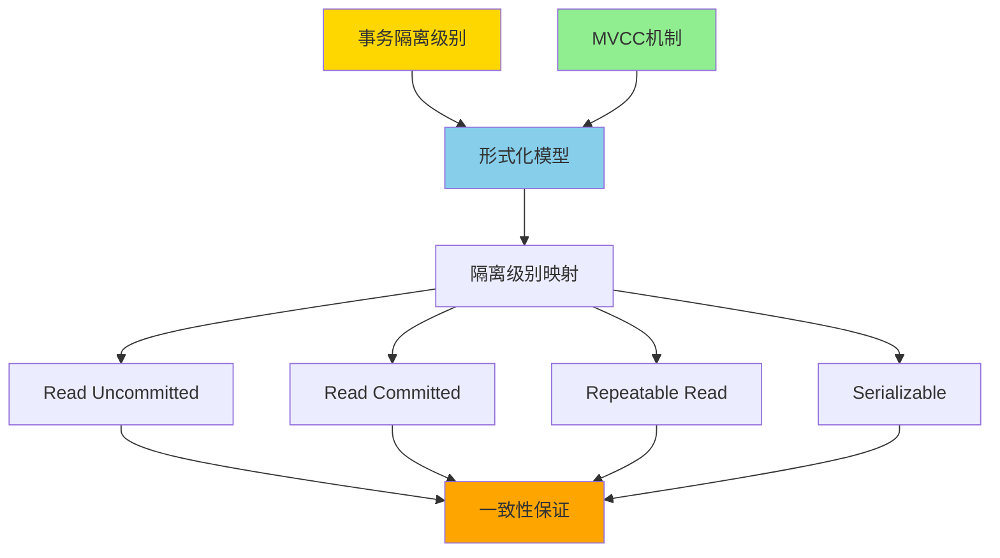
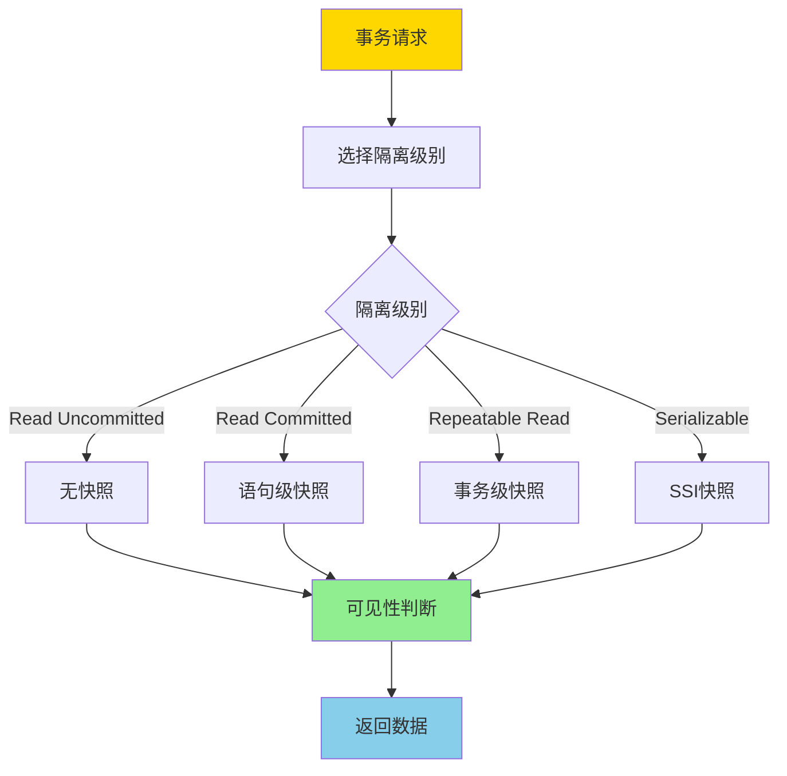

# 事务隔离与MVCC-统一形式模型与完备性证明

> **文档版本**: v1.0
> **最后更新**: 2025-01-16
> **版本覆盖**: PostgreSQL 18.x (推荐) ⭐ | 17.x (推荐) | 16.x (兼容)
> **文档状态**: 🟡 框架已创建，内容待完善

---

## 📋 目录

- [事务隔离与MVCC-统一形式模型与完备性证明](#事务隔离与mvcc-统一形式模型与完备性证明)
  - [📋 目录](#-目录)
  - [1. 概述](#1-概述)
    - [1.0 事务隔离与MVCC统一模型工作原理概述](#10-事务隔离与mvcc统一模型工作原理概述)
    - [1.1 本文档的范围](#11-本文档的范围)
  - [2. 核心内容](#2-核心内容)
  - [3. 形式化定义](#3-形式化定义)
  - [4. 定理与证明](#4-定理与证明)
  - [5. 实际应用](#5-实际应用)
  - [6. 相关文档](#6-相关文档)
    - [6.1 理论基础文档](#61-理论基础文档)
  - [7. 参考文献](#7-参考文献)
    - [7.1 核心理论文献](#71-核心理论文献)
    - [7.2 MVCC相关文献](#72-mvcc相关文献)
    - [7.3 PostgreSQL实现相关](#73-postgresql实现相关)
    - [7.4 相关文档](#74-相关文档)

---

## 1. 概述

### 1.0 事务隔离与MVCC统一模型工作原理概述

**统一形式模型**：

事务隔离级别和MVCC机制的统一形式化模型提供了一个数学框架，用于严格证明不同隔离级别的正确性和一致性保证。该模型将传统的事务隔离级别（Read Uncommitted, Read Committed, Repeatable Read, Serializable）与MVCC机制统一在一个形式化框架中。

**统一模型架构**：

**隔离级别与MVCC映射流程**：

### 1.1 本文档的范围

本文档涵盖：

- **统一形式模型**：事务隔离级别和MVCC的统一形式化模型
- **隔离级别映射**：不同隔离级别在MVCC中的实现方式
- **完备性证明**：证明该模型能够完整刻画所有隔离级别
- **一致性保证**：严格证明各隔离级别的一致性保证
- **实际应用**：模型在PostgreSQL中的应用

---

## 2. 核心内容

[待补充]

---

## 3. 形式化定义

[待补充]

---

## 4. 定理与证明

[待补充]

---

## 5. 实际应用

[待补充]

---

## 6. 相关文档

### 6.1 理论基础文档

- [形式语言与证明：总论](./1.1.25-形式语言与证明-总论.md)
- [理论基础导航](./README.md)

---

## 7. 参考文献

### 7.1 核心理论文献

- **Berenson, H., et al. (1995). "A Critique of ANSI SQL Isolation Levels."**
  - 会议: SIGMOD 1995
  - **重要性**: 隔离级别异常分析的经典论文
  - **核心贡献**: 提出了隔离级别的形式化定义和异常分类

- **Fekete, A., et al. (2005). "Making Snapshot Isolation Serializable."**
  - 会议: TODS 2005
  - **重要性**: 快照隔离可串行化的基础研究
  - **核心贡献**: 提出了SSI（Serializable Snapshot Isolation）算法

- **Cahill, M. J., et al. (2008). "Serializable Isolation for Snapshot Databases."**
  - 会议: SIGMOD 2008
  - **重要性**: SSI算法的完整实现和证明
  - **核心贡献**: 提供了SSI的完整形式化证明

### 7.2 MVCC相关文献

- **Bernstein, P. A., & Newcomer, E. (2009). "Principles of Transaction Processing."**
  - 出版社: Morgan Kaufmann
  - **重要性**: 事务处理的经典教材
  - **核心贡献**: 系统阐述了事务处理和并发控制理论

- **Adya, A. (1999). "Weak Consistency: A Generalized Theory and Optimistic Implementations for Distributed Transactions."**
  - 会议: MIT PhD Thesis
  - **重要性**: 弱一致性理论的基础
  - **核心贡献**: 提出了广义一致性理论

### 7.3 PostgreSQL实现相关

- **PostgreSQL官方文档 - 事务隔离](<https://www.postgresql.org/docs/current/transaction-iso.html>)**
  - PostgreSQL事务隔离级别实现说明

- **PostgreSQL官方文档 - MVCC](<https://www.postgresql.org/docs/current/mvcc.html>)**
  - PostgreSQL MVCC机制实现说明

### 7.4 相关文档

- [MVCC高级分析与形式证明](./1.1.8-MVCC高级分析与形式证明.md)
- [快照隔离异常谱系](./1.1.61-快照隔离异常谱系-形式分类与必要条件.md)
- [两阶段加锁-可串行化的严格证明](./1.1.69-两阶段加锁-可串行化的严格证明.md)
- [理论基础导航](./README.md)

---

**最后更新**: 2025-01-16
**维护者**: Documentation Team
**状态**: 🟡 框架已创建，内容待完善
