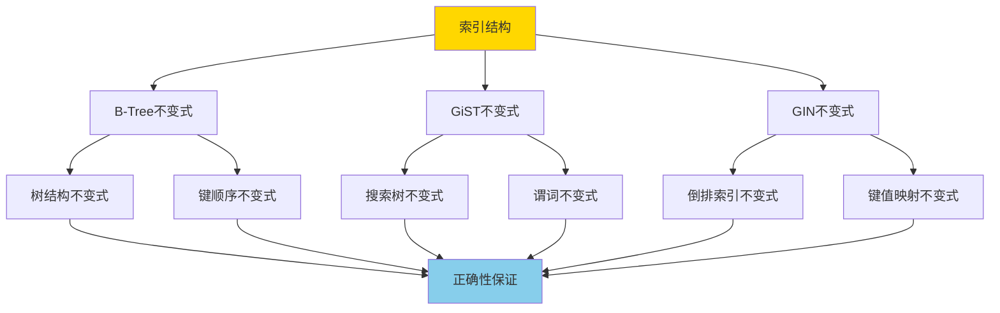
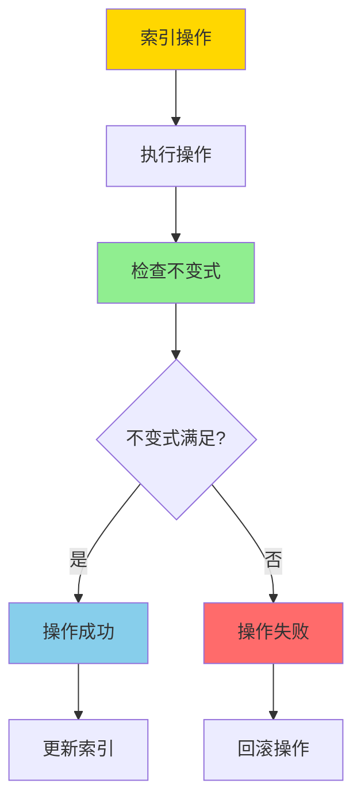

# 索引结构正确性-BTree_GiST_GiN不变式与证明

> **文档版本**: v1.0
> **最后更新**: 2025-01-16
> **版本覆盖**: PostgreSQL 18.x (推荐) ⭐ | 17.x (推荐) | 16.x (兼容)
> **文档状态**: 🟡 框架已创建，内容待完善

---

## 📋 目录

- [索引结构正确性-BTree\_GiST\_GiN不变式与证明](#索引结构正确性-btree_gist_gin不变式与证明)
  - [📋 目录](#-目录)
  - [1. 概述](#1-概述)
    - [1.0 索引结构正确性工作原理概述](#10-索引结构正确性工作原理概述)
    - [1.1 本文档的范围](#11-本文档的范围)
  - [2. 核心内容](#2-核心内容)
  - [3. 形式化定义](#3-形式化定义)
  - [4. 定理与证明](#4-定理与证明)
  - [5. 实际应用](#5-实际应用)
  - [6. 相关文档](#6-相关文档)
    - [6.1 理论基础文档](#61-理论基础文档)
  - [7. 参考文献](#7-参考文献)
    - [7.1 核心理论文献](#71-核心理论文献)
    - [7.2 PostgreSQL实现相关](#72-postgresql实现相关)
    - [7.3 相关文档](#73-相关文档)

---

## 1. 概述

### 1.0 索引结构正确性工作原理概述

**索引结构不变式**：

索引结构的不变式（Invariant）是索引在任何操作后都必须满足的性质。这些不变式保证了索引的正确性和查询结果的准确性。

**索引不变式体系**：

**不变式验证流程**：

### 1.1 本文档的范围

本文档涵盖：

- **B-Tree不变式**：B-Tree索引结构的不变式定义和证明
- **GiST不变式**：GiST索引结构的不变式定义和证明
- **GIN不变式**：GIN索引结构的不变式定义和证明
- **正确性证明**：严格证明这些不变式保证索引正确性

---

## 2. 核心内容

[待补充]

---

## 3. 形式化定义

[待补充]

---

## 4. 定理与证明

[待补充]

---

## 5. 实际应用

[待补充]

---

## 6. 相关文档

### 6.1 理论基础文档

- [形式语言与证明：总论](./1.1.25-形式语言与证明-总论.md)
- [理论基础导航](./README.md)

---

## 7. 参考文献

### 7.1 核心理论文献

- **Bayer, R., & McCreight, E. (1972). "Organization and Maintenance of Large Ordered Indexes."**
  - 会议: Acta Informatica 1972
  - **重要性**: B-Tree数据结构的经典论文
  - **核心贡献**: 提出了B-Tree数据结构及其不变式

- **Hellerstein, J. M., et al. (1995). "Generalized Search Trees for Database Systems."**
  - 会议: VLDB 1995
  - **重要性**: GiST索引结构的基础研究
  - **核心贡献**: 提出了GiST的通用搜索树框架

- **Tsitsonis, A., et al. (2004). "GIN: Generalized Inverted Indexes."**
  - 会议: PostgreSQL内部文档
  - **重要性**: GIN索引结构的设计文档
  - **核心贡献**: 提出了GIN倒排索引结构

### 7.2 PostgreSQL实现相关

- **PostgreSQL官方文档 - 索引](<https://www.postgresql.org/docs/current/indexes.html>)**
  - PostgreSQL索引类型和实现说明

- **PostgreSQL官方文档 - B-Tree索引](<https://www.postgresql.org/docs/current/btree.html>)**
  - B-Tree索引实现说明

### 7.3 相关文档

- [BTree插入不变式-严格归纳证明](./1.1.46-BTree插入不变式-严格归纳证明.md)
- [理论基础导航](./README.md)

---

**最后更新**: 2025-01-16
**维护者**: Documentation Team
**状态**: 🟡 框架已创建，内容待完善
