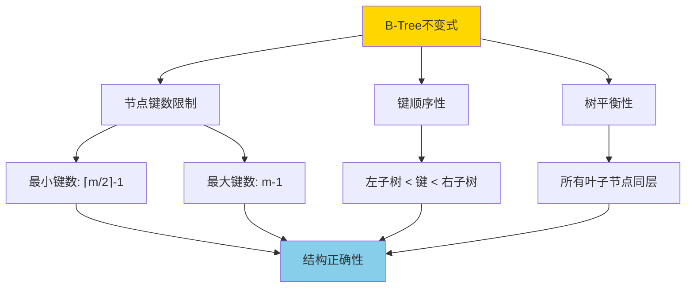
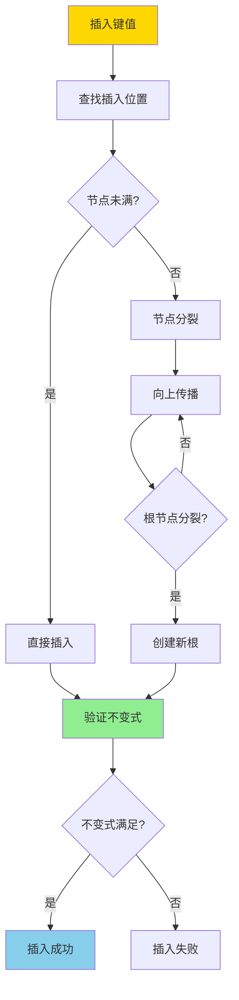

# BTree插入不变式-严格归纳证明

> **文档版本**: v1.0
> **最后更新**: 2025-01-16
> **版本覆盖**: PostgreSQL 18.x (推荐) ⭐ | 17.x (推荐) | 16.x (兼容)
> **文档状态**: 🟡 框架已创建，内容待完善

---

## 📋 目录

- [BTree插入不变式-严格归纳证明](#btree插入不变式-严格归纳证明)
  - [📋 目录](#-目录)
  - [1. 概述](#1-概述)
    - [1.0 B-Tree插入不变式工作原理概述](#10-b-tree插入不变式工作原理概述)
    - [1.1 本文档的范围](#11-本文档的范围)
  - [2. 核心内容](#2-核心内容)
  - [3. 形式化定义](#3-形式化定义)
  - [4. 定理与证明](#4-定理与证明)
  - [5. 实际应用](#5-实际应用)
  - [6. 相关文档](#6-相关文档)
    - [6.1 理论基础文档](#61-理论基础文档)
  - [7. 参考文献](#7-参考文献)
    - [7.1 核心理论文献](#71-核心理论文献)
    - [7.2 形式化证明相关](#72-形式化证明相关)
    - [7.3 PostgreSQL实现相关](#73-postgresql实现相关)
    - [7.4 相关文档](#74-相关文档)

---

## 1. 概述

### 1.0 B-Tree插入不变式工作原理概述

**B-Tree不变式**：

B-Tree的不变式是保证B-Tree正确性的关键性质。插入操作必须维护这些不变式，否则B-Tree的结构会被破坏，导致查询结果错误。

**B-Tree不变式**：

**插入操作流程**：

### 1.1 本文档的范围

本文档涵盖：

- **不变式定义**：B-Tree不变式的严格数学定义
- **插入算法**：B-Tree插入操作的算法描述
- **归纳证明**：使用数学归纳法严格证明插入操作维护不变式
- **正确性保证**：证明插入操作的正确性

---

## 2. 核心内容

[待补充]

---

## 3. 形式化定义

[待补充]

---

## 4. 定理与证明

[待补充]

---

## 5. 实际应用

[待补充]

---

## 6. 相关文档

### 6.1 理论基础文档

- [形式语言与证明：总论](./1.1.25-形式语言与证明-总论.md)
- [理论基础导航](./README.md)

---

## 7. 参考文献

### 7.1 核心理论文献

- **Bayer, R., & McCreight, E. (1972). "Organization and Maintenance of Large Ordered Indexes."**
  - 会议: Acta Informatica 1972
  - **重要性**: B-Tree数据结构的经典论文
  - **核心贡献**: 提出了B-Tree数据结构和插入算法

- **Comer, D. (1979). "The Ubiquitous B-Tree."**
  - 会议: ACM Computing Surveys 1979
  - **重要性**: B-Tree的综述性论文
  - **核心贡献**: 系统阐述了B-Tree的性质和操作

### 7.2 形式化证明相关

- **Leis, V., et al. (2013). "The Adaptive Radix Tree: ARTful Indexing for Main-Memory Databases."**
  - 会议: ICDE 2013
  - **重要性**: 现代索引结构的形式化分析
  - **核心贡献**: 提供了索引结构形式化分析的方法

### 7.3 PostgreSQL实现相关

- **PostgreSQL官方文档 - B-Tree索引](<https://www.postgresql.org/docs/current/btree.html>)**
  - PostgreSQL B-Tree索引实现说明

### 7.4 相关文档

- [索引结构正确性-BTree_GiST_GiN不变式与证明](./1.1.35-索引结构正确性-BTree_GiST_GiN不变式与证明.md)
- [理论基础导航](./README.md)

---

**最后更新**: 2025-01-16
**维护者**: Documentation Team
**状态**: 🟡 框架已创建，内容待完善
