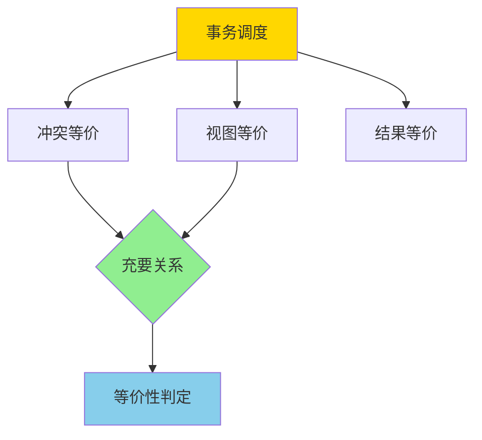
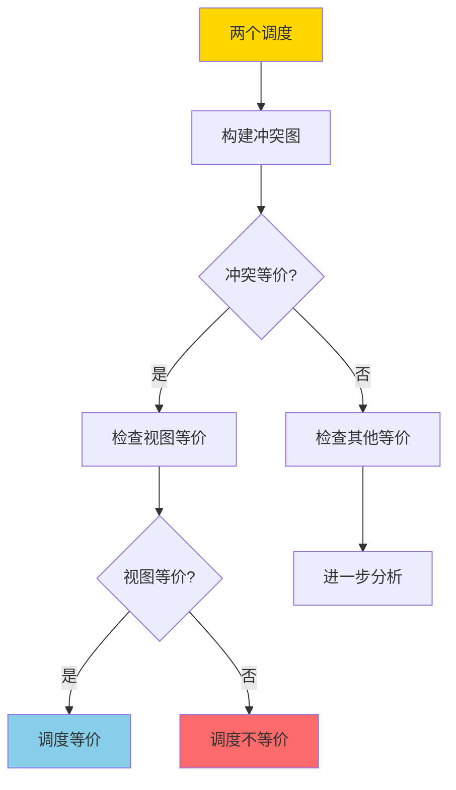

# 调度等价-冲突与视图等价的充要关系

> **文档版本**: v1.0
> **最后更新**: 2025-01-16
> **版本覆盖**: PostgreSQL 18.x (推荐) ⭐ | 17.x (推荐) | 16.x (兼容)
> **文档状态**: 🟡 框架已创建，内容待完善

---

## 📋 目录

- [调度等价-冲突与视图等价的充要关系](#调度等价-冲突与视图等价的充要关系)
  - [📋 目录](#-目录)
  - [1. 概述](#1-概述)
    - [1.0 调度等价工作原理概述](#10-调度等价工作原理概述)
    - [1.1 本文档的范围](#11-本文档的范围)
  - [2. 核心内容](#2-核心内容)
  - [3. 形式化定义](#3-形式化定义)
  - [4. 定理与证明](#4-定理与证明)
  - [5. 实际应用](#5-实际应用)
  - [6. 相关文档](#6-相关文档)
    - [6.1 理论基础文档](#61-理论基础文档)
  - [7. 参考文献](#7-参考文献)
    - [7.1 核心理论文献](#71-核心理论文献)
    - [7.2 相关文档](#72-相关文档)

---

## 1. 概述

### 1.0 调度等价工作原理概述

**调度等价性**：

事务调度的等价性是并发控制理论的核心概念。两个调度如果产生相同的结果，则它们是等价的。本文档严格证明冲突等价和视图等价的充要关系。

**调度等价分类**：

**等价性判定流程**：

### 1.1 本文档的范围

本文档涵盖：

- **冲突等价**：基于冲突操作交换的等价性定义
- **视图等价**：基于读写视图的等价性定义
- **充要关系**：严格证明冲突等价和视图等价的充要关系
- **实际应用**：等价性判定在查询优化中的应用

---

## 2. 核心内容

[待补充]

---

## 3. 形式化定义

[待补充]

---

## 4. 定理与证明

[待补充]

---

## 5. 实际应用

[待补充]

---

## 6. 相关文档

### 6.1 理论基础文档

- [形式语言与证明：总论](./1.1.25-形式语言与证明-总论.md)
- [理论基础导航](./README.md)

---

## 7. 参考文献

### 7.1 核心理论文献

- **Papadimitriou, C. H. (1979). "The Serializability of Concurrent Database Updates."**
  - 会议: JACM 1979
  - **重要性**: 调度等价性的经典论文
  - **核心贡献**: 提出了冲突等价和视图等价的概念

- **Bernstein, P. A., & Newcomer, E. (2009). "Principles of Transaction Processing."**
  - 出版社: Morgan Kaufmann
  - **重要性**: 事务处理的经典教材
  - **核心贡献**: 系统阐述了调度等价性理论

### 7.2 相关文档

- [两阶段加锁-可串行化的严格证明](./1.1.69-两阶段加锁-可串行化的严格证明.md)
- [理论基础导航](./README.md)

---

**最后更新**: 2025-01-16
**维护者**: Documentation Team
**状态**: 🟡 框架已创建，内容待完善
