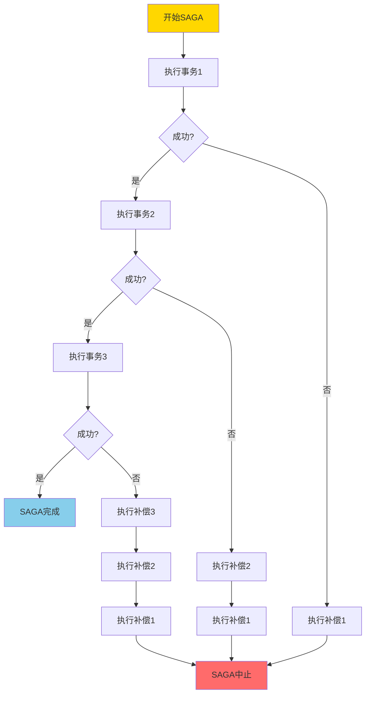
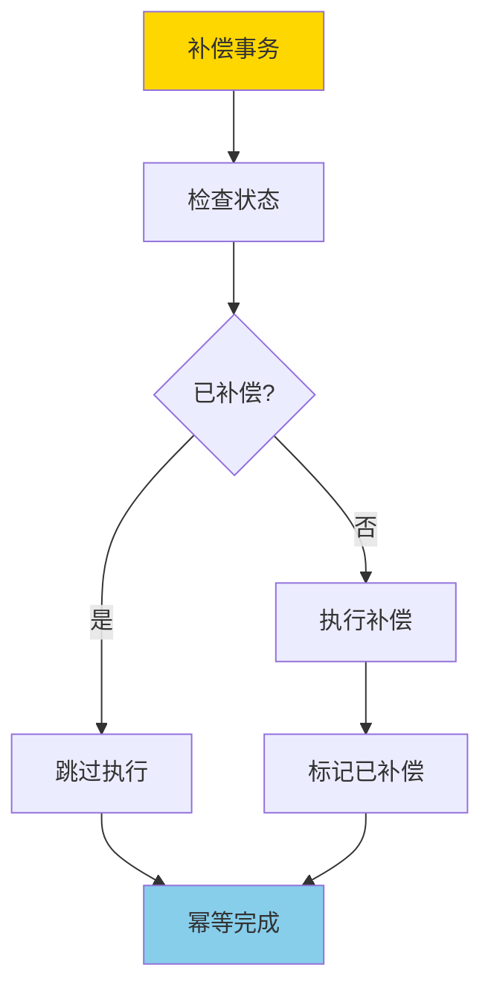

# SAGA与补偿事务-可达性与幂等性条件

> **文档版本**: v1.0
> **最后更新**: 2025-01-16
> **版本覆盖**: PostgreSQL 18.x (推荐) ⭐ | 17.x (推荐) | 16.x (兼容)
> **文档状态**: 🟡 框架已创建，内容待完善

---

## 📋 目录

- [SAGA与补偿事务-可达性与幂等性条件](#saga与补偿事务-可达性与幂等性条件)
  - [📋 目录](#-目录)
  - [1. 概述](#1-概述)
    - [1.0 SAGA与补偿事务工作原理概述](#10-saga与补偿事务工作原理概述)
    - [1.1 本文档的范围](#11-本文档的范围)
  - [2. 核心内容](#2-核心内容)
  - [3. 形式化定义](#3-形式化定义)
  - [4. 定理与证明](#4-定理与证明)
  - [5. 实际应用](#5-实际应用)
  - [6. 相关文档](#6-相关文档)
    - [6.1 理论基础文档](#61-理论基础文档)
  - [7. 参考文献](#7-参考文献)
    - [7.1 核心理论文献](#71-核心理论文献)
    - [7.2 微服务架构相关](#72-微服务架构相关)
    - [7.3 相关文档](#73-相关文档)

---

## 1. 概述

### 1.0 SAGA与补偿事务工作原理概述

**SAGA模式**：

SAGA是一种长事务处理模式，通过将长事务分解为多个本地事务，并使用补偿事务来处理失败情况。本文档严格证明SAGA的可达性和补偿事务的幂等性条件。

**SAGA执行流程**：

**补偿事务幂等性**：

### 1.1 本文档的范围

本文档涵盖：

- **SAGA模式**：SAGA模式的完整描述
- **可达性**：严格证明SAGA的可达性条件
- **幂等性**：补偿事务的幂等性条件和证明
- **实际应用**：SAGA在微服务架构中的应用

---

## 2. 核心内容

[待补充]

---

## 3. 形式化定义

[待补充]

---

## 4. 定理与证明

[待补充]

---

## 5. 实际应用

[待补充]

---

## 6. 相关文档

### 6.1 理论基础文档

- [形式语言与证明：总论](./1.1.25-形式语言与证明-总论.md)
- [理论基础导航](./README.md)

---

## 7. 参考文献

### 7.1 核心理论文献

- **Garcia-Molina, H., & Salem, K. (1987). "Sagas."**
  - 会议: SIGMOD 1987
  - **重要性**: SAGA模式的经典论文
  - **核心贡献**: 提出了SAGA模式和补偿事务概念

- **Bernstein, P. A., & Newcomer, E. (2009). "Principles of Transaction Processing."**
  - 出版社: Morgan Kaufmann
  - **重要性**: 事务处理的经典教材
  - **核心贡献**: 系统阐述了SAGA模式和补偿事务理论

### 7.2 微服务架构相关

- **Richardson, C. (2018). "Microservices Patterns: With Examples in Java."**
  - 出版社: Manning Publications
  - **重要性**: 微服务模式的实践指南
  - **核心贡献**: 提供了SAGA在微服务中的应用模式

### 7.3 相关文档

- [两阶段提交-可恢复性与阻塞特性证明](./1.1.55-两阶段提交-可恢复性与阻塞特性证明.md)
- [理论基础导航](./README.md)

---

**最后更新**: 2025-01-16
**维护者**: Documentation Team
**状态**: 🟡 框架已创建，内容待完善
