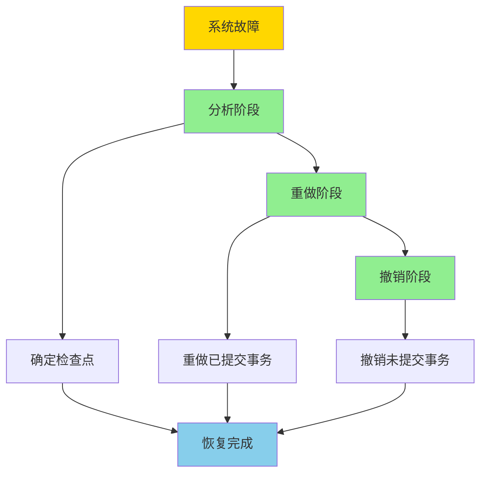
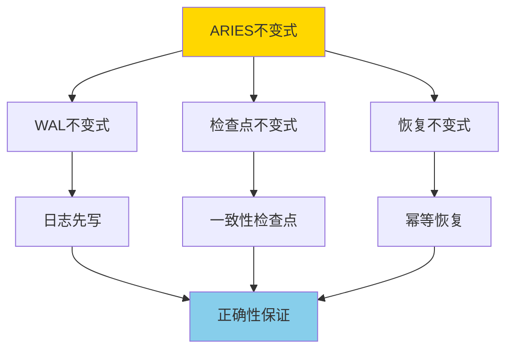

# ARIES日志恢复-正确性与不变式

> **文档版本**: v1.0
> **最后更新**: 2025-01-16
> **版本覆盖**: PostgreSQL 18.x (推荐) ⭐ | 17.x (推荐) | 16.x (兼容)
> **文档状态**: 🟡 框架已创建，内容待完善

---

## 📋 目录

- [ARIES日志恢复-正确性与不变式](#aries日志恢复-正确性与不变式)
  - [📋 目录](#-目录)
  - [1. 概述](#1-概述)
    - [1.0 ARIES日志恢复工作原理概述](#10-aries日志恢复工作原理概述)
    - [1.1 本文档的范围](#11-本文档的范围)
  - [2. 核心内容](#2-核心内容)
  - [3. 形式化定义](#3-形式化定义)
  - [4. 定理与证明](#4-定理与证明)
  - [5. 实际应用](#5-实际应用)
  - [6. 相关文档](#6-相关文档)
    - [6.1 理论基础文档](#61-理论基础文档)
  - [7. 参考文献](#7-参考文献)
    - [7.1 核心理论文献](#71-核心理论文献)
    - [7.2 PostgreSQL实现相关](#72-postgresql实现相关)
    - [7.3 相关文档](#73-相关文档)

---

## 1. 概述

### 1.0 ARIES日志恢复工作原理概述

**ARIES算法**：

ARIES（Algorithm for Recovery and Isolation Exploiting Semantics）是数据库恢复算法的经典实现。它使用Write-Ahead Logging（WAL）机制，保证数据库在故障后能够正确恢复。

**ARIES恢复流程**：

**ARIES不变式**：

### 1.1 本文档的范围

本文档涵盖：

- **ARIES算法**：ARIES恢复算法的完整描述
- **不变式定义**：ARIES算法的不变式严格定义
- **正确性证明**：严格证明ARIES算法的正确性
- **实际应用**：ARIES在PostgreSQL中的应用

---

## 2. 核心内容

[待补充]

---

## 3. 形式化定义

[待补充]

---

## 4. 定理与证明

[待补充]

---

## 5. 实际应用

[待补充]

---

## 6. 相关文档

### 6.1 理论基础文档

- [形式语言与证明：总论](./1.1.25-形式语言与证明-总论.md)
- [理论基础导航](./README.md)

---

## 7. 参考文献

### 7.1 核心理论文献

- **Mohan, C., et al. (1992). "ARIES: A Transaction Recovery Method Supporting Fine-Granularity Locking and Partial Rollbacks Using Write-Ahead Logging."**
  - 会议: TODS 1992
  - **重要性**: ARIES算法的经典论文
  - **核心贡献**: 提出了ARIES恢复算法和不变式

- **Gray, J., & Reuter, A. (1993). "Transaction Processing: Concepts and Techniques."**
  - 出版社: Morgan Kaufmann
  - **重要性**: 事务处理的经典教材
  - **核心贡献**: 系统阐述了恢复算法理论

### 7.2 PostgreSQL实现相关

- **[PostgreSQL官方文档 - WAL](<https://www.postgresql.org/docs/current/wal.html>)**
  - PostgreSQL WAL机制实现说明

### 7.3 相关文档

- [理论基础导航](./README.md)

---

**最后更新**: 2025-01-16
**维护者**: Documentation Team
**状态**: 🟡 框架已创建，内容待完善
