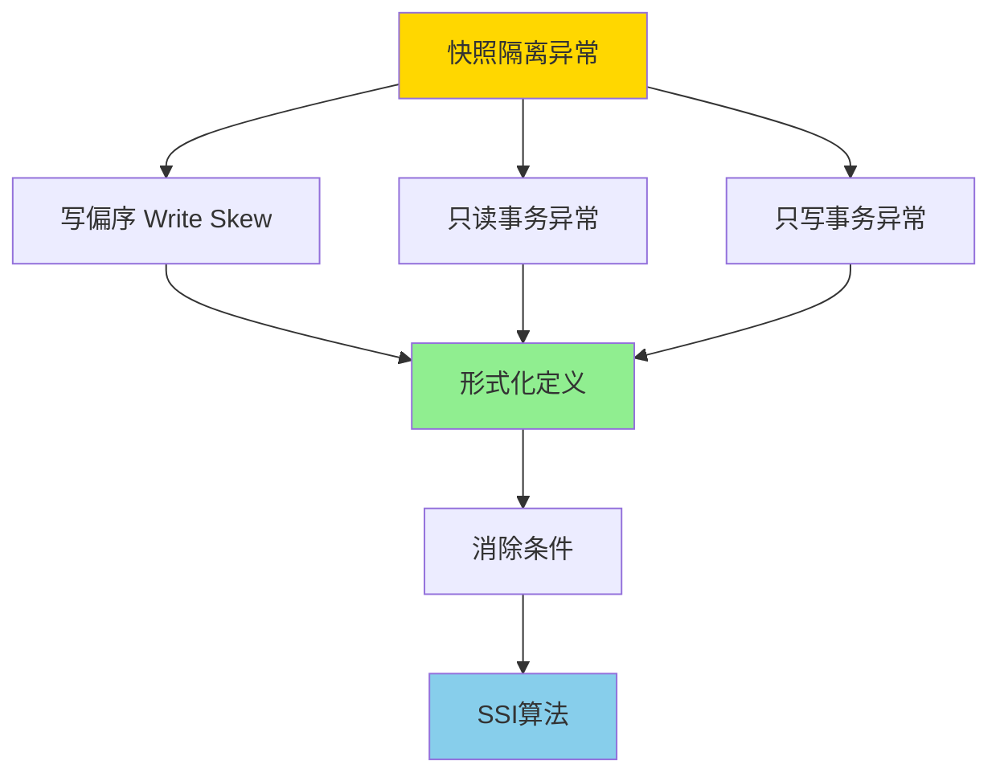
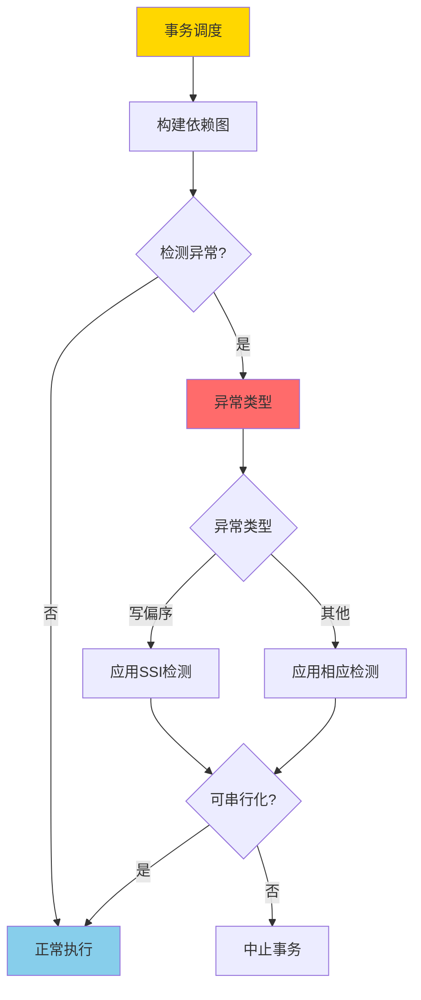

# 快照隔离异常谱系-形式分类与必要条件

> **文档版本**: v1.0
> **最后更新**: 2025-01-16
> **版本覆盖**: PostgreSQL 18.x (推荐) ⭐ | 17.x (推荐) | 16.x (兼容)
> **文档状态**: 🟡 框架已创建，内容待完善

---

## 📋 目录

- [快照隔离异常谱系-形式分类与必要条件](#快照隔离异常谱系-形式分类与必要条件)
  - [📋 目录](#-目录)
  - [1. 概述](#1-概述)
    - [1.0 快照隔离异常谱系工作原理概述](#10-快照隔离异常谱系工作原理概述)
    - [1.1 本文档的范围](#11-本文档的范围)
  - [2. 核心内容](#2-核心内容)
  - [3. 形式化定义](#3-形式化定义)
  - [4. 定理与证明](#4-定理与证明)
  - [5. 实际应用](#5-实际应用)
  - [6. 相关文档](#6-相关文档)
    - [6.1 理论基础文档](#61-理论基础文档)
  - [7. 参考文献](#7-参考文献)
    - [7.1 核心理论文献](#71-核心理论文献)
    - [7.2 相关文档](#72-相关文档)

---

## 1. 概述

### 1.0 快照隔离异常谱系工作原理概述

**快照隔离异常**：

快照隔离（Snapshot Isolation, SI）虽然提供了良好的性能，但存在一些异常情况，这些异常可能导致数据不一致。本文档对这些异常进行形式化分类，并给出消除这些异常的必要条件。

**异常分类体系**：

**异常检测流程**：

### 1.1 本文档的范围

本文档涵盖：

- **异常分类**：快照隔离异常的形式化分类
- **必要条件**：消除异常的必要条件
- **形式化定义**：异常的形式化定义和检测方法
- **实际应用**：异常检测在PostgreSQL SSI中的应用

---

## 2. 核心内容

[待补充]

---

## 3. 形式化定义

[待补充]

---

## 4. 定理与证明

[待补充]

---

## 5. 实际应用

[待补充]

---

## 6. 相关文档

### 6.1 理论基础文档

- [形式语言与证明：总论](./1.1.25-形式语言与证明-总论.md)
- [理论基础导航](./README.md)

---

## 7. 参考文献

### 7.1 核心理论文献

- **Berenson, H., et al. (1995). "A Critique of ANSI SQL Isolation Levels."**
  - 会议: SIGMOD 1995
  - **重要性**: 隔离级别异常分析的经典论文
  - **核心贡献**: 提出了隔离级别异常的形式化分类

- **Fekete, A., et al. (2005). "Making Snapshot Isolation Serializable."**
  - 会议: TODS 2005
  - **重要性**: 快照隔离异常消除的基础研究
  - **核心贡献**: 提出了SSI算法消除写偏序异常

- **Cahill, M. J., et al. (2008). "Serializable Isolation for Snapshot Databases."**
  - 会议: SIGMOD 2008
  - **重要性**: SSI算法的完整实现
  - **核心贡献**: 提供了SSI的完整形式化证明

### 7.2 相关文档

- [事务隔离与MVCC-统一形式模型与完备性证明](./1.1.27-事务隔离与MVCC-统一形式模型与完备性证明.md)
- [MVCC高级分析与形式证明](./1.1.8-MVCC高级分析与形式证明.md)
- [理论基础导航](./README.md)

---

**最后更新**: 2025-01-16
**维护者**: Documentation Team
**状态**: 🟡 框架已创建，内容待完善
