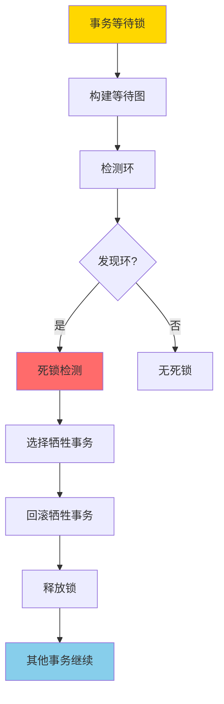
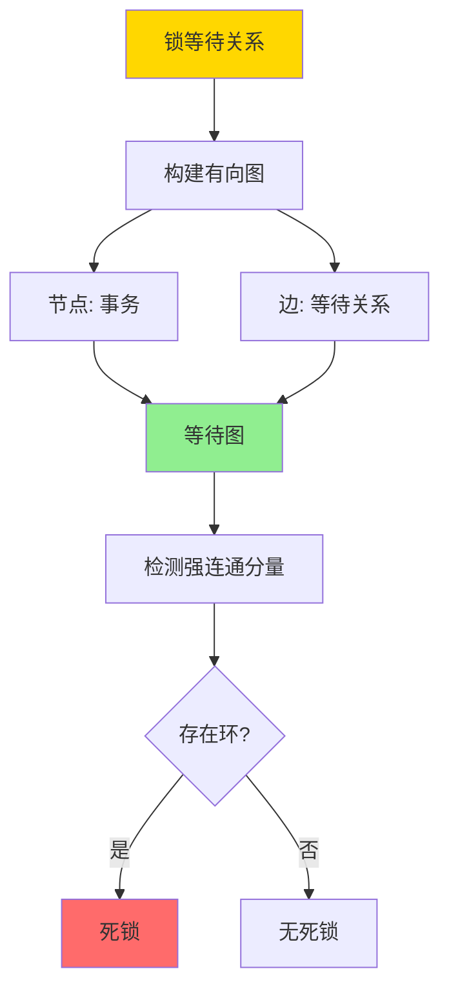

# 死锁与等待图-检测正确性与避免策略

> **文档版本**: v1.0
> **最后更新**: 2025-01-16
> **版本覆盖**: PostgreSQL 18.x (推荐) ⭐ | 17.x (推荐) | 16.x (兼容)
> **文档状态**: 🟡 框架已创建，内容待完善

---

## 📋 目录

- [死锁与等待图-检测正确性与避免策略](#死锁与等待图-检测正确性与避免策略)
  - [📋 目录](#-目录)
  - [1. 概述](#1-概述)
    - [1.0 死锁检测工作原理概述](#10-死锁检测工作原理概述)
    - [1.1 本文档的范围](#11-本文档的范围)
  - [2. 核心内容](#2-核心内容)
  - [3. 形式化定义](#3-形式化定义)
  - [4. 定理与证明](#4-定理与证明)
  - [5. 实际应用](#5-实际应用)
  - [6. 相关文档](#6-相关文档)
    - [6.1 理论基础文档](#61-理论基础文档)
  - [7. 参考文献](#7-参考文献)
    - [7.1 核心理论文献](#71-核心理论文献)
    - [7.2 PostgreSQL实现相关](#72-postgresql实现相关)
    - [7.3 相关文档](#73-相关文档)

---

## 1. 概述

### 1.0 死锁检测工作原理概述

**死锁检测**：

死锁是并发控制中的经典问题。死锁检测算法通过构建等待图（Wait-for Graph）来检测死锁。本文档严格证明死锁检测算法的正确性。

**死锁检测流程**：

**等待图构建流程**：

### 1.1 本文档的范围

本文档涵盖：

- **等待图**：等待图的构建和表示
- **死锁检测**：死锁检测算法的描述
- **正确性证明**：严格证明死锁检测算法的正确性
- **避免策略**：死锁避免策略的形式化分析

---

## 2. 核心内容

[待补充]

---

## 3. 形式化定义

[待补充]

---

## 4. 定理与证明

[待补充]

---

## 5. 实际应用

[待补充]

---

## 6. 相关文档

### 6.1 理论基础文档

- [形式语言与证明：总论](./1.1.25-形式语言与证明-总论.md)
- [理论基础导航](./README.md)

---

## 7. 参考文献

### 7.1 核心理论文献

- **Bernstein, P. A., & Newcomer, E. (2009). "Principles of Transaction Processing."**
  - 出版社: Morgan Kaufmann
  - **重要性**: 事务处理的经典教材
  - **核心贡献**: 系统阐述了死锁检测和避免理论

- **Elmagarmid, A. K. (1992). "Database Transaction Models for Advanced Applications."**
  - 出版社: Morgan Kaufmann
  - **重要性**: 高级事务模型的综述
  - **核心贡献**: 提供了死锁处理的理论框架

### 7.2 PostgreSQL实现相关

- **PostgreSQL官方文档 - 锁](<https://www.postgresql.org/docs/current/explicit-locking.html>)**
  - PostgreSQL锁机制和死锁检测说明

### 7.3 相关文档

- [两阶段加锁-可串行化的严格证明](./1.1.69-两阶段加锁-可串行化的严格证明.md)
- [理论基础导航](./README.md)

---

**最后更新**: 2025-01-16
**维护者**: Documentation Team
**状态**: 🟡 框架已创建，内容待完善
