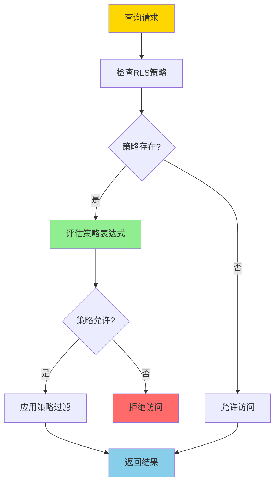
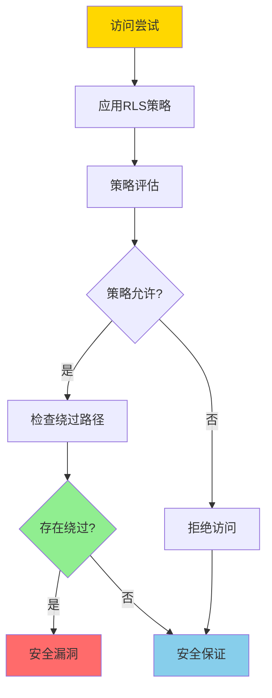

# 行级安全-RLS策略语义与不可逃逸性证明

> **文档版本**: v1.0
> **最后更新**: 2025-01-16
> **版本覆盖**: PostgreSQL 18.x (推荐) ⭐ | 17.x (推荐) | 16.x (兼容)
> **文档状态**: 🟡 框架已创建，内容待完善

---

## 📋 目录

- [行级安全-RLS策略语义与不可逃逸性证明](#行级安全-rls策略语义与不可逃逸性证明)
  - [📋 目录](#-目录)
  - [1. 概述](#1-概述)
    - [1.1 本文档的范围](#11-本文档的范围)
  - [2. 核心内容](#2-核心内容)
  - [3. 形式化定义](#3-形式化定义)
  - [4. 定理与证明](#4-定理与证明)
  - [5. 实际应用](#5-实际应用)
  - [6. 相关文档](#6-相关文档)
    - [6.1 理论基础文档](#61-理论基础文档)
  - [7. 参考文献](#7-参考文献)

---

## 1. 概述

### 1.0 行级安全工作原理概述

**行级安全（RLS）**：

行级安全是PostgreSQL提供的细粒度访问控制机制，允许基于行级别的安全策略控制数据访问。本文档严格证明RLS策略的语义和不可逃逸性。

**RLS策略应用流程**：

**不可逃逸性验证**：

### 1.1 本文档的范围

本文档涵盖：

- **RLS策略**：行级安全策略的语义定义
- **不可逃逸性**：严格证明RLS策略的不可逃逸性
- **安全性证明**：证明RLS策略的安全性保证
- **实际应用**：RLS在PostgreSQL中的应用

---

## 2. 核心内容

[待补充]

---

## 3. 形式化定义

[待补充]

---

## 4. 定理与证明

[待补充]

---

## 5. 实际应用

[待补充]

---

## 6. 相关文档

### 6.1 理论基础文档

- [形式语言与证明：总论](./1.1.25-形式语言与证明-总论.md)
- [理论基础导航](./README.md)

---

## 7. 参考文献

### 7.1 核心理论文献

- **Denning, D. E. (1976). "A Lattice Model of Secure Information Flow."**
  - 会议: Communications of the ACM 1976
  - **重要性**: 信息流安全的经典论文
  - **核心贡献**: 提出了信息流安全的理论框架

- **Sabelfeld, A., & Myers, A. C. (2003). "Language-Based Information-Flow Security."**
  - 会议: IEEE Journal on Selected Areas in Communications 2003
  - **重要性**: 基于语言的信息流安全研究
  - **核心贡献**: 提供了信息流安全的形式化方法

### 7.2 PostgreSQL实现相关

- **[PostgreSQL官方文档 - 行级安全](<https://www.postgresql.org/docs/current/ddl-rowsecurity.html>)**
  - PostgreSQL RLS实现说明

- **[PostgreSQL官方文档 - 安全](<https://www.postgresql.org/docs/current/security.html>)**
  - PostgreSQL安全机制说明

### 7.3 相关文档

- [理论基础导航](./README.md)

---

**最后更新**: 2025-01-16
**维护者**: Documentation Team
**状态**: 🟡 框架已创建，内容待完善
