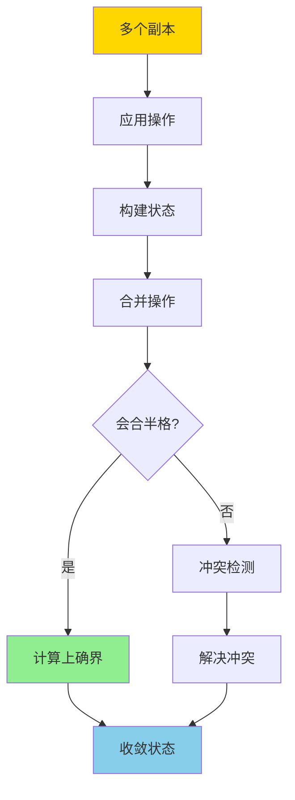
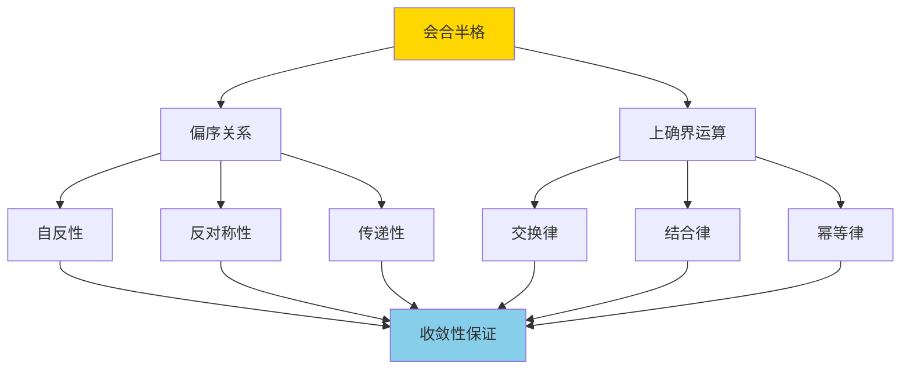

# CRDT与最终一致-会合半格与收敛性证明

> **文档版本**: v1.0
> **最后更新**: 2025-01-16
> **版本覆盖**: PostgreSQL 18.x (推荐) ⭐ | 17.x (推荐) | 16.x (兼容)
> **文档状态**: 🟡 框架已创建，内容待完善

---

## 📋 目录

- [CRDT与最终一致-会合半格与收敛性证明](#crdt与最终一致-会合半格与收敛性证明)
  - [📋 目录](#-目录)
  - [1. 概述](#1-概述)
    - [1.1 本文档的范围](#11-本文档的范围)
  - [2. 核心内容](#2-核心内容)
  - [3. 形式化定义](#3-形式化定义)
  - [4. 定理与证明](#4-定理与证明)
  - [5. 实际应用](#5-实际应用)
  - [6. 相关文档](#6-相关文档)
    - [6.1 理论基础文档](#61-理论基础文档)
  - [7. 参考文献](#7-参考文献)

---

## 1. 概述

### 1.0 CRDT与最终一致工作原理概述

**CRDT（Conflict-free Replicated Data Type）**：

CRDT是一种数据结构，可以在分布式系统中无冲突地复制和合并，保证最终一致性。本文档基于会合半格（Join Semilattice）理论严格证明CRDT的收敛性。

**CRDT合并流程**：

**会合半格结构**：

### 1.1 本文档的范围

本文档涵盖：

- **CRDT定义**：CRDT的数学定义和分类
- **会合半格**：会合半格的数学理论和性质
- **收敛性证明**：严格证明CRDT的收敛性
- **实际应用**：CRDT在分布式系统中的应用

---

## 2. 核心内容

[待补充]

---

## 3. 形式化定义

[待补充]

---

## 4. 定理与证明

[待补充]

---

## 5. 实际应用

[待补充]

---

## 6. 相关文档

### 6.1 理论基础文档

- [形式语言与证明：总论](./1.1.25-形式语言与证明-总论.md)
- [理论基础导航](./README.md)

---

## 7. 参考文献

### 7.1 核心理论文献

- **Shapiro, M., et al. (2011). "Conflict-free Replicated Data Types."**
  - 会议: SSS 2011
  - **重要性**: CRDT的经典论文
  - **核心贡献**: 提出了CRDT概念和会合半格理论

- **Shapiro, M., et al. (2011). "A Comprehensive Study of Convergent and Commutative Replicated Data Types."**
  - 会议: INRIA Research Report
  - **重要性**: CRDT的详细研究
  - **核心贡献**: 系统阐述了CRDT的分类和性质

### 7.2 分布式系统相关

- **Bailis, P., et al. (2013). "Coordination Avoidance in Database Systems."**
  - 会议: VLDB 2013
  - **重要性**: 分布式协调避免的研究
  - **核心贡献**: 提供了CRDT在数据库系统中的应用

### 7.3 相关文档

- [理论基础导航](./README.md)

---

**最后更新**: 2025-01-16
**维护者**: Documentation Team
**状态**: 🟡 框架已创建，内容待完善
