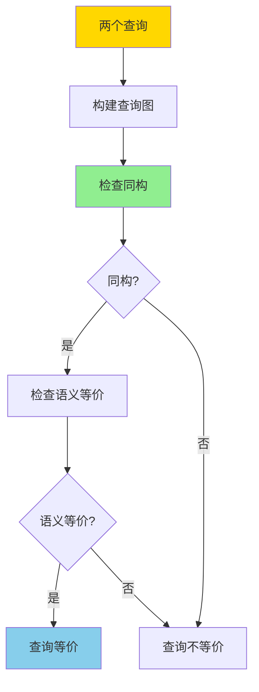
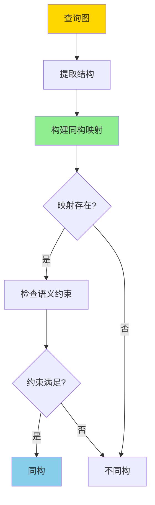

# 查询重写等价性-基于同构的充分必要条件

> **文档版本**: v1.0
> **最后更新**: 2025-01-16
> **版本覆盖**: PostgreSQL 18.x (推荐) ⭐ | 17.x (推荐) | 16.x (兼容)
> **文档状态**: 🟡 框架已创建，内容待完善

---

## 📋 目录

- [查询重写等价性-基于同构的充分必要条件](#查询重写等价性-基于同构的充分必要条件)
  - [📋 目录](#-目录)
  - [1. 概述](#1-概述)
    - [1.0 查询重写等价性工作原理概述](#10-查询重写等价性工作原理概述)
    - [1.1 本文档的范围](#11-本文档的范围)
  - [2. 核心内容](#2-核心内容)
  - [3. 形式化定义](#3-形式化定义)
  - [4. 定理与证明](#4-定理与证明)
  - [5. 实际应用](#5-实际应用)
  - [6. 相关文档](#6-相关文档)
    - [6.1 理论基础文档](#61-理论基础文档)
  - [7. 参考文献](#7-参考文献)
    - [7.1 核心理论文献](#71-核心理论文献)
    - [7.2 查询优化相关](#72-查询优化相关)
    - [7.3 PostgreSQL实现相关](#73-postgresql实现相关)
    - [7.4 相关文档](#74-相关文档)

---

## 1. 概述

### 1.0 查询重写等价性工作原理概述

**查询重写等价性**：

查询优化器通过查询重写来优化查询性能。两个查询如果对于所有数据库实例都产生相同的结果，则它们是等价的。本文档基于同构理论提供查询重写等价性的充分必要条件。

**查询等价性判定**：

**同构判定流程**：

### 1.1 本文档的范围

本文档涵盖：

- **同构理论**：查询图同构的数学定义
- **充分条件**：同构是查询等价的充分条件
- **必要条件**：同构是查询等价的必要条件
- **实际应用**：等价性判定在查询优化中的应用

---

## 2. 核心内容

[待补充]

---

## 3. 形式化定义

[待补充]

---

## 4. 定理与证明

[待补充]

---

## 5. 实际应用

[待补充]

---

## 6. 相关文档

### 6.1 理论基础文档

- [形式语言与证明：总论](./1.1.25-形式语言与证明-总论.md)
- [理论基础导航](./README.md)

---

## 7. 参考文献

### 7.1 核心理论文献

- **Chandra, A. K., & Merlin, P. M. (1977). "Optimal Implementation of Conjunctive Queries in Relational Data Bases."**
  - 会议: STOC 1977
  - **重要性**: 查询等价性的经典论文
  - **核心贡献**: 提出了查询同构的概念

- **Ullman, J. D. (1988). "Principles of Database and Knowledge-Base Systems."**
  - 出版社: Computer Science Press
  - **重要性**: 数据库系统的经典教材
  - **核心贡献**: 系统阐述了查询优化理论

### 7.2 查询优化相关

- **Ioannidis, Y. E., & Kang, Y. C. (1990). "Randomized Algorithms for Optimizing Large Join Queries."**
  - 会议: SIGMOD 1990
  - **重要性**: 查询优化的经典研究
  - **核心贡献**: 提供了查询等价性判定的方法

### 7.3 PostgreSQL实现相关

- **PostgreSQL官方文档 - 查询优化器](<https://www.postgresql.org/docs/current/planner-optimizer.html>)**
  - PostgreSQL查询优化器实现说明

### 7.4 相关文档

- [代价模型与优化器-等价重写与最优性](./1.1.34-代价模型与优化器-等价重写与最优性.md)
- [理论基础导航](./README.md)

---

**最后更新**: 2025-01-16
**维护者**: Documentation Team
**状态**: 🟡 框架已创建，内容待完善
